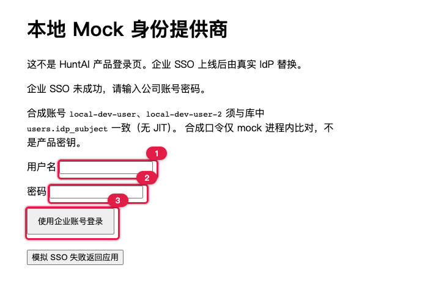

# 本地环境准备与启动（复现前提）

> 适用范围：在自己机器上从零启动 HuntAI Test，并**能真正把页面点下去**。
> 本文只负责「装好、起来、登进去」；登录之后要做什么，看下面两条学习路径。

---

## 1. 两条学习路径

本文是两条教程的共同前置。启动完成后按你的身份选一条：

| 你是 | 看这个 | 你会得到 |
| --- | --- | --- |
| 想用界面做测试的普通用户 | [`user-ui-guide.md`](user-ui-guide.md) | 从空库开始，在 UI 里造出用例、执行环境、门禁策略，跑通一次执行并看到结果与证据 |
| 想改代码的程序员 | [`developer-guide.md`](developer-guide.md) | 每个 UI 操作对应的页面文件 / `API-NNN` / router / service / 数据表，以及能单跑的测试用例 |
| 想先理解模块设计 | [`tutorial/index.html`](tutorial/index.html) | 按后端模块分篇的教程（浏览器直接打开） |

> 重要：本仓库**没有**「一条命令灌入演示数据」的种子脚本。除租户/用户/项目这三样由 `seed_local_identity.py` 写入外，用例、执行环境、门禁策略等全部由你在 UI 里创建——`user-ui-guide.md` 会一步步带做。早先版本教程提到的「临时种子脚本」（放在 `/tmp` 下的那种）**从来不在仓库里，已废弃，不要去找**。

---

## 2. 前置条件

### 2.1 工具版本

| 组件 | 要求 | 校验 |
| --- | --- | --- |
| Python | 3.14 | `python3 --version` |
| uv | 0.12.x | `uv --version`（缺则 `uv python install 3.14`） |
| Node.js | 24 LTS | `node --version` |
| PostgreSQL | 18（本地实例即可） | `psql --version` |

> M0/M1 运行面只需要 **PostgreSQL + API 进程 + 前端静态产物**。Temporal / Redis / MinIO / Vault **不要启动**，本地也不需要。

### 2.2 准备 `.env`

配置**只从仓库根目录**的 `.env` 读取（不是 `backend/.env`）。复制模板后填写：

```bash
cd <仓库根>
cp .env.example .env
```

`.env` 永不入库（`.gitignore` 已忽略）。只需关心这些键；其余键按 `.env.example` 注释留空即可：

```text
# 应用
APP_ENV
APP_PORT
LOG_LEVEL

# 数据库：指向你本机已存在的库
DATABASE_URL

# 会话 Cookie
SESSION_COOKIE_NAME
SESSION_COOKIE_SECURE          # 本地 HTTP 联调必须为 false，见下
SESSION_COOKIE_SAMESITE        # 本地填 Lax
SESSION_TTL_SECONDS

# OIDC（本地 mock IdP）
OIDC_ISSUER                    # 指向本地 mock：http://127.0.0.1:8090
OIDC_CLIENT_ID
OIDC_CLIENT_SECRET             # 本地 mock 不校验真实密钥，填任意非空值即可；须与 mock 读到的同一份 .env 一致
OIDC_REDIRECT_URI              # 浏览器可达：http://127.0.0.1:5173/api/v1/auth/oidc/callback
OIDC_CLAIM_SUBJECT             # 填 sub

# 登录草稿 TTL（秒）；`config.py` 必填，空字符串无法解析为 int
OIDC_LOGIN_DRAFT_TTL_SECONDS

# 审批与再认证窗口
REAUTH_WINDOW_SECONDS
APPROVAL_TTL_SECONDS

# 制品落盘根目录（M0/M1 本地卷；`config.py` 必填）
ARTIFACT_ROOT

# GitHub 入站 webhook HMAC（`config.py` 必填；本地可填任意非空字符串，不是产品密钥）
GITHUB_WEBHOOK_SECRET
```

`backend/app/core/config.py` 启动时读取上表全部无默认值的键；漏填或把整型键留空，uvicorn 会在导入阶段失败。Jenkins / CI 日志 / 心跳超时等键按 `.env.example` 注释可留空。

本地 HTTP 必填原因：浏览器会丢弃 `Secure` Cookie，若 `SESSION_COOKIE_SECURE` 为 `true`，登录后立刻回到未登录态。生产 HTTPS 才设为 `true`。

> 数据库必须先存在。例如：`createdb huntai_test`，然后 `DATABASE_URL=postgresql+asyncpg://<用户>@127.0.0.1:5432/huntai_test`。

---

## 3. 启动顺序（六步）

按顺序执行，每步都给出「期望看到」。

### 步骤 1 · 装后端依赖

```bash
cd backend
uv sync
```

**期望看到**：解析并安装依赖，末尾无 error，生成/更新 `backend/.venv`。

### 步骤 2 · 建表

```bash
cd backend
uv run alembic upgrade head
```

**期望看到**：若干 `Running upgrade ...`，最后停在 `head`。这一步在库里建出各模块私有 schema（如 `identity_tenancy`、`ai_governance`）与全部业务表。

### 步骤 3 · 写入本地身份（唯一的内置种子）

```bash
cd backend
uv run python scripts/seed_local_identity.py
```

**期望看到**（一行）：

```text
seeded org=local-dev idp_subject=local-dev-user user2=<uuid> approver_subject=local-dev-user-2 project=<uuid>
```

这一步是幂等的，可重复执行。它写入的内容见 §5。

### 步骤 4 · 启动本地 mock IdP（新开一个终端）

```bash
cd backend
uv run python scripts/mock_idp.py
```

**期望看到**：Uvicorn 监听 `127.0.0.1:8090`。这是本地的 OIDC 提供方，只允许 loopback，**不是产品端点**，不要用于任何共享环境。

### 步骤 5 · 启动后端（新开一个终端）

```bash
cd backend
uv run uvicorn app.main:app --host 127.0.0.1 --port 8000 --reload
```

**期望看到**：`Application startup complete.` 与 `Uvicorn running on http://127.0.0.1:8000`。

### 步骤 6 · 启动前端（新开一个终端）

```bash
cd frontend
npm install
npm run dev
```

**期望看到**：Vite 打印 `Local: http://127.0.0.1:5173/`。前端把 `/api` 代理到 `127.0.0.1:8000`，所以浏览器**只用 5173**，不要把 API 指到 8000。

### 就绪自检

| 检查 | 命令 | 期望 |
| --- | --- | --- |
| mock IdP 活着 | `curl -s -o /dev/null -w "%{http_code}" http://127.0.0.1:8090/.well-known/openid-configuration` | `200` |
| API 进程活着 | `curl -s -o /dev/null -w "%{http_code}" http://127.0.0.1:8000/healthz` | `200`（`{"status":"ok"}`；不碰数据库） |
| API 能连库 | `curl -s -o /dev/null -w "%{http_code}" http://127.0.0.1:8000/readyz` | `200`（`{"status":"ready"}`；失败为 `503`） |
| 前端活着 | 浏览器打开 `http://127.0.0.1:5173/` | 跳转到 mock IdP 登录页（未登录时） |

> `/healthz` 与 `/readyz` 在 `backend/app/api/ops.py`，挂在 `/api/v1` **之外**，无会话、无 API 编号。访问 `http://127.0.0.1:8000/` 仍是 404，属正常。

> 本教程走 **Vite 5173 + uvicorn 8000**，方便对照源码。若要用仓库根 `docker-compose.yml` 单机编排（对外默认 8080、前端是 nginx 静态产物），见 `docs/12_deployment/deployment.md`，不要把两套入口混用。

---

## 4. 登录与两个合成账号

打开 `http://127.0.0.1:5173/`，前端 SessionGate 会把你带到 mock IdP 的账号表单（首次没有 mock SSO Cookie 时）。



> ① 用户名 ② 密码 ③ 点「使用企业账号登录」。详细走查见 [`user-ui-guide.md`](user-ui-guide.md) §1.1。

| 账号 | 角色 | 说明 |
| --- | --- | --- |
| `local-dev-user` | 项目 **owner** | 主要操作身份；发起用例、注册环境、发起执行 |
| `local-dev-user-2` | 项目 **admin** | 四眼审批人身份；批准 `local-dev-user` 发起的审批 |

**口令统一为 `local-dev`**。两个都是合成账号，仅存在于本地 mock，不是产品密钥。

**切换身份**（浏览器会记住 mock SSO，直接重开登录页不会重新出表单）：

- 方式 A：访问 `http://127.0.0.1:8090/switch-account` → 清除 mock SSO → 回应用重新登录，此时会再次出示账号表单。
- 方式 B：用另一个浏览器 profile 或无痕窗口，各自登录一个账号。


> 访问 `http://127.0.0.1:8090/switch-account` 只会看到这两行，属正常。

> 为什么需要两个账号：**四眼审批要求「批准人 ≠ 发起人」**，这条规则由服务端强制。用同一个账号发起又批准，会在审批接口上被判 `403 HT-IAM-002`。所以本教程始终用两个身份交替。

> 注意：项目成员关系也必须在库里。`seed_local_identity.py` 已把 `local-dev-user` 设为 owner、`local-dev-user-2` 设为 admin；若成员不存在，登录后项目列表会是空的，需要在 P02 项目里先加成员。

---

## 5. 种子脚本实际写入什么

`scripts/seed_local_identity.py` 只写下面这些（`local-dev` 组织）——**没有用例、没有执行环境、没有门禁策略**：

| 对象 | 内容 |
| --- | --- |
| 组织 | `Local Dev Org`（slug `local-dev`） |
| 用户 | `local-dev-user`（owner）、`local-dev-user-2`（admin） |
| 项目 | `Local Dev Project` |
| 成员关系 | 上述 2 条（user 是 owner，user2 是 admin） |
| ModelRoute | 3 条（Internal / Confidential / Restricted 各一条，A1 生成走本地 stub） |
| OrgQuota | 1 条组织配额 |

其余对象全部由 [`user-ui-guide.md`](user-ui-guide.md) 带你在 UI 里创建。

> 重新执行本步骤不会刷新或作废登录态；登录态由 mock IdP 会话决定，不是脚本生成 Cookie。

---

## 6. 常见问题

| 现象 | 原因 | 处理 |
| --- | --- | --- |
| 登录后立即回到未登录 | `SESSION_COOKIE_SECURE=true` 而本地是 HTTP | 改为 `false`，重启后端 |
| 回调后报 `state` / `nonce` 校验失败 | `OIDC_REDIRECT_URI` 与浏览器地址不一致 | 确保为 `http://127.0.0.1:5173/api/v1/auth/oidc/callback`，且用 5173 访问 |
| 端口被占 | 8000 / 5173 / 8090 已被别的进程占用 | `lsof -i :8000 -sTCP:LISTEN` 找到 PID 杀掉后重启；Vite 端口被占会顺延到 5174，此时回调地址要同步改 |
| 项目列表为空 | 当前账号不是任何项目成员 | 用 owner 身份在 P02 项目里加成员 |
| 审批按钮点不动 / 403 `HT-IAM-002` | 你就是发起人（四眼） | 换 `local-dev-user-2` 登录后批准 |
| 注册环境返回 `401 HT-AUTH-002` | L3+ 动作超出再认证窗口 | 按页面提示完成 step-up 再认证（API-004）后重放同一请求 |
| 发起执行后立刻 `FAILED` | 参数缺 `TARGET_ENV`，或目标不可达 | 见 `user-ui-guide.md` §3；`FAILED` 也是有效结果，可在 P09 查看 |
| 跑完 `pytest` 后教程数据没了 | 每个用例前 TRUNCATE 业务表 | 会话结束时 `pytest_sessionfinish` 会自动重跑 `seed_local_identity.py`，两个合成账号能再登录；你在 UI 里建的策略 / 用例 / 环境仍已清空。要按 UI 教程从零再走，用 §6.1 复位 |
| mock IdP 登录页打不开 | 步骤 4 的 mock IdP 没启动 | 回到 §3 步骤 4 |

### 6.1 想从头再来一次（复位本地数据）

照 [`user-ui-guide.md`](user-ui-guide.md) 走完一遍后，库里会留下你创建的策略 / 用例 / 环境 / TestRun。想清空重来（回到 §2 描述的干净种子态），一条命令：

```bash
cd backend
uv run python scripts/reset_local_data.py --yes
```

它只做三件事：**清空**本项目 11 个 schema 下的全部业务表（表清单从库里动态枚举，以后新增表也不会漏）→ **保留**库结构与 `alembic_version`（迁移状态不受影响，不需要重跑 `alembic upgrade`）→ **重跑**身份种子（组织 / 两个账号 / 项目 / 成员关系 / 模型路由 / 配额）。

| 你可能会问 | 实际行为 |
| --- | --- |
| 要停后端吗 | **不用**。TRUNCATE 不是 DDL，正在跑的后端立刻看到空表；身份被重新种回，浏览器登录态仍然可用 |
| 会动 `.env` 吗 | 不会。也不动 mock IdP |
| 会误清生产库吗 | `APP_ENV=production` 时脚本直接拒绝运行 |
| 手滑跑了会怎样 | 不带 `--yes` 只会打印「将要清空哪 11 个 schema、共多少张表」然后退出，**不动任何数据** |
| 库结构坏了 / 改过迁移呢 | 那就连库一起重建：先 `Ctrl-C` 停后端（它持有连接时 `dropdb` 会失败），再 `dropdb <库名> && createdb <库名>`（库名以 `.env` 的 `DATABASE_URL` 为准，示例是 `huntai_test`），然后 `uv run alembic upgrade head && uv run python scripts/seed_local_identity.py` |

> 复位后不需要重启任何进程，直接刷新浏览器（或重新走 §3 步骤 4 的登录）就能按 UI 教程从零再走一遍。

---

## 7. 冒烟套件（`backend/tests/test_live_smoke.py`）

这是针对**运行中的本地实例**的端到端冒烟套件，默认跳过，需显式开启：

```bash
cd backend
HUNTAI_LIVE=1 uv run pytest tests/test_live_smoke.py -q
```

**它是自助的**：不依赖任何演示数据和预发 Cookie。套件自己走一遍 mock IdP 的 OIDC
Authorization Code + PKCE 链拿到 `huntai_session`，再用公开 API 自建所需资产
（blocking 门禁策略 / jira 连接器 / 3 条 ACTIVE 用例 / ACTIVE 执行环境）。所以按 §3
从干净库启动、只跑过 `seed_local_identity.py` 时即可运行。

**运行前提**：

- 后端在 `http://127.0.0.1:8000`（可用 `HUNTAI_BASE_URL` 覆盖）。
- mock IdP 已启动（§3 步骤 4）。
- 账号只有 §4 的两个合成账号（`local-dev-user` 是项目 owner、`local-dev-user-2` 是项目
  admin，口令 `local-dev`），因此套件只覆盖 owner/admin 边界；仓库没有 tester/viewer
  账号。若想复用已有会话 Cookie，可用 `HUNTAI_OWNER` / `HUNTAI_ADMIN` 覆盖。
- `test_08_release_webhook_observation` 需要「带 webhook secret 的 release 连接器」，
  而当前公开 API 无法设置 `webhook_secret_ref`（API-162 不接受该字段、API-163 不能改），
  干净库上它会**如实 skip**，不会用 ORM 伪造数据。

在干净的本地库上实测结果为 `7 passed, 1 skipped`。

---

## 附录：模拟 Release webhook（可选进阶）

只有先创建了 release 连接器（webhook secret 引用 `env:GITHUB_WEBHOOK_SECRET`，对应 `.env` 中的 `GITHUB_WEBHOOK_SECRET`）才可用。这是可选进阶，不影响主链路。

```bash
BODY='{"release_task_id":"<task_id>","external_item_id":"RI-DEMO","status":"ready"}'
SIG="sha256=$(printf '%s' "$BODY" | openssl dgst -sha256 -hmac "$GITHUB_WEBHOOK_SECRET" -r | cut -d' ' -f1)"
curl -s -X POST "http://127.0.0.1:8000/api/v1/inbound-webhooks/<release_connector_id>" \
  -H "content-type: application/json" -H "x-hub-signature-256: $SIG" \
  -H "x-github-delivery: demo-$(date +%s)" -H "x-github-event: release_item_ready" \
  -d "$BODY"
```

`SUBMITTED` 的任务将迁到 `READY`；`CANCELLED` 的任务只追加 divergence。
