# 普通用户 UI 教程：从零准备数据到跑完一次执行

> **这篇是给谁看的**：不写代码、只想在浏览器里把 HuntAI Test 用起来的人（测试同学、产品同学、第一次验收的同事）。
> **前置**：已经按 [`local-testing-guide.md`](./local-testing-guide.md) 的 §2–§4 把栈起起来了——`.env` 就绪、迁移跑过、`seed_local_identity.py` 跑过、mock IdP(8090) 与 mock 集成(8091) 与后端在 8000、前端在 5173，并且能用 `local-dev-user` 登录。
> **配套读物**：想弄清楚「我点的这个按钮底层走了哪段代码、哪张表、哪条测试」→ [`developer-guide.md`](./developer-guide.md)。

本文所有步骤都在本地实机走通过一遍；文中出现的页面标题、按钮文字、字段名、报错码都取自当前仓库代码，不是示意。

本文 §1–§5 截图取自同一次真实走查（本地 1440×900 浏览器窗口，中文界面）。§7 截图由 `backend/scripts/capture_tutorial_screenshots.mjs` 拍摄并已入库（`images/7-a-` … `7-g-`）。图上的红色描边框与 ① ② ③ 角标是**为指路后加的标注**，界面本身没有做任何改动，也没有示意图或合成图。截图出处与重拍方法见 [`images/README.md`](images/README.md)。

---

## §0 你会得到什么

按本文做完，你会得到一条**完整可用的质量证据链**：

| 你会创建/看到 | 在哪 | 结束状态 |
|---|---|---|
| 1 条质量门禁策略 | P11 门禁 · 策略 | 生效 |
| 1 条接口用例 | P07 生成审阅 → P05 用例库 | `ACTIVE` |
| 1 个执行环境 | P15 环境（+ P10 审批） | `ACTIVE` |
| 1 次 TestRun | P08 发起执行 → P09 TestRun 详情 | `SUCCEEDED` |
| 1 条用例结果 + StepRun | P09 用例结果表 / 证据查看器 | `passed` |
| 1 条门禁评估 | P11 评估历史（`/gates/evaluations`） | `pass` |

> 想**从头再来一遍**（清掉你创建的数据、回到干净种子态）：`cd backend && uv run python scripts/reset_local_data.py --yes`，说明见 [`local-testing-guide.md`](local-testing-guide.md) §6.1。

### 0.1 开工前自检

四条命令都应该通（在仓库任意目录均可；注释在 `backend/` 视角）：

```bash
curl -s -o /dev/null -w "%{http_code}\n" http://127.0.0.1:8090/.well-known/openid-configuration   # 期望 200（mock IdP: 本教程的「被测目标」）
curl -s -o /dev/null -w "%{http_code}\n" http://127.0.0.1:8091/healthz                             # 期望 200（mock 集成；§7 质量闭环依赖）
curl -s -o /dev/null -w "%{http_code}\n" http://127.0.0.1:8000/healthz                             # 期望 200（进程探活；/readyz 再确认数据库）
curl -s -o /dev/null -w "%{http_code}\n" http://127.0.0.1:5173/                                   # 期望 200（前端）
```

任一不通 → 回到 [`local-testing-guide.md`](./local-testing-guide.md) §3 的对应步骤。§7 还要求 mock 集成进程已启动（步骤 5）。

### 0.2 本教程用到的两个账号

四眼审批要求「批准人 ≠ 发起人」，所以**必须有两个身份**。种子脚本已经建好：

| 账号（IdP 用户名） | 项目角色 | 在本教程里演谁 |
|---|---|---|
| `local-dev-user` | `owner` | 发起人：建策略、采用例、注册环境、发起执行 |
| `local-dev-user-2` | `admin` | 审批人：审核用例、批准环境注册 |

口令都是 `local-dev`。

---

## §1 登录、认路与切身份

### 1.1 用 `local-dev-user` 登录

**目标**：进入平台并落在 P01 工作台。

**操作**

1. 浏览器打开 <http://127.0.0.1:5173/>。
2. 前端是纯 SPA，未登录会自动跳到 mock IdP 的登录页（地址形如 `http://127.0.0.1:8090/authorize?...`）。
3. 用户名填 `local-dev-user`，密码填 `local-dev`，提交。
4. IdP 带着授权码跳回后端 `/api/v1/auth/oidc/callback`，后端建服务端会话并下发 Cookie，浏览器回到平台。


> ① 用户名填 `local-dev-user` ② 密码填 `local-dev` ③ 点「使用企业账号登录」。
> 页面上那句「企业 SSO 未成功」是 mock IdP 自带的说明文案，不是你的操作出错。

**期望看到**

- 左侧主导航出现，顶部有账号信息与 AI 状态。
- 页面是**工作台**（P01）：四个统计卡（`待审批` / `执行中` / `门禁异常` / `Token 余量`）与两张空态卡片。项目列表**不在**工作台，在左侧 `项目` 里（见 §1.2）。

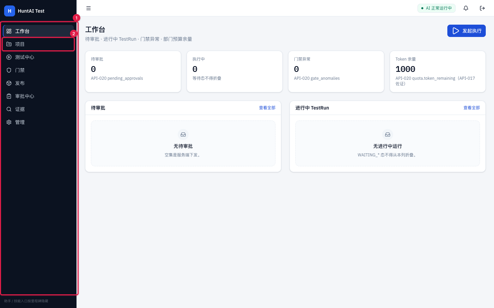

> ① 左侧主导航（8 项：工作台 / 项目 / 测试中心 / 门禁 / 发布 / 审批中心 / 证据 / 管理）
> ② 点「项目」进入项目总览。干净库里两张卡片是空态（`无待审批` / `无进行中运行`），属预期。

**失败怎么办**

| 现象 | 原因 | 处理 |
|---|---|---|
| 一直重定向回登录页 | 会话 Cookie 没被浏览器接受 | 确认 `.env` 里 `SESSION_COOKIE_SECURE=false`（本地是 HTTP，Secure Cookie 会被丢弃） |
| 报 `state` / `nonce` 校验失败 | 登录草稿过期或用了陈旧标签页 | 关掉该标签页重新从 <http://127.0.0.1:5173/> 走一遍 |
| mock IdP 502 / 连不上 | IdP 进程挂了 | 到 `backend/` 重跑 `uv run python scripts/mock_idp.py` |

### 1.2 认路：两级导航

左侧主导航（全局，8 项）：**工作台 / 项目 / 测试中心 / 门禁 / 发布 / 审批中心 / 证据 / 管理**。

进入某个项目后，会出现项目子导航（7 项）：**Overview / 用例 / 计划 / 执行 / 环境 / 集成 / 设置**。

本教程主要用这三组：

| 你要做的事 | 走哪条路 |
|---|---|
| 建门禁策略 | 左侧 `门禁` → 子项 `策略`（`/gates/policies`） |
| 生成 / 审用例 | 进入项目 → `用例`（`/projects/<项目ID>/cases`） |
| 注册环境 | 进入项目 → `环境`（`/projects/<项目ID>/environments`） |
| 审批 | 左侧 `审批中心`（`/approvals`） |
| 发起 / 看执行 | 左侧 `测试中心` → `发起执行`，以及 `TestRun` |

> **小技巧**：地址栏里的 `projectId` 就是 `Local Dev Project` 的 UUID。种子脚本固定用 `00000000-0000-4000-8000-000000000003`，所以你可以直接收藏 `/projects/00000000-0000-4000-8000-000000000003/overview`。

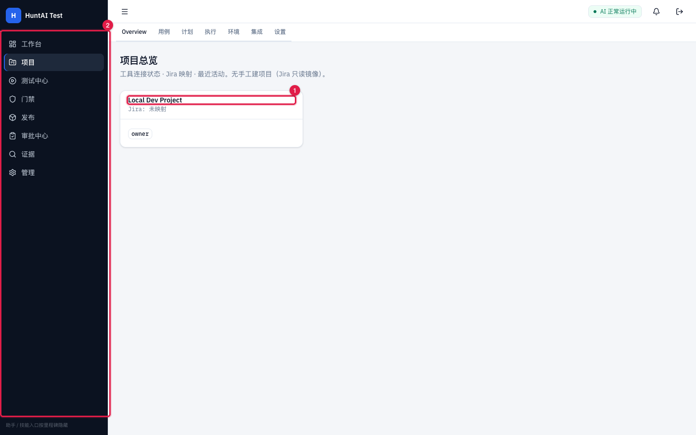

> ① 唯一的项目卡片 `Local Dev Project`（点进去）② 左侧主导航 `项目`。

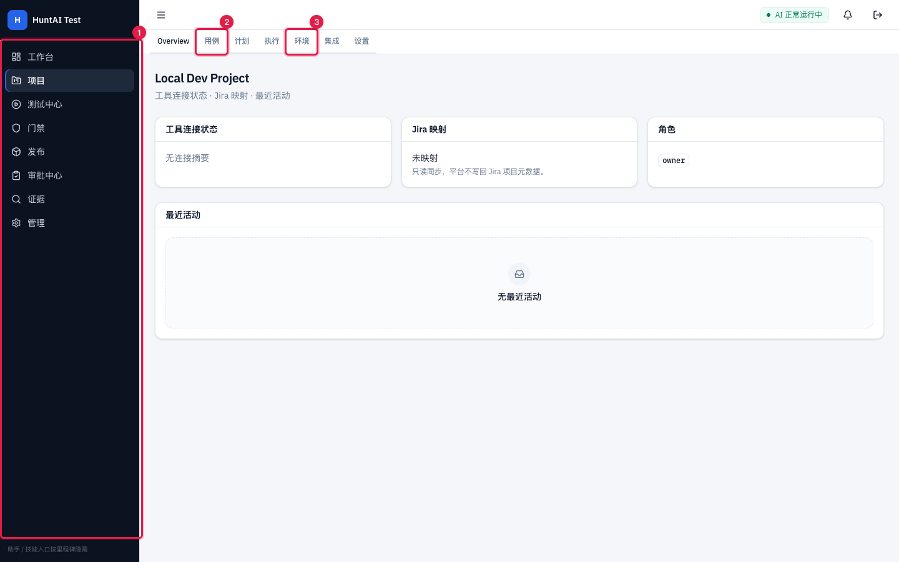

> ① 全局主导航（8 项，任何页面都在）②③ 项目子导航（`Overview / 用例 / 计划 / 执行 / 环境 / 集成 / 设置`，**只有进入项目后才出现**）。
> 本教程后面要用的两个入口就挂在这里：`用例`（§2.2、§2.3）与 `环境`（§2.4）。

### 1.3 切到第二个身份

**目标**：让 `local-dev-user-2` 也有一个会话，用来审批。

**操作（二选一）**

- **推荐**：开一个无痕窗口（或另一个浏览器 Profile），打开 <http://127.0.0.1:5173/>，用 `local-dev-user-2` / `local-dev` 登录。
- **同一浏览器切换**：先访问 <http://127.0.0.1:8090/switch-account>（页面会显示「已清除本地 mock SSO」），再回到 <http://127.0.0.1:5173/> 重新登录成第二个账号。


> 访问 `/switch-account` 后只会看到这两行：清除成功 + 「返回应用」链接。回到应用再走一次 §1.1 的登录即可换成另一个账号。

**期望看到**：两个窗口里是不同账号；在项目里，一个显示角色 `owner`，另一个显示 `admin`。


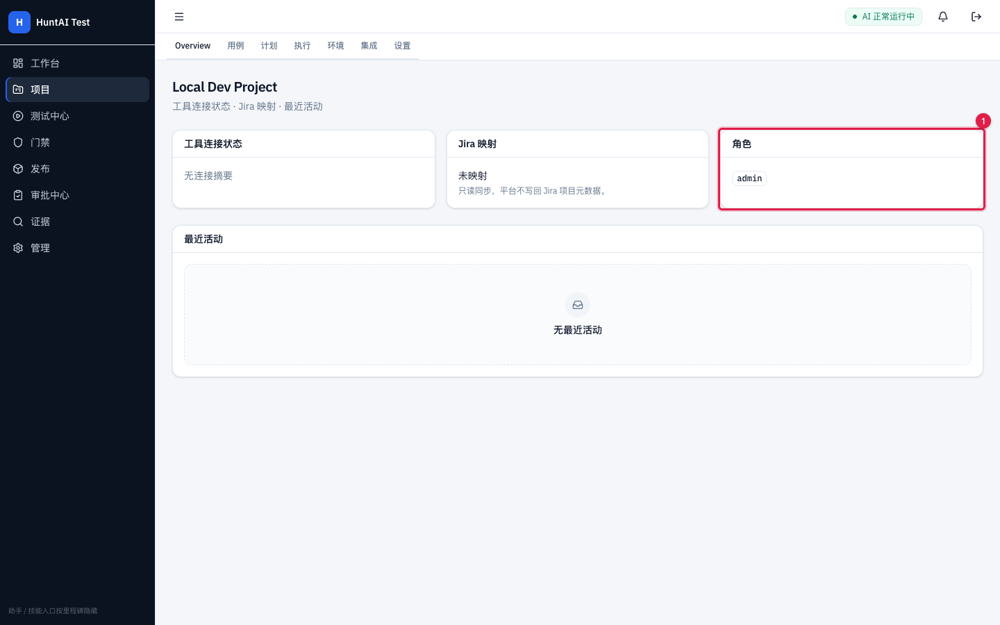

> 两张图是同一个页面的「角色」卡片（P02 项目 → `Overview`）：① 角标指的就是它。一个 `owner`、一个 `admin`，说明两个身份都登录成功。
> 本教程里 `owner` 负责造数据与发起，`admin` 负责审核与批准（四眼）。

**失败怎么办**：如果在同一浏览器里切完还是旧账号，说明平台的服务端会话 Cookie 还在——先在前端点一次「退出登录」，再走 `/switch-account`。用无痕窗口没有这个问题。

---

## §2 数据准备（本教程核心）

干净数据库里只有组织 / 两个用户 / 一个项目 / 成员关系 / 四条本地 mock 连接器 / 模型路由 / 配额（详见 [`local-testing-guide.md`](./local-testing-guide.md) §5），**没有用例、没有环境、没有门禁策略**。下面按依赖顺序把它们造出来。

### 2.1 建一条质量门禁策略（P11）

**目标**：让后面那次 TestRun 有策略可评估，从而产出 `pass` / `fail` 的门禁结论。

**操作**

1. 左侧导航点 `门禁` → 子项 `策略`，进入 `/gates/policies`（页面标题「质量门禁策略」）。
2. 最上方有个 `projectId（API-140 必填）` 输入框，把项目 UUID 粘进去：`00000000-0000-4000-8000-000000000003`（就是 §1.2 的 `Local Dev Project`）。
   - **这一步不能跳**：门禁策略按项目查询，`projectId` 为空时页面只显示「请填写 projectId」，下面的创建卡片根本不会出现。
3. 创建卡片里的**模式**默认就是 `仅报告`（按钮高亮），保持不动即可。要改成阻断得走二次确认。
4. `scope（JSON 对象）` 保持默认 `{}`。
5. 三项阈值默认已填 `95` / `500` / `1`，本地练手保持默认即可。后端要求三项键都在且为数字；前端把空输入转成 `0` 再提交，不是「留空就不设限」。
6. 点 `创建策略（API-142）`。

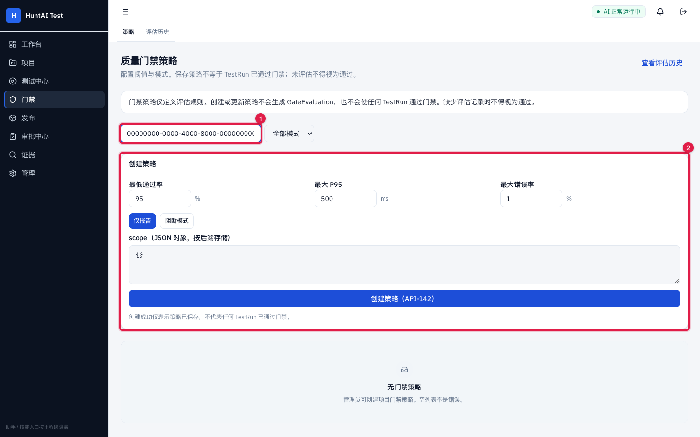

> ① `projectId（API-140 必填）`：粘贴 `00000000-0000-4000-8000-000000000003`（输入框窄，UUID 会被截断显示，属正常）
> ② `创建策略` 卡片：阈值默认 `95 / 500 / 1`、模式默认 `仅报告`、`scope` 默认 `{}`，最后点 `创建策略（API-142）`。
> 图下方那个 `无门禁策略` 是创建前的空态。

**期望看到**

- 创建后出现一条策略卡片，标题形如 `门禁模式 · policy_version 1 · CAS version 1`，模式区 `仅报告` 高亮。
- 卡片里能看到 `阈值配置`（三项值）与 `scope（API-141）`。

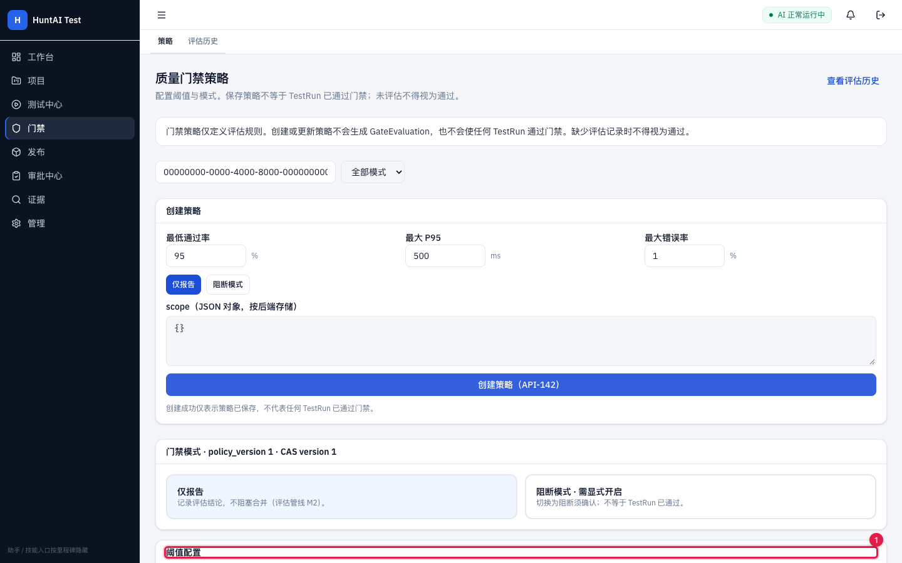

> ① `阈值配置`：这里回显刚创建的三项阈值。`仅报告` 模式表示**只记录不阻断**，最适合第一次练手。

**失败怎么办**

| 报错 | 原因 | 处理 |
|---|---|---|
| 提示项目必填 | 没选项目 | 这是项目级对象，必须选 `Local Dev Project` |
| `HT-IAM-001`（403） | 当前账号不是该项目的 owner/admin | 用 `local-dev-user` 操作 |
| `HT-STATE-001`（409） | 切换模式时带了过期的 `expected_version` | 刷新页面重新操作 |

> **为什么先建策略**：`report_only` 模式下门禁**只记录不阻断**，最适合第一次练手——即使跑失败也不会卡住后续动作。想体验"阻断"要显式二次确认，语义上也不等于 TestRun 已通过。

### 2.2 生成并采纳一条用例（P07）

**目标**：用 A1 从一段接口描述生成用例草稿，并采纳成一条 `DRAFT` 用例。

> A1 在本仓库是**本地确定性 stub**（M0 明确实现），**不需要模型 API Key**，也不需要外网。生成时页面上会出现一条「AI 降级模式」提示——这也是 stub 的正常表现，不是故障。

**操作**

1. 进入项目 → 子导航点 `用例` → 页面右上角点 `生成审阅`，进入 `/projects/<项目ID>/cases/generation-review`（页面标题「生成审阅」）。
2. 左侧「原文」区：
   - 数据源选 `curl`。
   - 文本框粘贴下面这一行。它指向本地的 mock IdP，是一个**必然可达、必然返回 JSON** 的地址：

     ```
     curl -s http://127.0.0.1:8090/.well-known/openid-configuration
     ```

3. 点 `发起 A1 生成`（按钮会短暂变成 `生成中…`）。
4. 右侧出现结构化草稿后，点草稿上的 `采纳`。

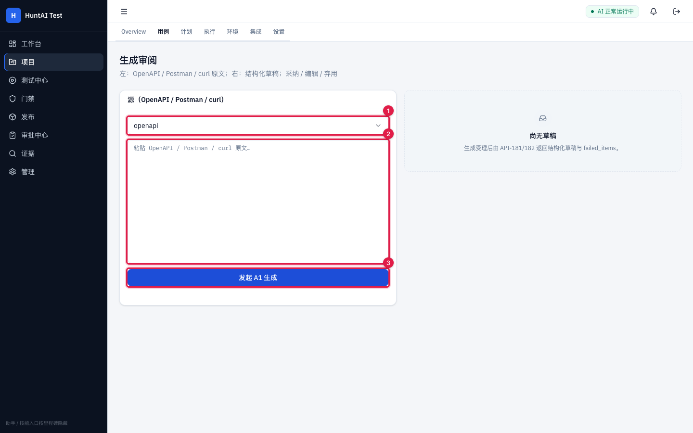

> ① 数据源下拉，先选 `curl` ② 原文文本框，粘贴上面那行 curl ③ 点 `发起 A1 生成`。
> 右侧此刻是 `尚无草稿` 空态，属预期。

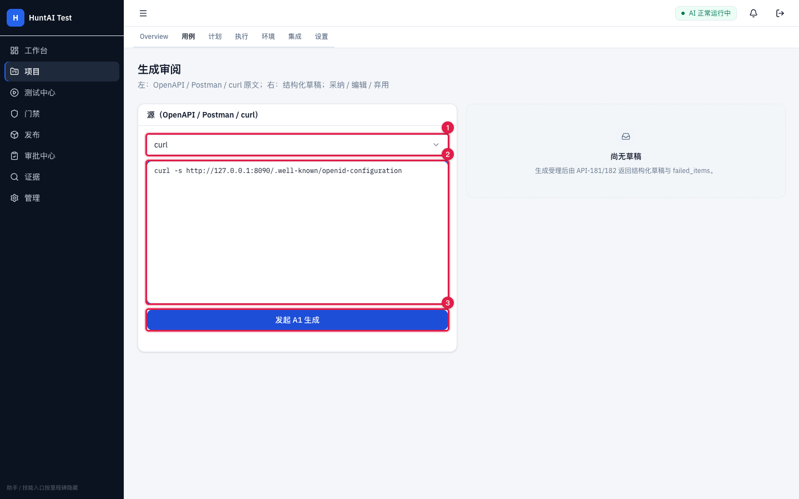

> ① 数据源已变成 `curl` ② 文本框里是那行 curl。

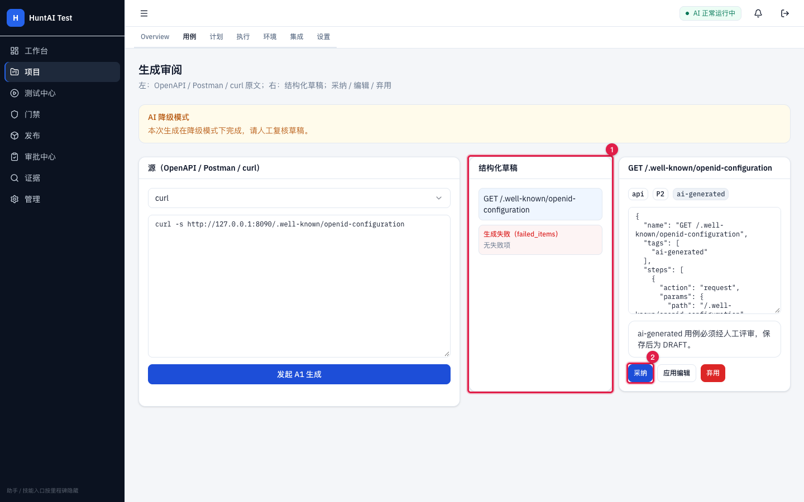

> ① `结构化草稿` 卡片：草稿名形如 `GET /.well-known/openid-configuration` ② 点 `采纳` 把它存成一条用例。
> 右边还能看到 `api / P2 / ai-generated` 三个徽标与可编辑的 JSON——`ai-generated` 的用例**必须人工评审**才能生效。

**期望看到**

- 生成完成后右侧草稿区不再是「尚无草稿」，能看到一条接口用例草稿，标题形如 `GET /.well-known/openid-configuration`。
- 点 `采纳` 后页面**直接跳到** `用例` 列表（没有额外的成功弹窗），列表里能看到这条用例：**生命周期 = `草稿`**（枚举值 `DRAFT`），**有效性 = `有效`**（枚举值 `valid`）。

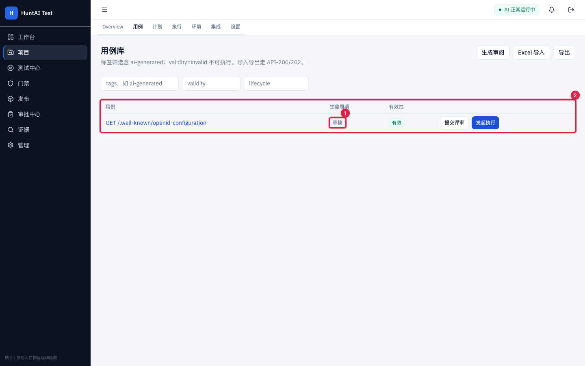

> ① 生命周期徽标 `草稿`（`DRAFT`）② 这条用例所在的行。

**失败怎么办**

| 现象 | 原因 | 处理 |
|---|---|---|
| 生成一直不结束 | 后端没在跑，或 A1 链路异常 | 看后端终端是否在刷日志；确认 8000 端口在监听 |
| 草稿为空 / 状态 `failed` | 粘贴的原文 stub 解析不了 | 确认那行 curl 一字不差；`curl` 数据源要求是 curl 命令，不是 OpenAPI JSON |
| 采纳报 403 | 当前账号角色不够 | `owner` / `admin` 才能创建；`tester` / `viewer` 会被拒 |
| 采纳后列表里看不到 | 列表筛选条件挡了 | 清掉列表上的筛选，或刷新页面 |

> **换数据源**：数据源下拉还有 `openapi` 与 `postman` 两个值。想用它们，就粘贴对应格式的**原文文本**。注意 YAML 格式的 OpenAPI 当前不被接受，请用 JSON。

### 2.3 提交评审并让用例变成 `ACTIVE`（P05）

**目标**：把刚采纳的 `DRAFT` 用例走完生命周期，变成可执行的 `ACTIVE`。

**操作**

1. 进入项目 → `用例`，找到刚才那条用例。
2. 点行内 `提交评审`。用例生命周期从 `草稿`（`DRAFT`）→ `待评审`（`PENDING_REVIEW`）。
3. 用**第二个身份**（`local-dev-user-2`，`admin`）在同一窗口打开 `用例` 页面，找到这条 `待评审` 的用例。
4. 点 `通过`。

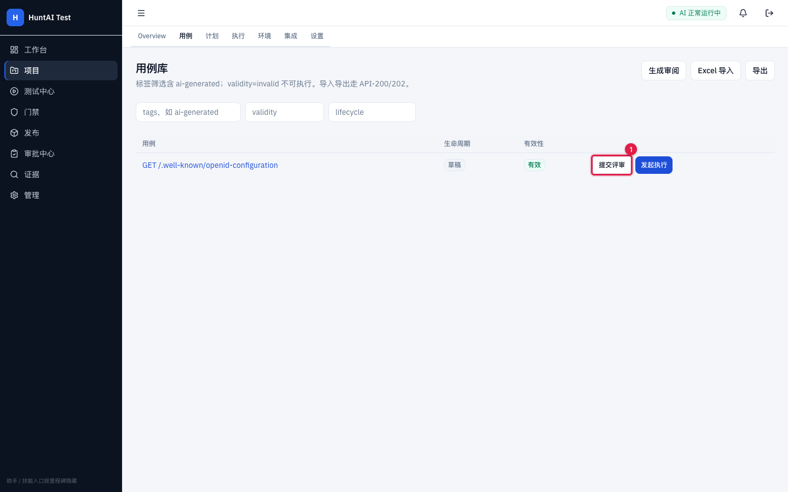

> ① 点 `提交评审`。此时生命周期徽标是 `草稿`、有效性是 `有效`。
> 注意行尾那个 `发起执行` 按钮**现在就在**——它和生命周期无关，见下面的说明。

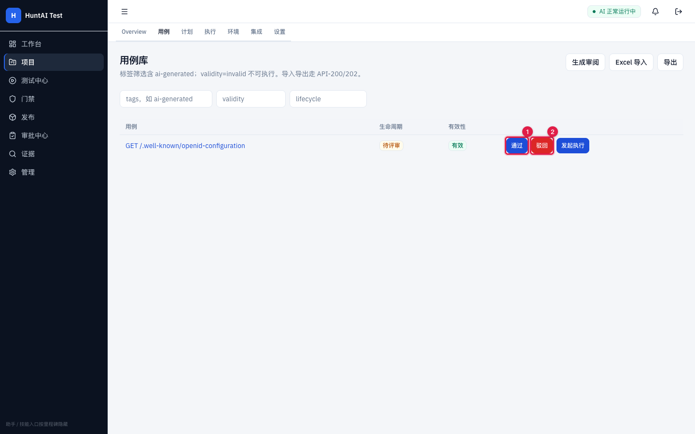

> ① 点 `通过` ② 点 `驳回`（驳回要附理由）。只有项目 `owner` / `admin` 能看到这两个按钮；用例评审（API-035）**不强制四眼**，发起人自己也能通过自己的用例（详见下方说明）。

**期望看到**：生命周期徽标从 `待评审` 变为 `活跃`（枚举值 `ACTIVE`）。

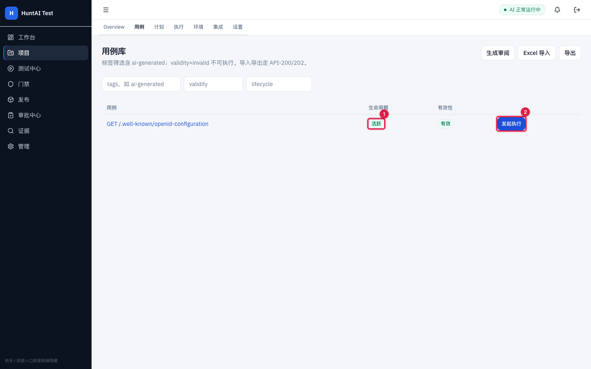

> ① 生命周期徽标 `活跃`（`ACTIVE`）② 行尾的 `发起执行`。

> **一个必须讲清楚的细节（截图为证）**：行尾的 `发起执行` 按钮**在任何生命周期下都在**（唯一例外是 `有效性 = 失效`，此时它会被替换成一句「失效用例不可执行」）。
> 所以判断「这条用例可执行」要看**生命周期徽标是不是 `活跃`**，而不是看有没有 `发起执行` 按钮。

**失败怎么办**

| 现象 | 原因 | 处理 |
|---|---|---|
| 看不到 `通过` / `驳回` 按钮 | 当前账号不是 owner/admin | `canReview` 只对项目 owner/admin 开放；换 `local-dev-user-2` |
| 报 `HT-STATE-001` | 用例不在 `PENDING_REVIEW` | 先确认已提交评审；刷新页面拿最新状态 |
| 报 `HT-IAM-002` | 撞上四眼拦截 | 见下方说明 |

> **一个必须讲清楚的差异（和审批中心不一样）**：
> **用例评审（API-035）服务端不强制四眼**——发起人自己也能把自己的用例改为 `ACTIVE`。
> **四眼强制只作用在审批中心的审批决定（API-112）上**，也就是 §2.4 的环境注册那一步。
> 所以本文让你换账号审核是**养成好习惯**（评审本来就该由别人做），不是平台的硬性要求。

### 2.4 注册执行环境 + 四眼审批（P15 → P10）

这是整条链路里**唯一必须两个身份配合**的一步。

**目标**：注册一个可用的 `platform_executor` 执行环境，并从 `PENDING_APPROVAL` 推到 `ACTIVE`。

**操作 A：发起人注册（`local-dev-user`）**

1. 进入项目 → 子导航 `环境`，进入 `/projects/<项目ID>/environments`（页面标题「环境管理」）。
2. 右侧「注册执行环境」表单填写：

   | 字段 | 填什么 | 说明 |
   |---|---|---|
   | 名称 | `本地教程环境` | 任意非空 |
   | 类型 | `platform_executor` | 平台自执行；选 `external_ci` 才需要 Job 契约与连接器 |
   | 作用域 | `project` | 项目级 |
   | Endpoint（非密钥） | 可留空 | 这里只放非密钥地址；凭证一律不落库 |
   | 可选 Job ID | **留空** | `platform_executor` 不需要 Job 契约；留空时表单不会提交 `job_contracts` |

3. 点 `提交注册`。

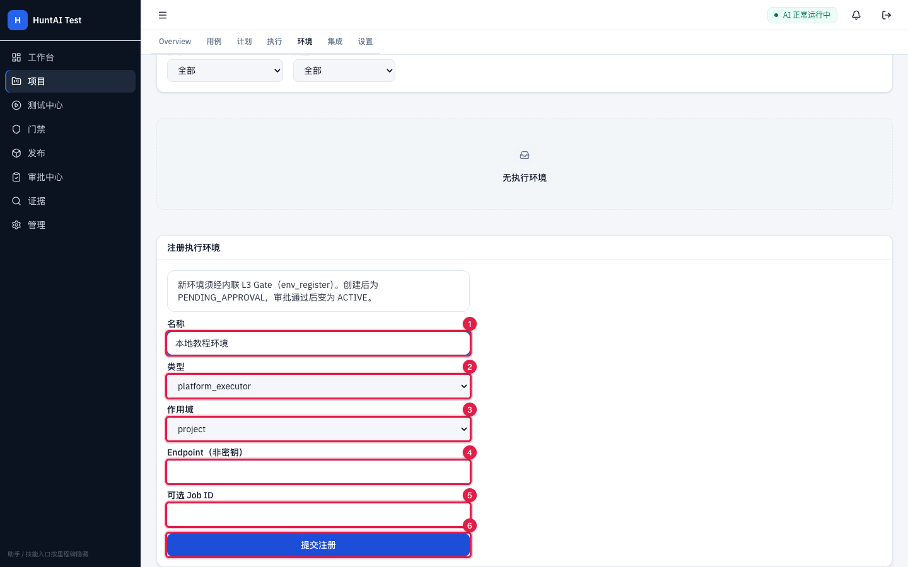

> ① 名称填 `本地教程环境`（任意非空）② 类型选 `platform_executor` ③ 作用域选 `project`
> ④ `Endpoint（非密钥）` 留空 ⑤ `可选 Job ID` 留空（留空时表单不会提交 `job_contracts`）⑥ 点 `提交注册`。
> 表单上方的提示就是这条链路的关键：新环境须经内联 L3 Gate（`env_register`），创建后是 `PENDING_APPROVAL`。

**期望看到**：提交后环境出现在列表里，状态徽标是 `待审批`（枚举值 `PENDING_APPROVAL`），行尾出现 `管理员审批` 链接。

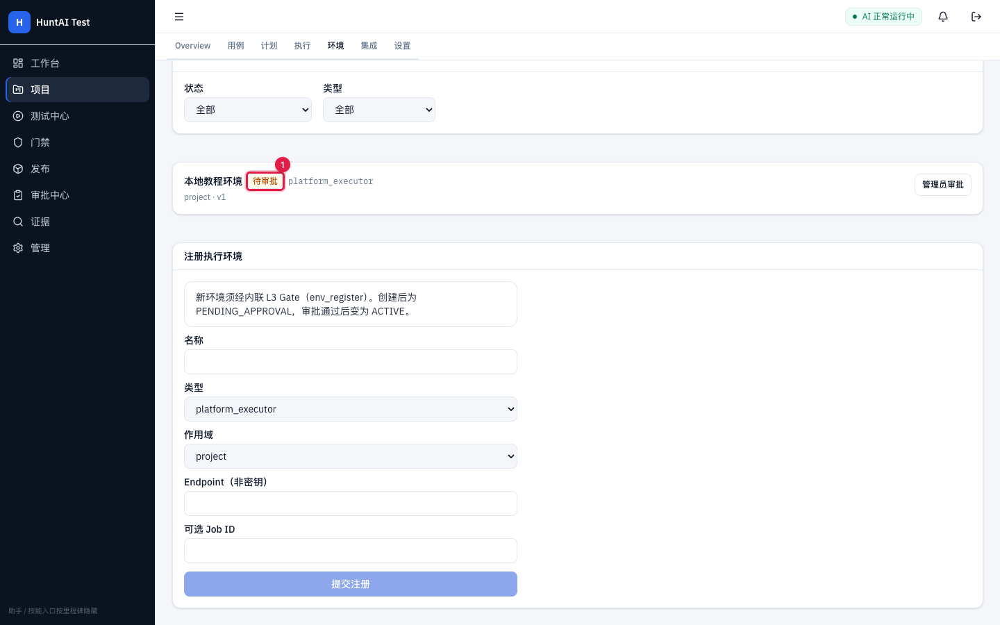

> ① 状态徽标 `待审批`。

**操作 B：对端审批（`local-dev-user-2`）**

4. 用第二个身份打开左侧 `审批中心`（`/approvals`）。
5. **先点一下 `待处理队列` 页签**——`/approvals` 默认停在 `Policy Gate Preview` 页签上，不切过去是看不到队列的（这一步很容易漏）。
6. 左侧「审批队列」找到 `action_type` 为 `env_register` 的那条，点它。
7. 右侧九要素卡片出现，点 `批准`。

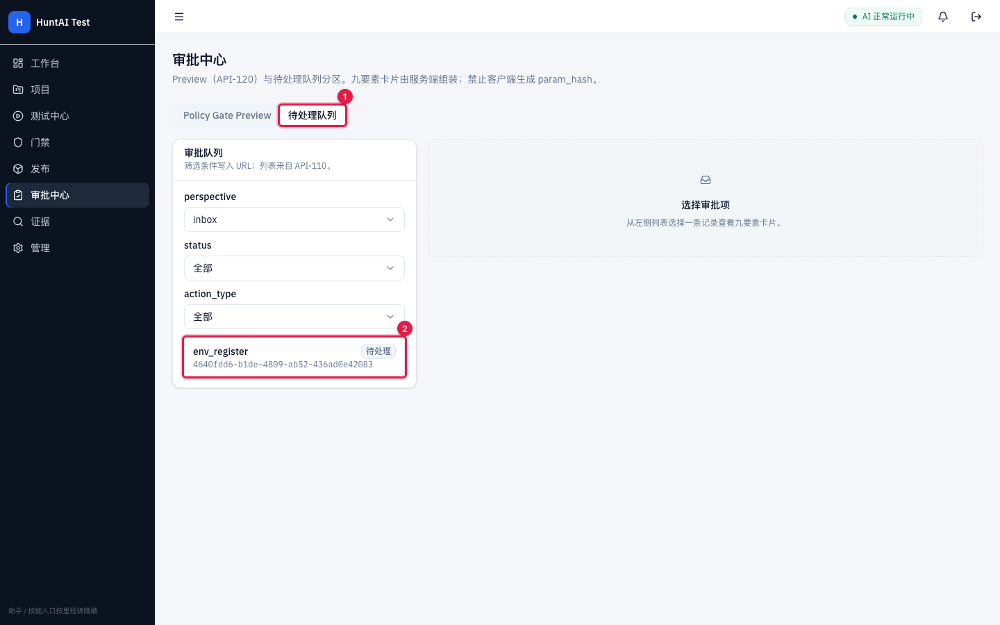

> ① 点 `待处理队列` 页签 ② 点这条 `env_register`（状态 `待处理`）。
> 左侧三个筛选默认是 `perspective=inbox` / `status=全部` / `action_type=全部`，保持默认就能看到它。

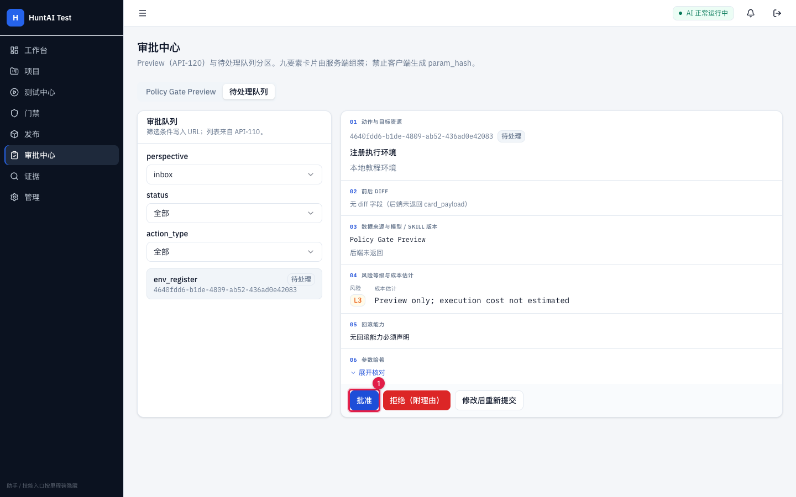

> ① 点 `批准`。右边三个按钮分别对应 §4 会展开讲的三个动作。

**期望看到**：审批状态变 `已执行`（`EXECUTED`——`env_register` 批准后会立刻触发激活，所以不会停在 `已批准`）；回到环境页面，环境状态变为 `活跃`（`ACTIVE`）。

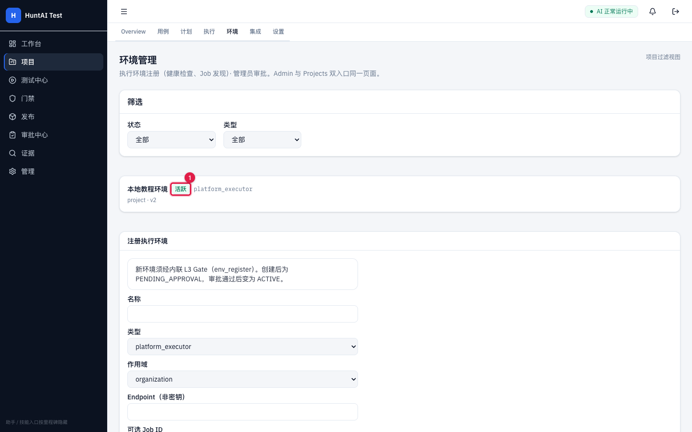

> ① 状态徽标 `活跃`——此时它才可选进 §3.1 的第 2 层。

> **顺带看一眼「为什么你不能自己批自己」**：用**发起人**（`local-dev-user`）打开同一条审批（地址形如 `/approvals?tab=queue&id=<审批ID>`），会看到按钮全部置灰 + 一行提示：

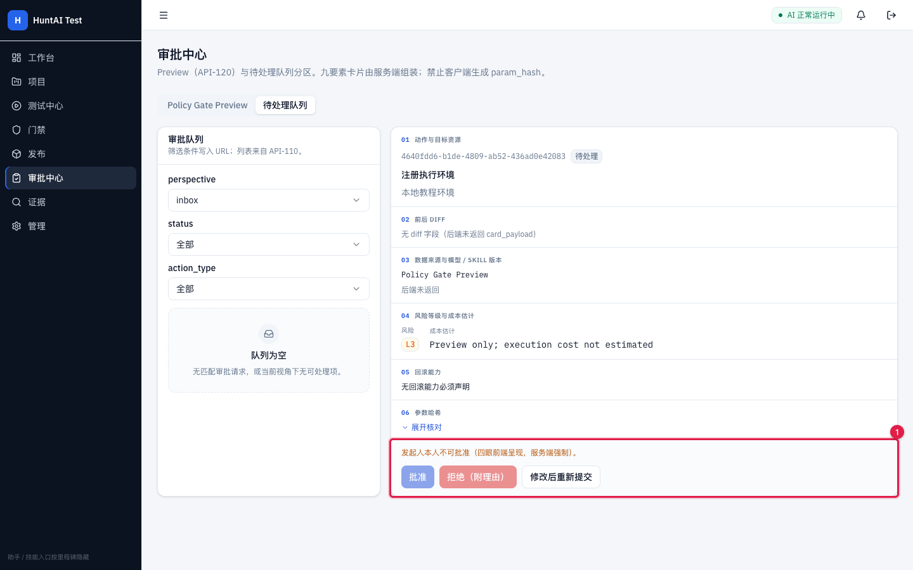

> ① 提示「发起人本人不可批准（四眼前端呈现，服务端强制）」，三个操作按钮都被禁用。
> 前端置灰只是呈现，**服务端也会拦**（403 `HT-IAM-002`）；候选审批人列表本身就排除了发起人。

**失败怎么办**

| 现象 | 原因 | 处理 |
|---|---|---|
| 提交注册报 403 `HT-IAM-001` | 不是项目 owner/admin | 换 `local-dev-user` |
| 点 `批准` 报 403 `HT-IAM-002` | **你在用发起人账号点批准** | 四眼：批准人必须不是发起人。换 `local-dev-user-2` |
| 卡片显示「发起人本人不可批准」且按钮置灰 | 同上，前端也做了呈现 | 换账号 |
| 列表里没有审批项 | 状态筛选挡住了 | 把 `status` 筛选调回「全部」 |
| 审批时报 `HT-STATE-001` | 审批请求已过期 / 已被处理 / 参数已变 | 刷新队列；若卡片顶部出现红色「审批已失效 — 参数已被修改」，需走「修改后重新提交」 |
| 批准了但环境还是 `PENDING_APPROVAL` | 后台激活是异步的 | 等几秒刷新；持续不变则查后端日志 |

> **为什么环境注册要审批**：`env_register` 是**代码里冻结的 L3 副作用动作**。L2+ 必须有人工审批（HITL），未声明副作用等级的动作一律拒绝。这不是可配置的业务开关。

### 2.5（可选）建一个测试计划（P06）

**目标**：把用例组织成计划，方便按计划发起执行与看计划级报告。

**操作**：进入项目 → `计划`（`/projects/<项目ID>/plans`，页面标题「测试计划」）→ 在 `创建测试计划` 卡片里填 `名称` → 关联 Jira `fixVersion`（本地不接 Jira 时可留空）→ 点 `创建计划` → 再在下方 `绑定用例（全量替换）` 里选用例集。

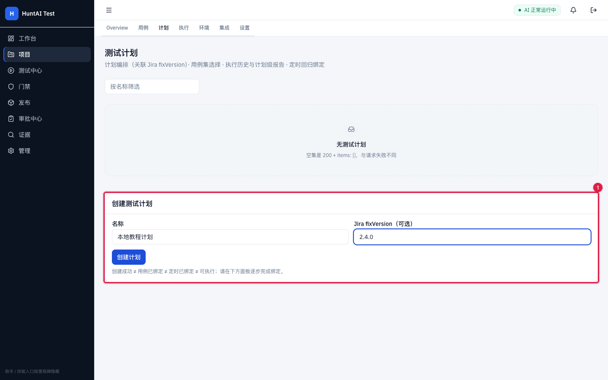

> ① `创建测试计划` 卡片：`名称` 必填（示例 `本地教程计划`），`Jira fixVersion（可选）` 本地可留空或随便填（示例 `2.4.0`），然后点 `创建计划`。
> 上图是**填好但还没提交**的状态；卡片下方那行小字提醒了后续三步（绑用例 / 绑定时 / 可执行）要分别保存。

**期望看到**：计划出现在列表；点进去能看到用例集与执行历史（首次为空，提示「无测试计划 / 无执行历史」是正常的空集，不是报错）。

**失败怎么办**：若提示需要 Jira 关联但本地没有 Jira 连接器，属预期限制——见 §6 覆盖范围表。本教程的主链路**不依赖计划**，跳过不影响。

---

## §3 跑一次并看结果

### 3.1 发起执行（P08）

**目标**：用 `ACTIVE` 用例 + `ACTIVE` 环境发起一次 TestRun。

**操作**

1. 左侧 `测试中心` → `发起执行`，进入 `/test-center/kickoff`（页面标题「发起执行」）。页面明确写着三层顺序：**模式 → 环境 → 参数**，顺序不要跳。
2. **第 0 层 项目**：最上面那张 `项目` 卡片里选 `Local Dev Project`。
   - 从左侧导航进来时这一栏是空的，下面两层会显示「先选择项目」；**先把项目选上**，第 2、3 层才会加载。
3. **第 1 层 执行模式**：选 `Script Mode`。
   - `Script Mode` 走质量门禁；`Agent Mode` 不进门禁。本次目标是验证门禁链路，所以选 Script。
4. **第 2 层 环境选择**：选 `本地教程环境`。
   - 下拉里只有 `selectable=true` 的环境可选。刚审批完的环境如果不在列表里，刷新页面。
5. **第 3 层 参数表单**：
   - **用例**：勾选 §2.3 里变成 `活跃` 的那条。**用例列表要等第 2 层选中环境后才会出现**，所以顺序不能颠倒。
   - **`TARGET_ENV`（必填）**：填 `http://127.0.0.1:8090`。
6. 点 `发起执行`。

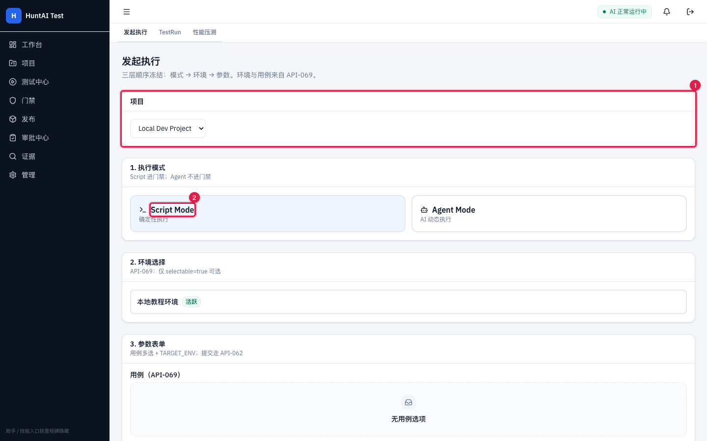

> ① `项目` 卡片选 `Local Dev Project` ② 第 1 层选 `Script Mode`（选中后边框高亮）。
> 此时第 3 层还显示 `无用例选项`——因为第 2 层的环境还没选，用例列表（API-069）要等环境选中后才加载。这不是空数据。

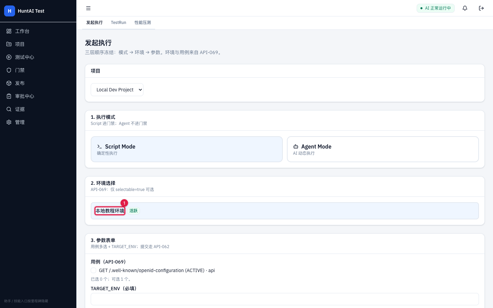

> ① 点 `本地教程环境`（状态徽标 `活跃`）。选中后第 3 层才会出现可勾选的用例。

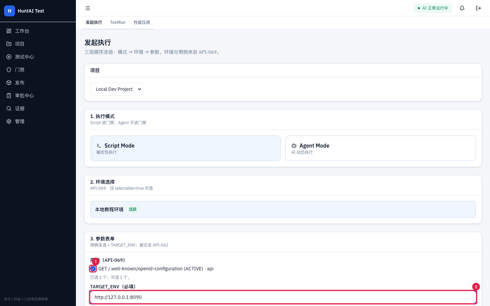

> ① 勾选用例：显示为 `标题 (ACTIVE) · api`，下方计数变成「已选 1 个；可选 1 个」 ② `TARGET_ENV（必填）` 填 `http://127.0.0.1:8090`。

**`TARGET_ENV` 到底填什么？** 这是新手最容易填错的一个字段：

- 执行器把它当作**基地址**，用例里记录的 `path` 会拼到它后面（`urljoin` 语义）。
- 本教程用例来自 `curl -s http://127.0.0.1:8090/.well-known/openid-configuration`，用例里记录的 path 是 `/.well-known/openid-configuration`。
- 所以基地址填 `http://127.0.0.1:8090`，最终请求就是 `http://127.0.0.1:8090/.well-known/openid-configuration`，返回 200，断言通过。
- **填错成 `http://127.0.0.1:8090/.well-known/openid-configuration` 会拼成 `/.../openid-configuration/.well-known/...`，请求 404 → 用例失败。**
- 留空或填了不可达地址 → TestRun 直接 `FAILED`，`result_summary` 为 `missing_target_env` 或连接类错误。

**期望看到**

- 点完后跳转到 P09 TestRun 详情页（`/test-center/runs/<runId>`），页面标题形如 `TestRun <uuid>`。
- 有时会先短暂出现「受理中」——**受理 ≠ 完成**，此时只代表命令被接受，真实状态以后端 GET 为准。

**失败怎么办**

| 现象 | 原因 | 处理 |
|---|---|---|
| 提交按钮被本地校验拦下，提示「至少选择一个 ACTIVE 用例」 | 没勾用例，或勾的用例不是 ACTIVE | 回 §2.3 确认用例生命周期 |
| 提示「TARGET_ENV 未通过本地即时校验」 | 该字段为空 | 填 `http://127.0.0.1:8090` |
| 环境下拉里没有你刚建的环境 | 还没 `ACTIVE`，或页面缓存 | 刷新；`PENDING_APPROVAL` 的环境不可选 |
| 报 `HT-STATE-001` | 环境版本变了（别人审批时版本推进） | 刷新页面重新选环境 |
| `HT-POL-001/002`（403） | Policy Gate 拒绝 | 检查用例/环境是否声明了允许的副作用等级 |

### 3.2 看状态机怎么走（P09 第 1 区）

**操作**：停留在 P09。页头第一个区块是「执行进度」，写着「状态由服务端下发，前端不推演迁移」。

**期望看到**：状态按 `待处理 PENDING → 校验中 VALIDATING → 执行中 RUNNING → 成功 SUCCEEDED` 推进（本地 stub 很快，可能一闪而过）。右侧还会显示一个 SSE 提示（如 `progress`），页面同时写明：**SSE 只是进度提示，权威状态以 GET 查询为准**。

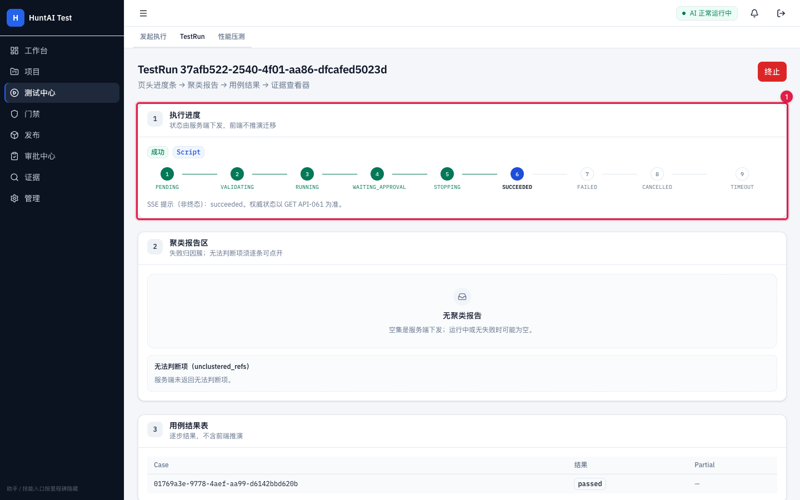

> ① `执行进度` 卡片：左侧徽标 `成功` + `Script`，下面是九节点进度条（当前节点 `SUCCEEDED` 高亮，后面的 `FAILED / CANCELLED / TIMEOUT` 是还没走到的分支）。
> 上图是**本地 stub 已经跑完**的状态——想看清 `校验中 → 执行中` 的中间态得手快，本地执行只要几百毫秒。

全部 10 个状态（用于对照）：

| 状态 | 中文 | 状态 | 中文 |
|---|---|---|---|
| `PENDING` | 待处理 | `STOPPING` | 终止中 |
| `VALIDATING` | 校验中 | `SUCCEEDED` | 成功 |
| `RUNNING` | 执行中 | `FAILED` | 失败 |
| `WAITING_EXTERNAL` | 等待外部 | `CANCELLED` | 已取消 |
| `WAITING_APPROVAL` | 等待审批 | `TIMEOUT` | 超时 |

**失败怎么办**

| 现象 | 原因 | 处理 |
|---|---|---|
| 一直是 `PENDING` | 调度器没接手 | 确认后端进程活着、没有第二个调度 Owner 同时跑 |
| 停在 `WAITING_APPROVAL` | 这次执行被策略要求审批 | 这是**合法等待态，不允许因为耗时而隐藏**；去 `审批中心` 处理 |
| 直接 `FAILED` | 见下一节 | 先看 `result_summary`，别急着重试 |

### 3.3 看用例结果与证据查看器（P09 第 3、4 区）

**操作**

1. 滚到「用例结果表」（第 3 区）。表头是 `Case` / `结果` / `Partial`，每行是一条 CaseResult。
2. 点某一行，下方「证据查看器」（第 4 区）就会按这一行的结果加载证据。

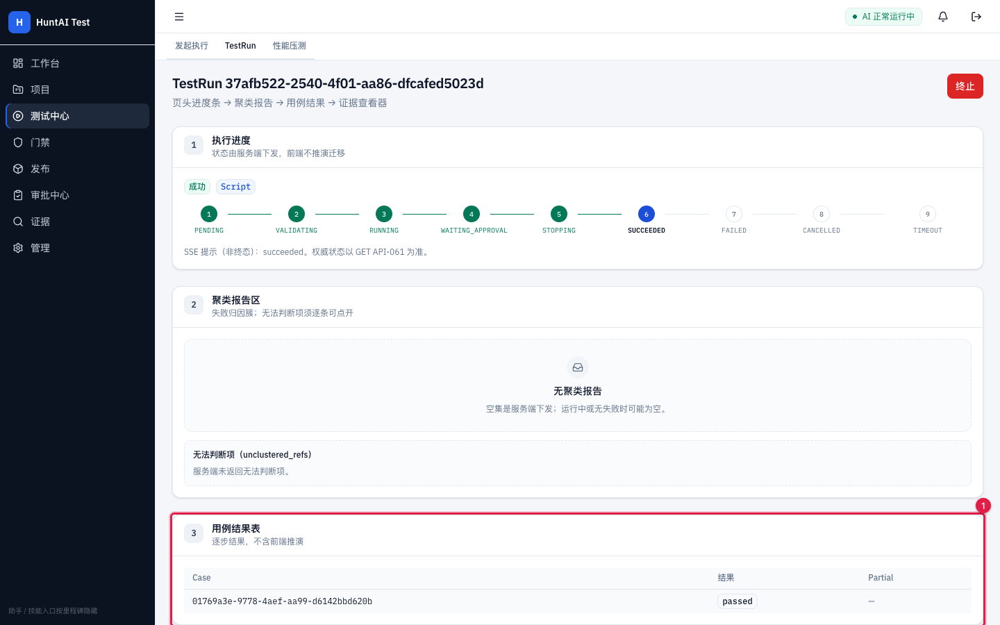

> ① `用例结果表`。`Case` 列显示的是 case_result 的 UUID，`结果` 列是 `passed`，`Partial` 列是 `—`。

**期望看到**

- 结果表有 1 行，结果列是 `passed`。
- 「证据查看器」有三个页签：`截图` / `视频` / `Trace`。

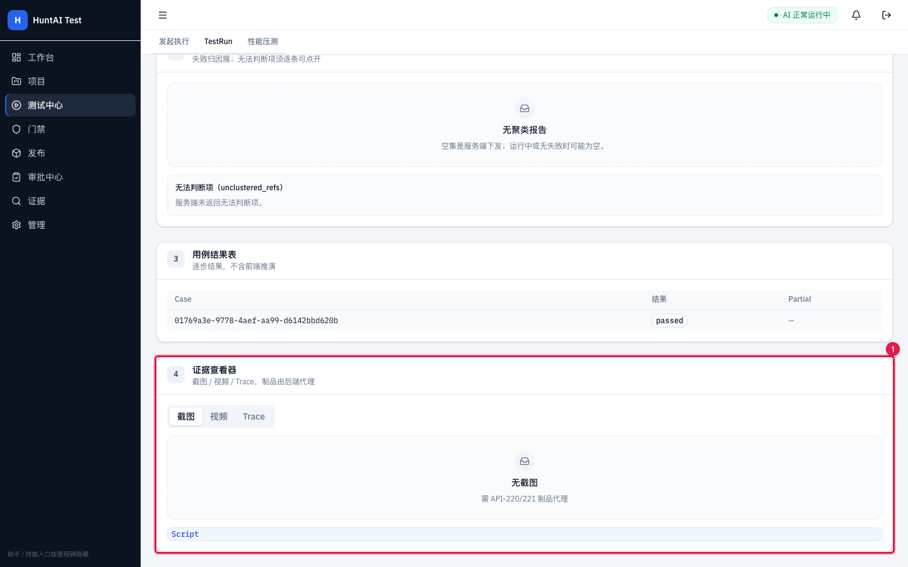

> ① `证据查看器`。本地 script 执行**不产出制品**，所以三个页签都是空态（`无截图` / `无视频` / `Trace 回放不可用`），提示里也写明了需要 API-220/221 制品代理。

> **空态 ≠ 失败**：这次执行的 CaseResult 与 StepRun 都已经写库（可用 API-064 / API-066 查到；本教程用例只有一步 `GET /.well-known/openid-configuration`），只是**没有截图 / 视频 / Trace 制品可看**——制品要由带录制能力的 Worker 产出，M0 的本地执行器不产出。
> 想看有内容的证据查看器，得跑 Web 用例（Playwright worker）或接入外部 CI，见 §6.2。

**失败怎么办**

| 现象 | 原因 | 处理 |
|---|---|---|
| 结果表是「无用例结果」空集 | 运行还没到终态，或执行失败在写结果之前 | 空集是 `200 + items: []`，不是请求失败。先确认状态是终态 |
| `FAILED` 且结果表为空 | 见 3.5 | |

### 3.4 「跑失败也是有效结果」——不要盲重试

新手最常见的误解是「没绿就是没跑通」。**不是的。** 平台的职责是**产出可信证据**，不是保证被测系统一定通。两种结果都是合格产出：

- **`SUCCEEDED` + 结果 `passed`**：目标可达、断言通过。
- **`FAILED` + `result_summary` 说明原因**：目标不可达 / 断言不通过。这是**真实的失败证据**，同样有价值。

必须区分的特殊情况：

| `result_summary` / 状态 | 含义 | 正确做法 |
|---|---|---|
| `missing_target_env` | `TARGET_ENV` 为空，**还没真正发请求就失败**，不会写 CaseResult | 补上 `TARGET_ENV` 重新发起（用**新的**幂等键） |
| 连接错误 / 超时 | 目标不可达 | 先确认真实原因（目标是否活着），再决定是否重跑 |
| `execution_result=unknown`（`HT-EXT-002`，409） | 外部系统结果未知 | **只允许对账或人工接管。禁止盲重试，也禁止当成功放行** |

### 3.5 取消一次执行（可选）

**操作**：P09 页头点 `取消`，确认。

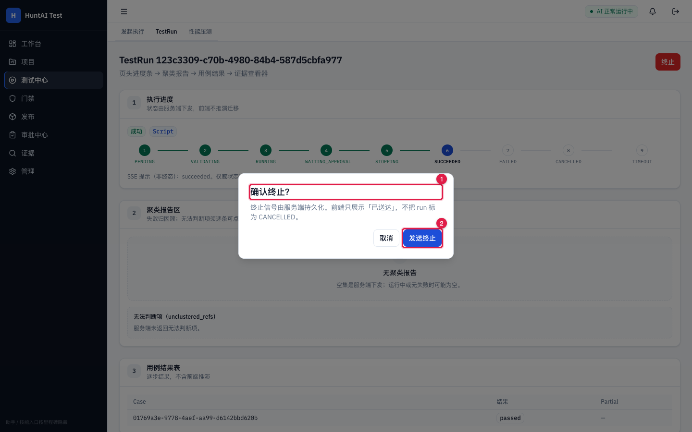

> ① 对话框标题 `确认终止？` ② 点 `发送终止`。
> 对话框的文案说明了语义：终止信号由服务端持久化，前端只展示「已送达」，**不把 run 标为 CANCELLED**。
> 这张图里背景的进度条已经是 `成功`——本地 stub 太快，等你点开对话框时 run 往往已经跑完；这种情况下确认终止会被服务端以 `HT-STATE-001` 拒绝（终态不可取消），这也是预期行为。

**期望看到**

- 若运行已进入执行中，状态先变 `STOPPING`（**不是** `CANCELLED`），执行器完成收尾后才落到 `CANCELLED`。
- 已经是终态的运行，取消会被拒（`HT-STATE-001`）。

---

## §4 审批中心与九要素卡片（P10）

**入口**：左侧 `审批中心`，`/approvals`。

**布局**：上面两个页签——`Policy Gate Preview`（默认停在这里）与 `待处理队列`；切到 `待处理队列` 后，左边是「审批队列」（可按 perspective / status / action_type 过滤），右边是选中项的九要素卡片。

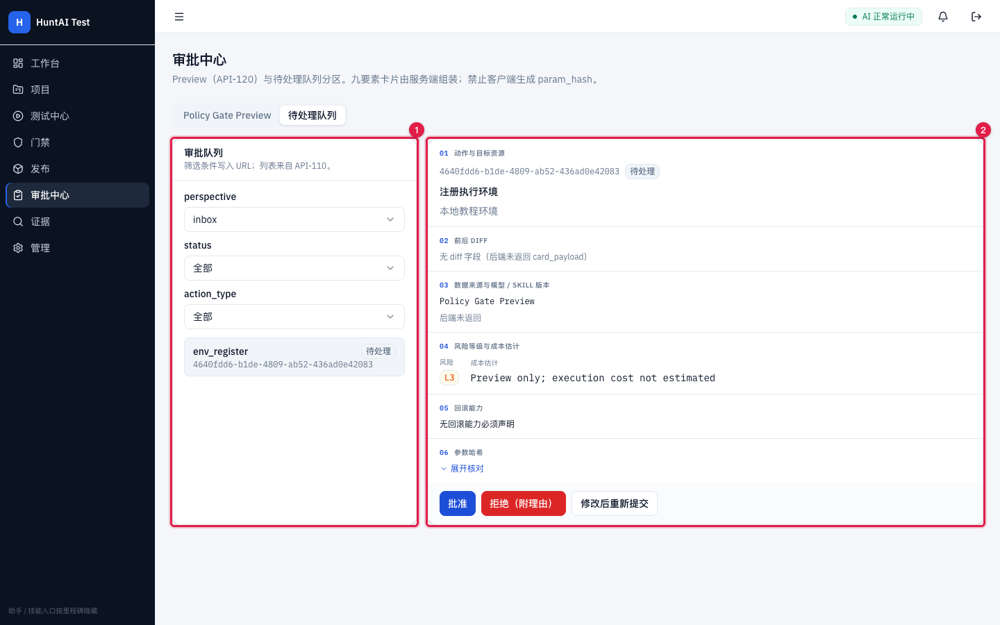

> ① `审批队列`（含三个筛选与队列列表）② 九要素卡片。
> 注意屏幕上半部分的两个页签：**不点 `待处理队列` 就看不到队列**，这是新手最常卡住的一步。

**卡片六个分区**（对应页面上 `01`–`06`）：

| 区 | 标题 | 你会看到什么 |
|---|---|---|
| 01 | 动作与目标资源 | 审批 ID、状态徽标、动作摘要、目标资源 |
| 02 | 前后 diff | 逐字段的「旧值 → 新值」；后端未返回时显示「无 diff 字段」 |
| 03 | 数据来源与模型 / Skill 版本 | 数据来源摘要、模型/Skill 版本 |
| 04 | 风险等级与成本估计 | 风险徽标（L0–L4）+ 成本估计 |
| 05 | 回滚能力 | 回滚说明；无回滚能力也必须有声明 |
| 06 | 参数哈希 | 默认折叠，点「展开核对」可看到 `param_hash` |

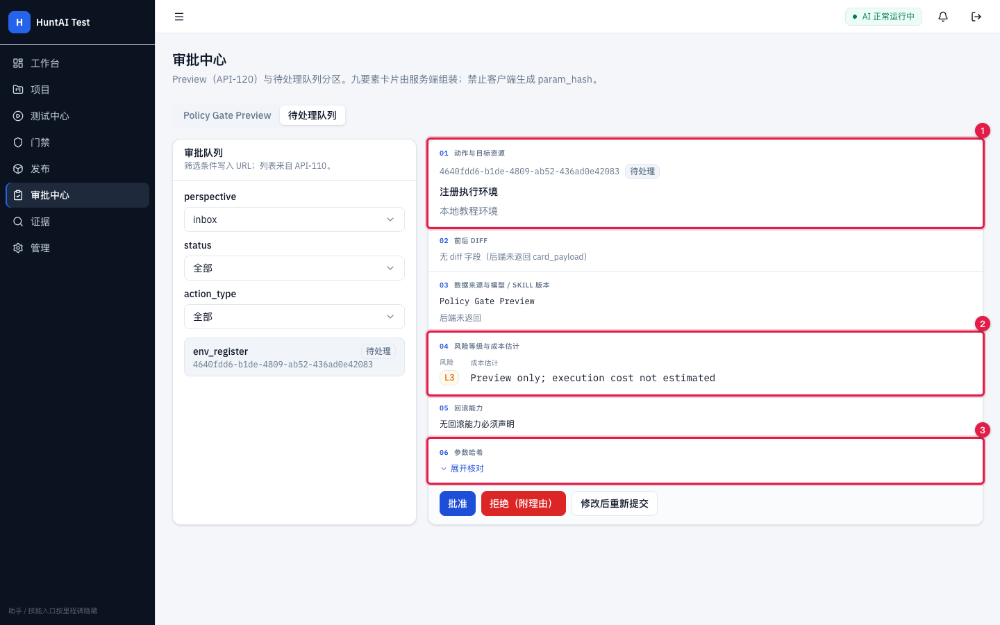

> ① `01 动作与目标资源`（审批 ID + 状态徽标 + 动作 `注册执行环境` + 目标 `本地教程环境`）
> ② `04 风险等级与成本估计`：`env_register` 是代码冻结的 **L3**
> ③ `06 参数哈希`：默认折叠，点 `展开核对` 展开。
> 这张卡片的 `02 前后 diff` 与 `03 数据来源` 显示「后端未返回」——因为 `env_register` 由 Policy Gate Preview 生成，没有 diff 字段与模型来源，**这是正常返回，不是报错**。

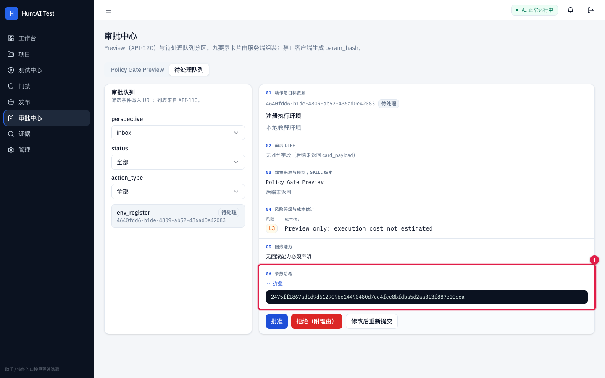

> ① `06 参数哈希` 展开后的值。这个哈希由**服务端**计算，前端只做展示，不参与生成。

**操作区三个按钮**：

- `批准`
- `拒绝（附理由）` — 理由**必填**，不填无法确认
- `修改后重新提交` — 从被驳回的请求重新发起

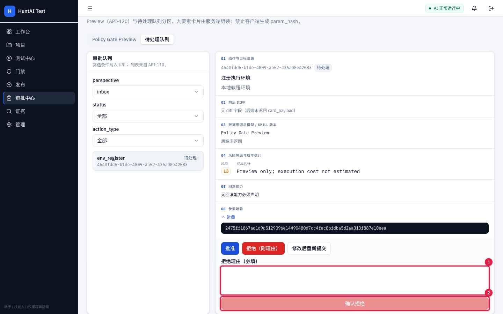

> ① `拒绝理由（必填）`：不填时 ② `确认拒绝` 一直是置灰的。

**发起人为什么点不了「批准」**

- 前端会显示「发起人本人不可批准（四眼前端呈现，服务端强制）」，并置灰按钮。
- **服务端也会拦**：即使绕过前端直接调接口，也会返回 `403` + `HT-IAM-002`。
- 候选审批人列表本身就排除了发起人，所以「换个页面点」是没用的。

**卡片顶部出现红色「审批已失效 — 参数已被修改」**：说明这条审批的目标参数在待审期间被改动了，`param_hash` 对不上。此时批准/拒绝都不可用，必须走「修改后重新提交」（服务端会作废原请求、新建一条 `PENDING`）。

---

## §5 常见卡点对照表

| 现象 | 错误码 / HTTP | 含义 | 你该做什么 |
|---|---|---|---|
| 点了批准，被拒 | `403` `HT-IAM-002` | 四眼违例：批准人 = 发起人 | 换成另一个账号批准 |
| 同租户但没这个动作的权限 | `403` `HT-IAM-001` 等 | 角色不够（如 tester 想注册环境） | 换 owner/admin |
| 提示要重新认证 | `401` `HT-AUTH-002` | L3+ 动作超出再认证时间窗 | 重新登录完成 step-up 后，用**同一个幂等键**重放（请求体不能变） |
| 资源打不开 | `404` `HT-RES-001` | 跨租户或无权感知 | **一律显示「资源不存在」是设计如此**，不要用 403/404 差异去探测存在性 |
| 状态不对 | `409` `HT-STATE-001` | 当前对象状态不允许该动作（如 `APPROVED` 不等于已执行） | 刷新拿最新状态再决定 |
| 版本冲突 | `409` `HT-VER-001` | `expected_version` 对不上（别人先改过） | 刷新拿新版本再操作，不要本地自增 |
| 幂等键冲突 | `409` `HT-IDEM-001` | 同一 `Idempotency-Key` 但请求体变了 | 换新键，或把 body 对齐后再用原键 |
| 策略拒绝 | `403` `HT-POL-001/002` | Policy DENY / 未声明副作用 / 压测白名单外 | 检查动作是否声明了合法副作用等级 |
| 外部结果未知 | `409` `HT-EXT-002` | `execution_result=unknown` | 对账或人工接管，**禁止盲重试、禁止当成功** |
| 网络未决 | `5xx` / 超时 `HT-NET-*` | 不知道成没成 | **先 GET 对账**；不要换新幂等键重发 |
| 提交表单没反应 | — | 幂等键重复 | 每次「发起」用新幂等键；前端已自动生成，若手工调接口需自己保证 |
| 等审批的页面一直转 | — | 等待态 | `WAITING_APPROVAL` / `WAITING_EXTERNAL` 是合法状态，**不允许因为耗时而隐藏** |

> **一条贯穿全文的纪律**：`APPROVED` ≠ `EXECUTED`；`受理` ≠ `完成`。收到确认前只显示「受理中」，以后端权威 GET 的状态为准。

---

## §6 覆盖范围表：哪些能在本地端到端走通

**本节的目的**：如实说明边界，不假装成功。下表是当前仓库在「干净本地环境」下的真实能力。

### 6.1 本地可端到端走通（本文已实测）

| 页面 | 路由 | 依赖 |
|---|---|---|
| P01 工作台 / P02 项目总览 | `/`、`/projects/<id>/overview` | 仅种子数据 |
| P05 用例库 | `/projects/<id>/cases` | 无 |
| P07 生成审阅 | `/projects/<id>/cases/generation-review` | A1 本地 stub，**无需模型 Key** |
| P11 质量门禁策略 | `/gates/policies` | 无 |
| P15 环境管理 | `/projects/<id>/environments` | 无（`platform_executor` 不需要连接器） |
| P10 审批中心 | `/approvals` | 需要**第二个账号**（四眼） |
| P08 发起执行 | `/test-center/kickoff` | 一个可达的 `TARGET_ENV` |
| P09 TestRun 详情 | `/test-center/runs/<runId>` | 无 |
| 证据中心（读已产生证据） | `/evidence` | 先有一次执行 |

### 6.2 本地 loopback mock 已接线（仍非生产）

起齐 **8091**（[`local-testing-guide.md`](./local-testing-guide.md) §3 步骤 5）且种子 Connector 的 `action_contract.base_url` 指向 loopback 时，产品出站会经 **httpx 打到 mock**；`base_url` 缺失或非 loopback 时仍走进程内 stub（fail-close，不把 mock 当生产）。

| 能力 | 本地 loopback 上怎样 | 仍须知道 |
|---|---|---|
| Jira 写缺陷（`jira_write`） | 四眼批准后 httpx → `http://127.0.0.1:8091/jira`；证据里出现 `HT-<n>` 键 | `APPROVED` ≠ `EXECUTED` + `execution_result=ok`；见 §7.3 |
| GitHub Check Run | 失败 run 评估链可 httpx → `http://127.0.0.1:8091/github` | 与 §3 的 Script 成功路径无关 |
| Release prepare（`release_push` 批准后） | httpx → `http://127.0.0.1:8091/release`；`scope_snapshot` 写入 `release_mock` / `RI-…` | **READY ≠ 生产已发布**；平台只准备 item |
| Release webhook（`release_item_ready`） | mock `POST /dev/emit-webhook` 代签 HMAC 后打到产品入站链 | webhook **只落观察**再走已登记命令；不直接改状态机 |
| Jenkins CI 回填 | mock 已预置 `local-demo` / `smoke-suite` job | **须自行注册** `external_ci` 环境（endpoint `http://127.0.0.1:8091/jenkins`，`credential_ref` 见 §7.6）；UI 表单不暴露凭证字段 |
| 性能压测（P16） | Locust 包装已落地 | 目标须命中 `perf_whitelist`，否则 `HT-POL-002` |
| Agent Mode（P14） | 试点已落地，**不进门禁** | 一期 `external_ci` 不支持 Agent |
| Copilot 只读（P18 `/assistant`） | 本地 stub 可提问 | **不在主导航**；直接打开 `/assistant` |
| Copilot 写操作 | 代码冻结为 `DISABLED` | M4 能力 |
| 定时回归 / 计划级报告 | API-055 可存绑定 | cron/时区仍 TBD |

> **红线提醒**：Agent Mode 的结果**不进质量门禁，也不作为发布证据**。mock 集成仅供本地联调，**不是**生产 Jira / GitHub / Jenkins / Release。

### 6.3 集成中心（P25）入口

左侧 `管理` → 子项 **集成中心**（P25，`/admin/integrations`）。应能看到种子写入的 **4 条** mock 连接器，名称分别为 `Local mock Jira` / `Local mock GitHub` / `Local mock Jenkins` / `Local mock Release`，类型徽标 + **`可写`** 绿标。项目 `Local Dev Project` 的 `jira_project_key` 为 `HT`（P02 可见）。

`http://127.0.0.1:8091/confluence/` 只是演示 HTML + 可下载 OpenAPI，**不是** `Connector.type`，**不会**出现在 P25 列表里。完整走查见 **§7**。

---

## §7 质量闭环扩展（Jira · Release · 可选 Jenkins）

> **这篇扩展给谁**：已完成 §1–§5（至少有一条 `ACTIVE` 用例、一个 `ACTIVE` 的 `platform_executor` 环境、一条门禁策略，并跑通过一次 `SUCCEEDED` 的 Script 执行）。§7 在同样数据上叠加 **失败证据 → Jira 写 → Release 编排 → webhook 观察**，教你看清「平台编排质量证据、不执行生产发布」的边界。
>
> 截图文件名以 `images/7-` 为前缀，由 `backend/scripts/capture_tutorial_screenshots.mjs` 拍摄（图下 ① ② ③ 角标与 [`images/README.md`](images/README.md) 规则一致）。重拍前可用 `uv run python scripts/bootstrap_tutorial_assets.py` 经公开 API 补齐 §2 数据。

### 7.1 核对四条种子连接器（P25）

**目标**：确认 loopback mock 已被产品识别为可写出站。

**操作**

1. 用 `local-dev-user` 登录。
2. 左侧 `管理` → `集成中心`，进入 `/admin/integrations`（页面标题「集成中心」）。
3. 打开 **连接器** 页签，核对列表里 **4 条**记录：

| 名称 | 类型徽标 | 出站 |
|---|---|---|
| `Local mock Jira` | `jira` | `可写` |
| `Local mock GitHub` | `github` | `可写` |
| `Local mock Jenkins` | `ci` | `可写` |
| `Local mock Release` | `release` | `可写` |

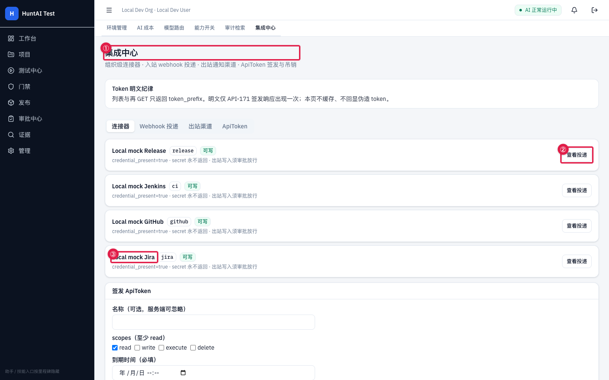

> ① `管理` 子导航里的 `集成中心` ② 连接器卡片上的名称与类型 ③ 绿色 `可写` 徽标（`outbound_write_enabled=true`）。

**期望看到**：四条齐全；卡片小字含 `credential_present=…` 与「出站写入须审批放行」。**看不到 Confluence**——它不是连接器类型。

**失败怎么办**

| 现象 | 处理 |
|---|---|
| 列表为空 | 重跑 `cd backend && uv run python scripts/seed_local_identity.py` |
| 8091 healthz 不通 | 启动 `uv run python scripts/mock_integrations.py`（§0.1 第四条 curl） |
| 没有 `可写` | 检查种子是否写入 `outbound_write_enabled` |

### 7.2 再跑一次 Script，故意 FAILED（制造聚类）

**目标**：用**同一条** §2.3 的 `ACTIVE` 用例，换 `TARGET_ENV` 让请求 404，得到失败 run 与聚类输入。

**操作**

1. 左侧 `测试中心` → `发起执行`（P08），项目仍选 `Local Dev Project`，模式 `Script Mode`，环境仍选 §2.4 的 `本地教程环境`。
2. 勾选同一条 `ACTIVE` 用例。
3. **`TARGET_ENV（必填）` 改为 `http://127.0.0.1:8091`**（注意：不要带 path）。
4. 点 `发起执行`。

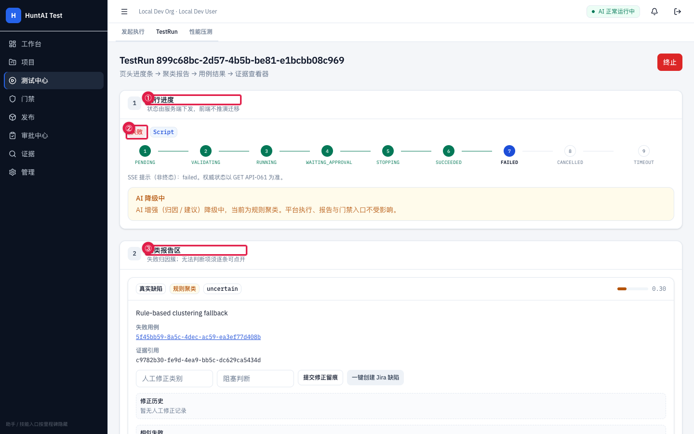

> ① `TARGET_ENV` 填 `http://127.0.0.1:8091` ② 仍勾选 §2.3 的活跃用例。

**为什么会 FAILED？** 用例 path 仍是 `/.well-known/openid-configuration`（来自 §2.2 的 curl 原文）。执行器做 `urljoin`：`http://127.0.0.1:8091` + `/.well-known/openid-configuration` → `http://127.0.0.1:8091/.well-known/openid-configuration`。8091 是 Jira/GitHub/Jenkins/Release mock，**没有** IdP 的 OpenID 配置路径 → HTTP 404 → 用例 `failed` → TestRun 终态 **`失败`**。这是**真实失败证据**，不是平台故障。

**期望看到**（P09）：页头进度条终态 `失败`；第 2 区「聚类报告区」在终态后出现簇卡片（可能短暂显示「聚类生成中」）。

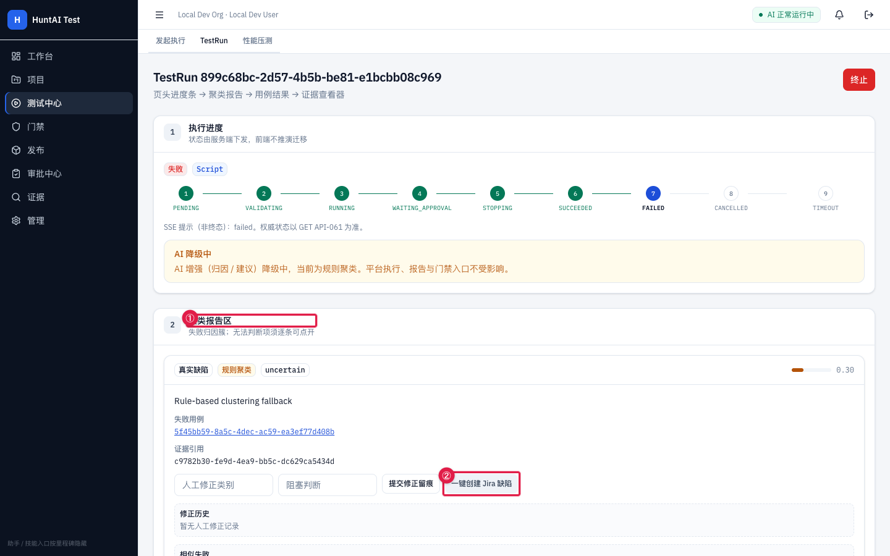

> ① 执行进度终态 `失败` ② `聚类报告区` ③ 簇卡片（类别徽标 + 置信度条）。

### 7.3 聚类上一键创建 Jira 缺陷（四眼 → mock HTTP）

**前提**：§7.2 的 run 已是 `FAILED`；当前账号不是 `viewer`。

**操作 A：发起人创建审批（`local-dev-user`）**

1. 停留在 P09，在 **聚类报告区**（第 2 区）找到簇卡片。
2. 点 **`一键创建 Jira 缺陷`**（`jira_write` 的 Preview，L2 须审批）。
3. 成功后浏览器通常会**自动跳到** `审批中心`（带 `highlight` 参数）；若未跳转，手动打开 `待处理队列` 找 `action_type` 为 `jira_write` 的项。


> ① `一键创建 Jira 缺陷`（仅 `FAILED` run 且该簇尚无 Jira 时出现）。

**操作 B：对端批准（`local-dev-user-2`）**

4. 第二个身份打开 `审批中心` → `待处理队列` → 选中 `jira_write` → 点 `批准`。

**期望看到**

- 批准后执行钩子 httpx 到 mock Jira；簇卡片出现 **`Jira 缺陷：HT-<n>`**（`n` 递增）。
- 证据中心或 P09 证据引用里能关联到 outbound 证据（append-only `EvidenceObject`）。

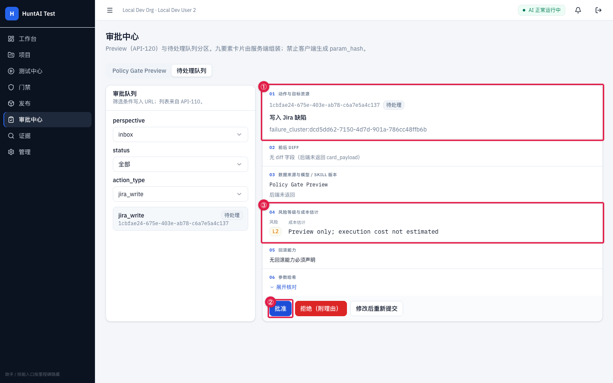

> ① `Jira 缺陷：HT-…` 行。

**可选：curl 对账 mock 上的 issue**

```bash
curl -s http://127.0.0.1:8091/jira/rest/api/2/issue/HT-<n>
```

把 `<n>` 换成卡片上的数字。这是 **mock 进程**上的只读核对，不是产品 API。

**失败怎么办**

| 现象 | 处理 |
|---|---|
| 看不到 `一键创建 Jira 缺陷` | run 不是 `FAILED`，或该簇已有 `jira_issue` |
| 批准人 = 发起人 | 403 `HT-IAM-002`；换 `local-dev-user-2` |
| 批准后无 `HT-` 键 | 确认 8091 活着、Jira 连接器 `base_url` 为 loopback；查后端日志 |
| 误以为「批准 = 外部已落地」 | **`APPROVED` ≠ `EXECUTED` + ok**；以 GET 簇详情 / 证据为准 |

### 7.4 Release 任务：圈定版本 → release_push 审批

**目标**：创建 Release 任务，走 L4 `release_push` 四眼，批准后平台 **内部 prepare** release item（httpx → mock `/release`）。

**操作**

1. 左侧主导航点 **`发布`**，进入 `/releases`（页面标题「Release 任务」）。页顶 Alert 写明：**无「执行生产发布」路径；READY ≠ 生产已发布**。
2. 填写：
   - **`项目 ID`**：`00000000-0000-4000-8000-000000000003`
   - **`Jira 版本号`**：`1.0.0`（mock `GET /jira/rest/api/2/project/HT/versions` 返回的 name；placeholder 显示 `v1.0` 但教程用 `1.0.0`）
3. 点 **`圈定版本创建（API-152）`**。
4. 左侧选中新建任务；状态徽标应为 **`待确认`**（`PENDING_CONFIRM`）。
5. 在「范围快照」卡片点 **`发起 release_push 审批`** → 对话框 **`确认推送到 Release 系统？`** → **`发起审批`**。
6. `local-dev-user-2` 在 `审批中心` 批准该 `release_push`（L4，四眼）。

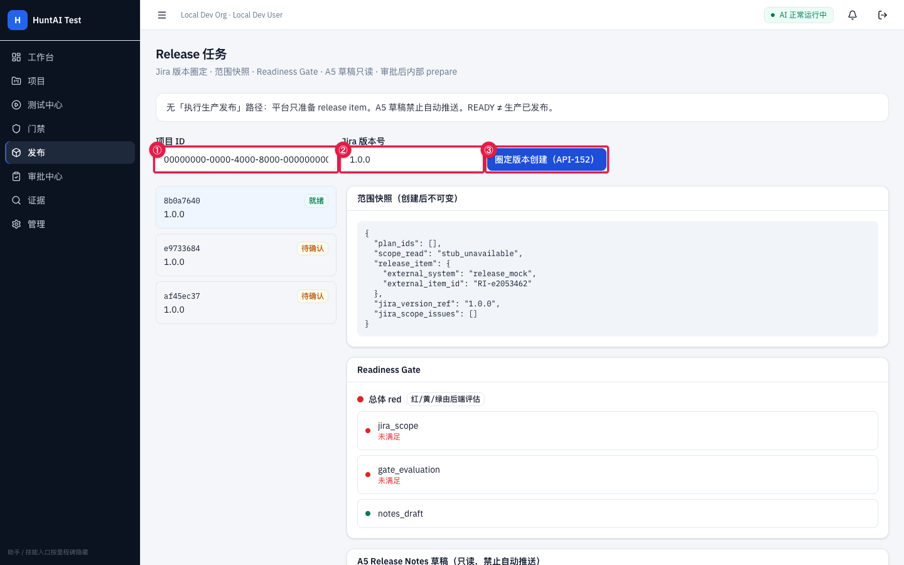

> ① `项目 ID` ② `Jira 版本号` `1.0.0` ③ `圈定版本创建（API-152）`。

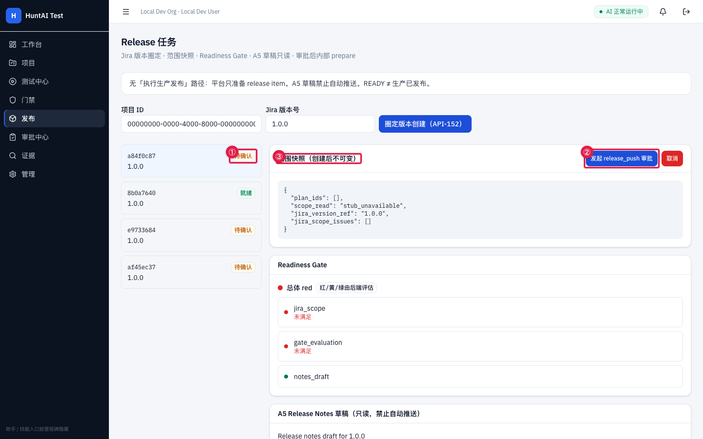

> ① 状态 `待确认` ② `发起 release_push 审批`。

**期望看到**

- 批准后任务变为 **`已提交`**（`SUBMITTED`）。
- 「范围快照」JSON 中出现 `release_item`，含 `"external_system": "release_mock"` 与 `"external_item_id": "RI-…"`（`RI-` 前缀由 mock prepare 返回）。


> ① 状态 `已提交` ② `scope_snapshot` 里的 `release_item.external_system` / `external_item_id`。

### 7.5 模拟 Release webhook：SUBMITTED → READY

**目标**：用 mock 的 **`POST /dev/emit-webhook`** 代签 HMAC，把 `release_item_ready` 观察推入产品入站链；任务迁到 **`就绪`**（`READY`）。

**操作**：在终端执行（把占位符换成 §7.4 的真实值）：

```bash
curl -s -X POST http://127.0.0.1:8091/dev/emit-webhook \
  -H 'Content-Type: application/json' \
  -d '{
    "huntai_base": "http://127.0.0.1:8000",
    "connector_id": "00000000-0000-4000-8000-000000000013",
    "event": "release_item_ready",
    "delivery_id": "00000000-0000-4000-8000-000000000099",
    "body": {
      "release_task_id": "<§7.4 的任务 UUID>",
      "external_item_id": "<scope_snapshot.release_item.external_item_id>",
      "status": "ready"
    }
  }'
```

- `connector_id` 固定为种子 Release 连接器 `…0013`。
- **`delivery_id` 每次换新的 UUID**（去重键）；**不要把任何密钥写进 JSON**——签名由 mock 进程用 `.env` 的 `GITHUB_WEBHOOK_SECRET` 计算。
- 仅 loopback 客户端可调用；mock 会 POST 到 `{huntai_base}/api/v1/inbound-webhooks/{connector_id}`。

**期望看到**：curl 返回 `delivered: true`；刷新 Release 页，任务状态 **`就绪`**。P25 → **Webhook 投递** 页签可看到新投递（`accepted`）。

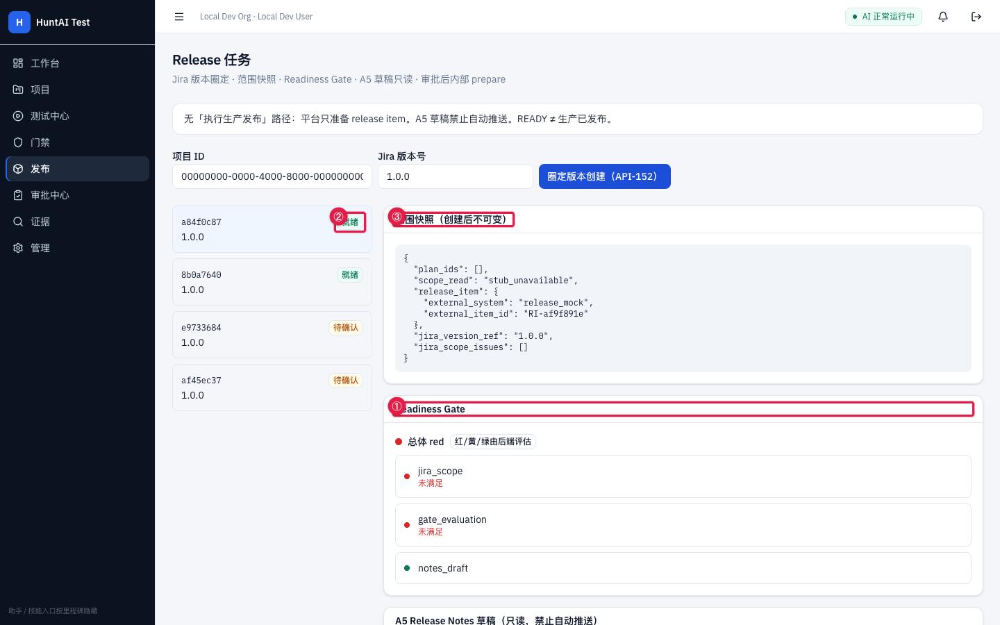

> ① 状态 `就绪` ② 仍无「生产发布」按钮——**READY 只表示外部 item 观察到位，不等于生产已发布**。

**纪律**：入站 webhook **先验签、落 `external_observations`，再分派已登记命令**；禁止把 webhook 当命令通道直接改 `ReleaseTask`。平台**不执行**生产发布。

### 7.6（可选）external_ci + mock Jenkins

本地 Jenkins 形状在 8091，但 **不会自动注册执行环境**。若要体验 CI 回填，需额外造一条 `external_ci` 环境（**四眼 `env_register`**，与 §2.4 相同审批流）：

| 字段 | 填什么 |
|---|---|
| 名称 | 任意，如 `本地 mock Jenkins` |
| 类型 | `external_ci` |
| 作用域 | `project` |
| Endpoint | `http://127.0.0.1:8091/jenkins` |
| 可选 Job ID | `local-demo` |
| 报告适配器 | `junit`（选 Job ID 后出现） |

**凭证陷阱**：P15 注册表单**没有** `credential_ref` 输入框；测试里常在审批前用 ORM 写入 `env:JENKINS_API_TOKEN`。教程最短路径是注册时通过 API-102 body 带上 `"credential_ref": "env:JENKINS_API_TOKEN"`（须已在 `.env` 配置 `JENKINS_API_TOKEN` 任意非空值），或批准后在库内补绑——**仅本地联调**。

还需一条引用该 `job_id` 的 `ACTIVE` 用例，并从 P08 选 `external_ci` 环境发起执行。mock 的 `local-demo` build 会返回 **一 pass 一 fail** 的 JUnit，用于报告解析练手。细节与坑（Agent × external_ci 不支持、job schema 必填等）见 [`developer-guide.md`](./developer-guide.md) §4；主链路**可跳过**本节。

### 7.7（可选）Confluence 演示 OpenAPI → 第二次 A1

打开 <http://127.0.0.1:8091/confluence/> 阅读说明，下载或 `curl` OpenAPI：

```bash
curl -s http://127.0.0.1:8091/confluence/openapi.json
```

在 P07 **生成审阅** 把数据源改为 `openapi`，粘贴 JSON 原文，再 `发起 A1 生成`——与 §2.2 的 curl 数据源并列，**不是** RAG / M4 Confluence 连接器。该页**不会**出现在 P25。

---

## 附：本文与其它文档的关系

| 文档 | 讲什么 |
|---|---|
| [`local-testing-guide.md`](./local-testing-guide.md) | 环境准备与启动（本文的前置） |
| **本文** | 普通用户在 UI 里从零造数据 → 跑完一次执行 |
| [`developer-guide.md`](./developer-guide.md) | 每个 UI 操作背后的模块、原理与对应测试用例 |
| [`tutorial/`](./tutorial/index.html) | 按后端模块分篇的代码教程 |

**下一步**

- 想走 Jira 写缺陷 / Release webhook / 可选 Jenkins → 继续 **§7**（假定 §2–§3 数据已存在）。
- 想知道「我点的『批准』按钮，服务端到底执行了哪段代码、哪条测试在保护它」→ 打开 [`developer-guide.md`](./developer-guide.md)。
