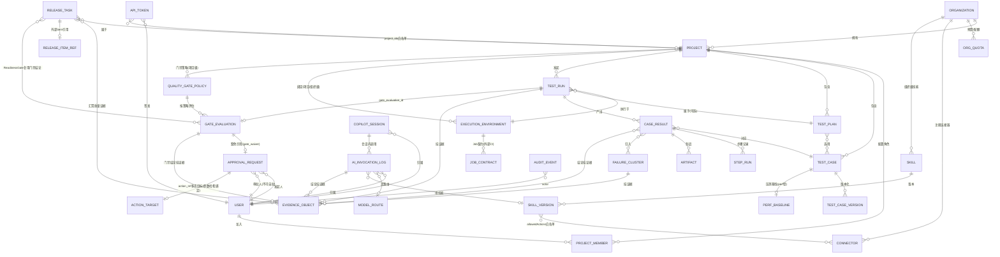
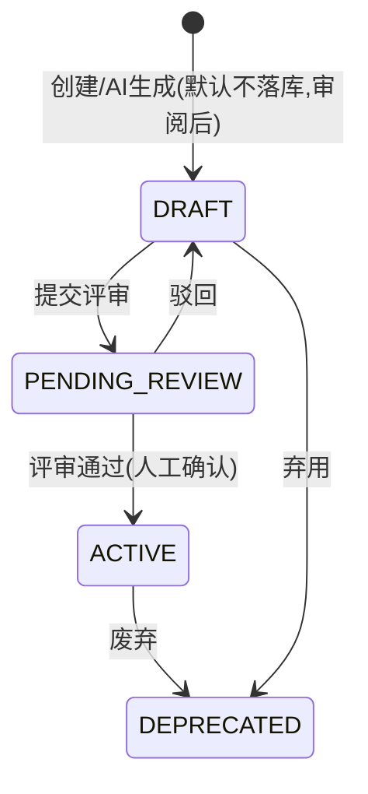
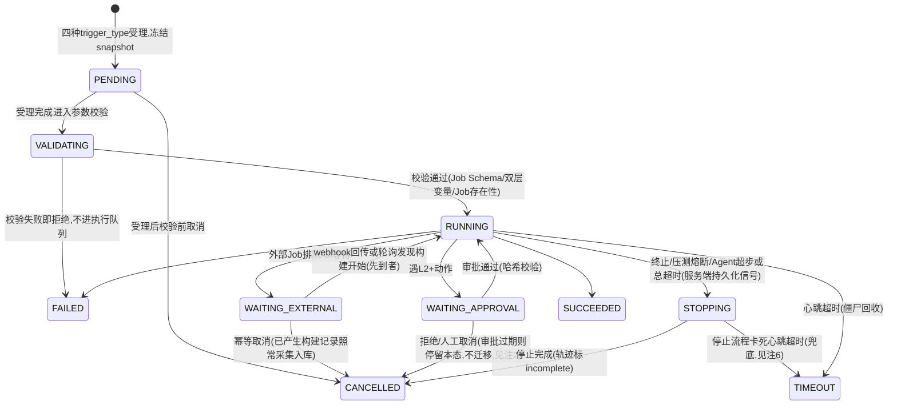
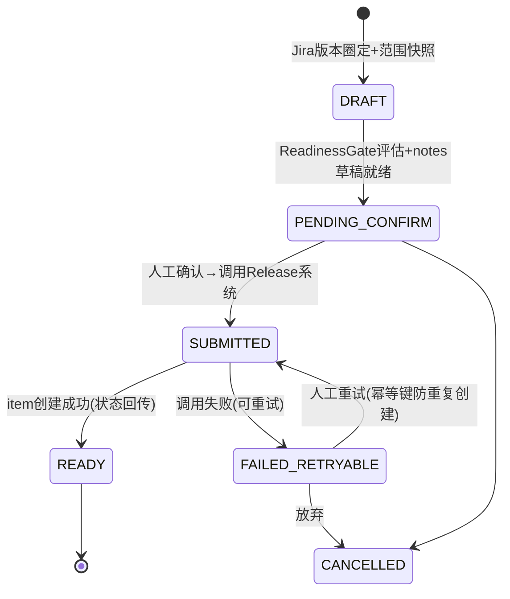

# 05 · 业务建模与领域模型（收口建模层 · Stage 5）

> - **日期**：2026-08-29 · **版本**：v1.4
> - **流程定位**：开发流程图 Stage 5「业务建模」产出；上承 [03-市场调研借鉴](../01_market_research/market_research.md)（Stage 3）与 [04-竞品功能拆解索引](../02_competitor_analysis/competitor_analysis.md)（Stage 4），下供 Stage 6 核心交互链、Stage 7 产品原型、Stage 8 后端架构与数据模型设计使用
> - **定位**：完成「功能清单 → 业务建模」的数据升级，作为后续**系统架构设计、前端原型设计、数据模型设计**的共同输入。
> - **收口纪律**：所有对象 / 状态 / 页面均可追溯到 [12-PRD](../08_prd/prd.md) 的 FR 或 [README](../README.md)（v1.5）章节，来源以「←」标注；为建模完整性补充的字段级细节标注 **[建模补全]**，数据模型设计阶段可调整，不构成新需求。
> - **v1.3 说明**：本版为一致性修复版——补齐既有 FR 在建模层的落点缺口（门禁对象、配额对象、4 个页面）与状态机 / ER 图的表述矛盾，**不引入新业务功能**；新增对象与页面均可回溯到已冻结的 FR 或 README 裁定表条目。
> - **v1.4 说明**：按已批准架构复审补充 `execution_result=unknown`，用于表达外部请求可能已发出但效果不可判定；不新增领域对象或 ApprovalRequest 状态。
> - **不做什么**：不定义 API 路由细节、不写 DDL、不做视觉设计——分别是架构 / 数据模型 / 原型阶段的工作。

---

## 1. 领域对象总览与 ER 模型

### 1.1 领域对象清单（23 个，全部带溯源）

| # | 对象 | 职责 | 来源 |
| --- | --- | --- | --- |
| 1 | Organization | 租户 = 部门/事业部；预算与配额的归属单元 | ← FR-01 |
| 2 | User / ProjectMember | SSO 用户 + 项目内角色（owner/admin/tester/viewer） | ← FR-01 |
| 3 | Project | 业务项目；关联 Jira 项目映射 | ← FR-01、裁定表「项目从 Jira 只读同步」 |
| 4 | ExecutionEnvironment | 执行环境一等注册对象（平台执行器实例 / 企业 Jenkins 实例 + Job 契约） | ← FR-18、README 4.0 |
| 5 | TestCase(+Version) | 测试用例（含引用型）；版本化 + ai-generated 标签流 | ← FR-05/06、README 4.0 |
| 6 | TestPlan | 测试计划（关联 Jira fixVersion） | ← 裁定表「测试计划」 |
| 7 | TestRun | 执行批次（统一状态机；execution_source 三值） | ← FR-08、README 7.10 |
| 8 | CaseResult / StepRun / Artifact | 用例级结果 / 步骤级记录 / 制品（截图/视频/Trace/日志引用） | ← FR-07/09、README 4.2 |
| 9 | FailureCluster | run 级失败聚类（含阻塞判断） | ← FR-07 |
| 10 | EvidenceObject | 证据一等对象：claim → evidence_link → source_object | ← README 7.11 |
| 11 | ApprovalRequest | HITL 审批（参数哈希绑定、九要素卡片） | ← FR-04、README 9.12 |
| 12 | AIInvocationLog | AI 调用全量日志（无旁路） | ← FR-02 |
| 13 | AuditEvent | append-only 审计事件 | ← 03 文档 3.16 schema |
| 14 | Skill(+SkillVersion) | 版本化技能包（双消费者：Copilot + Agent Mode） | ← README 5.2、4.0 |
| 15 | ModelRoute | 模型路由（任务类型 × 数据分级 × 成本上限） | ← README 7.12 |
| 16 | PerfBaseline | 压测基线（同场景唯一活跃、快照冻结） | ← FR-11、README 4.3 |
| 17 | ReleaseTask | 发布任务（范围快照 + Readiness Gate + 外部 item 引用） | ← FR-15、README 5.1 |
| 18 | ApiToken | CI/集成 API Token（细粒度 + 有效期 + 吊销） | ← 裁定表「Token 管理」 |
| 19 | Connector | 集成中心连接器配置（Jira/GitHub/CI/Release） | ← README 5.1/裁定表、03 文档 3.6 |
| 20 | CopilotSession | Copilot 服务端会话（持久化） | ← FR-16、README 5.2 反面清单 #4 |
| 21 | OrgQuota | 组织级配额与预算（AI Token 预算 + 执行资源配额）——v1.3 补列：§2.5 字段表、§3 CRUD 矩阵与 §1.2 ER 图已使用，原清单遗漏 | ← FR-03、README 7.1/裁定表「限流放 gateway」 |
| 22 | QualityGatePolicy | 质量门禁策略（三阈值 + 仅报告⇄阻断模式 + 阈值来源域）——v1.3 补列：FR-12/13 与「质量门禁策略」页均以此为落点，原清单无对象承接 | ← FR-12/13、README 4.3 第 6 条、裁定表「质量门禁」 |
| 23 | GateEvaluation | 门禁评估结果（TestRun.gate_evaluation_id 的指向对象：结论 / 逐阈值明细 / Check Run 引用 / 豁免引用）——v1.3 补列 | ← FR-12/13、§2.2 gate_evaluation_id |

### 1.2 ER 图（关系与基数）



**关键基数与约束**（均来自既有决策）：

1. 所有核心表带 `tenant_id`（= Organization），ORM/中间件强制过滤，无组织上下文 = 拒绝而非放行（← FR-01，反面证据见 04 索引 FST G1–G8）；
2. `execution_source` 枚举：`script` / `agent` / `external_ci`（← README 4.0），决定结果是否可进门禁（仅 script / external_ci）；
3. `side_effect_level` 枚举 L0–L4，声明在 Connector Action、Skill、Agent 工具三处（← README 7.9）；
4. PerfBaseline 同场景唯一活跃，创建自动停用旧基线（← FR-11）；
5. 引用型用例（case_type=referenced）不托管脚本，仅声明 Job 引用 + 参数 + 采集配置（← FR-18）；
6. **ACTION_TARGET 不是独立表**（v1.3 澄清，替代原图中无定义的 `EXECUTION_EFFECT`）：它是 §2.3 `action_ref = {type, payload}` 的多态目标语义占位——按 type 指向 TestRun / TestCase / ReleaseTask / ExecutionEnvironment / GateEvaluation 等既有对象，物理落表方式由数据模型阶段决定。同理，ER 图中的 `JOB_CONTRACT`（属 ExecutionEnvironment）、`RELEASE_ITEM_REF`（属 ReleaseTask）、`PROJECT_MEMBER` / `TEST_CASE_VERSION` / `STEP_RUN` / `ARTIFACT` 均为 §1.1 清单对象的**从属结构**，不另计入对象总数；
7. **门禁两对象职责分离**（v1.3）：QualityGatePolicy = 阈值与模式配置（项目级，可版本化），GateEvaluation = 单次评估结果快照（不可变，含评估时所用策略快照）——避免策略事后修改导致历史门禁结论漂移（同「快照冻结」纪律）；
8. **无门禁资格的 run 不产生 GateEvaluation**：`execution_source=agent` 的 TestRun 其 `gate_evaluation_id` 恒为空（← README 4.0：Agent Mode 结果不进门禁）。

---

## 2. 核心对象字段与状态机全集

通用列（所有表默认具备，下表不再重复）：`id`、`tenant_id`、`created_at`、`updated_at`、`created_by`。

### 2.1 TestCase（含引用型）与版本

| 字段 | 类型/约束 | 来源 |
| --- | --- | --- |
| case_type | enum: `api` / `web` / `performance` / `referenced` | ← README 4.0 三域 + 引用型 |
| execution_mode | enum: `script` / `agent` | ← README 4.0 双执行模式 |
| title / priority / tags | 文本 / P0–P3 / 含保留标签 `ai-generated` | ← FR-05 |
| script_ref | 对象存储引用（script 型）；referenced 型为空 | ← FR-05 |
| job_binding | referenced 型：`{env_id, job_id, params_schema_ref, collect_config, gate_mapping}` | ← FR-18 |
| validity | enum: `valid` / `invalid`（**系统标记，区别于人工 DEPRECATED**，v1.2 裁定）：引用型 Job 被外部删除/改名、执行前存在性校验失败 → 置 invalid 并通知 Owner，不进执行队列；Job 恢复后可回 valid（失效可逆）；辅助字段 invalid_reason / invalidated_at [建模补全] | ← 12-PRD §2.3 边界场景 |
| jira_story_key | 关联 Jira story（单向链接） | ← FR-14 |
| current_version_id → TestCaseVersion | 版本指针；Version 存全量快照 | ← FR-06（自愈快照）、TestHub 版本模型 |

**状态机**（← FR-05 两步式 + TestHub 评审四态借鉴）：



约束：`ai-generated` 用例**必须**经 PENDING_REVIEW→ACTIVE 人工确认，禁止生成直写 ACTIVE（← FR-05 验收「无 save=true 直写路径」）。

### 2.2 TestRun（统一执行状态机）

| 字段 | 类型/约束 | 来源 |
| --- | --- | --- |
| plan_id / env_id | 可选关联计划 / 必填执行环境 | ← 1.2 ER |
| execution_source | enum: `script`/`agent`/`external_ci` | ← README 4.0 |
| trigger_type | enum: `manual`/`schedule`/`ci_webhook`/`api_token` | ← FR-13/18、定时回归 |
| idempotency_key | 唯一索引；external_ci 重放不重复触发 | ← FR-18 验收 |
| gate_evaluation_id | 门禁评估结果引用 | ← FR-13 |
| snapshot | 触发时配置快照（用例版本、环境、参数） | ← 快照冻结（03 文档 3.4） |

**状态机**（← README 7.10，融合 TestHub 8 态）：



终态集合 = {SUCCEEDED, FAILED, CANCELLED, TIMEOUT}；活跃态必须有心跳，无心跳超时自动转 TIMEOUT 并回收（← FR-08 验收「无永久 running」）。

**v1.2 边标注与裁定补充**：

1. 校验动作在 VALIDATING 态执行（PENDING 仅受理 + 快照冻结）；FR-18「参数不过 Job Schema 校验即拒绝」的落点 = `VALIDATING → FAILED`；
2. **审批过期不迁移**：ApprovalRequest 过期（EXPIRED）后 TestRun **停留 WAITING_APPROVAL**（不自动放行，待人工重新提交或取消）；仅「拒绝 / 人工取消」走 CANCELLED（← 12-PRD §2.3，v1.2 澄清，替代旧标注「拒绝/过期」）；
3. WAITING_EXTERNAL 排队超时仅告警，不自动迁移、不自动取消外部 Job（← FR-18「超时阈值告警 + 可幂等取消」）；
4. Agent Mode 终态归属：系统主动终止（max_steps / 总超时）走 `STOPPING → CANCELLED`（轨迹 incomplete）；进程失联由心跳超时兜底 `RUNNING → TIMEOUT`（← FR-19 验收口径）。

**v1.3 补充裁定（等待态与终止态的兜底口径）**：

5. **等待态不受心跳治理，但必须有滞留可见性**：WAITING_APPROVAL / WAITING_EXTERNAL 是等待态而非活跃态，不适用心跳僵尸回收（← C2 「两套超时职责分离」）。二者均**可长期滞留且不自动迁移**（审批过期不放行；外部排队超时仅告警），因此硬要求：① 两态必须在工作台「进行中 TestRun」与 TestRun 列表持续可见并显示滞留时长；② 滞留超阈值发告警（阈值归 08 配置项）；③ 人工可随时取消（WAITING_APPROVAL→CANCELLED 人工取消边；WAITING_EXTERNAL→CANCELLED 幂等取消边）。**「无永久 running」（FR-08）的口径 = 活跃态无永久滞留**，等待态以「可见 + 可告警 + 可人工取消」替代自动回收；
6. **STOPPING 的兜底出边**：STOPPING 是活跃态（受心跳治理）——停止流程本身卡死（如外部 Job cancel 无响应）时由心跳超时走 `STOPPING → TIMEOUT`，不得永久停留 STOPPING；
7. **VALIDATING 期间取消**：校验为短时同步动作，不提供独立取消边；发起后立即取消统一落 `PENDING → CANCELLED`。

### 2.3 ApprovalRequest（审批中心）

| 字段 | 类型/约束 | 来源 |
| --- | --- | --- |
| action_ref | 多态目标：{type: jira_write / heal_apply / perf_high_risk / release_push / env_register / **agent_tool_action** / **gate_waiver** / **kill_switch_restore**（M4 预留 copilot_write）， payload}——v1.2 扩展：agent_tool_action 承接 Agent Mode 执行中的 L2+ 工具动作（← FR-19）；gate_waiver 承接质量门禁豁免（← FR-13）；v1.3 扩展：kill_switch_restore 承接 AI 开关恢复（关停不走审批，见 §4.2「AI 能力开关与降级」页） | ← FR-04/06/11/13/15/16/19 |
| param_hash | Preview 与 Execute 参数哈希；**参数变化审批失效** | ← README 9.12 |
| card_payload | 九要素卡片数据（动作/资源/diff/来源/模型与 Skill 版本/风险级/成本估计/回滚能力/参数哈希） | ← README 9.12 |
| approver_id | ≠ initiator_id（四眼原则） | ← TestHub 反面取证 |
| snapshot_ref | 应用前快照（自愈等写操作） | ← FR-06 |
| expires_at / escalate_to | 超时升级备审批人，**不自动放行** | ← PRD 边界场景 |
| execution_result | nullable enum：`ok / failed / unknown`，仅 EXECUTED 有值；unknown 表示外部效果不可判定 | ← 架构复审 v1.4 |

**状态机**：`CREATED → PENDING → (参数哈希复核) APPROVED → EXECUTED`；分支 `REJECTED` / `EXPIRED`；consume 加行锁（select_for_update）防并发双执行（← TestHub confirm.py:118 反例）。

**状态语义与处置（v1.2 冻结；v1.4 增补 unknown）**：

- CREATED = Policy Gate 判 REQUIRE_APPROVAL 时创建（瞬时态）；PENDING = 卡片入审批队列、通知审批人、TTL（expires_at）启动；
- 发起方撤回 / 上游对象取消 / APPROVED 后参数变更（审批失效）→ 统一置 **EXPIRED + reason（withdrawn / invalidated）**，AuditEvent 留痕，不新增状态；
- EXECUTED = 已尝试执行，附 **execution_result（ok / failed / unknown）**：`ok` 表示结果已确认成功，`failed` 表示结果已确认失败，`unknown` 表示请求可能已到达外部系统但当前无法确认效果；`unknown` 必须进入对账或人工接管，禁止当作失败盲目重试，也禁止当作成功放行。执行失败或不可判定均通过 AuditEvent、Evidence 与连接器恢复协议表达；需要再次发起新动作时必须创建新审批；
- 「修改后重新提交」生成新请求：**initiator_id = 重新提交人**，保留 origin_request_id / original_initiator_id 归因链，四眼基于新 initiator 校验；
- 审批过期：EXPIRED 后关联 TestRun 停留 WAITING_APPROVAL，不自动放行（← 12-PRD §2.3）。

**action_ref × sideEffectLevel 冻结表（v1.2）**：

| action_ref | sideEffectLevel | 场景说明 |
| --- | --- | --- |
| jira_write | L2 | 外部系统非生产写（建缺陷 + 链接回写） |
| env_register | L3 | 变更审批：新环境接入即解锁外部 Job 触发能力（← README 9.16 管理员审批） |
| heal_apply | L3 | 正式变更审批：修改 ACTIVE 用例生效版本 / 定位器（快照 + 回滚端点） |
| perf_high_risk | L3 | 触发正式压测（白名单外目标直接 DENY，不进审批） |
| gate_waiver | L3 | 质量门禁豁免（← 12-PRD FR-13 v1.4） |
| kill_switch_restore | L3 | AI 能力 / 模块 / 连接器写入开关的**恢复**（放开）；**关停方向为 L1 即时生效、不入审批**（v1.3，事故响应优先） |
| agent_tool_action | 按工具声明（≥L2 才入审批） | Agent Mode 执行中的 L2+ 工具动作（← FR-19） |
| release_push | L4 | 生产发布类：平台仅「准备」不「执行」，人工确认后调用（← README 9.11） |
| copilot_write（M4 预留） | ≥L2 | Copilot 写操作两段式（← README 5.2） |

### 2.4 ExecutionEnvironment 与 Job 契约

| 字段 | 类型/约束 | 来源 |
| --- | --- | --- |
| env_type | enum: `platform_executor` / `external_ci` | ← README 4.0 |
| endpoint / credential_ref | 凭证只存 Vault 引用 | ← README 9.16 |
| health_status | 健康检查结果（最近探活时间/延迟） | ← FR-18 |
| capacity/quota | 平台执行器 slot 数；外部 CI 使用配额 | ← README 4.0 配额 |
| job_contracts[] | external_ci：Job Registry/参数 Schema/产物 manifest/报告适配器/取消能力 | ← 03 文档第 2 节 Jenkins Job Contract |

状态机：`PENDING_APPROVAL →(管理员审批) ACTIVE → DEGRADED(健康检查失败) → DISABLED`。

在途处置（v1.2）：DEGRADED / DISABLED 只影响**新发起**（发起侧环境选择不可选）；在途 RUNNING / WAITING_EXTERNAL run **不中断**——RUNNING 失败按 FAILED 正常落账，WAITING_EXTERNAL 继续幂等采集；触发前环境已 DISABLED 的直接拒绝发起。

### 2.5 其余核心对象（字段摘要）

| 对象 | 关键字段 | 状态机/约束 | 来源 |
| --- | --- | --- | --- |
| FailureCluster | run_id、category（枚举同 A2：**7 值**，unknown 兜底——v1.2 与 12-PRD §3.2 对齐）、root_cause、confidence、blocking_judgment、evidence_refs[]、correction_history[]（人工修正留痕：actor/field/old/new/timestamp，[建模补全]） | 无生命周期（随 run 只读生成，人工修正留痕） | ← FR-07 |
| EvidenceObject | claim、source_object{connector, resource, version, timestamp}、content_ref | append-only；覆盖 ≥95% 关键结论 | ← README 7.11 |
| AIInvocationLog | user、model、prompt_version、usage(真实)、cost、latency、data_classification、result(ok/degraded/refused)、skill_version? | 唯一出口写入（LLM 工厂）；敏感正文不落普通日志 | ← FR-02 + 04 索引修订建议 #1 |
| AuditEvent | 03 文档 3.16 全字段（含 delegated_agent、request_hash、approval.bound_hash、evidence_refs、cost/latency） | append-only，可外发 SIEM | ← 03 文档 3.16 |
| SkillVersion | manifest（allowedTools/max_steps/超时/副作用上限/modelPolicy/金标准测试集）、instructions、scope | 三级发布：personal→team(Owner 审核)→org(管理员+安全)；未版本化不进生产 | ← README 5.2 |
| ModelRoute | task_type、data_classification、provider 白名单、max_cost、fallback | requirePromptVersion / 结构化输出强制 | ← README 7.12 |
| PerfBaseline | scenario(=perf 型 TestCase)、指标快照、容忍度(RT/TPS) | 同场景唯一活跃 | ← FR-11 |
| ReleaseTask | jira_version_ref、范围快照、gate_result、notes_draft、release_item_ref | 见 2.6 | ← FR-15 |
| ApiToken | scopes{read/write/execute/delete}、project_ids[]、expires_at、revoked_at、last_used_at(异步更新) | 进认证链（04 索引修订建议 #2：必须有消费方） | ← 裁定表 |
| Connector | type(jira/github/ci/release)、auth 方式、动作契约（sideEffectLevel/supportsPreview/Idempotency/Compensation） | 写前 ETag；HMAC 强制无例外 | ← 03 文档 3.6 |
| OrgQuota | token_budget、执行资源配额（UI slot/压测并发） | 超限拒新调用并通知 Owner | ← FR-03 |
| QualityGatePolicy | project_id、thresholds{min_pass_rate / max_p95_ms / max_error_rate}（三域同模型，性能阈值同源 FR-12）、mode（`report_only` / `blocking`）、scope（用例集 / 计划 / 仓库分支绑定）、version [建模补全] | mode 切至 blocking 须**显式开启**（上线初期仅报告）；策略修改不改写历史 GateEvaluation | ← FR-12/13、README 裁定表 |
| GateEvaluation | test_run_id、policy_snapshot（评估时策略快照）、result（`pass` / `fail` / `waived`）、threshold_details[]（逐阈值实测值与判定）、check_run_ref（GitHub 回写引用与同步状态）、waiver_approval_id（→ ApprovalRequest.gate_waiver，可空）、evidence_refs[] | **不可变**（append-only，重评估生成新记录）；`execution_source=agent` 的 run 不生成本对象 | ← FR-12/13、§2.2 gate_evaluation_id |

### 2.6 ReleaseTask 状态机（← README 5.1 收口进模型）



---

## 3. FR × 领域对象 CRUD 矩阵（功能 → 数据落点）

| FR | 数据落点（对象：操作） |
| --- | --- |
| FR-01 租户/SSO/RBAC | Organization:C · User:R · ProjectMember:CRUD · Project:C(Jira 同步) |
| FR-02 AI 日志计量 | AIInvocationLog:C(唯一出口) · ModelRoute:R · OrgQuota:U |
| FR-03 预算看板 | OrgQuota:CRUD · AIInvocationLog:R(聚合) |
| FR-04 审批中心 | ApprovalRequest:CRUD+状态迁移 · AuditEvent:C |
| FR-05 用例生成两步式 | TestCase:C(DRAFT)+Version:C · AIInvocationLog:C · 采纳率埋点(AIInvocationLog result 扩展) |
| FR-06 失败自愈 | ApprovalRequest:C · TestCaseVersion:C(快照) · FailureCluster:R · EvidenceObject:C |
| FR-07 失败聚类报告 | FailureCluster:C · CaseResult:R · EvidenceObject:C · TestRun:U(挂报告) |
| FR-08 执行引擎 | TestRun:CRUD+状态机 · CaseResult/StepRun:C · Artifact:C |
| FR-09 Playwright 执行器 | ExecutionEnvironment(platform):R · Artifact:C(截图/视频/Trace) |
| FR-10 定位器自愈 | TestCaseVersion:U(主备定位器字段) · ApprovalRequest:C |
| FR-11 压测编排 | TestRun(perf):C · PerfBaseline:CRUD · ApprovalRequest:C(高危) · OrgQuota:U(并发预算) |
| FR-12 性能门禁 | QualityGatePolicy:R(阈值同源) · GateEvaluation:C · TestRun.gate_evaluation_id:U · PerfBaseline:R(对比) |
| FR-13 Check Run 门禁 | QualityGatePolicy:CRUD(策略页) · GateEvaluation:C(结论+明细+check_run_ref) · Connector(github):EXE · TestRun:R · ApprovalRequest:C(gate_waiver 豁免) · AuditEvent:C(回写与豁免) |
| FR-14 Jira 缺陷 | Connector(jira):EXE · ApprovalRequest:C · EvidenceObject:R |
| FR-15 Release | ReleaseTask:CRUD+状态机 · EvidenceObject:R(汇聚) · Connector(release):EXE |
| FR-16 Copilot | CopilotSession:CRUD · AIInvocationLog:C · Skill:R |
| FR-17 Policy Gate | (无独立表；Connector/Skill 的 sideEffectLevel:R + 裁决日志入 AuditEvent) |
| FR-18 执行环境/引用型用例 | ExecutionEnvironment:CRUD+审批 · TestCase(referenced):C · TestRun(external_ci):C |
| FR-19 双执行模式 | TestCase.execution_mode:U · TestRun(agent):C · ExecutionTrajectory:存储为 Artifact+CaseResult |

---

## 4. 信息架构与页面清单（前端原型输入）

### 4.1 主导航（10 个，← 研究包 IA + 本平台模块映射）

> **页面清单口径（v1.3）**：§4.2 共 **25 个页面**（v1.0 = 20 → v1.2 补「集成」= 21 → v1.3 补「项目设置」「测试计划」「集成中心」「AI 能力开关与降级」= 25）。下游（06 交互链 / 07 原型）引用页面时以 §4.2 表为准，**不再引用「20 个页面」这一过时数量**。

```
工作台 Home · 项目 Projects · 测试中心 Test Center · 门禁 Gates · 发布 Releases
助手 Assistant(M3+) · 技能 Skills · 审批中心 Approvals · 证据 Evidence · 管理 Admin
```

项目页二级导航（← 研究包项目页结构）：`Overview / 用例 / 计划 / 执行 / 环境 / 集成 / 设置`。

### 4.2 页面清单与映射（US → 页面 → FR）

| 页面 | 一级导航 | 映射 US/FR | 阶段 | 核心组件 |
| --- | --- | --- | --- | --- |
| 工作台 | Home | 全部 | M0 | 待审批列表、进行中 TestRun、门禁异常、部门预算余量 |
| 项目总览 | Projects | US-11 | M0 | 工具连接状态、Jira 映射、最近活动 |
| 集成 | Projects/集成 | US-06、FR-13/18 | M2 | GitHub 仓库/分支 ↔ 测试计划触发绑定、项目级连接器配置（v1.2 补列：§4.1 二级导航既有「集成」纳入清单，承接 FR-13 PR/push 触发绑定） |
| 项目设置 | Projects/设置 | US-11、FR-01 | M0 | 成员与角色（owner/admin/tester/viewer）、Jira 项目映射、项目级配额视图、通知订阅（v1.3 补列：§4.1 二级导航既有「设置」纳入清单） |
| 用例库 | Projects/用例 | US-01/13 | M1 | 列表(标签筛选含 ai-generated)、版本历史、Excel 导入导出 |
| 测试计划 | Projects/计划 | US-03/09、FR-15 | M1 | 计划编排（关联 Jira fixVersion）、用例集选择、执行历史与计划级报告、定时回归绑定（v1.3 补列：TestPlan 为 §1.1 清单对象且 FR-15 证据汇聚以计划结果为输入，原清单无承接页） |
| 生成审阅页 | Projects/用例 | US-01、FR-05 | M1 | 左：OpenAPI 原文；右：结构化草稿；采纳/编辑/弃用；partial 失败可见 |
| 执行发起页 | Test Center | US-01/02/14 | M1 | **模式选择（Script/Agent）× 环境选择（平台/外部 CI）**、引用型用例 Job 参数表单（按 Schema 生成）、定时配置 |
| TestRun 列表/详情 | Test Center | US-02/03 | M1 | 状态时间线、进度流(SSE)、聚类报告（置信度/无法判断项/修改历史）、证据查看器、Trace 回放、CI 存量报告归一化标识 |
| 审批中心 | Approvals | US-12 | M0 | **审批卡片（九要素布局）**、批量队列、超时升级提示 |
| 质量门禁策略 | Gates | US-06 | M1→M2 | 阈值配置（通过率/p95/错误率）、仅报告⇄阻断切换（显式开启） |
| 门禁评估历史 | Gates | US-06、FR-13 | M2 | Check Run 关联、评估明细、豁免记录 |
| Web 用例详情 | Projects/用例 | US-04/05 | M2 | 步骤编辑、证据三件套、定位器主备与健康度 |
| Agent 任务详情 | Test Center | US-13 | M2 | 轨迹时间线（每步动作+截图+工具调用）、终止按钮（持久化信号）、**转脚本草稿入口**、incomplete 标记 |
| 环境管理 | Admin 或 Projects/环境 | US-14、FR-18 | M0 | 执行环境注册（健康检查、Job 发现、配额）、管理员审批 |
| 性能压测 | Test Center | US-08 | M3 | 场景配置（白名单环境+护栏提示）、基线对比图、kill switch、压力机自监控 |
| Release 任务 | Releases | US-09 | M3 | 范围快照、证据汇聚面板、Readiness Gate 红黄绿、推送预览+确认 |
| Copilot 对话 | Assistant | US-10 | M3+ | 会话（服务端持久化）、引用展示、技能选择、AI 降级横幅 |
| 技能管理 | Skills | 平台管理员 | M4 | 版本列表、三级发布审核、金标准测试集结果 |
| 证据中心 | Evidence | Test Lead | M2 | 证据检索、证据包导出（ZIP/MD/JSON） |
| AI 成本看板 | Admin | US-11 | M0 | 部门 Token 消耗、采纳率、降级率、每工作流成本 |
| 模型路由配置 | Admin | 平台管理员 | M0 | 路由表、数据分级约束、测试连接 |
| AI 能力开关与降级 | Admin | 平台管理员 / 安全 | M0 | 四级 kill switch（单能力 A1–A8 → 模块 Copilot/Release/压测 → 连接器写入 → 全局 AI）、当前降级状态与横幅生效范围、压测 kill switch 演练入口（v1.3 补列：12-PRD §7.4 开关层级与 FR-03/FR-16「开关真实生效」验收原无页面承接）。**开关方向不对称裁定（v1.3）**：**关停（收紧）动作 = L1，即时生效不走审批**（事故响应不得被审批阻塞，← 12-PRD §7.3 P1 「15 分钟启动」）；**恢复（放开）动作 = L3，走审批**（action_ref=`kill_switch_restore`）；两向均写 AuditEvent |
| 审计检索 | Admin | 安全 | M0 | 全字段检索、外发 SIEM 配置 |
| 集成中心 | Admin | US-06/07/09、FR-13/14/15/18 | M0→M2 | 组织级连接器注册（Jira/GitHub/CI/Release）与健康状态、入站 webhook 接收与投递历史/失败重试、出站通知渠道（主备容灾）、ApiToken 签发与吊销（v1.3 补列：裁定表「Webhook 调试统一管理→建集成中心」「Token 管理」「通知设置纳入集成中心」三条均无页面承接；Connector / ApiToken 亦为 §1.1 清单对象。与「项目设置」页分工：本页管组织级连接器实例与凭证，项目级绑定在 Projects/集成） |

### 4.3 三个关键页面的结构约束（原型必须体现）

1. **审批卡片**（FR-04）：九要素自上而下分区——动作与目标资源 → 前后 diff → 数据来源与模型/Skill 版本 → 风险等级(L0–L4 色标) + 成本估计 → 回滚能力说明 → 参数哈希（折叠展开）；操作区「批准 / 拒绝 / 修改后重新提交」，参数被修改时卡片顶部红色警示「审批已失效」。
2. **TestRun 详情**（FR-07/08）：页头状态机进度条（PENDING→…→终态，WAITING_APPROVAL 高亮跳转审批）→ 聚类报告区（每簇：类别标签 + confidence + 阻塞判断 + 证据链接 + 人工修正入口）→ 用例结果表 → 证据查看器（截图/视频/Trace 切换）→ `execution_source` 徽标（script/agent/external_ci，agent 型显示「不进门禁」提示）。
3. **执行发起页**（README 4.0）：第一层模式选择（Script/Agent，Agent 显示受限说明）→ 第二层环境选择（平台执行器 / 已注册外部 CI；选择外部 CI 时仅 Script 可用）→ 第三层参数表单（引用型用例按 Job 参数 Schema 动态生成）。

---

## 5. AI 能力输出 Schema 全集（A1–A8 Prompt Contract）

通用契约规则（全部能力继承，← PRD 3.2）：输出一律结构化 JSON（Pydantic 校验）；`meta.prompt_version` 必填；`evidence_refs` 服务端校验只允许引用输入证据池；禁止输出执行类指令；失败重试 1 次（temperature 0）后走各能力 fallback 并记 `result=degraded`。A2 完整契约见 PRD 3.2，此处不再重复。

**A1 用例生成（FR-05）**
```json
{"cases": [{"name": "", "priority": "P0-P3", "case_type": "api",
  "steps": [{"action": "request", "params": {}}],
  "assertions": [{"type": "status_code|json_path|contains|header|response_time|equals", "expression": "", "expected": ""}],
  "variable_extractions": [{"name": "", "source": "body|header", "expression": ""}],
  "preconditions": "", "tags": ["ai-generated"]}],
 "failed_items": [{"endpoint": "", "reason": ""}], "meta": {"prompt_version": "", "model": ""}}
```
禁止：断言少于 2 类；静默丢弃失败端点（必须进 failed_items）。

**A2 失败聚类与归因（FR-07，核心）** —— 完整 schema 与禁止行为见 [12-PRD §3.2](../08_prd/prd.md#32-prompt-contract以-a2-失败聚类为例作为接口对待)（`prompt/failure-triage`），此处只登记本层需固化的三条约束（v1.3 补列，保证 A1–A8 编号连续可查）：`category` 枚举 **7 值**（env_down / auth_expired / locator_stale / assertion_real_bug / flaky / data_issue / unknown）；`blocking_judgment` 三值（blocker / non_blocker / uncertain）；未能聚类的失败必须进 `unclustered_refs` 显式呈现。Fallback：规则聚类（错误码 / 接口路径分组）+ confidence 0.3 + `result=degraded`。

**A3 定位器自愈建议（FR-10）**
```json
{"case_id": "", "locator_id": "", "candidates": [{"strategy": "", "expression": "", "reason": "", "confidence": 0.0}],
 "semantic_invariant_note": "", "meta": {}}
```
禁止：直接修改用例；候选改变交互语义。Fallback：仅提示人工修复 + DOM diff。

**A4 修复建议（FR-06，并入 A2 的 fixes 字段）**
```json
{"fixes": [{"field": "", "current": "", "suggested": "", "reason": "", "confidence": 0.0}],
 "can_auto_apply": false, "rollback_endpoint_required": true}
```
禁止：confidence<0.7 展示「可应用」；字段超出白名单。

**A5 Release Notes 草稿（FR-15）**
```json
{"summary": "", "changes": [{"jira_key": "", "type": "feature|fix|breaking", "summary": ""}],
 "checklist": [{"item": "", "status": "pass|fail|missing", "evidence_ref": ""}],
 "missing_inputs": [""], "meta": {}}
```
禁止：编造缺失项（missing 必须显式列出）；自动推送。

**A6 Copilot 回答（FR-16）**
```json
{"answer": "", "citations": [{"source_type": "jira|github|platform", "resource_id": "", "evidence_ref": ""}],
 "tool_calls": [{"tool": "", "args_hash": "", "result_summary": ""}],
 "refused_policies": [""], "meta": {}}
```
禁止：无引用的关键事实；调用白名单外工具（refused_policies 记录拒止）。

**A7 LLM Judge（M4）**
```json
{"dimension_scores": {"completeness": 0, "correctness": 0, "traceability": 0},
 "rationale": "", "rubric_version": "", "runs_aggregated": {"n": 3, "method": "median|mode"}, "meta": {}}
```
禁止：先打分后理由（必须 CoT 先 rationale）；裁判与被评模型同源。

**A8 Agent 执行轨迹（FR-19）**
```json
{"task_id": "", "status": "completed|incomplete|terminated",
 "steps": [{"seq": 1, "intent": "", "action": {"tool": "", "args_hash": ""}, "observation_ref": "", "screenshot_ref": "", "elapsed_ms": 0}],
 "assertion_results": [{"expr": "", "passed": true}], "token_usage": {}, "meta": {}}
```
禁止：超出 max_steps 继续；未留存的工具调用。Fallback：超步/超时保存轨迹退出标 incomplete，**无自动重试**。

---

## 6. 三线消费指引

| 下游设计 | 消费本文件的哪些部分 | 配合输入 |
| --- | --- | --- |
| 系统架构设计 | §1 ER + §2 状态机 + 治理约束（tenant_id/副作用分级/唯一出口） | README 第 7 章底座 + 03 文档第 4 节技术选型 |
| 数据模型设计 | §2 字段表（含 [建模补全] 标注可调整）+ §3 CRUD 矩阵 + §5 schema（存储层） | 04 索引（照竞品实现参考，如 TestHub 性能模型 / WHT Token 计量表结构） |
| 前端原型设计 | §4 IA + 页面清单 + 三个关键页面结构约束 | PRD §2 用户故事与验收标准 |

## 7. 变更日志

| 版本 | 日期 | 变更 |
| --- | --- | --- |
| v1.0 | 2026-08-23 | 首版：20 对象 ER、6 组状态机、19 项 FR×对象矩阵、20 页面 IA 清单、8 份 AI 输出 schema；全部条目带溯源 |
| v1.2 | 2026-08-24 | Stage 6.5 缺口回写（26 项缺口裁定，详见各交互链文末「回写记录」）：TestRun 状态机补边与标注（WAITING_EXTERNAL→CANCELLED 幂等取消直达边、审批过期停留 WAITING_APPROVAL、校验时序、Agent 终态归属）；ApprovalRequest 状态语义/处置冻结 + action_ref 扩展（agent_tool_action / gate_waiver / M4 copilot_write）+ sideEffectLevel 冻结表；TestCase.validity 失效标记；ExecutionEnvironment 在途处置；ReleaseTask FAILED_RETRYABLE 出边；FailureCluster 补 correction_history 与 7 值枚举对齐；页面清单补列「集成」（20→21） |
| v1.3 | 2026-08-24 | 全链路一致性复核（Stage 3→6 反向核查）修复 9 项：① 领域对象补 3 个（OrgQuota 遗漏补列、新增 QualityGatePolicy / GateEvaluation——门禁原为「有落点无对象」）；② ER 图修正无定义悬空实体 `EXECUTION_EFFECT` → `ACTION_TARGET` 多态语义占位，并补门禁 / 会话关系边；③ 补关键约束 6–8（多态目标非独立表、门禁两对象职责分离与快照纪律、agent 型 run 不产生 GateEvaluation）；④ TestRun 状态机消歧（`过期不停留` 措辞与注 2 冲突）并补裁定 5–7（等待态「可见+告警+可人工取消」替代自动回收、STOPPING→TIMEOUT 兜底出边、VALIDATING 无独立取消边）；⑤ 页面清单补 4 页（项目设置 / 测试计划 / 集成中心 / AI 能力开关与降级）并固化「25 页」口径，作废下游「20 个页面」引用；⑥ action_ref 扩 `kill_switch_restore` + 冻结表补行，裁定开关**关停 L1 即时、恢复 L3 审批**的方向不对称；⑦ §3 矩阵 FR-12/13 落点改挂新门禁对象 + 豁免审批；⑧ §5 补 A2 登记行（原 A1→A3 跳号）；⑨ §2.5 补 QualityGatePolicy / GateEvaluation 字段摘要 |
| v1.4 | 2026-08-29 | 架构复审回写：ApprovalRequest 的 `execution_result` 从 ok/failed 扩展为 ok/failed/unknown；unknown 仅表示外部效果不可判定，必须对账或人工接管，不得盲重试或成功放行。 |
