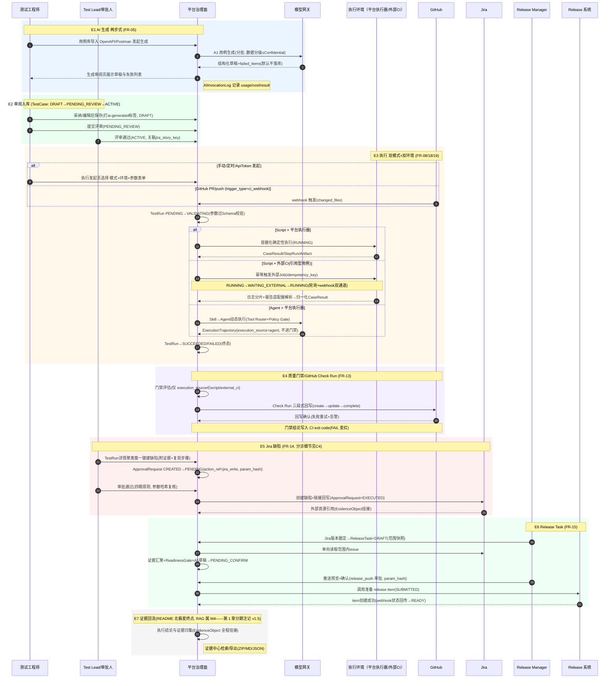

# C1 · 北极星质量闭环 —— 核心交互链规范

> - **链路编号**：C1（北极星质量闭环，端到端主链）
> - **链路定义**：Confluence 需求 → AI 生成（两步式）→ 审阅入库 → 执行（双模式 Script/Agent × 双环境 平台执行器/外部 CI）→ 质量门禁 / GitHub Check Run → Jira 缺陷 → Release Task（Readiness Gate → 调用 Release 系统）→ 证据回流（回流知识库 RAG）
> - **覆盖 FR**：FR-05 / FR-13 / FR-14 / FR-15 / FR-18（主）；交叉引用 FR-01 / FR-02 / FR-03 / FR-04 / FR-06 / FR-07 / FR-08 / FR-09 / FR-10 / FR-11 / FR-12 / FR-19（仅衔接处标注，细节归子链）
> - **上游引用**：[problem_model.md](../../03_problem_modeling/problem_model.md)（唯一建模事实源：§1 对象 / §2 状态机 / §4 页面 / §5 AI Schema）· [prd.md](../../08_prd/prd.md)（US / FR / 验收标准 / §2.3 边界场景）· [../README.md](../../README.md)（第 1 章北极星闭环与产品原则、4.0 双执行模式 × 双执行环境、5.1 Release 模块、7.9 副作用分级、9.11/9.12 Release 高危动作与审批参数哈希）· [interaction_flows.md](../interaction_flows.md)（Stage 6 骨架与输出结构要求）
> - **同级链路交叉引用**：审批细节见 [c2_approval_chain.md](c2_approval_chain.md) · 执行发起与 TestRun 状态机细节见 [c3_execution_kickoff.md](c3_execution_kickoff.md) · 失败分诊细节见 [c4_failure_triage.md](c4_failure_triage.md)。C1 聚焦各环节如何串成闭环、环节间的对象交接与证据流。
> - **收口纪律**：页面只用 05 §4.2 页面清单名称（**25 页**，口径以 05 §4.2 页面清单为准，**不得引用「20 个页面」**）；状态与跳转只用 05 §2 已定义集合；领域对象只用 05 §1.1 清单（**23 个**）；不引入 05 / 12-PRD 之外的新功能。发现上游缺口记入文末「缺口上报」，不自行发明补齐。
> - **一致性复核消费（v1.1 · 2026-08-24）**：对齐 [consistency_fixes_20260824.md](../../13_changes/consistency_fixes_20260824.md) 后续建议 #1——页面 / 对象数量口径随 05 一致性修复版更新（25 页 / 23 对象）；链路行为语义不变

---

## ① 触发者与前置条件

角色词汇统一为 05 §1.1 的项目内角色（owner/admin/tester/viewer）与 PRD §1.3 的职能角色（平台管理员、Test Lead、Release Manager、性能工程师）及系统触发（CI webhook / 定时 / ApiToken）。

| 环节 | 触发者 | 权限 / 角色 | 前置条件（对象状态与配置） |
| --- | --- | --- | --- |
| E0 需求与资产接入 | 测试工程师 | 项目成员（tester 及以上），租户内有效会话（SSO，FR-01） | Project 存在且 Jira 映射就绪（项目总览可见工具连接状态）；一期资产入口为 OpenAPI / Postman / curl 导入（FR-05，README 4.1）；Confluence 需求 RAG 接入属 M4 能力（README 第 1 章分期注记 v1.5 + 第 8 章 M4，见回写记录 G1） |
| E1 AI 生成（两步式） | 测试工程师 | tester 及以上 | ModelRoute 已配置且测试连接通过（模型路由配置页）；OrgQuota 部门 Token 预算未超限（FR-03，超限拒新调用并通知 Owner）；导入内容数据分级 ≤ Confidential（A1 模型策略） |
| E2 审阅入库 | 测试工程师（提交评审）、人工评审（确认） | tester 及以上 | 生成结果为「默认不落库」草稿（FR-05）；`ai-generated` 用例必须经 PENDING_REVIEW→ACTIVE 人工确认，禁止生成直写 ACTIVE（05 §2.1 约束） |
| E3 执行发起 | 手动：测试工程师；定时：系统（trigger_type=schedule）；CI：GitHub PR/push webhook（trigger_type=ci_webhook）；集成：ApiToken（trigger_type=api_token，scopes 含 execute） | 手动 / API 触发要求 tester 及以上或持有效 ApiToken | TestCase = ACTIVE（含 referenced 型，且绑定 Job 存在性校验通过，失效则不进执行队列——PRD §2.3 边界场景）；ExecutionEnvironment = ACTIVE（PENDING_APPROVAL / DEGRADED / DISABLED 不可用或需先处理）；压测分支另需白名单环境 + perf_high_risk 审批（FR-11）；执行资源配额（OrgQuota：UI slot / 压测并发）未超 |
| E4 质量门禁 / Check Run | 系统触发（TestRun 进入终态；CI 侧由 PR/push 事件驱动） | 平台内部动作，无人工触发 | TestRun 终态 ∈ {SUCCEEDED, FAILED} 且 execution_source ∈ {script, external_ci}（agent 结果不进门禁——README 4.0）；质量门禁策略页已配置阈值（通过率 / p95 / 错误率）；Connector(github) 可用 |
| E5 Jira 缺陷创建 | Test Lead / 测试工程师（从聚类簇发起） | tester 及以上发起；审批人 ≠ 发起人（四眼原则，05 §2.3） | TestRun 已出聚类报告（FailureCluster 含阻塞判断，细节见 C4）；EvidenceObject 证据已挂接（缺陷须附证据附件与复现步骤——FR-14 验收）；Connector(jira) 可用 |
| E6 Release Task | Release Manager | Release Manager 职能角色（项目内至少 tester 权限）；推送确认审批人 ≠ 发起人 | Jira fixVersion 可圈定（Resolved/Done issue，README 5.1）；该版本范围内质量证据已汇聚（测试计划结果 / 门禁结论 / 性能基线对比 / 未关闭缺陷）；Readiness Gate 完成评估（红黄绿）；A5 notes / 检查单草稿就绪（AI 只做草稿，禁止自动推送）；Connector(release) 可用 |
| E7 证据回流 | 系统归集 + 平台管理员 / Test Lead（检索与导出） | tester 及以上可检索导出；平台管理员管理外发 SIEM 配置（审计检索页） | EvidenceObject 已按环节挂接（覆盖率目标 ≥95%，README 7.11）；结论回流知识库 RAG 属 M4（README 第 1 章分期注记 v1.5，见回写记录 G1） |

**进入链路的总闸**：链路各环均在租户上下文内执行（ORM 强制 tenant_id 过滤，无组织上下文 = 拒绝，FR-01）；跨租户引用（用例 / 报告 / evidence_id）一律返回 404 不泄露存在性（PRD §2.3）。

---

## ② 页面流

主链页面流（页面名称均出自 05 §4.2 页面清单）：

| 步骤 | 页面 | 关键交互 |
| --- | --- | --- |
| 0 | 项目总览 | 确认工具连接状态（Jira / GitHub / CI / Release 连接器健康）、Jira 项目映射就绪，再进入用例生产 |
| 1 | 用例库 | 导入 OpenAPI / Postman / curl 发起 AI 生成；`ai-generated` 标签筛选；版本历史查看 |
| 2 | 生成审阅页 | 左：OpenAPI 原文，右：结构化草稿（A1 Schema）；逐条采纳 / 编辑 / 弃用；批次 partial 失败条目在「生成失败」列表可见，禁止静默丢弃 |
| 3 | 用例库 | 保存为草稿（自动打 `ai-generated` 标签）→ 提交评审 → 评审通过入库（TestCase：DRAFT → PENDING_REVIEW → ACTIVE）；关联 jira_story_key |
| 4 | 执行发起页 | 三层结构（05 §4.3 约束 3）：第一层模式选择（Script / Agent，Agent 显示受限说明）→ 第二层环境选择（平台执行器 / 已注册外部 CI；选外部 CI 时仅 Script 可用）→ 第三层参数表单（引用型用例按 Job 参数 Schema 动态生成）；定时配置（schedule 触发） |
| 5 | TestRun 列表/详情 | 页头状态机进度条（WAITING_APPROVAL 高亮跳转审批中心）→ 聚类报告区（类别 / confidence / 阻塞判断 / 证据链接 / 人工修正入口）→ 用例结果表 → 证据查看器（截图 / 视频 / Trace 切换、Trace 回放）→ execution_source 徽标（script / agent / external_ci；agent 型显示「不进门禁」提示）；进度流（SSE） |
| 5a | Agent 任务详情 | （Agent Mode 分支）轨迹时间线（每步动作 + 截图 + 工具调用）、终止按钮（服务端持久化信号）、转脚本草稿入口（人工确认后回到 Script Mode）、incomplete 标记 |
| 6 | 质量门禁策略 | 阈值配置（通过率 / p95 / 错误率，三域同模型，FR-12 性能阈值同源）；「仅报告 ⇄ 阻断」切换（显式开启，上线初期仅报告——README 裁定表） |
| 7 | 门禁评估历史 | Check Run 关联、评估明细、豁免记录（豁免流程已由 12-PRD FR-13 定义并固化数据落点 QualityGatePolicy / GateEvaluation（05 §1.1 #22/#23）：owner / Test Lead 发起，gate_waiver 审批，L3） |
| 8 | 审批中心 | 九要素审批卡片（05 §4.3 约束 1：动作与目标资源 → 前后 diff → 数据来源与模型/Skill 版本 → 风险等级 L0–L4 色标 + 成本估计 → 回滚能力 → 参数哈希折叠展开）；批量队列、超时升级提示；本链路出现 jira_write / release_push（及压测分支 perf_high_risk）审批卡片 |
| 9 | TestRun 列表/详情 | 从聚类簇一键发起创建 Jira 缺陷（附证据与复现步骤）→ 跳转审批中心完成 jira_write 审批（发起细节在 C4，审批细节在 C2） |
| 10 | Release 任务 | 范围快照（Jira 版本圈定，冻结 issue 清单）、证据汇聚面板、Readiness Gate 红黄绿分区、A5 AI 草稿（summary / changes / checklist / missing_inputs）、推送预览 + 确认（release_push） |
| 11 | 证据中心 | 证据检索、证据包导出（ZIP / MD / JSON）——为 Release 决策、审计取证与 M4 知识回流供数 |

支撑页面（不在主干但承接链路运行观测与配置，页面名同出 05 §4.2）：

| 页面 | 在本链路中的职责 |
| --- | --- |
| 工作台 | 链路运行监控入口：待审批列表、进行中 TestRun、门禁异常、部门预算余量 |
| 环境管理 | 执行环境注册（健康检查、Job 发现、配额）与管理员审批（PENDING_APPROVAL → ACTIVE）；引用型用例绑定的环境在此维护 |
| Web 用例详情 | Web 域分支：步骤编辑、证据三件套、定位器主备与健康度（自愈建议走 C4） |
| 性能压测 | 性能域分支：场景配置（白名单环境 + 护栏提示）、基线对比图、kill switch、压力机自监控 |
| Copilot 对话 | 链路旁路的自然语言查询入口（只读技能，M3+）：查询用例 / TestRun / 门禁结论，不改变链路控制流（Workflow first, Chat second） |
| 技能管理 | Agent Mode 分支依赖：Skill 版本列表、三级发布审核、金标准测试集结果 |
| AI 成本看板 | E1 生成与 A5 草稿的成本观测：部门 Token 消耗、采纳率、降级率、每工作流成本 |
| 模型路由配置 | E1 前置：路由表、数据分级约束、测试连接 |
| 审计检索 | 全链路动作审计查询（含 Check Run 回写、外部写、Release 状态迁移）与外发 SIEM 配置 |

---

## ③ 状态迁移

### 3.1 主链时序（跨系统对象交接）



### 3.2 各状态机在本链路中的跳转（状态名与 05 §2 完全一致）

```mermaid
flowchart TB
    subgraph S_TC["TestCase 状态机 · E1–E2 生成与入库"]
        direction TB
        TC1[DRAFT] -->|提交评审| TC2[PENDING_REVIEW]
        TC2 -->|评审通过(人工确认)| TC3[ACTIVE]
        TC2 -->|驳回| TC1
        TC1 -->|弃用| TC4[DEPRECATED]
        TC3 -->|废弃| TC4
    end

    subgraph S_TR["TestRun 状态机 · E3 执行(细节见C3)"]
        direction TB
        TR1[PENDING] -->|参数过Schema校验| TR2[VALIDATING]
        TR1 -->|发起后直接取消| TR3[CANCELLED]
        TR2 -->|校验通过进入执行| TR4[RUNNING]
        TR2 -->|校验失败| TR5[FAILED]
        TR4 -->|外部Job排队/CI等待| TR6[WAITING_EXTERNAL]
        TR6 -->|外部Job运行/webhook回传| TR4
        TR4 -->|遇L2+动作| TR7[WAITING_APPROVAL]
        TR7 -->|审批通过(哈希校验)| TR4
        TR7 -->|拒绝/过期| TR3
        TR4 -->|终止/压测熔断(服务端持久化信号)| TR8[STOPPING]
        TR8 -->|停止完成| TR3
        TR4 -->|全部通过| TR9[SUCCEEDED]
        TR4 -->|存在失败| TR5
        TR4 -->|心跳超时(僵尸回收)| TR10[TIMEOUT]
    end

    subgraph S_AR["ApprovalRequest 状态机 · E5/E6 审批(细节见C2)"]
        direction TB
        AR1[CREATED] -->|进入审批中心队列| AR2[PENDING]
        AR2 -->|审批人通过| AR3[APPROVED]
        AR3 -->|执行前参数哈希复核通过并执行| AR4[EXECUTED]
        AR2 -->|拒绝| AR5[REJECTED]
        AR2 -->|超时升级后仍未处理| AR6[EXPIRED]
    end

    subgraph S_RT["ReleaseTask 状态机 · E6 发布编排"]
        direction TB
        RT1[DRAFT] -->|ReadinessGate评估+notes草稿就绪| RT2[PENDING_CONFIRM]
        RT2 -->|人工确认→调用Release系统| RT3[SUBMITTED]
        RT3 -->|item创建成功(状态回传)| RT4[READY]
        RT3 -->|调用失败(可重试)| RT5[FAILED_RETRYABLE]
        RT2 -->|取消| RT6[CANCELLED]
    end

    subgraph S_EE["ExecutionEnvironment 状态机 · E3 前置"]
        direction TB
        EE1[PENDING_APPROVAL] -->|管理员审批| EE2[ACTIVE]
        EE2 -->|健康检查失败| EE3[DEGRADED]
        EE3 -->|禁用| EE4[DISABLED]
    end

    S_TC -->|ACTIVE 用例进入执行| S_TR
    S_EE -->|ACTIVE 环境绑定 TestRun| S_TR
    S_TR -->|终态触发门禁评估| S_RT
    S_AR -.->|jira_write/release_push 审批放行| S_RT
```

跳转触发条件说明（对照 05 §2）：

- **TestCase**：AI 生成结果「默认不落库」，采纳保存后进入 DRAFT 并带 `ai-generated` 标签；PENDING_REVIEW → ACTIVE 必须人工确认（FR-05 验收：不存在 save=true 直写路径）；仅 ACTIVE 用例可被 E3 执行。
- **TestRun**：trigger_type 四值（manual / schedule / ci_webhook / api_token）均从 PENDING 起；external_ci 链路以 idempotency_key 保证「CI 触发后平台重启不重复触发外部 Job，轮询从中断处恢复」（PRD §2.3）；WAITING_APPROVAL 仅在执行中遇 L2+ 动作出现（如压测高危参数、Agent 内 L2+ 工具动作）；终态集合 = {SUCCEEDED, FAILED, CANCELLED, TIMEOUT}，活跃态无心跳超时自动转 TIMEOUT 并回收（FR-08：无永久 running）。
- **ApprovalRequest**：APPROVED → EXECUTED 之间有执行前参数哈希复核（anti-TOCTOU，README 9.12）；EXPIRED 不自动放行，任务停在原状态（如 TestRun 停 WAITING_APPROVAL——PRD §2.3 审批超时边界场景）。
- **ReleaseTask**：DRAFT 建立即冻结范围快照（防 Jira 后续漂移——README 5.1）；FAILED_RETRYABLE 出边已由 05 §2.6 v1.2 补齐（→SUBMITTED 人工幂等重试 / →CANCELLED 放弃）。
- **ExecutionEnvironment**：本链路只消费 ACTIVE 环境；env_register 注册审批细节归 C2 / C3。

---

## ④ 分支与异常

依据 12-PRD §2.3 边界场景表与各 FR 验收标准，逐项给出走向与用户可见反馈：

| # | 异常 / 分支项 | 走向 | 用户可见反馈 |
| --- | --- | --- | --- |
| 1 | AI 生成失败（解析失败 / 单条 schema 校验失败） | 同参数重试 1 次（temperature 0）→ 仍失败进显式失败列表；批次标记 partial，失败条目进「生成失败」列表，不允许静默丢弃（A1 契约 + PRD §2.3） | 生成审阅页展示 partial 状态与失败条目（endpoint + reason，来自 A1 failed_items）；生成失败有显式告警，禁止静默返回空（FR-05 验收） |
| 2 | 模型网关整体不可用（AI 降级） | AI 增强（生成 / A5 草稿 / 归因建议）降级或置灰；平台功能（执行 / 报告 / 门禁）不受影响（PRD §2.3；降级顺序：AI 增强 → 只读查询 → 平台执行，PRD §7.2） | 页面显式「AI 降级中」横幅；A1 入口置灰但 OpenAPI 导入本身不受影响（A1 fallback） |
| 3 | 取消（手动终止） | TestRun：PENDING → CANCELLED（未起跑）；RUNNING → STOPPING → CANCELLED（终止信号服务端持久化，多 worker 可停——FR-19）；外部 Job 幂等取消（cancel 后已产生的构建记录照常采集入库——PRD §2.3）；ReleaseTask：PENDING_CONFIRM → CANCELLED | TestRun 详情页头进度条即时反映 STOPPING → CANCELLED；Agent 任务详情终止按钮生效后轨迹保存退出 |
| 4 | 超时——外部 Job 排队拥堵 / 长时间无响应 | TestRun：RUNNING → WAITING_EXTERNAL 状态可见；超时阈值触发告警；可幂等取消（PRD §2.3） | TestRun 列表 / 详情显示 WAITING_EXTERNAL 徽标与等待时长；超时告警通知 |
| 5 | 超时——审批人休假 / 审批超时 | ApprovalRequest：PENDING →（TTL 到期）升级通知 escalate_to 备审批人 → 仍未处理自动 EXPIRED，**不自动放行**；被阻塞动作停原状态（TestRun 停 WAITING_APPROVAL） | 审批中心显示超时升级提示；TestRun 详情页头 WAITING_APPROVAL 高亮并链接审批中心 |
| 6 | 超时——执行器心跳超时（僵尸回收） | TestRun：RUNNING → TIMEOUT，自动回收（FR-08：进程重启后无永久 running） | TestRun 列表 / 详情显示 TIMEOUT 终态与回收记录；Test Lead 决定是否重跑（PRD §7.1） |
| 7 | 审批拒绝 | ApprovalRequest：PENDING → REJECTED；若动作发生在执行中，TestRun：WAITING_APPROVAL → CANCELLED（05 §2.2） | 审批卡片操作区「拒绝」后发起人收到通知；TestRun 详情可见被拒绝原因链路 |
| 8 | 参数失效（审批后修改参数再执行） | ApprovalRequest 审批绑定 param_hash，参数变化则审批失效 → 执行被拦截并要求重新审批（FR-04 验收；README 9.12 anti-TOCTOU）；引用型用例参数不过 Job Schema 校验即拒绝：TestRun PENDING → VALIDATING → FAILED（FR-18 验收） | 审批卡片顶部红色警示「审批已失效」（05 §4.3 约束 1）；校验失败在 TestRun 详情展示失败原因 |
| 9 | 引用型用例绑定的 Job 被外部删除 / 改名 | 执行前 Job 存在性校验失败 → 用例标记失效并通知 Owner，不进入执行队列（PRD §2.3；失效标记已由 05 §2.1 v1.2 承接：validity=invalid，系统标记、可逆） | 用例库 / 执行发起页对失效用例给出不可执行标识；Owner 收到通知 |
| 10 | Check Run 回写失败 | 重试 + 告警（FR-13 验收：Check Run 同步失败有重试与告警）；门禁结论仍以 CI exit code 为准 | 门禁评估历史页可查回写状态；失败告警通知项目成员 |
| 11 | Release 系统调用失败 | ReleaseTask：SUBMITTED → FAILED_RETRYABLE（可重试，05 §2.6）；重试走 FAILED_RETRYABLE→SUBMITTED（人工幂等重试）、放弃走 →CANCELLED（05 §2.6 v1.2） | Release 任务页显示失败原因与重试入口；审计可查 |
| 12 | Readiness Gate 不达标 | 允许「带豁免说明发布」，豁免必须留痕可审计（README 5.1）；豁免走 gate_waiver 审批（owner / Test Lead 发起，L3，12-PRD FR-13 v1.4） | Release 任务页 Readiness Gate 红黄绿分区呈现不达标项；豁免记录可查 |
| 13 | CI 触发后平台重启 | idempotency_key 保证不重复触发外部 Job；轮询从中断处恢复（PRD §2.3） | TestRun 状态连续，无重复副作用（技术 Gate：故障重启不得重复副作用） |
| 14 | 超大测试报告（>10 万用例结果） | 分片流式解析，进度可见；解析超时 → 已完成部分入库 + 显式失败标记，不静默截断（PRD §2.3） | TestRun 详情显示解析进度与部分入库标记 |
| 15 | Agent Mode 循环 / 超步数 | 达到 max_steps 或总超时强制终止，轨迹保存为 incomplete；Agent 任务无自动重试（PRD §2.3；A8 fallback） | Agent 任务详情显示 incomplete 标记与完整轨迹；无自动重跑 |
| 16 | Agent 请求白名单外工具 / 越权资源 | Policy Gate 拒绝并记录安全事件；连续 3 次拒绝自动终止任务（PRD §2.3） | Agent 任务详情轨迹中可见拒止记录；安全事件进审计检索 |
| 17 | 同一压测场景并发触发 | 场景级互斥：第二次请求进入排队并提示，不并行施压（PRD §2.3；性能域分支经执行发起页进入） | 执行发起页 / 性能压测页显示排队提示 |
| 18 | 敏感数据（密钥 / PII）进入日志 / 报告 | 落库前脱敏管道（正则 + 字典）；AI 调用 prompt 不含 Restricted 级内容（路由层保证，PRD §2.3） | 证据查看器 / 日志展示已脱敏内容；AIInvocationLog 敏感正文不落普通日志 |
| 19 | 跨租户引用（用例 / 报告 / evidence_id） | 工具层强制租户校验，返回 404 而非 403（PRD §2.3） | 用户看到资源不存在，无存在性泄露 |
| 20 | 环境降级 | ExecutionEnvironment：ACTIVE → DEGRADED（健康检查失败，05 §2.4）；环境管理页健康状态可见；绑定该环境的执行前置校验拦截或提示 | 环境管理页 DEGRADED 标识与最近探活时间；执行发起页环境选择器提示 |
| 21 | **不适用**：用户在 Copilot 中诱导越权 / 注入 | 不适用——C1 页面流不含 Copilot 对话环节；该边界由 Copilot 模块承接（PRD §2.3，M3+） | — |
| 22 | **不适用**：Mock 用例判定 | 不适用——Mock Server 为可选集成（README 4.1 第 6 条「mock 用例在集合回归中不得直接判 passed」属接口域执行细则，非本链路交互环节，归 C3 消化） | — |

---

## ⑤ 审批与副作用点

sideEffectLevel 对照 README 7.9 五级：L0 只读 / L1 平台内草稿 / L2 外部系统非生产写 / L3 触发正式测试或变更审批 / L4 生产发布·邮件·删除；裁决规则：L0 默认允许、L1 允许可追溯、L2/L3 必须审批、L4 禁止或仅生成草稿（声明于 Connector Action / Skill / Agent 工具三处，05 §1.2 约束 3）。

| # | 动作（环节） | sideEffectLevel | 是否触发审批（L2+） | ApprovalRequest action_ref | 依据 |
| --- | --- | --- | --- | --- | --- |
| 1 | A1 生成草稿（默认不落库，FR-05） | L1（平台内草稿） | 否（允许，全程可追溯：AIInvocationLog） | — | README 7.9 L1；FR-05 两步式 |
| 2 | 保存草稿 / 提交评审 / 评审入库（TestCase 状态迁移） | L1（平台内写，版本化 + 审计） | 否（人工审阅本身即治理；ai-generated 禁直写 ACTIVE） | — | FR-05；05 §2.1 |
| 3 | 执行环境注册 / 变更 | L3（变更审批：新环境接入即解锁外部 Job 触发能力——05 §2.3 v1.2 冻结值，与 C2 对齐；本文 v1.0 曾标 L2，以冻结表为准） | **是**（管理员审批：ExecutionEnvironment PENDING_APPROVAL → ACTIVE） | env_register | 05 §2.4；README 9.16 |
| 4 | Script × 平台执行器 触发 | L1（平台内执行资源消耗） | 否 | — | FR-08 |
| 5 | Script × 外部 CI 触发（引用型用例） | L2（对外部 CI 系统触发构建） | 否（不逐次审批）——由环境注册审批（#3）背书，运行期以 idempotency_key + Job 参数 Schema 校验 + 写前契约治理 | — | FR-18 验收（幂等触发 / Schema 校验即拒绝） |
| 6 | Agent Mode 工具动作 | manifest 声明上限 ≤ L1；L2+ 动作 | L2+ 动作**单独走审批中心**（TestRun 转 WAITING_APPROVAL） | 对应动作类型 | README 4.0；FR-19 |
| 7 | 压测高危配置（大并发 / 长时长） | L3（触发正式压测） | **是** | perf_high_risk | FR-11（性能域分支，执行细节归 C3） |
| 8 | GitHub Check Run 回写 | L2（对 GitHub 的外部写，系统契约内自动动作） | 否（非用户发起；由审计 + 失败重试告警治理） | — | FR-13；05 §3 FR-13 行 |
| 9 | Jira 缺陷创建（含链接回写） | L2（外部系统非生产写） | **是**（未经审批不得写入——FR-14 验收） | jira_write | FR-14；05 §2.3 |
| 10 | 自愈建议应用（改用例 / 定位器） | L3（正式变更审批：修改 ACTIVE 生产资产；四段式：diff → 确认 → 快照 → 回滚；快照失败 fail-close——05 §2.3 v1.2 冻结值，与 C2/C4 对齐；本文 v1.0 曾标 L2，以冻结表为准） | **是**（细节归 C4） | heal_apply | FR-06/10；README 9.7 |
| 11 | A5 Release Notes / 检查单草稿 | L1（仅草稿） | 否；**禁止自动推送**（FR-15 验收） | — | README 9.11 |
| 12 | Readiness Gate 豁免发布 | L3（带豁免说明的变更决策） | **是**（action_ref=gate_waiver，走 FR-04 审批，留痕可审计——12-PRD FR-13 v1.4 定义） | gate_waiver | README 5.1 第 3 条；12-PRD FR-13 v1.4 |
| 13 | 调用 Release 系统（准备 release item） | L3（变更审批级高危动作；平台只「准备」不「执行」发布，故不升 L4） | **是**（预览 → 人工确认 → 审计；推送预览 + 确认） | release_push | FR-15；README 9.11、5.1 第 4 条 |
| 14 | 生产发布执行 / 外部对象删除 / 邮件通知 | L4 | **禁止**（不适用：发布执行权永远留在 Release 系统 / 流水线，平台无此类动作） | — | README 7.9 L4、9.11 |

四眼原则：所有 ApprovalRequest 的 approver_id ≠ initiator_id（05 §2.3）；consume 加行锁防并发双执行；审批窗口独立 TTL，超时升级不自动放行。审批中心交互、九要素卡片与参数哈希复核的完整细节见 [c2_approval_chain.md](c2_approval_chain.md)。

---

## ⑥ 证据落点

对照 05 §3 FR × 对象 CRUD 矩阵与 README 7.11（Evidence 一等对象：claim → evidence_link → source_object；关键结论覆盖率 ≥95%、无据结论率 <2%）：

| 环节 | 产生的领域对象（05 §1 清单内） | EvidenceObject | AuditEvent | Artifact | 说明 |
| --- | --- | --- | --- | --- | --- |
| E0 资产接入 | Project（Jira 映射）、Connector（配置读取） | —（只读阶段） | 连接器配置与连接状态变更审计 | — | 项目总览可见连接健康 |
| E1 AI 生成 | **AIInvocationLog**（唯一出口，无旁路：usage / cost / latency / prompt_version / result 含 degraded）、ModelRoute（路由）、OrgQuota（预算扣减） | AI 结论按 README 7.11 挂证据引用（evidence_refs 服务端校验只允许引用输入证据池） | — | — | 采纳率 / 修改幅度埋点落 AIInvocationLog result 扩展（05 §3 FR-05） |
| E2 审阅入库 | TestCase(+Version)（DRAFT 起版本化全量快照） | — | 入库 / 评审状态迁移审计 | — | `ai-generated` 标签保留生成来源可溯 |
| E3 执行 | **TestRun**（含 snapshot 触发时配置快照：用例版本 / 环境 / 参数；trigger_type / execution_source / idempotency_key）、CaseResult / StepRun、ExecutionEnvironment（绑定） | TestRun / CaseResult / FailureCluster 挂证据（05 §1.2 ER） | 执行触发与全部状态迁移审计 | 截图 / 视频 / Trace / 日志引用（FR-09 三件套）；Agent 轨迹存储为 Artifact + CaseResult（05 §3 FR-19） | external_ci 结果归一化后同权落库（execution_source=external_ci） |
| E4 门禁 | TestRun.gate_evaluation_id（评估结果引用）、Connector(github)（EXE） | 门禁结论 / 解读挂证据（README 7.11：门禁解读属关键结论） | **Check Run 回写审计**（05 §3 FR-13：AuditEvent:C） | — | 门禁评估历史页可查关联与豁免记录 |
| E5 Jira 缺陷 | ApprovalRequest（jira_write + param_hash + snapshot_ref）、Connector(jira)（EXE）、EvidenceObject（R，复用已挂证据） | 缺陷 claim → evidence_link → source_object(jira, issue, version, timestamp) | 审批全生命周期 + 外部写审计 | 证据附件随缺陷外发 | 未经审批不得写入（渗透测试验收） |
| E6 Release | **ReleaseTask**（范围快照 / gate_result / notes_draft / release_item_ref）、ApprovalRequest（release_push）、Connector(release)（EXE）、AIInvocationLog（A5 草稿） | 汇聚质量证据（EvidenceObject:R——测试计划结果 / 门禁结论 / 基线对比 / 未关闭缺陷） | ReleaseTask 全状态迁移 + 推送调用审计（FR-15 验收：全链路审计可查） | 证据包导出（ZIP / MD / JSON，证据中心） | A5 草稿 missing_inputs 显式列出，禁止编造 |
| E7 证据回流 | EvidenceObject（append-only 归集）、AIInvocationLog（M4 RAG 检索调用） | 检索结论挂证据引用 | —（读取为主） | 证据包 | 回流知识库机制按 README 第 1 章分期注记 v1.5（M4 补建模） |

**证据流主线（闭环骨架）**：E1 AIInvocationLog → E2 TestCase(+Version) 快照 → E3 TestRun.snapshot + CaseResult/StepRun + Artifact → E4 gate_evaluation + 回写审计 → E5 缺陷 claim 挂证据 → E6 ReleaseTask 汇聚证据 + 范围快照 → E7 证据中心导出与（M4）知识回流。任一关键结论均可由 claim 反查 source_object 与审批链（每个副作用可归因——README 产品原则 4）。

---

## 缺口上报

以下缺口在 05 / 12-PRD 中找不到明确承接，按纪律不自行发明，仅登记并建议归属：

| # | 缺口描述 | 建议归属上游文档 |
| --- | --- | --- |
| G1 | **闭环首尾两端的 Confluence / 知识库承接缺失**：北极星链路起点「Confluence 需求文档（RAG）」与终点「执行结论回流知识库（RAG）」需要 Confluence 连接器与 RAG 知识库对象承接，但 05 §2.5 Connector.type 枚举仅（jira/github/ci/release），05 §1.1 领域对象清单（当时 20 个 / 现 23 个）中无知识库 / 向量库对象（仅 PRD §3.1 A2 提及「历史失败向量库 pgvector」）；回流机制（触发时机、回流内容范围、权限与租户边界、是否需人工确认）在上游均无行为定义。当前一期按 FR-05 以 OpenAPI / Postman 导入承接生成入口（README 第 8 章 M4 才有 RAG），本文如实标注分期 | README（5.x 或第 8 章 M4 定义回流机制）+ 05 §1/§2.5（扩展 Connector 类型与知识库对象建模） |
| G2 | **ReleaseTask 状态机 FAILED_RETRYABLE 无出边**：05 §2.6 仅定义 SUBMITTED → FAILED_RETRYABLE，未定义重试后的迁移目标（重试成功到 READY？再次失败停留？） | 05 §2.6（补充 FAILED_RETRYABLE 的出边与触发条件） |
| G3 | **GitHub 仓库 / 分支 ↔ 测试计划（触发绑定）的配置页面缺失**：FR-13 的 PR/push 触发需要「哪个仓库 / 分支触发哪个测试计划或用例集」的绑定配置，但 05 §4.2 页面清单（当时 20 页；现已扩至 **25 页**，含「集成 / 集成中心 / 测试计划」等）中当时无承接页面（质量门禁策略页组件仅含阈值与模式切换；项目二级导航有「集成」但未列入页面清单，硬性纪律下不可引用） | 05 §4.2（在页面清单中明确承接页面，如扩展「项目总览」或「质量门禁策略」组件，或补入「集成」页面） |
| G4 | **质量门禁豁免流程未定义**：「门禁评估历史」页面组件含「豁免记录」，README 5.1 仅对 Readiness Gate 豁免给出「带豁免说明发布、留痕可审计」的原则；FR-13 及 05 均未定义质量门禁豁免的发起角色、审批要求（是否走 ApprovalRequest / action_ref 类型）与留痕字段 | 12-PRD（FR-13 验收标准补充豁免行为）+ 05 §4.2（豁免记录组件字段）；若引入豁免审批需同步 05 §2.3 action_ref 类型 |
| G5 | **引用型用例「标记失效」无建模承接**：PRD §2.3 边界场景要求「用例标记失效并通知 Owner」，但 05 §2.1 TestCase 状态机仅有 DRAFT/PENDING_REVIEW/ACTIVE/DEPRECATED（DEPRECATED 语义为废弃/弃用），字段表亦无失效标记字段；失效与废弃语义是否等同未裁定 | 05 §2.1（明确失效承接方式：新增字段级标记或裁定复用 DEPRECATED） |

### 回写记录（2026-08-24 · Stage 6.5，26 项缺口全部裁定并回写上游）

| # | 状态 | 裁定与回写落点 |
| --- | --- | --- |
| G1 | ✅ 已回写 | 裁定「一期收窄 + M4 扩展」：README 第 1 章新增分期注记（v1.5）——一期起点以 OpenAPI / Postman / curl 导入承接、终点以证据包导出人工归档 Confluence 承接；Confluence 连接器（Connector.type 扩展）与知识回流对象建模在 M4 启动时补入 05 |
| G2 | ✅ 已回写 | 05 §2.6 v1.2：补出边 `FAILED_RETRYABLE → SUBMITTED`（人工重试，幂等键防重复创建）与 `FAILED_RETRYABLE → CANCELLED`（放弃） |
| G3 | ✅ 已回写 | 05 §4.2 v1.2 补列「集成」页（Projects/集成，US-06、FR-13/18，M2）——§4.1 项目二级导航既有「集成」纳入页面清单（20→21）；**v1.3 进一步固化为 25 页**（另补「项目设置 / 测试计划 / 集成中心 / AI 能力开关与降级」），承接仓库/分支 ↔ 测试计划触发绑定 |
| G4 | ✅ 已回写 | 12-PRD FR-13 v1.4：豁免 = owner / Test Lead 发起，走 FR-04 审批（action_ref=gate_waiver，L3），豁免记录入「门禁评估历史」+ AuditEvent；05 §2.3 v1.2 同步扩枚举与冻结表 |
| G5 | ✅ 已回写 | 05 §2.1 v1.2：新增 validity=valid/invalid 系统标记（区别于人工 DEPRECATED，可逆）+ invalid_reason / invalidated_at；12-PRD §2.3 边界场景同步标注落点 |
