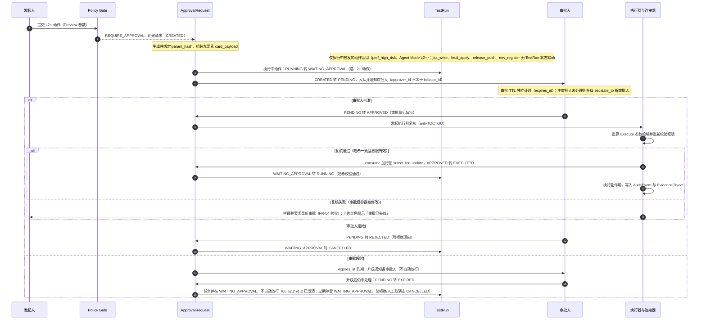
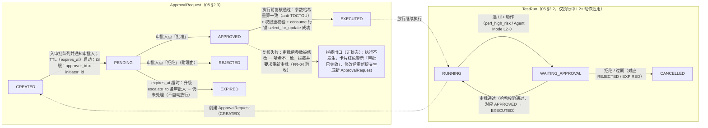

# C2 · 审批链（核心交互链 · Stage 6）

> - **链路编号**：C2（审批链）
> - **链路定义**：动作发起 → 参数哈希生成与绑定 → 审批中心九要素卡片 → 审批人操作（同意 / 拒绝 / 参数变更致审批失效）→ 执行前复核（anti-TOCTOU）→ 执行留痕与补偿（← [interaction_flows.md](../interaction_flows.md) §1）
> - **覆盖 FR**：**FR-04（主）**；关联 FR-01（角色权限）、FR-02（AI 调用留痕）、FR-06 / FR-10（heal_apply 场景）、FR-11（perf_high_risk 场景）、FR-14（jira_write 场景）、FR-15（release_push 场景）、FR-17（Policy Gate）、FR-18（env_register 场景）、FR-19（Agent Mode L2+ 动作）
> - **上游引用**：[problem_model.md](../../03_problem_modeling/problem_model.md)（§1.1 领域对象 **23 个** / §2 状态机全集 / §4.2 页面清单 **25 页** 与九要素约束）· [prd.md](../../08_prd/prd.md)（§2.2 FR-04 验收 / §2.3 边界场景「审批人休假 / 审批超时」）· [../README.md](../../README.md)（第 1 章产品原则「AI 提议、策略裁决、工作流执行」「每个副作用可归因」、5.1 Release 只准备不执行、5.2 TestHub 三处缺口补齐、7.9 副作用分级、9.7 AI 写操作四段式、9.11、9.12 anti-TOCTOU、9.14 幂等与补偿）——上游各文档最新版本以其文首版本头为准
> - **姊妹链路**：[c1_north_star_quality_loop.md](c1_north_star_quality_loop.md) · [c3_execution_kickoff.md](c3_execution_kickoff.md) · [c4_failure_triage.md](c4_failure_triage.md)（同目录）
> - **收口纪律**：页面只引用 05 §4.2 清单（**25 页**，**不得引用「20 个页面」**）；状态只引用 05 §2 已定义状态；领域对象只用 05 §1.1 清单（**23 个**）；不引入 05 / 12-PRD 之外的新功能、新对象、新字段
> - **日期**：2026-08-24 · **版本**：v1.1（v1.0 行为语义不变；一致性复核消费：对齐 05「25 页 / 23 对象」与 12-PRD 一致性修复口径）

---

## ① 触发者与前置条件

### 1.1 角色与权限（← FR-01，角色词汇 owner/admin/tester/viewer 一套到底）

| 角色 | 在本链中的职责 | 权限边界 |
| --- | --- | --- |
| tester / owner / admin | **发起人（initiator）**：在业务页面发起 L2+ 动作的 Preview 请求 | viewer 只读，不能发起任何 L2+ 动作请求 |
| 项目 owner / admin / 平台管理员 | **审批人（approver）**：在审批中心处理 HITL 队列（← US-12：平台管理员在审批中心统一处理所有 HITL 请求） | **硬约束：approver_id ≠ initiator_id（四眼原则，禁止自批）**（← 05 §2.3、README 5.2） |
| 平台管理员 | **env_register 专属审批人**：执行环境注册的管理员审批（← 05 §2.4：PENDING_APPROVAL →(管理员审批) ACTIVE） | 仅管理员可激活环境 |
| 备审批人（escalate_to） | 主审批人超时未处理时被升级通知的兜底审批人 | 同样受四眼原则约束 |
| 发起人 | 审批结果的通知接收方（批准 / 拒绝 / 过期） | — |

### 1.2 哪些动作会创建 ApprovalRequest（action_ref 全场景，← 05 §2.3）

Policy Gate（FR-17）对动作输出 **REQUIRE_APPROVAL**（L2/L3 必须审批，← README 7.9）即进入本链，创建 ApprovalRequest 并绑定参数哈希：

| action_ref 场景 | 发起场景（FR） | 进入审批时的对象状态 | 入口页面 | 来源链路 |
| --- | --- | --- | --- | --- |
| `jira_write` | 失败用例一键创建 Jira 缺陷 + 证据附件（FR-14） | TestRun 已达终态（FAILED），从聚类报告区发起 | TestRun 列表/详情 | [c4_failure_triage.md](c4_failure_triage.md)（亦为 [c1_north_star_quality_loop.md](c1_north_star_quality_loop.md) 的 Jira 缺陷环节） |
| `heal_apply` | 归因修复建议应用（FR-06）/ 定位器自愈建议落地（FR-10） | TestCase 处于 ACTIVE；建议 confidence ≥ 0.7 才展示「可应用」；应用前先创建版本快照（snapshot_ref），**快照失败即中止（fail-close）** | TestRun 列表/详情（修复建议）、Web 用例详情（定位器自愈） | [c4_failure_triage.md](c4_failure_triage.md) |
| `perf_high_risk` | 压测高危配置（大并发 / 长时长）执行（FR-11） | TestRun(perf) 执行中遇 L2+ 动作 → **WAITING_APPROVAL**（← 05 §2.2 唯一定义边 `RUNNING → WAITING_APPROVAL: 遇L2+动作`）；**白名单外目标不进审批，Policy Gate 直接 DENY（100% 被拒）** | 性能压测（场景配置）、执行发起页 | [c3_execution_kickoff.md](c3_execution_kickoff.md) |
| `release_push` | 调用企业 Release 系统**准备** release item（FR-15） | ReleaseTask 处于 **PENDING_CONFIRM**（Readiness Gate 评估 + notes 草稿就绪后进入待确认） | Release 任务（推送预览 + 确认） | [c1_north_star_quality_loop.md](c1_north_star_quality_loop.md) |
| `env_register` | 注册执行环境（平台执行器 / 企业 Jenkins 实例 + Job 契约）（FR-18） | ExecutionEnvironment 处于 **PENDING_APPROVAL** | 环境管理（执行环境注册、管理员审批） | 环境管理页直接发起；为 [c3_execution_kickoff.md](c3_execution_kickoff.md) 的「环境选择」层供给可选环境 |

补充：Agent Mode 执行中每个工具动作过 Tool Router + Policy Gate，Skill manifest 默认 sideEffectLevel ≤ L1，**L2+ 动作单独走审批中心**（← FR-19、README 4.0），入口见 Agent 任务详情；action_ref 类型已由 05 §2.3 v1.2 扩展为 `agent_tool_action`（Agent Mode L2+ 工具动作）。

### 1.3 统一前置条件（缺一不满足则不创建 ApprovalRequest）

1. Policy Gate（FR-17）对该动作裁决输出 **REQUIRE_APPROVAL**（L2/L3）；L0/L1 输出 ALLOW 不进本链；L4 域动作平台只「准备」不「执行」（← README 5.1 / 9.11）；
2. **param_hash 已按 Preview 参数生成并绑定**（Preview 与 Execute 参数哈希一致才可执行，← README 9.12）；
3. **card_payload 九要素齐备**（动作 / 资源 / diff / 数据来源 / 模型与 Skill 版本 / 风险等级 / 成本估计 / 回滚能力 / 参数哈希，← FR-04），缺一不入队；
4. 满足四眼原则的候选审批人集合非空（排除发起人本人）；配置了 expires_at / escalate_to（审批独立 TTL，← 05 §2.3）；
5. `heal_apply` 类写操作：应用前快照（snapshot_ref）创建成功，**快照失败即中止（fail-close）**（← FR-06、README 9.7）。

---

## ② 页面流

### 2.1 主链页面流（页面名全部出自 05 §4.2 清单）

| 步骤 | 页面 | 关键交互 |
| --- | --- | --- |
| 1. 动作发起 | 按场景：**TestRun 列表/详情**（jira_write、heal_apply-修复建议）、**Web 用例详情**（heal_apply-定位器）、**性能压测**（perf_high_risk）、**Release 任务**（release_push）、**环境管理**（env_register）、**Agent 任务详情**（Agent Mode 执行中 L2+ 动作暂停提示） | 发起人提交 Preview 参数 → Policy Gate 裁决 → REQUIRE_APPROVAL 后生成审批卡片并绑定 param_hash；发起页提示「已进入审批」；TestRun 详情页头状态机进度条 **WAITING_APPROVAL 高亮并可跳转审批**（← 05 §4.3 约束 2） |
| 2. 待办感知 | **工作台** | 审批人 / 备审批人：在「待审批列表」看到新卡片与超时升级提示；发起人：在「进行中 TestRun」区看到 WAITING_APPROVAL 与审批进度 |
| 3. 卡片审阅 | **审批中心** | 九要素卡片分区审阅（见 2.3）；**批量队列**处理同质卡片；**超时升级提示**（escalate_to 已通知备审批人时显著标出） |
| 4. 审批操作 | **审批中心** | 操作区三键：**批准 / 拒绝（附理由）/ 修改后重新提交**；参数被修改时卡片顶部红色警示**「审批已失效」**；四眼校验：发起人本人打开卡片时「批准」置灰 |
| 5. 执行前复核与执行 | **审批中心** → 回跳发起页面 | 批准后系统执行 anti-TOCTOU 复核（Execute 参数哈希重算 + 权限重校验 + consume 行锁）；复核通过即执行并将结果回写发起页（TestRun 详情显示 WAITING_APPROVAL → RUNNING；Release 任务显示 PENDING_CONFIRM → SUBMITTED；环境管理显示 PENDING_APPROVAL → ACTIVE） |
| 6. 事后追溯 | **证据中心** / **审计检索** | 按 approval.bound_hash / request_hash 检索审批与执行全程 AuditEvent；证据包导出（ZIP/MD/JSON） |

### 2.2 五个 action_ref 场景的入口汇总

| 场景 | 入口页面 | 来源链路（同目录引用） |
| --- | --- | --- |
| jira_write | TestRun 列表/详情 → 工作台 → 审批中心 | c4_failure_triage.md（C1 闭环亦经过） |
| heal_apply | TestRun 列表/详情 或 Web 用例详情 → 审批中心 | c4_failure_triage.md |
| perf_high_risk | 性能压测 / 执行发起页（经 C3）→ TestRun 列表/详情 → 审批中心 | c3_execution_kickoff.md |
| release_push | Release 任务 → 审批中心 | c1_north_star_quality_loop.md |
| env_register | 环境管理 → 审批中心 | 环境管理页直接发起（C3 环境选择的上游供给） |

### 2.3 九要素卡片分区布局（审批中心，严格遵循 05 §4.3 约束 1，自上而下）

```text
┌────────────────────────────────────────────────────────────┐
│ 〔仅参数被修改时出现〕红色警示条：审批已失效                    │
├────────────────────────────────────────────────────────────┤
│ 区 1  ① 动作与目标资源：action_ref + payload（写哪个系统/对象）│
├────────────────────────────────────────────────────────────┤
│ 区 2  ② 前后 diff：目标资源变更前后对照                       │
├────────────────────────────────────────────────────────────┤
│ 区 3  ③ 数据来源与模型/Skill 版本：结论引用的输入证据池、       │
│        模型、prompt_version、SkillVersion                    │
├────────────────────────────────────────────────────────────┤
│ 区 4  ④ 风险等级色标（L0–L4，sideEffectLevel）＋ ⑤ 成本估计   │
├────────────────────────────────────────────────────────────┤
│ 区 5  ⑥ 回滚能力说明：snapshot_ref（快照恢复）/               │
│        compensation（如 CI Job cancel）/ 无回滚能力必须声明   │
├────────────────────────────────────────────────────────────┤
│ 区 6  ⑦ 参数哈希（param_hash，默认折叠、点击展开核对）          │
├────────────────────────────────────────────────────────────┤
│ 操作区：〔批准〕 〔拒绝（附理由）〕 〔修改后重新提交〕           │
└────────────────────────────────────────────────────────────┘
```

要点（← 05 §4.3 约束 1、FR-04）：

1. 九要素 = 动作 / 资源 / diff / 数据来源 / 模型与 Skill 版本 / 风险等级 / 成本估计 / 回滚能力 / 参数哈希，分区呈现顺序不得调换；
2. 「修改后重新提交」产生**新的 ApprovalRequest 与新的 param_hash**，重新走四眼与 TTL；归属语义已由 05 §2.3 v1.2 冻结：新请求 initiator_id = 重新提交人，保留 origin_request_id / original_initiator_id 归因链，四眼基于新 initiator 校验；
3. 审批人在卡片上看到的 param_hash 即审批绑定的 `approval.bound_hash` 来源，执行前复核以它为准（README 9.12）。

---

## ③ 状态迁移

### 3.1 主时序（sequenceDiagram：发起 → 审批 → 执行前复核 → 行锁 consume → 留痕）



### 3.2 状态机联动（flowchart：ApprovalRequest 六态 × TestRun 交互，状态名与 05 §2 完全一致）



### 3.3 关联对象的状态落点（引用 05 §2 已定义迁移，不新增）

| 场景 | 关联对象状态迁移（触发 = 本链审批结果） |
| --- | --- |
| perf_high_risk | TestRun：RUNNING → WAITING_APPROVAL（遇 L2+ 动作）；批准 → RUNNING；拒绝/过期 → CANCELLED |
| release_push | ReleaseTask：PENDING_CONFIRM → SUBMITTED（人工确认 → 调用 Release 系统）；SUBMITTED → READY（item 创建成功，状态回传）；SUBMITTED → FAILED_RETRYABLE（调用失败可重试）（← 05 §2.6） |
| env_register | ExecutionEnvironment：PENDING_APPROVAL → ACTIVE（管理员审批批准）；激活后健康检查失败 → DEGRADED、停用 → DISABLED 为环境自身治理，不回流审批链（← 05 §2.4） |
| heal_apply | TestCase 保持 ACTIVE，应用落地为新的 TestCaseVersion 快照版本（版本化留痕，← 05 §1.1 #5、FR-06/10）；回滚 = 恢复快照版本 |

### 3.4 三项反向设计在本链的落点（TestHub 反例补齐，← README 5.2）

| 反向设计 | 强制点（系统） | 用户可见点（界面） |
| --- | --- | --- |
| ① 四眼原则（approver_id ≠ initiator_id） | ApprovalRequest 创建时校验候选审批人集合；审批提交时服务端复核发起人与审批人不同，违例拒绝 | 发起人本人打开卡片时「批准」置灰；违例尝试写入 AuditEvent |
| ② 行锁防双执行（consume 加行锁 select_for_update） | APPROVED → EXECUTED 的 consume 事务内对 ApprovalRequest 行加锁，并发第二个消费者被拒绝（防 TestHub confirm.py:118 类双执行反例） | 第二次触发得到「该审批已被消费」错误提示，不产生第二次副作用 |
| ③ 审批独立 TTL（expires_at / escalate_to） | 审批创建即启动独立 TTL 计时；到期先升级通知备审批人，仍未处理转 EXPIRED；**任何情况下不自动放行**（← 12-PRD §2.3） | 审批中心「超时升级提示」；工作台待审批列表徽标；发起人收到过期通知，任务停在 WAITING_APPROVAL |

---

## ④ 分支与异常

| 分支 | 走向（状态迁移） | 用户可见反馈 |
| --- | --- | --- |
| **取消** | ① 审批人拒绝：PENDING → REJECTED，TestRun（如适用）WAITING_APPROVAL → CANCELLED，ReleaseTask 停留 PENDING_CONFIRM（可再确认或 CANCELLED）。② 发起方上游对象先终止（如 TestRun 经 RUNNING → STOPPING → CANCELLED，终止信号服务端持久化）：待审卡片因执行前提消失而不可执行——执行前复核对已离开等待态的对象不 consume；撤回/上游取消按 05 §2.3 v1.2 处置：置 EXPIRED + reason（withdrawn / invalidated），AuditEvent 留痕 | 拒绝：发起人收到通知与拒绝理由；TestRun 详情时间线展示「审批拒绝」节点。上游取消：卡片标注对应任务已取消、操作区置灰 |
| **超时** | expires_at 到期 → 升级通知 escalate_to 备审批人 → 仍未处理 → PENDING → EXPIRED；**任务停在 WAITING_APPROVAL，不自动放行**（← 12-PRD §2.3）；05 §2.2 v1.2 已澄清边标注：过期停留 WAITING_APPROVAL（待人工重新提交或取消），仅拒绝/人工取消走 CANCELLED | 审批中心超时升级提示（已通知备审批人）；工作台待审批列表高亮临期/已过期卡片；发起人收到「审批已过期」通知与重新提交入口 |
| **降级** | ① AI 降级：仅 AI 增强降级，审批/执行等平台核心不受影响（← 12-PRD §2.3「模型网关整体不可用」、7.2）；heal_apply 的入口依赖 AI 建议（confidence ≥ 0.7 才显示「可应用」），AI 降级期间建议不可用 → 无新 heal_apply 审批产生，已入队卡片不受影响、照常可批。② 执行环境降级：ExecutionEnvironment ACTIVE → DEGRADED 属健康检查治理，发生在 env_register 审批完成之后，**不回流审批链**（列出原因：环境降级不需要重新审批，停用走 DISABLED） | AI 降级：页面显式 AI 降级横幅（见下）；环境降级：环境管理页健康状态展示 |
| **审批拒绝** | PENDING → REJECTED（附理由，留痕）；TestRun（如适用）WAITING_APPROVAL → CANCELLED；ReleaseTask 留在 PENDING_CONFIRM 可改后重提 | 发起人通知 + 拒绝理由；TestRun 详情 / Release 任务页状态回退展示；AuditEvent 记录拒绝人与理由 |
| **参数失效**（anti-TOCTOU 命中） | 审批后修改参数再执行 → 执行前复核哈希不一致 → **拦截并要求重新审批**（← FR-04 验收，自动化测试覆盖）；原 APPROVED 请求不再可执行，走「修改后重新提交」生成新 ApprovalRequest（新 param_hash，重新四眼 + TTL） | 卡片顶部红色警示**「审批已失效」**；发起人收到「参数已变更，审批失效」通知；操作区引导「修改后重新提交」 |
| **僵尸回收** | **不直接适用（列出原因）**：僵尸回收（心跳超时 → TIMEOUT，← 05 §2.2「活跃态必须有心跳，无心跳超时自动转 TIMEOUT 并回收」）作用于执行进程活跃态，属 [c3_execution_kickoff.md](c3_execution_kickoff.md) 范围；WAITING_APPROVAL 是等待态，其超时由**审批独立 TTL（EXPIRED）**治理而非心跳——两套超时职责分离，防止「任务超时连带放行/误杀审批」 | 若审批通过恢复执行后执行进程心跳丢失，按 C3 规则回收（TIMEOUT），审批侧状态已为 EXECUTED、不回滚审批记录 |
| **AI 降级横幅** | 模型网关整体不可用 → 仅 AI 增强降级，**任一层降级在 UI 显式横幅提示，不静默**（← 12-PRD 7.2、边界场景） | 审批中心 / 工作台顶部「AI 降级中」横幅；对源自 AI 建议的 heal_apply 卡片，区 3（数据来源与模型/Skill 版本）正常展示生成时的模型与版本（历史事实不变） |
| **执行后失败（补偿）** | release_push：SUBMITTED → FAILED_RETRYABLE（可重试，重试不得造成重复写入，← README 9.14）；jira_write 写失败按连接器重试策略，不重复建缺陷（幂等键 + external_request_id）；heal_apply 执行异常 → 快照恢复（回滚端点，FR-06 验收「回滚后用例可执行」） | 失败重试可见（Release 任务页）；补偿动作留 AuditEvent；外部对象不自动删除（如 Jira 缺陷关闭仅生成草稿、人工确认，← 12-PRD 7.4） |

---

## ⑤ 审批与副作用点

### 5.1 动作 × sideEffectLevel × ApprovalRequest 场景

分级语义（← README 7.9）：L0 只读 / L1 平台内草稿 / L2 外部系统非生产写 / L3 触发正式测试或变更审批 / L4 生产发布·邮件·删除；裁决规则：L0 默认允许、L1 允许可追溯、**L2/L3 必须审批**、L4 禁止或仅生成草稿。下表等级已由 05 §2.3 v1.2 冻结表确认（与本链推导值一致）：

| 动作 | sideEffectLevel（本链标注） | ApprovalRequest 场景 | 来源链路 | 快照 / 补偿 |
| --- | --- | --- | --- | --- |
| 创建 Jira 缺陷 + 链接回写 | **L2**（外部系统非生产写） | `jira_write` | C4（C1 亦经） | 连接器统一返回 external_request_id；补偿 = 缺陷关闭草稿（人工确认，不自动删外部对象，← 12-PRD 7.4） |
| 归因修复建议应用 / 定位器自愈落地 | **L3**（平台内正式资产变更，属「变更审批」类；修改的是 ACTIVE 用例的生产资产而非草稿） | `heal_apply` | C4 | snapshot_ref（TestCaseVersion 快照，快照失败 fail-close）+ 回滚端点（FR-06/10 验收） |
| 压测高危配置执行（大并发/长时长） | **L3**（触发正式压测） | `perf_high_risk` | C3 | kill switch / SLA 熔断属执行侧（C3）；压测任务严禁自动重试（← FR-11） |
| 调用 Release 系统准备 release item | **L4 域动作**（生产发布类）；但平台仅「准备」不「执行」发布（← README 5.1 / 9.11） | `release_push` | C1 | 幂等创建（幂等键 + external_request_id）；失败 FAILED_RETRYABLE 可重试；实际发布执行权永远留在 Release 系统/流水线 |
| 执行环境注册（企业 CI 接入） | **L3**（平台变更审批：新环境接入即解锁外部 Job 触发能力，← README 9.16「环境注册有管理员审批」） | `env_register` | 环境管理（C3 上游） | 凭证只存 Vault 引用（README 9.16）；停用走 DISABLED（治理开关，非补偿） |

### 5.2 Policy Gate 输出与 L2+ 触发审批的关系（← FR-17）

- **ALLOW**：L0 只读默认允许、L1 平台内草稿允许可追溯——不进入本链；
- **REQUIRE_APPROVAL**：L2 / L3 必须审批——**本链的全部入口**，创建 ApprovalRequest 并绑定 param_hash；
- **DENY**：如压测白名单外目标（100% 被拒）、L4 中平台不提供的「执行发布」动作、未声明 sideEffectLevel 的动作（FR-17：默认拒绝未声明动作）——直接拒绝并记录安全事件（AuditEvent），不进审批队列；
- **REQUIRE_REAUTH**：要求重新认证（12-PRD FR-17 v1.4 已定义触发条件：L3+ 动作且操作者会话超过再认证窗口，或目标资源声明需强认证；默认数值由 08 后端架构配置项定义）；
- Agent Mode 侧约束：Skill manifest 声明 sideEffectLevel 上限，Mode 内默认 ≤ L1，**L2+ 动作单独走审批中心**（← FR-19、README 4.0 / 9.15），TestRun 因此进入 WAITING_APPROVAL（`RUNNING → WAITING_APPROVAL: 遇L2+动作`）。

---

## ⑥ 证据落点

原则：**每个副作用可归因**——任何外部写入可追溯到用户、工作流、模型、输入证据与审批（← README 第 1 章产品原则 4）。AuditEvent 关键字段（← 12-PRD §4.1、05 §2.5 引 03 文档 3.16）：`actor_user / delegated_agent / request_hash / approval.bound_hash / data_classification / evidence_refs / cost / latency`。

| 环节 | 领域对象（05 §1 清单） | 落点内容与关键字段 |
| --- | --- | --- |
| 1. 动作发起与 Policy Gate 裁决 | **AuditEvent** | 裁决日志入 AuditEvent（← 05 §3 FR-17 行）：actor_user=发起人、delegated_agent（AI/Agent 代发时）、request_hash、data_classification；DENY 同样留痕（失败/拒绝操作也要审计） |
| 2. AI 建议生成（heal_apply 等场景的上游） | **AIInvocationLog** | model、prompt_version、skill_version、usage（真实）、cost、latency、data_classification、result(ok/degraded/refused)——审批卡片区 3「数据来源与模型/Skill 版本」即取材于此（无旁路，← FR-02） |
| 3. ApprovalRequest 创建 | **ApprovalRequest** | action_ref + payload、param_hash、card_payload（九要素）、approver_id（≠ initiator_id）、snapshot_ref、expires_at / escalate_to；同时写 AuditEvent：request_hash 与 approval.bound_hash 绑定记录 |
| 4. 审批人操作（批准/拒绝/失效/升级） | **AuditEvent** | actor_user=审批人（或备审批人）、approval.bound_hash、审批意见 / 拒绝理由；TTL 升级通知与 EXPIRED 均留痕；四眼违例尝试留痕 |
| 5. 执行前复核（anti-TOCTOU） | **AuditEvent** | 哈希重算结果（一致/不一致）、权限重校验结果、行锁 consume 结果（批准号唯一消费）；复核失败被拦截同样留痕 |
| 6. 执行与留痕 | **EvidenceObject**（claim → evidence_link → source_object{connector, resource, version, timestamp}）· **Artifact**（按场景：截图/Trace/日志引用）· **Connector**（外部写经连接器，返回 external_request_id、warnings）· **TestRun / ReleaseTask / ExecutionEnvironment**（状态回写） | 外部写入结果挂 EvidenceObject（证据覆盖率 ≥95% 指标输入）；evidence_refs 进 AuditEvent；cost / latency 计入本次动作审计 |
| 7. 回滚与补偿 | **TestCaseVersion**（heal_apply 快照恢复）· **AuditEvent**（补偿执行记录，如缺陷关闭草稿） | 回滚后用例可执行（FR-06 验收）；外部对象不自动删除，人工确认闭环 |
| 8. 检索与消费 | **审计检索**页（AuditEvent 全字段检索、外发 SIEM）· **证据中心**页（EvidenceObject 检索、证据包导出 ZIP/MD/JSON） | 事后归因与审计对账（外部误写 = 0、审批反悔率 <1% 两项指标的取证入口，← 12-PRD §5.3） |

---

## 缺口上报

以下缺口均为上游文档待补事项，本链未自行发明补齐（文中相关处已按「不新增状态/对象/字段」原则做了保守处理）：

1. **CREATED → PENDING 的触发事件未显式定义**：05 §2.3 只给出六态序列，未写明 CREATED 与 PENDING 的区分语义。本链暂按「卡片入审批队列并通知审批人、TTL 启动」转述。建议归属：[problem_model.md](../../03_problem_modeling/problem_model.md) §2.3。
2. **ApprovalRequest 六态缺少「发起方撤回 / 上游取消」与「审批失效（APPROVED 后参数变更）」的终态处置**：上游对象取消或参数变更后，请求停在哪一态未约定。本链按「执行前复核拦截 + AuditEvent 留痕 + 另建新请求」处理，未新增状态。建议归属：05 §2.3（或 12-PRD FR-04 验收补充）。
3. **过期后 TestRun 终态表述不一致**：05 §2.2 定义 `WAITING_APPROVAL → CANCELLED: 拒绝/过期`，而 12-PRD §2.3 边界场景要求「自动过期后任务停在 WAITING_APPROVAL，不自动放行」——两者在过期后 TestRun 是「立即 CANCELLED」还是「停留等待人工处置（重新提交/取消）」上存在歧义。建议归属：[prd.md](../../08_prd/prd.md) §2.3 与 05 §2.2 对齐澄清。
4. **action_ref 枚举未覆盖两类 L2+ 入口**：① Agent Mode 执行中的 L2+ 工具动作（README 4.0「L2+ 单独审批」、FR-19）；② Copilot M4 写操作两段式 + 审批（12-PRD M4 计划、README 5.2）——两者映射到 `jira_write/heal_apply/perf_high_risk/release_push/env_register` 中哪一类（或需扩枚举）未定义。建议归属：05 §2.3 action_ref 定义处（联动 12-PRD FR-19 / FR-16）。
5. **各 action_ref 的 sideEffectLevel 未在上游冻结**：README 7.9 只有分级语义与裁决规则，05 §2.3 未逐动作标注等级。本链第 ⑤ 节的 L2/L3/L4 标注为推导值。建议归属：05 §2.3 或 [architecture.md](../../06_architecture_design/architecture.md) 的 Connector Action 声明表收口。
6. **Policy Gate 输出 REQUIRE_REAUTH 的触发条件未细化**：FR-17 与 README 7.9 仅给出四值枚举。建议归属：12-PRD FR-17 验收口径。
7. **审批 TTL 数值未定义**：expires_at 默认时长与 escalate_to 升级触发时点（如到期前多久、升级几轮）无数值口径。建议归属：12-PRD §2.3 边界场景或 08 后端架构配置项。
8. **「修改后重新提交」后新 ApprovalRequest 的归属未定义**：审批人代改参数重新提交时，新请求的 initiator_id 记原发起人还是审批人（影响四眼校验与审计归因）。建议归属：05 §2.3 或 12-PRD FR-04。

### 回写记录（2026-08-24 · Stage 6.5，26 项缺口全部裁定并回写上游）

| # | 状态 | 裁定与回写落点 |
| --- | --- | --- |
| 1 | ✅ 已回写 | 05 §2.3 v1.2 状态语义冻结：CREATED = Policy Gate 判 REQUIRE_APPROVAL 时创建（瞬时态）；PENDING = 入审批队列、通知审批人、TTL 启动 |
| 2 | ✅ 已回写 | 05 §2.3 v1.2：撤回 / 上游取消 / 审批失效（APPROVED 后参数变更）统一置 EXPIRED + reason（withdrawn / invalidated），AuditEvent 留痕，不新增状态（正文 ④ 已同步） |
| 3 | ✅ 已回写 | 裁定以 12-PRD §2.3 为准：过期停留 WAITING_APPROVAL 不迁移、不自动放行；05 §2.2 v1.2 边标注改为「拒绝/人工取消」（正文 ③/④ 已同步） |
| 4 | ✅ 已回写 | 05 §2.3 v1.2：action_ref 扩展 `agent_tool_action`（Agent Mode L2+ 工具动作，← FR-19）+ M4 预留 `copilot_write`（正文 ①.2 已同步） |
| 5 | ✅ 已回写 | 05 §2.3 v1.2 冻结表：jira_write=L2 / env_register=L3 / heal_apply=L3 / perf_high_risk=L3 / gate_waiver=L3 / agent_tool_action=按工具声明（≥L2 入审批）/ release_push=L4（仅准备）——与本链 ⑤ 节推导值一致，推导值转正 |
| 6 | ✅ 已回写 | 12-PRD FR-17 v1.4：REQUIRE_REAUTH = L3+ 动作且会话超过再认证窗口，或目标资源需强认证；默认数值归 08 配置项（正文 ⑤.2 已同步） |
| 7 | ⏭ 移交 Stage 8 | 审批 TTL 默认时长与 escalate_to 升级时点数值（升级轮数 / 提前量）→ 08 后端架构「超时与 TTL 配置项表」定义 |
| 8 | ✅ 已回写 | 05 §2.3 v1.2：新请求 initiator_id = 重新提交人，保留 origin_request_id / original_initiator_id 归因链，四眼基于新 initiator 校验（正文 ②.3 已同步） |
