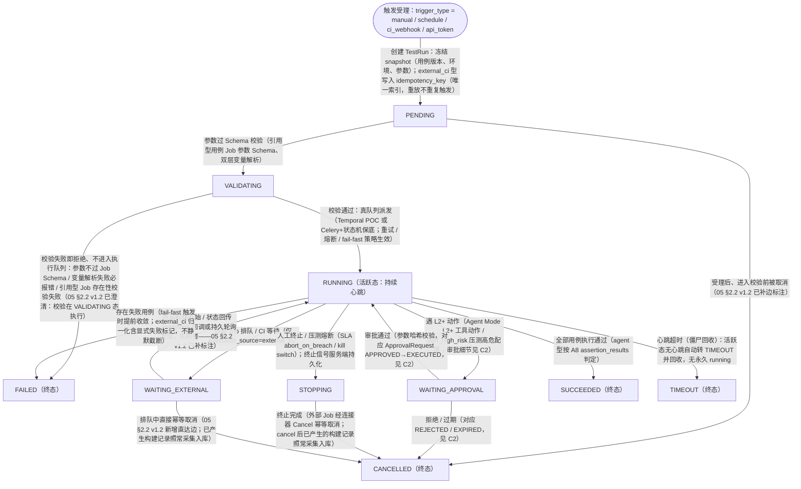
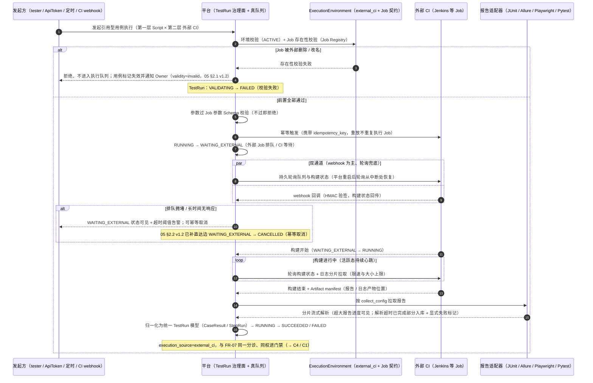
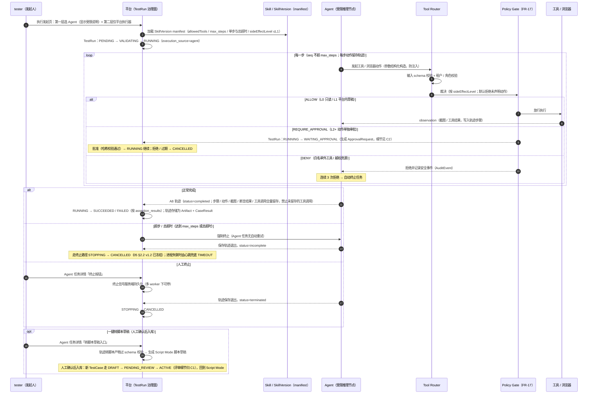

# C3 · 执行发起链（核心交互链 · Stage 6）

> - **链路编号**：C3（执行发起链）
> - **链路定义**：模式选择（Script / Agent）→ 环境选择（平台执行器 / 外部 CI，含引用型用例按 Job Schema 动态生成的参数表单）→ TestRun 状态机全路径流转（PENDING→VALIDATING→RUNNING→WAITING_EXTERNAL / WAITING_APPROVAL / STOPPING→终态，含心跳超时僵尸回收）→ 结果与证据产出（CaseResult / StepRun / Artifact，agent 型轨迹一键转脚本草稿）（← [interaction_flows.md](../interaction_flows.md) §1 C3）
> - **覆盖 FR**：**FR-08（执行引擎：真队列 / 重试 / 熔断 / fail-fast / 心跳 / 僵尸回收 / 六类断言 / 双层变量）**、**FR-18（执行环境一等注册 + 引用型用例：幂等触发 → 轮询 + webhook 双通道 → 日志分片拉取 → 报告适配器 → 归一化统一 TestRun）**、**FR-19（双执行模式：Script / Agent、manifest 约束、L2+ 单独审批、execution_source=agent 不进门禁、轨迹留存、一键转脚本草稿）**为主；交叉引用 FR-01（租户与角色）、FR-02（AI 调用日志）、FR-03（预算与配额）、FR-04（审批中心）、FR-05（ai-generated 用例 ACTIVE 前置）、FR-07（终态后失败聚类衔接）、FR-09（Playwright 证据三件套）、FR-11（压测高危审批 / kill switch / SLA 熔断）、FR-13（ci_webhook 触发与门禁）、FR-17（Policy Gate），均如实标注
> - **上游引用**：[problem_model.md](../../03_problem_modeling/problem_model.md)（唯一建模事实源：§1.1 领域对象 **23 个** / §2 状态机全集（§2.2 TestRun 统一 **10 态**、§2.4 ExecutionEnvironment 与 Job 契约、§2.1 TestCase 含引用型 job_binding）/ §4 信息架构（§4.2 **25 页**清单、§4.3 约束 2、3）/ §5 A8 Agent 执行轨迹）· [prd.md](../../08_prd/prd.md)（§2.2 FR-08/18/19 验收标准、§2.3 边界场景）· [../README.md](../../README.md)（第 1 章产品原则、4.0 双执行模式 × 双执行环境、7.10 TestRun 统一状态机、9.15 / 9.16）· [interaction_flows.md](../interaction_flows.md)（Stage 6 骨架）——上游各文档最新版本以其文首版本头为准
> - **姊妹链路**：审批交互细节见 [c2_approval_chain.md](c2_approval_chain.md) · 失败分诊（终态之后）见 [c4_failure_triage.md](c4_failure_triage.md) · 端到端闭环见 [c1_north_star_quality_loop.md](c1_north_star_quality_loop.md)（同目录）
> - **收口纪律**：页面只引用 05 §4.2 页面清单（**25 页**，**不得引用「20 个页面」**）；状态与跳转只沿 05 §2.2 已定义的边走；领域对象只用 05 §1.1 清单（**23 个**；execution_source 枚举仅 script/agent/external_ci；trigger_type 仅 manual/schedule/ci_webhook/api_token）；不引入 05 / 12-PRD 之外的新功能、新对象、新字段。发现上游缺口记入文末「缺口上报」，不自行发明补齐
> - **日期**：2026-08-24 · **版本**：v1.1（v1.0 行为语义不变；一致性复核消费：对齐 05「25 页 / 23 对象 / 10 态」与 12-PRD 一致性修复口径）

---

## ① 触发者与前置条件

### 1.1 触发者与触发方式（trigger_type 四值，← 05 §2.2）

| trigger_type | 触发者 | 角色 / 凭证要求 | 典型场景 |
| --- | --- | --- | --- |
| `manual` | 测试工程师（主用户）/ owner / admin | 项目内 tester 及以上（viewer 只读，不可发起执行） | 在执行发起页经三层选择后手动发起回归 / 冒烟执行 |
| `schedule` | 系统（定时调度：APScheduler / Celery Beat，← README 裁定表「定时任务跑用例」） | 定时配置由 tester 及以上在执行发起页完成；到点由系统触发 | 定时回归（如每夜全量接口回归） |
| `ci_webhook` | GitHub PR / push 事件（系统） | webhook 强制 HMAC 验签无例外（← README 9.3）；PR 事件 changed_files 必须正确传递（← FR-13） | PR 触发门禁执行（执行完成后 Check Run 三段式回写，门禁衔接归 C1） |
| `api_token` | 外部集成方（企业脚本 / 其他平台） | ApiToken scopes 含 `execute` + project_ids 白名单命中 + 有效期内未吊销（← 05 §2.5 ApiToken） | 企业侧系统以 Token 调平台 API 触发执行 |

**总闸（全部触发方式共用）**：租户上下文存在（ORM 强制 `tenant_id` 过滤，无组织上下文 = 拒绝而非放行，← FR-01）；跨租户引用（用例 / run / evidence_id）返回 404 不泄露存在性（← 12-PRD §2.3）。

### 1.2 对象状态前置条件（缺一不满足则不创建 TestRun 或不进入执行队列）

| 对象 | 必须满足的状态 / 条件 | 来源 |
| --- | --- | --- |
| TestCase | 处于 **ACTIVE**。DRAFT / PENDING_REVIEW（未过人工确认）与 DEPRECATED（已废弃）均不可执行；`ai-generated` 用例必须已经 PENDING_REVIEW→ACTIVE 人工确认（禁止生成直写 ACTIVE） | ← 05 §2.1、FR-05 |
| TestCase（引用型，case_type=referenced） | `job_binding = {env_id, job_id, params_schema_ref, collect_config, gate_mapping}` 完整；**执行前 Job 存在性校验通过**——Job 被外部删除 / 改名 → 校验失败，用例标记失效并通知 Owner，不进入执行队列（失效标记已由 05 §2.1 v1.2 承接：validity=invalid，系统标记、可逆） | ← 05 §2.1、FR-18、12-PRD §2.3 |
| ExecutionEnvironment | 处于 **ACTIVE**。PENDING_APPROVAL（未过管理员审批）、DISABLED（停用）不可选；DEGRADED（健康检查失败）在环境选择层不可选。env_type 与模式组合合法（Agent × external_ci 一期不支持，见 1.3） | ← 05 §2.4、FR-18 |
| Skill / SkillVersion（仅 Agent Mode） | 所用 SkillVersion 已按三级发布进入生产（personal→team→org，**未版本化不进生产**）；manifest 声明 allowedTools 白名单 / max_steps / 单步与总超时 / sideEffectLevel 上限（≤L1） | ← 05 §2.5、README 4.0 / 5.2 |
| ModelRoute / OrgQuota（仅 Agent Mode） | 模型路由可用（网关不可用 → Agent 任务排队不启动，← 12-PRD §3.1 A8 fallback）；部门 Token 预算未超限（超限拒新 AI 调用并通知 Owner，← FR-03） | ← FR-02/03、README 7.12 |
| OrgQuota（执行资源配额） | UI slot / 压测全局并发预算未超（超限不派发新执行） | ← README 4.0 配额、05 §2.5 |
| 压测分支（case_type=performance，交叉） | 目标环境在白名单内（白名单外 100% 被拒，不进审批）；大并发 / 长时长高危配置预先走 `perf_high_risk` 审批（细节归 C2） | ← FR-11 |

### 1.3 模式 × 环境组合与 execution_source 映射（← README 4.0，05 §1.2 约束 2）

| 第一层：模式 | 第二层：环境（env_type） | execution_source | 是否进门禁 / 发布证据 |
| --- | --- | --- | --- |
| Script Mode | 平台执行器（platform_executor，本地容器：接口执行器 / Playwright / Locust-k6） | `script` | 是 |
| Script Mode | 外部 CI（external_ci，引用型用例绑定外部 Job） | `external_ci` | 是（与平台原生执行**同权**进门禁，对下游透明） |
| Agent Mode | 平台执行器 | `agent` | **否**（「不进门禁」；证据照常入证据链；固化为脚本后按 Script Mode 规则进门禁） |
| Agent Mode | 外部 CI | **一期不支持**（Agent 依赖平台侧工具与浏览器控制面——执行发起页第二层选外部 CI 时 Agent 不可用） | — |

---

## ② 页面流

### 2.1 主链页面流（页面名全部出自 05 §4.2 清单）

| 步骤 | 页面 | 关键交互 |
| --- | --- | --- |
| 1. 选取用例 | **用例库** | 按 ACTIVE 状态选取待执行用例（列表标签筛选含 `ai-generated`；版本历史可查，确保以 current_version_id 版本执行）；引用型用例可见其 job_binding 归属环境与 Job；点击「发起执行」进入执行发起页 |
| 2. 三层配置与发起 | **执行发起页** | 严格遵循 05 §4.3 约束 3 的三层结构（自上而下，见 2.2）：第一层模式选择（Script / Agent，Agent 显示受限说明）→ 第二层环境选择（平台执行器 / 已注册外部 CI；选外部 CI 时仅 Script 可用）→ 第三层参数表单（引用型用例按 Job 参数 Schema 动态生成）+ 定时配置（trigger_type=schedule）；「发起执行」→ 创建 TestRun（PENDING）并冻结 snapshot（用例版本 / 环境 / 参数） |
| 3. 执行监控 | **TestRun 列表/详情** | 详情页严格遵循 05 §4.3 约束 2（见 2.3）：页头状态机进度条（WAITING_APPROVAL 高亮跳转审批中心）；进度流（SSE）；CI 存量报告归一化标识（external_ci 型）；execution_source 徽标（agent 型显示「不进门禁」提示） |
| 4. Agent 分支监控 | **Agent 任务详情** | 轨迹时间线（每步动作 + 截图 + 工具调用）、终止按钮（服务端持久化信号）、**转脚本草稿入口**、incomplete 标记（见 2.4） |
| 5. 审批分支 | **审批中心** | TestRun 进入 WAITING_APPROVAL 时从详情页进度条高亮跳入；九要素卡片、批准 / 拒绝 / 修改后重新提交、参数哈希复核——**全部交互细节归 [c2_approval_chain.md](c2_approval_chain.md)**，本链只负责 TestRun 侧状态联动 |
| 6. 转脚本回流 | **用例库** | Agent 轨迹一键转脚本草稿（产物过 schema 校验）→ 人工确认后以新 TestCase 入库，走 DRAFT→PENDING_REVIEW→ACTIVE 评审流（细节归 C1），回到 Script Mode |
| 7. 运行观测 | **工作台** | 「进行中 TestRun」区监控活跃 run（RUNNING / WAITING_EXTERNAL / WAITING_APPROVAL）；「待审批列表」联动审批分支；「部门预算余量」联动 Agent Mode 配额 |
| 8. 事后取证 | **证据中心** / **审计检索** | 按证据检索本链产生的 Artifact / EvidenceObject；审计检索按 actor / request_hash / 外部触发（api_token）等全字段回溯；证据包导出（ZIP / MD / JSON） |

### 2.2 执行发起页三层结构（← 05 §4.3 约束 3，原型必须逐层体现）

```text
┌──────────────────────────────────────────────────────────────────┐
│ 执行发起页（三层结构，自上而下顺序不可调换）                          │
├──────────────────────────────────────────────────────────────────┤
│ 第一层 · 模式选择（execution_mode：script / agent）                 │
│   〔Script Mode〕 〔Agent Mode〕                                  │
│   选 Agent 时显示受限说明：                                        │
│   · Skill manifest 约束（allowedTools 白名单 / max_steps /         │
│     单步与总超时 / sideEffectLevel ≤L1，L2+ 单独审批）              │
│   · 每个工具动作过 Tool Router + Policy Gate                       │
│   · 结果 execution_source=agent，不进门禁 / 不作发布证据             │
│   · 轨迹全量留存；Agent 任务无自动重试                              │
├──────────────────────────────────────────────────────────────────┤
│ 第二层 · 环境选择（仅 ACTIVE 环境可选）                             │
│   〔平台执行器 platform_executor〕 〔已注册外部 CI external_ci〕     │
│   · 每个环境显示 health_status（最近探活时间 / 延迟）与容量 / 配额    │
│   · 第一层已选 Agent 时：外部 CI 选项置灰（一期不支持）              │
│   · 第一层已选外部 CI 时：Agent 模式不可用（仅 Script 可用）         │
│   · DEGRADED / DISABLED / PENDING_APPROVAL 环境不可选，             │
│     引导至环境管理页（环境注册与审批细节归 C2 env_register）          │
├──────────────────────────────────────────────────────────────────┤
│ 第三层 · 参数表单                                                  │
│   · 引用型用例（referenced）：按 job_binding.params_schema_ref      │
│     动态生成参数表单；提交前过 Job 参数 Schema 校验，                 │
│     不过校验即拒绝（不进入执行队列）                                 │
│   · Script 普通用例：双层变量（环境变量层 / 动态函数层）、            │
│     六类断言随用例版本快照生效；变量解析失败必报错                    │
│   · 定时配置（trigger_type=schedule）                              │
├──────────────────────────────────────────────────────────────────┤
│ 操作区：〔发起执行〕→ 创建 TestRun(PENDING)，冻结 snapshot           │
└──────────────────────────────────────────────────────────────────┘
```

### 2.3 TestRun 详情页结构（← 05 §4.3 约束 2）

页头**状态机进度条**（PENDING → VALIDATING → RUNNING →（WAITING_EXTERNAL / WAITING_APPROVAL / STOPPING 按需出现）→ 终态 SUCCEEDED / FAILED / CANCELLED / TIMEOUT；**WAITING_APPROVAL 高亮并可跳转审批中心**）→ 聚类报告区（类别标签 + confidence + 阻塞判断 + 证据链接 + 人工修正入口——归 [c4_failure_triage.md](c4_failure_triage.md)）→ 用例结果表（CaseResult / StepRun 下钻）→ 证据查看器（截图 / 视频 / Trace 切换、Trace 回放，← FR-09）→ **execution_source 徽标**（script / agent / external_ci；**agent 型显示「不进门禁」提示**）。附加组件：进度流（SSE，异步执行无用户等待 SLO）；external_ci 型显示「CI 存量报告归一化标识」。

### 2.4 Agent 任务详情页（← 05 §4.2，agent 型 run 专属视图）

| 组件 | 交互要点 | 依据 |
| --- | --- | --- |
| 轨迹时间线 | 每步动作 + 截图 + 工具调用（A8 ExecutionTrajectory：steps[].seq / intent / action{tool, args_hash} / observation_ref / screenshot_ref / elapsed_ms；assertion_results；token_usage） | ← 05 §5 A8、FR-19 |
| 终止按钮 | 点击后**终止信号服务端持久化**（多 worker 下可停，TestHub 单进程内存信号反例的补齐）；信号送达后轨迹保存退出 | ← FR-19 验收、README 4.0 设计边界 5 |
| 转脚本草稿入口 | 一键将成功轨迹转为 Script Mode 脚本草稿；产物过 schema 校验；人工确认后入库（回用例库评审流） | ← FR-19、US-13 |
| incomplete 标记 | 超步 / 超时 / 工具失败强制终止时轨迹保存为 incomplete（status=completed / incomplete / terminated 三值）；Agent 任务无自动重试 | ← 05 §5 A8、12-PRD §2.3 |

### 2.5 支撑页面（不在主干但承接配置与观测，页面名同出 05 §4.2 清单）

| 页面 | 在本链路中的职责 |
| --- | --- |
| 环境管理 | 第二层环境选择的供给端：执行环境注册（健康检查、Job 发现、参数 Schema 读取、配额）与管理员审批（PENDING_APPROVAL→ACTIVE，审批细节归 C2 env_register）；引用型用例绑定的环境在此维护 |
| 技能管理 | Agent Mode 依赖：SkillVersion manifest（allowedTools / max_steps / 超时 / 副作用上限）、三级发布审核、金标准测试集结果 |
| 性能压测 | 压测分支（交叉 FR-11）：场景配置（白名单环境 + 护栏提示）、基线对比图、kill switch、压力机自监控 |
| 质量门禁策略 | 门禁阈值配置（通过率 / p95 / 错误率）；仅 script / external_ci 结果进入；agent 不进门禁（门禁执行细节归 C1） |
| 模型路由配置 | Agent Mode 模型可用性与数据分级路由（AI 降级观测相关，见 ④） |

---

## ③ 状态迁移

### 3.1 TestRun 状态机全路径（flowchart，状态名与边严格取自 05 §2.2，每条边标注触发条件）



终态集合 = {SUCCEEDED, FAILED, CANCELLED, TIMEOUT}（终态吸收；终态之后的分诊归 C4）。

### 3.2 状态边清单（与 05 §2.2 逐边对齐，标注适用范围）

| # | 边（05 §2.2 原文） | 触发条件 | 适用 execution_source / 场景 |
| --- | --- | --- | --- |
| 1 | [*] → PENDING | 四种触发方式之一受理，创建 TestRun 并冻结 snapshot | 全部 |
| 2 | PENDING → VALIDATING（参数过 Schema 校验） | 受理后进入参数校验阶段（Job 参数 Schema / 双层变量） | 全部 |
| 3 | PENDING → CANCELLED | 受理后、校验前取消（05 §2.2 v1.2 已补边标注） | 全部 |
| 4 | VALIDATING → RUNNING | 校验通过，真队列派发 | 全部 |
| 5 | VALIDATING → FAILED（校验失败） | 参数不过 Job Schema / 变量解析失败 / Job 存在性校验失败——不进入执行队列 | 全部 |
| 6 | RUNNING → WAITING_EXTERNAL（外部 Job 排队 / CI 等待） | 幂等触发外部 Job 后处于排队 / 等待 | 仅 external_ci |
| 7 | WAITING_EXTERNAL → RUNNING | 构建开始 / 状态回传（webhook 或持久轮询发现） | 仅 external_ci |
| 8 | RUNNING → WAITING_APPROVAL（遇 L2+ 动作） | Agent Mode 执行中 L2+ 工具动作；压测 perf_high_risk | agent；script（perf 型） |
| 9 | WAITING_APPROVAL → RUNNING（审批通过，哈希校验） | ApprovalRequest APPROVED→EXECUTED（C2） | 同上 |
| 10 | WAITING_APPROVAL → CANCELLED（拒绝 / 过期） | ApprovalRequest REJECTED / EXPIRED（C2） | 同上 |
| 11 | RUNNING → STOPPING（终止 / 压测熔断，服务端持久化信号） | 人工终止（详情页 / Agent 任务详情终止按钮）；SLA 熔断；kill switch | 全部 |
| 12 | STOPPING → CANCELLED | 终止完成（含外部 Job 幂等取消） | 全部 |
| 13 | RUNNING → SUCCEEDED | 全部用例执行通过 | 全部 |
| 14 | RUNNING → FAILED | 存在失败用例（含 fail-fast 提前收敛、归一化显式失败标记） | 全部 |
| 15 | RUNNING → TIMEOUT（心跳超时，僵尸回收） | 活跃态心跳超时，自动转 TIMEOUT 并回收 | 全部 |
| 16 | WAITING_EXTERNAL → CANCELLED（幂等取消） | 排队中直接取消，已产生构建记录照常采集入库（05 §2.2 v1.2 新增直达边） | 仅 external_ci |

### 3.3 外部 CI 链路时序（sequenceDiagram：幂等触发 → 轮询 + webhook 双通道 → 日志分片 → 报告适配器 → 归一化）



### 3.4 Agent Mode 链路时序（sequenceDiagram：Tool Router → Policy Gate 逐步裁决 + 审批往返 + 终止与转脚本）



### 3.5 关联对象状态落点（引用 05 §2 已定义迁移，不新增）

| 对象 | 本链涉及的状态迁移 | 说明 |
| --- | --- | --- |
| TestRun | 3.1 全部 15 条边 | 唯一主线 |
| ExecutionEnvironment | PENDING_APPROVAL →（管理员审批）ACTIVE；ACTIVE → DEGRADED（健康检查失败）→ DISABLED | 注册与审批归 C2 env_register；本链只消费 ACTIVE 环境；DEGRADED / DISABLED 只影响新发起，在途 run 不中断（05 §2.4 v1.2） |
| TestCase | DRAFT → PENDING_REVIEW → ACTIVE（转脚本草稿回流与 ai-generated 前置，评审细节归 C1）；ACTIVE → DEPRECATED（废弃，不属本链主动作） | 本链前置要求 ACTIVE；Job 失效标记落点 = validity=invalid（05 §2.1 v1.2，可逆） |
| ApprovalRequest | CREATED → PENDING → APPROVED → EXECUTED / REJECTED / EXPIRED | 仅 L2+ 动作出现；全链细节归 C2 |

---

## ④ 分支与异常

| 分支 | 走向（状态迁移） | 用户可见反馈 |
| --- | --- | --- |
| **取消（人工终止）** | RUNNING → STOPPING（终止信号服务端持久化，多 worker 下可停）→ CANCELLED。PENDING 阶段取消：PENDING → CANCELLED。外部 Job：经连接器 Cancel 能力**幂等取消**，**cancel 后已产生的构建记录照常采集入库**（CaseResult / Artifact 照常落库，终态后进入 C4 分诊）；排队中取消走 05 §2.2 v1.2 新增直达边 WAITING_EXTERNAL → CANCELLED（幂等取消）。Agent 任务终止：同 STOPPING → CANCELLED，轨迹保存退出（status=terminated）。审批拒绝 / 过期引起的取消：仅拒绝 / 人工取消走 WAITING_APPROVAL → CANCELLED，审批过期则停留 WAITING_APPROVAL 不迁移（05 §2.2 v1.2，细节归 C2） | TestRun 详情状态时间线出现「终止」节点与操作者；Agent 任务详情终止按钮显示信号已持久化送达；已采集的部分结果照常可见 |
| **超时** | ① 外部 Job 排队超时：停留 WAITING_EXTERNAL（状态可见 + 超时阈值告警），**可幂等取消**；超时仅告警、不自动迁移、不自动取消外部 Job（05 §2.2 v1.2 口径）。② 心跳超时（僵尸回收）：RUNNING → TIMEOUT，自动转 TIMEOUT 并回收，活跃态必须有心跳、无永久 running（进程重启后无永久 running 任务，混沌测试验收）。③ Agent 超步 / 总超时：达到 max_steps 或总超时即强制终止、轨迹保存为 incomplete、**Agent 任务无自动重试**；系统主动终止走 STOPPING → CANCELLED，进程失联由心跳兜底 TIMEOUT（05 §2.2 v1.2 / FR-19 验收 v1.4） | ① TestRun 详情 WAITING_EXTERNAL 可见 + 告警 + 「幂等取消」入口；② 状态时间线 TIMEOUT 节点 + 回收记录（AuditEvent 留痕），Test Lead 决定是否重跑（← 12-PRD §7.1）；③ Agent 任务详情 incomplete 标记 + 轨迹照常可查 |
| **降级（执行环境）** | ExecutionEnvironment ACTIVE → DEGRADED（健康检查失败）/ DISABLED：发起时该环境在第二层不可选；在途 run **不中断**——RUNNING 失败按 FAILED 正常落账、WAITING_EXTERNAL 继续幂等采集（05 §2.4 v1.2 在途处置裁定） | 环境选择层健康状态标识（最近探活时间 / 延迟）与不可选原因；环境管理页健康检查结果 |
| **审批拒绝** | WAITING_APPROVAL → CANCELLED（拒绝 / 过期共用该唯一定义边）；ApprovalRequest 侧 PENDING → REJECTED / EXPIRED；执行前复核、参数哈希失效等全部细节归 [c2_approval_chain.md](c2_approval_chain.md) | TestRun 详情进度条从 WAITING_APPROVAL 高亮转为 CANCELLED；发起人收到拒绝 / 过期通知 |
| **参数失效** | ① Job 参数 Schema 校验失败：**即拒绝、不进入执行队列**——PENDING → VALIDATING → FAILED（05 §2.2 v1.2 已澄清：校验在 VALIDATING 态执行）。② 双层变量解析失败：**必报错**（禁止静默保留原文的「假绿」，← FR-08 验收），同走校验失败路径。③ 引用型用例绑定的 Job 被外部删除 / 改名：执行前 Job 存在性校验失败 → 用例标记失效（validity=invalid，05 §2.1 v1.2）并通知 Owner、不进入执行队列 | 执行发起页第三层表单即时校验错误（未提交即可见）；已受理的在校验失败后 TestRun 详情展示具体失败原因；Owner 收到用例失效通知 |
| **僵尸回收** | RUNNING → TIMEOUT（心跳超时自动转 TIMEOUT 并回收）；已产生的 CaseResult / StepRun / Artifact 照常入库（旁路入口进入 C4）；**不自动重跑**，重跑决策由 Test Lead 作出（← 12-PRD §7.1） | TestRun 详情状态时间线 TIMEOUT 节点；回收动作写 AuditEvent（审计检索可查）；工作台「进行中 TestRun」区该 run 消失并转入终态列表 |
| **AI 降级横幅** | 模型网关整体不可用 → 平台功能（执行 / 报告 / 门禁）不受影响，仅 AI 增强降级（← 12-PRD §2.3、§7.2 降级顺序：先保平台、再保证据、最后保 AI 增强）；Script / external_ci 执行链路本身不依赖模型，照常执行；**Agent Mode：网关不可用 → 任务排队不启动**（← 12-PRD §3.1 A8 fallback）；任一层降级在 UI 显式横幅提示，不静默 | 执行发起页 / TestRun 详情 / Agent 任务详情顶部「AI 降级中」横幅；Agent 模式下提示任务排队不启动（排队不产生 TestRun 派发） |
| **自动重试（适用性矩阵）** | 功能回归 run：可按 FR-08 重试 / 熔断 / fail-fast 策略治理（队列内重试不产生新 TestRun 状态语义）；**压测任务：自动重试「不适用」**（严禁套用功能测试自动重试，语义错误，← FR-11）；**Agent 任务：自动重试「不适用」**（无自动重试，← FR-19 验收） | 重试在状态时间线 / StepRun 层可见；压测与 Agent 终态后仅提供人工重新发起入口 |
| **WAITING_EXTERNAL（适用范围）** | 平台执行器执行（script / agent）：**不适用**——该状态仅在 execution_source=external_ci 的引用型用例链路出现（幂等触发后排队 / 等待） | — |
| **Agent Mode × 外部 CI（组合）** | **不适用**：一期不支持（Agent 依赖平台侧工具与浏览器控制面）；执行发起页第二层选外部 CI 时第一层 Agent 不可用 | 第一层 Agent 选项置灰并显示原因 |
| **超大报告（>10 万用例结果）** | 仅 external_ci 适用：分片流式解析、进度可见；解析超时 → 已完成部分入库 + 显式失败标记，**不静默截断**（← 12-PRD §2.3）；平台执行器执行「不适用」（无外部报告归一化环节） | TestRun 详情解析进度可见；部分入库结果带显式失败标记 |

---

## ⑤ 审批与副作用点

sideEffectLevel（L0–L4）声明位置：**Connector Action、Skill、Agent 工具三处**（← 05 §1.2 约束 3）；分级语义：L0 只读 / L1 平台内草稿 / L2 外部系统非生产写 / L3 触发正式测试或变更审批 / L4 生产发布·邮件·删除（← README 7.9）。**普通功能 / 接口 / Web 用例的执行触发本身不是 sideEffectLevel 的声明点，不进入审批链**（05 §2.3 action_ref 五类场景中无对应项）。

| 动作 | sideEffectLevel | ApprovalRequest 场景与 TestRun 联动 | 裁决位置与输出 |
| --- | --- | --- | --- |
| Agent Mode 执行中的工具动作（逐动作裁决） | L0 / L1 → 放行；manifest 上限 ≤L1，**L2+ 动作单独走审批中心** | L2+ → REQUIRE_APPROVAL → 创建 ApprovalRequest（action_ref 已由 05 §2.3 v1.2 扩展为 agent_tool_action）；TestRun：RUNNING → WAITING_APPROVAL；批准 → RUNNING（哈希校验），拒绝 / 过期 → CANCELLED | **Tool Router 之后、工具执行之前**：Tool Router（输入 schema 校验 + 租户 / 角色校验）→ Policy Gate 按 sideEffectLevel 输出 ALLOW / DENY / REQUIRE_APPROVAL / REQUIRE_REAUTH（← FR-17、README 4.0 设计边界 3）；白名单外工具 / 越权资源 → DENY + 记录安全事件，连续 3 次拒绝自动终止任务；越权工具调用 100% 阻断（注入测试集验收）；未声明动作默认拒绝 |
| 压测高危配置执行（大并发 / 长时长，交叉 FR-11） | **L3**（触发正式压测；等级标注沿 C2 §5.1 推导值） | `perf_high_risk` → TestRun（perf）：RUNNING → WAITING_APPROVAL，批准 / 拒绝路径同上；细节归 C2 | 白名单外目标**不进审批**，Policy Gate 直接 DENY（100% 被拒）；kill switch / SLA 熔断（RUNNING → STOPPING）属本链执行侧治理 |
| 执行环境注册（链路上游供给） | **L3**（C2 标注：新环境接入即解锁外部 Job 触发能力） | `env_register`：ExecutionEnvironment PENDING_APPROVAL →（管理员审批）ACTIVE；发生在环境管理页，审批细节归 C2 | 环境注册有管理员审批（← README 9.16）；本链第二层环境选择仅消费 ACTIVE 环境 |
| 引用型用例触发外部 Job（external_ci 主链动作） | CI 连接器动作按 Job Contract（Trigger / Cancel）声明于 Connector 动作契约（supportsPreview / Idempotency / Compensation，← 05 §2.5、12-PRD §4.3） | **单次触发不重复触发审批**——外部接入风险已由 env_register 注册审批收口；触发幂等由 TestRun.idempotency_key 保证（重放不重复执行 Job）；取消走 Cancel 能力（已产生构建记录照常采集入库） | 连接器统一返回 {status, resource_refs, evidence, external_request_id, warnings}；egress 白名单限定已注册 CI 域（← README 9.16） |
| 门禁与发布证据衔接（链路出口） | —（治理规则而非审批动作） | **execution_source ∈ {script, external_ci} 同权进门禁；execution_source=agent 不进门禁、不作发布证据输入**（可重复性不足）；agent 型证据照常入证据链；固化为脚本后按 Script Mode 规则进门禁 | 门禁评估（gate_evaluation_id 挂接）与 Check Run 回写归 C1（交叉 FR-13）；TestRun 详情 execution_source 徽标对用户显式提示 |

---

## ⑥ 证据落点

原则：**执行面与治理面分离，两类执行面共用同一套归一化与证据链**（← README 第 1 章产品原则 3）；每个副作用可归因（原则 4）。AuditEvent 关键字段：`actor_user / delegated_agent / request_hash / approval.bound_hash / data_classification / evidence_refs / cost / latency`（← 12-PRD §4.1、05 §2.5）。

| 环节 | 领域对象（05 §1 清单） | 落点内容与关键字段 |
| --- | --- | --- |
| 1. 触发受理 | **TestRun**（PENDING；trigger_type、execution_source、plan_id / env_id）· **AuditEvent**（触发事件：actor_user、api_token 触发时的凭证标识、request_hash；失败操作也要审计） | snapshot 冻结触发时配置（用例版本、环境、参数）；external_ci 型写入 **idempotency_key**（唯一索引，重放不重复触发外部 Job） |
| 2. 校验（VALIDATING） | **TestRun**（→ RUNNING / FAILED）· **AuditEvent**（校验失败留痕） | Job 存在性、Job 参数 Schema、双层变量解析结果；失败原因对用户可见（不静默） |
| 3. 队列执行（script × 平台执行器） | **TestRun**（状态机 + 活跃态心跳）· **CaseResult** · **StepRun** · **Artifact**（截图 / 视频 / Trace 三件套自动上传对象存储，← FR-09） | 六类断言结果（status_code / response_time / contains / json_path / header / equals）；双层变量解析留痕；任一失败步骤 100% 有 Trace 可回放 |
| 4. 外部 CI 链路（external_ci） | **ExecutionEnvironment**（job_contracts：Job Registry / 参数 Schema / Artifact manifest / Cancel）· **Connector**（调用记录、external_request_id、warnings）· **Artifact**（日志分片、报告原件引用）· **CaseResult / StepRun**（归一化产物）· **EvidenceObject**（claim → evidence_link → source_object{connector, resource, version, timestamp}——外部构建与报告来源挂证据） | 归一化统一 TestRun 模型；「CI 存量报告归一化标识」；分片流式解析进度；与平台原生结果同权进分诊与门禁 |
| 5. Agent Mode（agent） | **Artifact + CaseResult**（A8 ExecutionTrajectory 存储为 Artifact + CaseResult，← 05 §3 FR-19 行：steps / action{tool, args_hash} / observation_ref / screenshot_ref / assertion_results / token_usage）· **AIInvocationLog**（model、prompt_version、skill_version、usage 真实、cost、latency、data_classification、result=ok/degraded/refused；无旁路）· **SkillVersion**（执行所用版本留痕）· **AuditEvent**（Policy Gate 逐动作裁决日志、DENY 安全事件、连续 3 次拒绝自动终止、终止信号持久化记录） | 禁止未留存的工具调用；轨迹含 incomplete / terminated 标记；Agent 任务无自动重试 |
| 6. 审批分支（如有） | **ApprovalRequest**（action_ref + payload、param_hash、card_payload 九要素、approver_id ≠ initiator_id）→ 细节归 C2 | WAITING_APPROVAL 往返在 TestRun 状态时间线留痕；approval.bound_hash 进 AuditEvent |
| 7. 终态与回收 | **TestRun**（终态 SUCCEEDED / FAILED / CANCELLED / TIMEOUT；gate_evaluation_id 挂接门禁评估）· **AuditEvent**（僵尸回收记录、终止完成记录） | 终态吸收；TIMEOUT / CANCELLED 的已产生 CaseResult / Artifact 照常入库（供 C4 旁路分诊） |
| 8. 转脚本草稿（agent 出口） | **TestCase**（新用例以 DRAFT 入库）+ **TestCaseVersion**（新版本全量快照）· **Artifact**（转脚本产物，过 schema 校验） | 人工确认后经评审流转 ACTIVE，回到 Script Mode（execution_source=script 后恢复进门禁资格）；评审细节归 C1 |
| 9. 检索与消费 | **证据中心**（证据检索、证据包导出 ZIP / MD / JSON）· **审计检索**（AuditEvent 全字段检索、外发 SIEM） | 事后归因、审计对账与 Release 证据汇聚（→ C1）的取证入口 |

---

## 缺口上报

以下缺口均为上游文档待补事项，本链未自行发明补齐（文中相关处已按「不新增状态 / 对象 / 字段、只走已定义边」原则做保守处理）：

1. **README 7.10 与 05 §2.2 的 TestRun 状态机不一致**：README 7.10 表述为 `DRAFT→VALIDATING→RUNNING→WAITING_EXTERNAL→WAITING_APPROVAL→终态`（起点 DRAFT，未显式列出 PENDING / STOPPING / TIMEOUT）；05 §2.2 已统一为 PENDING 起点 + 10 态全集。本链以 05（唯一建模事实源）为准。建议归属：[../README.md](../../README.md) 7.10 对齐 05 §2.2。
2. **两条边的触发条件未标注**：05 §2.2 中 `PENDING → CANCELLED`（受理后取消的触发事件）与 `WAITING_EXTERNAL → RUNNING`（构建开始的状态判据：webhook 回传还是轮询发现）无边标注。本链按保守语义转述。建议归属：[problem_model.md](../../03_problem_modeling/problem_model.md) §2.2。
3. **校验时序歧义**：`PENDING → VALIDATING` 边标注「参数过 Schema 校验」，而 `VALIDATING → FAILED` 标注「校验失败」——校验究竟发生在 PENDING 还是 VALIDATING 存在两种读法；FR-18「参数不过 Job Schema 校验即拒绝」未指明拒绝时 TestRun 落在哪一状态。本链按「校验在 VALIDATING 态执行、失败走 VALIDATING → FAILED、不进入执行队列」处理。建议归属：05 §2.2（或 12-PRD FR-18 验收口径澄清）。
4. **「Job 被外部删除 / 改名 → 用例标记失效」的 TestCase 状态落点未定义**：TestCase 状态机仅有 `ACTIVE → DEPRECATED: 废弃`，系统自动失效是否即该迁移、是否可逆、失效后 job_binding 如何处置均未约定。建议归属：05 §2.1（联动 12-PRD §2.3 边界场景）。
5. **WAITING_EXTERNAL 缺少取消 / 超时出边**：05 §2.2 该状态唯一定义出边为 `→ RUNNING`，而 FR-18 要求「外部 Job 排队超时状态可见且可幂等取消」——排队中取消的 TestRun 流转（本链保守处理为先回 RUNNING 再 STOPPING → CANCELLED）与排队超时后是否存在自动流转均未定义。建议归属：05 §2.2。
6. **Agent Mode L2+ 工具动作的 action_ref 映射未定义**（与 [c2_approval_chain.md](c2_approval_chain.md) 缺口上报 #4 同源）：映射到 jira_write / heal_apply / perf_high_risk / release_push / env_register 中哪一类（或需扩枚举）未约定。建议归属：05 §2.3 action_ref 定义处（联动 12-PRD FR-19）。
7. **ExecutionEnvironment DEGRADED / DISABLED 对在途 TestRun 的处置未定义**：执行中环境转 DEGRADED 后，RUNNING / WAITING_EXTERNAL 的 run 继续、失败还是等待未约定（发起侧不可选已有明确依据）。建议归属：05 §2.4（或 [architecture.md](../../06_architecture_design/architecture.md)）。
8. **Agent 超步 / 超时强制终止后的 TestRun 终态归属未显式定义**：走「终止」（STOPPING → CANCELLED，轨迹 incomplete）还是 TIMEOUT（心跳超时僵尸回收）未明确。本链按「系统终止走 STOPPING → CANCELLED；进程失联由心跳兜底 TIMEOUT」处理。建议归属：05 §2.2（联动 12-PRD FR-19 验收口径）。
9. **超时与心跳相关数值口径未定义**：心跳周期、僵尸回收超时阈值、外部 Job 排队超时告警阈值、Agent 单步 / 总超时数值（FR-08 / 18 / 19 均只定义机制未给数值）。建议归属：[architecture.md](../../06_architecture_design/architecture.md)（配置项）或 12-PRD 各 FR 验收口径。

### 回写记录（2026-08-24 · Stage 6.5，26 项缺口全部裁定并回写上游）

| # | 状态 | 裁定与回写落点 |
| --- | --- | --- |
| 1 | ✅ 已回写 | README 7.10（v1.5）改为以 05 §2.2 为唯一事实源（PENDING 起点 + 10 态全集），旧「DRAFT 起点」表述作废 |
| 2 | ✅ 已回写 | 05 §2.2 v1.2 补边标注：PENDING→CANCELLED = 受理后校验前取消；WAITING_EXTERNAL→RUNNING = webhook 或轮询先到者（正文 ③ 已同步） |
| 3 | ✅ 已回写 | 裁定校验在 VALIDATING 态执行（PENDING 仅受理 + 快照冻结）；12-PRD FR-18 v1.4 验收补「拒绝落 VALIDATING→FAILED」 |
| 4 | ✅ 已回写 | （与 C1-G5 同源）05 §2.1 v1.2：validity=invalid 系统标记（可逆，区别于人工 DEPRECATED）；12-PRD §2.3 同步标注 |
| 5 | ✅ 已回写 | 05 §2.2 v1.2 新增直达边 WAITING_EXTERNAL→CANCELLED（幂等取消，已产生构建照常采集）；排队超时仅告警不自动迁移（正文 ③/④ 已同步转正） |
| 6 | ✅ 已回写 | （与 C2-#4 同源）05 §2.3 v1.2：action_ref 扩展 agent_tool_action（正文 ⑤ 已同步） |
| 7 | ✅ 已回写 | 05 §2.4 v1.2 在途处置：DEGRADED / DISABLED 只影响新发起；在途 RUNNING / WAITING_EXTERNAL run 不中断（正文 ③.5/④ 已同步） |
| 8 | ✅ 已回写 | 05 §2.2 v1.2 + 12-PRD FR-19 v1.4：系统主动终止 → STOPPING→CANCELLED（轨迹 incomplete）；进程失联 → 心跳兜底 TIMEOUT |
| 9 | ⏭ 移交 Stage 8 | 心跳周期 / 僵尸回收阈值 / 排队超时告警阈值 / Agent 单步与总超时数值 → 08 后端架构「超时与 TTL 配置项表」定义 |
