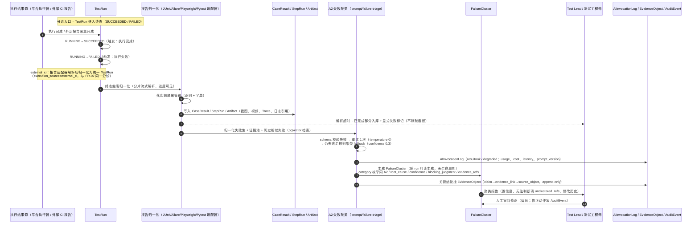
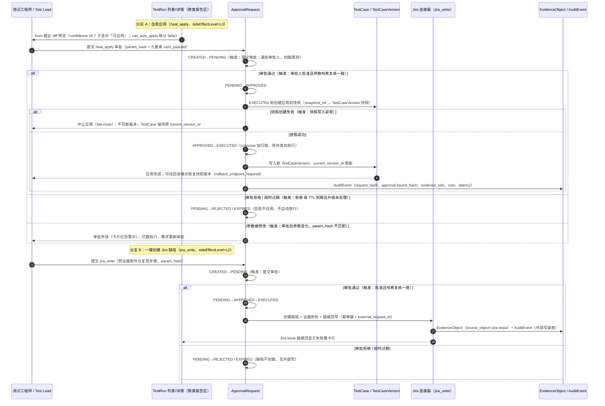

# C4 · 失败分诊链（Stage 6 · 核心交互链）

> - **链路编号**：C4 · 失败分诊链——TestRun 完成 → 报告归一化（含外部 CI 报告适配器）→ 失败聚类（阻塞判断 + confidence + 无法判断项）→ 人工审阅修正（留痕）→ 建 Jira 缺陷 / 自愈建议（diff → 审批 → 快照 → 回滚）→ 证据落库
> - **覆盖 FR**：**FR-06（失败归因建议）**、**FR-07（run 级失败聚类报告）** 为主；交叉引用 FR-02（AI 日志）、FR-04（审批中心）、FR-08（执行终态与僵尸回收）、FR-09（证据三件套）、FR-10（定位器自愈）、FR-13（门禁联动）、FR-14（Jira 缺陷创建）、FR-17（副作用分级）、FR-18（external_ci 同一分诊），均如实标注
> - **上游引用**：[problem_model.md](../../03_problem_modeling/problem_model.md)（§1.1 领域对象 **23 个**、§2 状态机、§4.2 页面清单 **25 页**、§5 AI Schema A1–A8）· [prd.md](../../08_prd/prd.md)（FR-06/07、§2.3 边界场景、§3.2 A2 Prompt Contract **7 值**枚举、第 7 章降级）· [../README.md](../../README.md)（第 1 章产品原则、7.9/7.11、9.7）· [interaction_flows.md](../interaction_flows.md)（Stage 6 骨架）——上游各文档最新版本以其文首版本头为准
> - **同目录链路**：审批交互细节见 [c2_approval_chain.md](c2_approval_chain.md)；TestRun 执行过程（进入终态之前）见 [c3_execution_kickoff.md](c3_execution_kickoff.md)；端到端闭环见 [c1_north_star_quality_loop.md](c1_north_star_quality_loop.md)
> - **生成纪律**：页面名仅取 05 §4.2 页面清单（**25 页**，**不得引用「20 个页面」**）；状态名仅取 05 §2 已定义状态机；领域对象仅取 05 §1.1（**23 个**）；不引入 05 / 12-PRD 之外的新功能、新对象、新字段；上游缺口见文末「缺口上报」，不自行补齐
> - **日期**：2026-08-24 · **版本**：v1.1（v1.0 行为语义不变；一致性复核消费：对齐 05「25 页 / 23 对象」与 12-PRD「A2 7 值」口径）

---

## ① 触发者与前置条件

### 1.1 触发者（角色与权限）

| 角色 | 进入链路的动作 | 权限要求 | 来源 |
| --- | --- | --- | --- |
| 测试工程师（主用户） | 查看失败归因与修复建议（不自动应用）、发起自愈应用审批、发起建 Jira 缺陷审批 | 项目成员，tester 及以上可发起写操作审批；viewer 仅可查看报告与证据 | ← 12-PRD §1.3、05 §1 User/ProjectMember |
| Test Lead / QA 负责人 | run 级失败聚类审阅、阻塞判断决策、修正聚类结果、决定僵尸/超时 run 是否重跑 | tester 及以上；审阅为每日/每次回归频率 | ← 12-PRD §1.3、7.1（低置信度人工接管点 = Test Lead 审阅报告） |
| 审批人（heal_apply / jira_write 的批准方） | 在审批中心批准/拒绝 L2+ 动作 | approver_id ≠ initiator_id（四眼原则），审批人路由规则由 C2-审批链 定义 | ← 05 §2.3 |

### 1.2 对象状态前置条件

1. **主入口**：TestRun 到达终态 `SUCCEEDED` 或 `FAILED`，且 run 含失败 CaseResult（← 05 §2.2 终态集合、06 骨架 C4）。无失败 CaseResult 的 `SUCCEEDED` run 不触发失败聚类（无失败可聚），仅展示通过汇总；
2. **旁路入口**：`CANCELLED` / `TIMEOUT` 终态 run——已产生的 CaseResult / Artifact 照常采集入库（← 12-PRD §2.3「cancel 后已产生的构建记录照常采集入库」），对已入库的失败结果同样进入归一化与聚类；`TIMEOUT` 的重跑决策由 Test Lead 作出（← 12-PRD §7.1）；
3. **分诊阶段 TestRun 不再发生状态迁移**：run 已处终态（终态吸收），后续审批作用于 ApprovalRequest 生命周期而非 TestRun——TestRun 的 `WAITING_APPROVAL` 状态仅出现在执行过程中遇 L2+ 动作时（属 C2 / C3 链路），本链路不适用；
4. **TestCase 前置**：自愈应用（heal_apply）的对象为处于 `ACTIVE` 状态的用例；TestCase 自身生命周期状态（DRAFT / PENDING_REVIEW / ACTIVE / DEPRECATED）在本链路中不迁移——自愈产生新的 TestCaseVersion 并更新版本指针 `current_version_id`，用例评审流归 C1 链路（← 05 §2.1、§3 FR-06 数据落点）。

### 1.3 外部 CI 归一化报告的进入条件

- run 的 `execution_source = external_ci`（← 05 §1.2 约束 2、README 4.0）：外部 CI（Jenkins 等）Job 产物经报告适配器（JUnit / Allure / Playwright / Pytest）解析，归一化为统一 TestRun 模型后，**与 FR-07 同一分诊、同权进门禁**（← FR-18 验收）；`execution_source=script` 与 `external_ci` 结果可进门禁，`agent` 型结果显示「不进门禁」提示（← 05 §4.3 约束 2）；
- TestRun 列表/详情带「CI 存量报告归一化标识」（← 05 §4.2 页面组件）；
- 归一化解析为确定性管道（非 AI），验收口径：标注集字段级解析准确率 ≥98%（← FR-07 / FR-18 验收）；报告与日志落库前过脱敏管道（正则 + 字典），AI 调用 prompt 不含 Restricted 级内容（← 12-PRD §2.3、§4.4）。

### 1.4 AI 侧前置

- A2 契约 `prompt/failure-triage` 生产环境版本锁定（pin），`meta.prompt_version` 必填（← 12-PRD §3.2、§5.4）；
- 模型网关可用；不可用时走降级路径（见 ④ 第 6–7 行），平台执行/报告/门禁功能不受影响（← 12-PRD §2.3、§7.2）；
- A2 时延预期（SLO，非硬超时）：run 完成后 ≤5 分钟出报告（10k 用例级）（← 12-PRD §6.2）。

---

## ② 页面流

页面名严格取自 05 §4.2 页面清单，不新造页面。

| # | 步骤 | 页面 | 关键交互 |
| --- | --- | --- | --- |
| 1 | 发现终态失败 run | 工作台 | 「进行中 TestRun」区卡片转为终态（`FAILED` / 含失败 CaseResult 的 run）；「门禁异常」区块提醒（← 05 §4.2 工作台组件） |
| 2 | 定位与进入 run | TestRun 列表/详情（列表视图） | 按状态（终态）与 `execution_source`（script / external_ci / agent）筛选；CI 存量报告归一化标识区分存量接入来源 |
| 3 | 阅读聚类报告 | TestRun 列表/详情（详情视图） | 页头状态机进度条（PENDING→…→终态）；**聚类报告区每簇五要素：类别标签 + confidence + 阻塞判断 + 证据链接 + 人工修正入口**（← 05 §4.3 约束 2）；「无法判断项」区块（unclustered_refs 逐条可点开原始 CaseResult 与证据）；「修改历史」查看用户修正留痕；历史相似失败对比（← FR-07）；`execution_source` 徽标（agent 型显示「不进门禁」提示）；AI 降级横幅（降级时，见 ④） |
| 4 | 核验证据 | TestRun 列表/详情（详情视图·证据查看器） | 用例结果表下钻 CaseResult / StepRun；证据查看器切换截图 / 视频 / Trace，Trace 回放（← 05 §4.2、FR-09） |
| 5 | 人工审阅修正 | TestRun 列表/详情（详情视图） | 经簇卡片「人工修正入口」修正类别 / 阻塞判断等；修正留痕进入修改历史（FailureCluster 随 run 只读生成、人工修正留痕 ← 05 §2.5） |
| 6A | 建 Jira 缺陷（分支） | TestRun 列表/详情 → 审批中心 | 失败簇 / CaseResult 上「一键创建 Jira 缺陷」，自动附证据附件与复现步骤（← US-07、FR-14）→ 生成 `jira_write` 审批卡片（九要素：动作与目标 Jira 项目 / 前后内容 / 数据来源与模型与 Skill 版本 / 风险等级色标 + 成本估计 / 回滚能力 / 参数哈希）→ 审批中心批准 / 拒绝 / 修改后重新提交 |
| 6B | 自愈建议与应用（分支） | TestRun 列表/详情 → 审批中心 | 簇内 A4 fixes 建议 diff 预览（field / current / suggested / reason / confidence）；**confidence ≥0.7 才显示「可应用」**；点击「可应用」生成 `heal_apply` 审批卡片（含快照与回滚能力说明、参数哈希）→ 审批中心处理；定位器类建议（category=locator_stale）交叉 FR-10 |
| 7 | 应用结果确认（分支 6B 后） | 用例库 / Web 用例详情 | 用例库查看版本历史（新 TestCaseVersion 生效、可回滚至快照版本）；Web 用例查看定位器主备与健康度（← 05 §4.2、FR-10） |
| 8 | 审批结果回看（分支 6A/6B 后） | TestRun 列表/详情（详情视图） | 簇卡片操作入口状态回显：EXECUTED（Jira issue 链接回显 / 自愈已应用）/ REJECTED / EXPIRED |
| 9 | 证据复用 | 证据中心 | 按证据检索分诊结论与制品；证据包导出（ZIP / MD / JSON）（← 05 §4.2、Test Lead 场景） |
| 10 | 审计追溯（旁路） | 审计检索 | 按 actor、approval.bound_hash、外部写动作等全字段检索 heal_apply / jira_write 全链路（← 05 §4.2、README 7.11） |
| 11 | agent 型 run 分诊（交叉） | Agent 任务详情 | `execution_source=agent` 的 run 在轨迹时间线（每步动作 + 截图 + 工具调用）中查看失败上下文；结果不进门禁（← 05 §4.2、FR-19） |
| 12 | 降级观测（旁路） | AI 成本看板 | A2 降级率（目标 <5%，告警 ≥15%）、每工作流成本观测（← 12-PRD §5.3） |

---

## ③ 状态迁移

### 3.1 主链路：终态 → 归一化 → 聚类 → 审阅（sequenceDiagram）

### 3.2 分支链路：自愈应用与建 Jira 缺陷经 ApprovalRequest（sequenceDiagram）

### 3.3 跳转对照表（状态名与 05 §2 完全一致）

| 对象 | 迁移 | 触发条件 | 备注 |
| --- | --- | --- | --- |
| TestRun | RUNNING→SUCCEEDED / RUNNING→FAILED | 执行完成 / 执行失败 | 分诊主入口（05 §2.2） |
| TestRun | RUNNING→TIMEOUT | 活跃态心跳超时（僵尸回收），自动回收无人工动作 | 已产生结果照常入库分诊（05 §2.2、12-PRD §7.1） |
| TestRun | WAITING_EXTERNAL→RUNNING→终态 | external_ci 外部 Job 排队结束、产物采集完成 | 采集与等待过程属 C3；入库后进入本链路（05 §2.2） |
| TestRun | RUNNING→STOPPING→CANCELLED | 终止信号（C3 链路动作） | 已产生的构建记录照常采集入库后分诊（12-PRD §2.3） |
| ApprovalRequest | CREATED→PENDING | 发起人提交 heal_apply / jira_write | 四眼原则；超时升级备审批人不自动放行（05 §2.3） |
| ApprovalRequest | PENDING→APPROVED→EXECUTED | 审批人批准 + 执行前参数哈希复核一致；heal_apply 需先完成应用前快照 | consume 行锁防并发双执行（05 §2.3） |
| ApprovalRequest | PENDING→REJECTED / PENDING→EXPIRED | 审批人拒绝 / TTL 到期且升级仍未处理 | 自愈不应用、缺陷不创建（05 §2.3、12-PRD §2.3） |
| TestCase | （不迁移） | — | 自愈对象为 ACTIVE 用例；仅新增 TestCaseVersion 并更新 current_version_id，生命周期状态由 C1 链路管理（05 §2.1、§3） |
| FailureCluster | （无状态机） | 随 run 只读生成 | 无生命周期；人工修正留痕，不新增状态（05 §2.5） |

---

## ④ 分支与异常

| # | 分支/异常 | 走向 | 用户可见反馈 |
| --- | --- | --- | --- |
| 1 | 取消（run 层） | RUNNING→STOPPING→CANCELLED 属 C3 链路；CANCELLED / TIMEOUT run 已产生的 CaseResult / Artifact 照常采集入库并进入分诊（← 12-PRD §2.3） | 详情页状态时间线显示 CANCELLED / TIMEOUT 与已采集结果可查 |
| 2 | 取消（聚类生成中） | **不适用**——聚类为系统自动任务，无用户可取消的执行体；TestRun 已终态。用户离开页面不影响生成，报告就绪后详情页可见 | 报告生成中显示进度流（SSE）；离开再进入不丢结果 |
| 3 | 超时（超大报告分片解析） | >10 万用例结果分片流式解析、进度可见；解析超时 → **已完成部分入库 + 显式失败标记，不静默截断**，未完成条目不允许静默丢弃（← 12-PRD §2.3） | 详情页解析进度条 + 「部分解析失败」显式标记与失败条目列表 |
| 4 | 超时（A2 调用 30s） | schema 校验失败或 30s 超时 → 同参数重试 1 次（temperature 0）→ 仍失败走规则聚类 fallback（按错误码 / 接口路径分组，confidence 0.3），`AIInvocationLog.result=degraded`（← 12-PRD §3.2） | AI 降级横幅（见第 7 行）；簇卡片 confidence 显示 0.3 并标注规则聚类来源 |
| 5 | 超时（审批） | TTL 到期 → 升级通知备审批人 → 仍未处理自动 EXPIRED，**不自动放行**（← 12-PRD §2.3）；自愈不应用、缺陷不创建。注意：TestRun 已终态，不存在「任务停在 WAITING_APPROVAL」——该状态仅执行中 L2+ 动作时出现（C2/C3），本链路不适用 | 审批中心超时升级提示；TestRun 详情对应操作入口状态回显 EXPIRED |
| 6 | 降级（模型网关整体不可用） | 平台功能（执行 / 报告 / 门禁）不受影响，仅 AI 增强降级为规则聚类 fallback；`AIInvocationLog.result=degraded`（← 12-PRD §2.3、§7.2 降级顺序：先保平台、再保证据、最后保 AI 增强） | 页面显式提示，不静默 |
| 7 | AI 降级横幅 | TestRun 详情聚类报告区顶部横幅：「AI 增强（归因 / 建议）降级中，当前为规则聚类」；降级期间无 A4 fixes 建议（无 AI 输出），自愈建议入口不出现，人工修复路径不受影响 | 横幅 + 建议区置灰说明；降级率在 AI 成本看板观测（目标 <5%，告警 ≥15%） |
| 8 | 审批拒绝 | ApprovalRequest→REJECTED：自愈不应用（不产生新 TestCaseVersion）、缺陷不创建（无 Jira 写入）；外部误写 = 0 为硬性指标（← 12-PRD §5.3）；可修改后重新提交（重新走审批） | 审批卡片记录拒绝；TestRun 详情簇卡片操作入口回显「已拒绝」 |
| 9 | 参数失效（审批 anti-TOCTOU） | 审批通过后参数被修改 → param_hash 不匹配 → 拦截执行，审批失效，要求重新审批（← FR-04 验收、README 9.12） | 审批卡片顶部红色警示「审批已失效」 |
| 10 | 参数失效（引用型 Job 被外部删除 / 改名） | 执行前 Job 存在性校验失败 → 用例标记失效并通知 Owner，**不进入执行队列**（← 12-PRD §2.3）——发生在 C3 执行前，属上游阻断，**不适用本链路处理**（本链路只消费已入库结果） | 环境管理 / 用例库中用例失效标记（C3 范围呈现） |
| 11 | 僵尸回收 | 活跃态无心跳超时 RUNNING→TIMEOUT 自动回收（← 05 §2.2「无永久 running」）；已产生结果照常入库进入分诊；是否重跑由 Test Lead 决定（← 12-PRD §7.1）。注：12-PRD §7.1 v1.4 已对齐 05 §2.2 口径（TIMEOUT，旧「标记 FAILED」表述作废） | 详情页状态显示 TIMEOUT 与回收原因；重跑入口属 C3 |
| 12 | 无法判断项 | `unclustered_refs` 在聚类报告区**显式展示**，逐条可追溯原始 CaseResult 与证据；A2 禁止编造 root_cause，不确定必须输出 unknown / uncertain（← 12-PRD §3.2 禁止行为④） | 「无法判断项」独立区块，不做任何归因包装 |
| 13 | confidence < 0.7 | fixes 不显示「可应用」，仅展示诊断（← A4 禁止项）；簇标注 uncertain，人工接管点 = Test Lead 审阅报告（← 12-PRD §7.1 低置信度处置） | 建议区仅诊断文本，无应用按钮 |
| 14 | 快照失败 fail-close | heal_apply 在 EXECUTED 前创建应用前快照，快照失败即**中止**，不应用修改、不产生新 TestCaseVersion（← FR-06 验收、README 9.7） | 操作入口回显中止原因；修复后需重新发起审批（审批通过但执行失败已由 05 §2.3 v1.2 承接：EXECUTED 附 execution_result=failed + AuditEvent 留痕） |
| 15 | 归因枚举约束 | cluster.category 仅允许 A2 契约枚举：env_down、auth_expired、locator_stale、assertion_real_bug、flaky、data_issue、unknown（12-PRD FR-06 v1.4 已对齐 7 值枚举，旧「8 类」表述作废；05 §2.5 v1.2 同步）；不新增类别 | 类别标签按枚举渲染；unknown 单独呈现 |
| 16 | 无据结论率约束 | evidence_refs 服务端校验只允许引用输入证据池内 ID，违规输出**整批拒收** → fallback；证据覆盖率 ≥95%、无据结论率 <2%（← FR-07 验收、README 产品原则 5「Evidence over eloquence」、7.11） | 无证据的结论不展示证据链接即计为缺陷指标，进入 AI 成本看板质量观测 |
| 17 | 敏感数据脱敏 | 报告 / 日志落库前脱敏管道（正则 + 字典）；AI 调用 prompt 不含 Restricted 级内容（路由层保证）（← 12-PRD §2.3、§4.4） | 证据查看器中敏感字段呈脱敏后形态 |
| 18 | 跨租户引用 | evidence_id / case_result_id 跨租户访问 → 工具层强制租户校验，返回 404 而非 403（不泄露存在性）（← 12-PRD §2.3） | 页面呈现「资源不存在」 |

---

## ⑤ 审批与副作用点

副作用五级（L0–L4）裁决规则：L0 默认允许、L1 允许可追溯、**L2/L3 必须审批**、L4 禁止或仅生成草稿（← README 7.9、FR-17 Policy Gate）。

| 动作 | action_ref | sideEffectLevel | 触发 L2+ 审批 | ApprovalRequest 场景（card_payload 九要素要点） | 回滚能力 |
| --- | --- | --- | --- | --- | --- |
| 报告归一化与聚类生成 | 无（系统内建工作流，非用户可配工具） | L0（只读输入 → 平台内报告对象，无外部副作用） | 否 | 不适用 | 不适用（FailureCluster 随 run 只读生成） |
| 人工审阅修正（聚类修正） | 无 | L1（平台内可追溯写） | 否 | 不适用（留痕即可） | 修改历史可查，原值留痕（05 §2.5 v1.2 已补 correction_history[] 字段） |
| 建 Jira 缺陷 | `jira_write` | **L2**（外部系统非生产写：向 Jira 创建缺陷 + 附件 + 链接回写） | **是**（四眼原则） | 动作与目标 Jira 项目、缺陷描述（复现步骤）与证据附件清单、数据来源与模型 / Skill 版本、风险等级 L2 色标、成本估计、回滚能力说明、参数哈希；未经审批不得写入（← FR-14 验收「渗透测试」） | compensation：Jira 缺陷关闭草稿，**不自动删外部对象，人工确认**（← 12-PRD §7.4） |
| 自愈应用 | `heal_apply` | **L3**（正式变更审批：直接修改 ACTIVE 用例生效版本 / 主备定位器字段） | **是**（四眼原则） | 前后 diff（field / current / suggested）、数据来源与模型 / Skill 版本、风险等级 L3 色标、成本估计、**快照与回滚端点说明**、参数哈希；param_hash 绑定 + 执行前复核（anti-TOCTOU） | 快照恢复：应用前 TestCaseVersion 快照，经回滚端点恢复（← 12-PRD §7.4） |

**can_auto_apply 与 rollback_endpoint_required 的硬约束**：

1. `can_auto_apply` 在 A2 / A4 输出契约中**默认且恒为 false**（← 05 §5 A4、12-PRD §3.2 schema），平台不提供任何「免审批直接应用」路径（← README 1.5 非目标 3「不做无人审批的 AI 自动应用」、产品原则 2「AI 提议、策略裁决、工作流执行」）；前端展示的「可应用」仅是入口可见性（confidence ≥0.7 门控），实际应用必须经 FR-04 审批；
2. `rollback_endpoint_required = true`（← 05 §5 A4）：自愈应用必须存在回滚端点，FR-06 验收要求「有回滚 API 且自动化测试覆盖」；**快照失败即中止（fail-close）**（← FR-06 验收、README 9.7「AI 一切写操作：diff 预览 → 人工确认 → 快照 → 可回滚，快照失败即中止」）；
3. 两类审批的 consume 均加行锁（select_for_update）防并发双执行（← 05 §2.3）；审批超时升级备审批人不自动放行；跨租户与权限在审批执行前重校验。

---

## ⑥ 证据落点

领域对象均取自 05 §1.1 清单（**23 个**）；EvidenceObject append-only，claim → evidence_link → source_object{connector, resource, version, timestamp}，关键结论证据覆盖率 ≥95%（← README 7.11）。

| 环节 | 领域对象（操作） | 落点内容与约束 |
| --- | --- | --- |
| 报告归一化（含 external_ci 适配器） | CaseResult:C · StepRun:C · Artifact:C · TestRun:U | 用例级结果 / 步骤记录 / 制品（截图、视频、Trace、日志引用；external_ci 含报告原文制品引用）；TestRun 挂报告与 CI 存量报告归一化标识；脱敏管道先于落库；解析超时的已完成部分入库 + 显式失败标记（← 05 §3 FR-07/08、12-PRD §2.3） |
| 失败聚类（A2） | FailureCluster:C · EvidenceObject:C · AIInvocationLog:C · CaseResult:R | FailureCluster：run_id、category（枚举同 A2）、root_cause（≤200 字）、confidence、blocking_judgment（blocker / non_blocker / uncertain）、evidence_refs[]；每个 root_cause 关键结论挂 EvidenceObject（evidence_refs 服务端校验只允许输入证据池内 ID，无据结论率 <2%）；AIInvocationLog 走唯一出口（LLM 工厂），result=ok / degraded，真实 usage / cost / latency / prompt_version / data_classification（← 05 §2.5、§5；FR-02、FR-07） |
| 人工审阅修正 | AuditEvent:C · FailureCluster:U（修正留痕） | 修正动作 append-only 留痕（actor、操作、时间）；聚类报告区「修改历史」可查（修正记录结构化存储于 correction_history[]，05 §2.5 v1.2） |
| 建 Jira 缺陷（jira_write，审批后） | ApprovalRequest:C · AuditEvent:C · EvidenceObject:C | ApprovalRequest：card_payload 九要素 + param_hash；AuditEvent 外部写留痕（actor、delegated_agent、request_hash、approval.bound_hash、evidence_refs、cost、latency）；EvidenceObject：缺陷创建结论 → source_object{connector=jira, resource=issue key, version, timestamp}；连接器统一返回 {status, resource_refs, evidence, external_request_id, warnings}（← 05 §2.3、§3 FR-14；12-PRD §4.3） |
| 自愈应用（heal_apply，审批后） | ApprovalRequest:C · TestCaseVersion:C（应用前快照 + 应用后新版本） · TestCase:U（current_version_id） · EvidenceObject:C · AuditEvent:C | ApprovalRequest.snapshot_ref 指向应用前快照；应用后新 TestCaseVersion 为全量快照（版本化）；A4 建议依据（fixes + 输入证据链）挂 EvidenceObject；审批执行全链路 AuditEvent；回滚 = 恢复快照版本（← 05 §2.1、§2.3、§3 FR-06/10） |
| 门禁联动（交叉 FR-13） | TestRun.gate_evaluation_id:U · AuditEvent:C | 分诊报告服务质量门禁与发布证据（仅 script / external_ci 结果进门禁，agent 不进）；Check Run 回写留痕（← 05 §1.2 约束 2、§3 FR-13） |
| agent 型 run（交叉 FR-19） | Artifact:C + CaseResult:C（执行轨迹存储） | 轨迹（步骤 / 动作 / 截图 / 工具调用）全量留存并照常入证据链，但不进门禁（← 05 §3 FR-19） |
| 全链路审计 | AuditEvent:C（append-only，可外发 SIEM） | 覆盖：归一化、聚类、人工修正、审批创建/批准/执行/拒绝/过期、外部写、回滚（← 05 §2.5、03 文档 3.16 schema） |

---

## 缺口上报

以下缺口均为上游文档既有不一致或未定义项，本链路如实引用并按最接近的收口口径执行，不自行补齐：

1. **「8 类原因」与 A2 schema 枚举数量不一致**（历史缺口，已回写）：上报时 12-PRD FR-06 与 §3.1 A2 行均表述「8 类原因」，但 §3.2 A2 严格输出 schema 的 category 枚举仅列 7 个值（env_down、auth_expired、locator_stale、assertion_real_bug、flaky、data_issue、unknown）。**现口径（12-PRD §3.2 / 05 §2.5）已统一为 7 值枚举（unknown 兜底）**。本链路按 A2 schema 实际 7 值执行。建议归属（已完成）：[prd.md](../../08_prd/prd.md) §3.2 + 05 §2.5；
2. **ApprovalRequest 缺「审批通过但执行失败」的状态落点**：05 §2.3 状态机仅定义 CREATED→PENDING→APPROVED→EXECUTED 与 REJECTED / EXPIRED 分支，未定义 APPROVED 后执行失败（如 heal_apply 快照失败 fail-close 中止、jira_write 写入失败）的落点。本链路按「不产生副作用 + AuditEvent 留痕 + 需重新发起审批」处理。建议归属：[problem_model.md](../../03_problem_modeling/problem_model.md) §2.3（补充执行失败分支或明确以 AuditEvent + 重试策略表达）；
3. **FailureCluster「人工修正留痕」与「修改历史」的存储字段未定义**：05 §2.5 字段表（run_id、category、root_cause、confidence、blocking_judgment、evidence_refs[]）无修正记录字段，而 §4.2 TestRun 详情组件要求展示「修改历史」。本链路按 AuditEvent 留痕 + 报告区展示处理。建议归属：[problem_model.md](../../03_problem_modeling/problem_model.md) §2.5（补充修正留痕字段，可标 [建模补全]）；
4. **僵尸任务终态表述不一致**：12-PRD §7.1 失败模式矩阵表述「执行器僵尸任务：自动标记 FAILED + 回收」，而 05 §2.2 TestRun 状态机为「无心跳超时自动转 TIMEOUT 并回收」。本链路按 05 §2.2 收口口径（RUNNING→TIMEOUT）执行。建议归属：[prd.md](../../08_prd/prd.md) §7.1（对齐 05 状态机口径）。

### 回写记录（2026-08-24 · Stage 6.5，26 项缺口全部裁定并回写上游）

| # | 状态 | 裁定与回写落点 |
| --- | --- | --- |
| 1 | ✅ 已回写 | 裁定以 A2 schema 为准：12-PRD FR-06 v1.4 改为「7 值枚举（unknown 兜底）」；05 §2.5 v1.2 同步「7 值」（正文 ④#15 已转正） |
| 2 | ✅ 已回写 | 05 §2.3 v1.2：EXECUTED = 已尝试执行，附 execution_result（ok/failed）；执行失败凭 AuditEvent + 连接器重试策略表达，需重新发起审批，不新增状态（正文 ④#14 已同步） |
| 3 | ✅ 已回写 | 05 §2.5 v1.2 补 correction_history[]（actor / field / old / new / timestamp，[建模补全]）（正文 ⑤/⑥ 已同步） |
| 4 | ✅ 已回写 | 12-PRD §7.1 v1.4 对齐 05 §2.2：僵尸任务「自动转 TIMEOUT 并回收」，旧「标记 FAILED」表述作废（正文 ④#11 已同步） |
