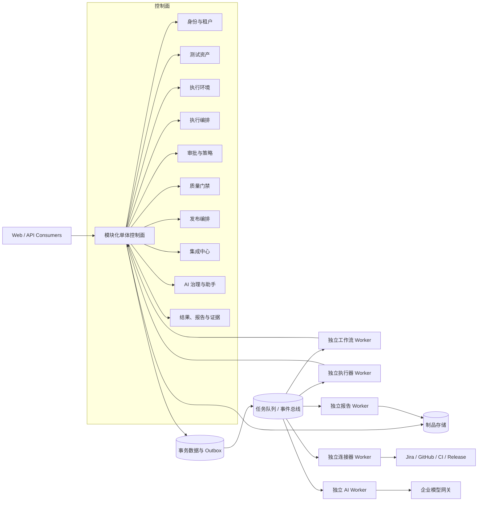
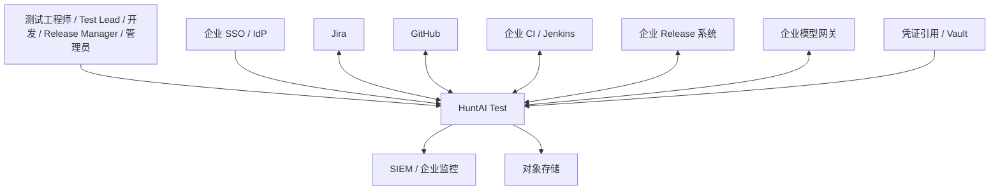

# HuntAI Test 领域与服务架构

> - **Status: Draft**
> - **日期**：2026-08-26
> - **阶段**：Stage 6 · 系统架构设计
> - **决策状态**：本文全部为 Draft 建议，不标记为“已接受”；涉及上游对象、状态、等级或业务语义的调整，必须另走变更流程。
> - **约束**：本文只定义领域模块、运行单元、事务与消息语义；不含实际代码、DDL、迁移和部署配置。

## 1. 范围、非目标与来源优先级

### 1.1 范围

本文把既有 23 个领域对象、五类已定义状态机和 C1–C4 核心链路收口为可实施的领域与服务架构，重点回答：

1. 对象归属哪个限界上下文与模块，谁拥有写权限；
2. 控制面与执行面如何分离，哪些能力独立为 Worker；
3. 聚合、不变量、事务边界、并发控制与异步一致性如何表达；
4. 命令、查询、异步任务和事件如何成为后续 API、工作流与 Worker 契约的输入；
5. 幂等、审批、防双执行、外部回调去重、迟到事件、失败恢复、补偿与人工接管如何治理；
6. 对上游冲突给出 Draft 推荐、替代方案和影响，但不修改上游。

对象总数及建模纪律以 `../03_problem_modeling/problem_model.md:14`、`../03_problem_modeling/problem_model.md:16` 为准；前后端状态、权限、外部访问和成功判定均由后端裁决，依据 `frontend_backend_boundary_spec-v1.0.md:13`、`frontend_backend_boundary_spec-v1.0.md:17`、`frontend_backend_boundary_spec-v1.0.md:19`、`frontend_backend_boundary_spec-v1.0.md:22`。

### 1.2 非目标

- 不定义 API 路由、HTTP 错误码、分页协议或 SSE 帧格式；这些属于后续 API 契约设计，现有边界规范也明确排除，见 `frontend_backend_boundary_spec-v1.0.md:7`、`frontend_backend_boundary_spec-v1.0.md:8`。
- 不定义物理表、字段类型、索引 DDL、数据库迁移或数据回填方案。
- 不给出容器、集群、流水线、网络、密钥系统或其他部署配置。
- 不替代 Jira、Confluence、GitHub、CI/CD 或 Release 系统，不做双向全量同步，见 `../08_prd/prd.md:66`、`../08_prd/prd.md:68`。
- 不把 Agent Mode 结果纳入门禁或发布证据；其证据照常保留，见 `../03_problem_modeling/problem_model.md:98`、`../03_problem_modeling/problem_model.md:104`。
- 不在本文新增领域对象或业务状态；如推荐方案需要新增枚举值或状态边，只登记为开放变更，不视为已生效。

### 1.3 来源优先级与冲突处理

| 优先级 | 来源 | 使用规则 |
| --- | --- | --- |
| 1 | `../03_problem_modeling/problem_model.md` | 最高优先级；23 对象、关系、不变量、状态语义和 CRUD 落点的唯一建模事实源，见 `../03_problem_modeling/problem_model.md:5`、`../03_problem_modeling/problem_model.md:14`。 |
| 2 | `../04_interaction_design/interaction_flows.md` 与 `../04_interaction_design/chains/` | 定义 C1–C4 页面流、跨模块时序、异常与证据落点；其自身要求状态与对象服从问题模型，见 `../04_interaction_design/interaction_flows.md:25`、`../04_interaction_design/interaction_flows.md:35`。 |
| 3 | `frontend_backend_boundary_spec-v1.0.md` | 定义后端权威性、模块功能语义、成功和错误边界；其文首同样声明问题模型为唯一建模事实源，见 `frontend_backend_boundary_spec-v1.0.md:5`、`frontend_backend_boundary_spec-v1.0.md:7`。 |
| 4 | `../README.md` | 产品原则、总体范围、控制/执行分离、集成和安全基线，见 `../README.md:42`、`../README.md:44`、`../README.md:46`。 |
| 5 | `../08_prd/prd.md` | 用户价值、FR 和验收输入；当前仍是尚未吸收完整下游结论的中期版，见 `../08_prd/prd.md:3`、`../08_prd/prd.md:4`。 |

冲突时先保持最高优先级事实源的兼容行为，再在第 13 章登记“推荐方案 + 替代方案 + 影响”。任何推荐均为 Draft，不反向宣称上游已经改变。

## 2. 架构建议与替代方案

### 2.1 推荐：模块化单体控制面 + 独立 Worker

**Draft 推荐**：同步控制面采用模块化单体；持久工作流、执行器、连接器、报告和 AI 分别作为独立 Worker 运行。选择依据是内部规模、共享治理需求、长任务恢复要求和执行面隔离要求：平台规模为企业内部、用户规模有限，见 `../README.md:14`、`../README.md:16`；执行面与治理面必须分离，见 `../README.md:46`；Playwright 执行器必须独立于 API 进程，见 `../08_prd/prd.md:124`；持久工作流要求故障重启不重复副作用，见 `../README.md:336`、`../08_prd/prd.md:269`。

| 运行单元 | 主要职责 | 明确禁止 |
| --- | --- | --- |
| 模块化单体控制面 | 同步命令、查询、RBAC/租户、Policy Gate、状态机、聚合事务、Outbox、工作台投影 | 执行浏览器、压测、长轮询、超大报告解析或直接调用模型厂商 SDK |
| 工作流 Worker | 恢复 TestRun、审批等待、外部轮询、Release 等长流程；按命令推进聚合 | 直接更新模块私有表；绕过命令处理器决定业务状态 |
| 执行器 Worker | 接口/Web/性能确定性执行和 Agent 受限执行；心跳、终止确认、制品上传 | 持有审批裁决权；把内存状态作为唯一终止信号 |
| 连接器 Worker | Jira/GitHub/CI/Release 外部 I/O、轮询、webhook 规范化、重试和补偿 | 直接修改 TestRun、ReleaseTask、GateEvaluation；绕过 Connector 动作契约 |
| 报告 Worker | 报告分片、适配、归一化、脱敏、结果入库命令和显式 partial | 自行判门禁、改 TestRun 终态或静默截断失败条目 |
| AI Worker | A1–A8 调用、Schema 校验、fallback、AIInvocationLog、证据引用校验 | 决定工作流控制流、审批、重试幂等、权限或直接执行外部写 |

Worker 回写控制面的唯一方式是已登记命令；跨模块通知的唯一方式是已登记事件。该约束落实“模型不决定业务控制流”和“副作用可归因”，见 `../README.md:45`、`../README.md:47`，也落实前端与外部系统不得绕过后端的边界，见 `frontend_backend_boundary_spec-v1.0.md:18`、`frontend_backend_boundary_spec-v1.0.md:20`。

### 2.2 数据与一致性形态

- Draft 起步采用一个事务数据库集群，但按模块私有 schema/仓储隔离；共享数据库不等于共享表。业务模块只能通过公开命令、查询接口或事件读取其他模块事实。
- Redis 只用于缓存、限流、短租约或调度提示，不作为工作流、审批、终止信号或幂等记录的唯一事实源；上游已明确 Redis 不作工作流唯一状态，见 `../08_prd/prd.md:221`。
- Artifact、截图、视频、Trace、报告原件和证据包进入对象存储；事务记录只保存受控引用。既有存储分工见 `../08_prd/prd.md:221`。
- 模块内强一致使用单本地事务；跨模块流程使用 Outbox + Inbox + 持久工作流达成至少一次投递、幂等消费和最终一致，不使用跨模块分布式事务。

### 2.3 替代方案

| 方案 | 适用条件 | 优点 | 主要代价 / 风险 |
| --- | --- | --- | --- |
| **A. 模块化单体控制面 + 独立 Worker（推荐）** | 当前内部规模；状态机与治理规则共享；执行负载异构 | 聚合事务简单；策略一致；Worker 可独立扩展与隔离；较少网络契约 | 必须严守模块私有表和依赖规则，否则会退化为耦合单体 |
| B. 全部微服务 | 团队边界稳定、各域有独立 SLO/容量、跨服务事件治理成熟后 | 故障与容量隔离更强；独立发布 | 早期分布式事务、事件版本、可观测和本地开发成本高；23 对象关系尚在冲突收口期，不宜立即固化服务边界 |
| C. 单进程单体含全部异步任务 | 仅 POC 或极低负载 | 最少运行单元 | 执行器、长轮询、报告和 AI 会争抢 API 资源；进程重启丢任务，直接违背独立执行器和持久恢复要求 |
| D. 控制面模块化单体 + 托管持久工作流引擎 | 工作流 POC 证明可运维且团队接受其约束 | 审批等待、轮询、重放与补偿表达更直接 | 引擎选型尚为 TBD；PRD 明确要求先做 POC，见 `../08_prd/prd.md:360`，因此本文不将具体引擎标为已决定 |

## 3. 系统上下文、控制面与执行面

### 3.1 系统上下文

平台是测试治理与质量证据编排层，不是项目管理、缺陷管理、CI 或发布执行系统。Release 权限永远留在企业 Release 系统，平台只准备 item，见 `../README.md:237`、`../README.md:257`。

### 3.2 控制面职责

控制面拥有：租户与项目权限、用例与计划、环境注册、TestRun 状态机、审批与 Policy Gate、配额、门禁策略与评估、ReleaseTask、Connector/Token 元数据、AI 路由与技能、证据与审计索引。所有状态迁移以后端为唯一裁决，见 `frontend_backend_boundary_spec-v1.0.md:17`；租户过滤和 RBAC 每请求强制，见 `frontend_backend_boundary_spec-v1.0.md:18`。

### 3.3 执行面职责

执行面分为平台执行器和外部 CI 两类，均归一化到统一 TestRun、CaseResult、Artifact 与证据链；Script × 外部 CI 只保存 Job 引用与采集契约，不迁移脚本，见 `../README.md:165`、`../README.md:170`。Agent Mode 一期仅运行于平台执行环境，且每个工具动作都经过 Tool Router 和 Policy Gate，见 `../README.md:185`、`../README.md:190`。

控制面向执行面发不可变执行快照和命令；执行面回传心跳、结果块、制品引用与完成事实。执行面不得读取控制面可变表来“实时拼装”已开始任务，避免运行中配置漂移；TestRun 在受理时冻结用例版本、环境和参数，见 `../03_problem_modeling/problem_model.md:146`、`../03_problem_modeling/problem_model.md:148`。

## 4. 限界上下文、模块与 23 对象归属

### 4.1 限界上下文

1. **身份与租户**：Organization、User、ProjectMember、Project、OrgQuota；提供租户上下文、项目授权与预算资格。
2. **测试资产**：TestCase/Version、TestPlan、PerfBaseline；提供版本化测试意图与执行选择。
3. **执行环境**：ExecutionEnvironment；提供平台执行器和外部 CI Job 契约注册与健康资格。
4. **执行编排**：TestRun；拥有统一状态机、快照、心跳、终止和工作流恢复。
5. **结果与证据**：CaseResult/StepRun/Artifact、FailureCluster、EvidenceObject、AuditEvent；负责归一化、分诊、证据与审计事实。
6. **审批与策略**：ApprovalRequest；负责 Preview、Policy Gate、四眼、参数哈希、一次消费和审批 TTL。
7. **质量门禁**：QualityGatePolicy、GateEvaluation；负责策略版本和不可变评估。
8. **发布编排**：ReleaseTask；负责 Jira 范围快照、Readiness 证据和 Release prepare 生命周期。
9. **集成中心**：Connector、ApiToken；负责外部系统契约、凭证引用、webhook、轮询和出站动作。
10. **AI 治理与助手**：AIInvocationLog、Skill/SkillVersion、ModelRoute、CopilotSession；负责模型唯一出口、技能、路由、会话和成本归因。

这些上下文承接既有 23 对象清单，来源为 `../03_problem_modeling/problem_model.md:18` 至 `../03_problem_modeling/problem_model.md:40`；ACTION_TARGET、JOB_CONTRACT、PROJECT_MEMBER、TEST_CASE_VERSION、STEP_RUN、ARTIFACT 等从属结构不另增对象计数，见 `../03_problem_modeling/problem_model.md:102`。

### 4.2 23 对象归属矩阵

| # | 领域对象（沿用上游口径） | 限界上下文 / 所属模块 | 聚合或存储角色 | 允许的跨模块消费 | 追溯 |
| --- | --- | --- | --- | --- | --- |
| 1 | Organization | 身份与租户 / `identity_tenancy` | 聚合根；租户隔离根 | 全模块只读 tenant context | `../03_problem_modeling/problem_model.md:18` |
| 2 | User / ProjectMember | 身份与租户 / `identity_tenancy` | User 外部身份镜像；ProjectMember 授权聚合成员 | Policy Gate、查询投影只读 | `../03_problem_modeling/problem_model.md:19` |
| 3 | Project | 身份与租户 / `identity_tenancy` | 聚合根；Jira 项目映射 | 测试资产、执行、门禁、Release 按 ID 引用 | `../03_problem_modeling/problem_model.md:20` |
| 4 | ExecutionEnvironment | 执行环境 / `execution_registry` | 聚合根，含 Job Contract 从属结构 | 执行编排读取不可变快照 | `../03_problem_modeling/problem_model.md:21` |
| 5 | TestCase (+Version) | 测试资产 / `test_assets` | TestCase 聚合根；Version 不可变从属实体 | 执行编排读取 current version 快照 | `../03_problem_modeling/problem_model.md:22` |
| 6 | TestPlan | 测试资产 / `test_assets` | 聚合根；保存用例引用与 Jira fixVersion | 执行与 Release 读取 | `../03_problem_modeling/problem_model.md:23` |
| 7 | TestRun | 执行编排 / `run_orchestration` | 聚合根；统一状态机 | 结果、门禁、Release、工作台订阅事件 | `../03_problem_modeling/problem_model.md:24` |
| 8 | CaseResult / StepRun / Artifact | 结果与证据 / `results_evidence` | 高容量 append/分片实体；不塞入 TestRun 单事务 | 分诊、门禁、证据、详情查询 | `../03_problem_modeling/problem_model.md:25` |
| 9 | FailureCluster | 结果与证据 / `results_evidence` | run 级结果聚合；修正留痕 | Jira 缺陷、Release 只读 | `../03_problem_modeling/problem_model.md:26` |
| 10 | EvidenceObject | 结果与证据 / `results_evidence` | append-only 证据事实 | 全模块按引用读取 | `../03_problem_modeling/problem_model.md:27` |
| 11 | ApprovalRequest | 审批与策略 / `approval_policy` | 聚合根；行锁消费 | 工作流按 action_ref 接收执行结果 | `../03_problem_modeling/problem_model.md:28` |
| 12 | AIInvocationLog | AI 治理与助手 / `ai_governance` | append-only 调用事实 | 配额、成本看板、审计查询 | `../03_problem_modeling/problem_model.md:29` |
| 13 | AuditEvent | 结果与证据 / `audit_evidence` | append-only 审计事实 | 全模块写入端口；SIEM/查询读取 | `../03_problem_modeling/problem_model.md:30` |
| 14 | Skill (+SkillVersion) | AI 治理与助手 / `ai_governance` | Skill 聚合根；Version 不可变 | Agent/Copilot 读取已发布版本 | `../03_problem_modeling/problem_model.md:31` |
| 15 | ModelRoute | AI 治理与助手 / `ai_governance` | 聚合根；版本化配置 | AI Worker 只读快照 | `../03_problem_modeling/problem_model.md:32` |
| 16 | PerfBaseline | 测试资产 / `test_assets` | 场景子聚合；同场景唯一活跃 | 门禁、Release 只读 | `../03_problem_modeling/problem_model.md:33` |
| 17 | ReleaseTask | 发布编排 / `release_orchestration` | 聚合根；范围与证据引用快照 | Connector 执行 prepare；工作台读取 | `../03_problem_modeling/problem_model.md:34` |
| 18 | ApiToken | 集成中心 / `integration_hub` | 聚合根；签发、吊销、scope | 认证链只读验证 | `../03_problem_modeling/problem_model.md:35` |
| 19 | Connector | 集成中心 / `integration_hub` | 聚合根；动作契约与凭证引用 | 连接器 Worker 读取版本快照 | `../03_problem_modeling/problem_model.md:36` |
| 20 | CopilotSession | AI 治理与助手 / `ai_governance` | 聚合根；服务端会话 | AIInvocationLog 按 session 关联 | `../03_problem_modeling/problem_model.md:37` |
| 21 | OrgQuota | 身份与租户 / `quota_governance` | 独立高并发聚合根；CAS 记账 | AI、执行受理做预留/扣减 | `../03_problem_modeling/problem_model.md:38` |
| 22 | QualityGatePolicy | 质量门禁 / `quality_gates` | 聚合根；版本化策略 | GateEvaluation 快照读取 | `../03_problem_modeling/problem_model.md:39` |
| 23 | GateEvaluation | 质量门禁 / `quality_gates` | 不可变评估事实 | TestRun 挂引用；Release 汇聚 | `../03_problem_modeling/problem_model.md:40` |

### 4.3 模块职责与禁止依赖

| 模块 | 拥有的写模型 | 可以依赖 | 禁止依赖 / 禁止行为 |
| --- | --- | --- | --- |
| `identity_tenancy` / `quota_governance` | Organization、User/ProjectMember、Project、OrgQuota | IdP/Jira 读取适配端口、Audit 端口 | 依赖执行、门禁、Release；让 Jira webhook 直接改本地授权；跨租户返回可区分存在性 |
| `test_assets` | TestCase/Version、TestPlan、PerfBaseline | 身份授权查询、Audit 端口 | 直接改 TestRun；从结果模块反向写用例；AI 输出直写 ACTIVE |
| `execution_registry` | ExecutionEnvironment | 身份授权、审批结果、Connector 查询端口 | 触发 TestRun；直接调用外部 Job；健康检查绕过状态命令 |
| `run_orchestration` | TestRun | 身份/配额、资产快照、环境快照、审批命令端口 | 解析报告、执行浏览器、调用外部系统、直接写结果或门禁表 |
| `results_evidence` / `audit_evidence` | CaseResult/StepRun/Artifact、FailureCluster、EvidenceObject、AuditEvent | TestRun 只读快照、AI 调用端口 | 推进 TestRun 状态；修改门禁结论；删除或覆盖 append-only 事实 |
| `approval_policy` | ApprovalRequest、Policy Gate 规则投影 | 身份、Connector/Skill 动作声明、Audit 端口 | 自行执行外部副作用；把前端置灰当权限；复用过期或哈希不符审批 |
| `quality_gates` | QualityGatePolicy、GateEvaluation | TestRun 终态事件、结果查询、Evidence 查询 | 直接改 TestRun 终态；修改历史评估；为 agent run 生成评估 |
| `release_orchestration` | ReleaseTask | Jira 读取端口、门禁/证据查询、审批命令端口 | 实际执行生产发布；直接修改 GateEvaluation；绕过 prepare 审批 |
| `integration_hub` | Connector、ApiToken、Inbox 投递事实 | Vault 引用、Audit 端口 | 按外部回调直接改其他聚合；持有业务状态机；把轮询结果当无条件新事实 |
| `ai_governance` | AIInvocationLog、Skill/Version、ModelRoute、CopilotSession | 配额预留、Evidence 输入池、Tool Router | 直连业务表或厂商 SDK 旁路；决定审批/重试/状态机；处理 Restricted 数据越过路由 |

模块间依赖以 ID、快照、查询端口和事件为主，不以 ORM 实体或共享仓储为接口。EvidenceObject 和 AuditEvent 虽为横切能力，也通过 append 端口接收，不允许业务模块取得其底层仓储。

## 5. 聚合、不变量与事务边界

### 5.1 通用规则

1. 每个可变聚合带逻辑版本；命令必须携带 `expected_version` 或等价前置版本，冲突时拒绝并要求重读，不做最后写入获胜。前端缓存冲突以后端为准，见 `frontend_backend_boundary_spec-v1.0.md:183`、`frontend_backend_boundary_spec-v1.0.md:189`。
2. 聚合事务只能写本模块私有数据、AuditEvent append 请求和 Outbox；跨模块副作用在事务提交后由事件驱动。
3. append-only 对象不原地覆盖：EvidenceObject、AuditEvent、AIInvocationLog、GateEvaluation、已发布 SkillVersion、TestCaseVersion 均新增事实或新版本。
4. 大结果不与 TestRun 放在同一聚合事务。超大报告要求分片、进度、部分成功显式标记，见 `../08_prd/prd.md:145`；因此结果块按幂等序号独立提交，TestRun 只保存归一化完成/失败摘要与引用。
5. 所有核心对象必须带租户归属并在持久层查询入口强制过滤；无租户上下文拒绝，见 `../03_problem_modeling/problem_model.md:97`。

### 5.2 聚合与关键不变量

| 聚合根 | 聚合内不变量 | 单事务内容 | 跨聚合动作 |
| --- | --- | --- | --- |
| Organization | tenant context 必须存在；组织隔离不可由调用方覆盖 | 组织状态 + Outbox | 项目、成员、配额分别命令化 |
| Project | Jira 映射唯一且只读同步；项目 ID 不等于外部 Jira ID | Project 镜像 + 同步游标 + Outbox | ProjectMember、TestPlan 独立事务 |
| ProjectMember | 角色仅 owner/admin/tester/viewer；授权变更必须审计 | 角色变更 + Audit append + Outbox | User 身份状态通过查询校验 |
| OrgQuota | 预算/执行资源不得超配；预留、确认、释放均 CAS；同一消费幂等 | 单次配额记账 + Outbox | AI/TestRun 只持 reservation 引用 |
| TestCase | AI 生成不得直达 ACTIVE；current_version 指向不可变全量版本；validity 与生命周期分离 | 新 Version + 指针 CAS + 状态变化 + Outbox | AI 先产草稿；heal_apply 经审批 |
| TestPlan | 用例引用在同租户/项目；执行时解析为不可变快照 | 计划配置 + 引用 + Outbox | StartTestRun 消费快照 |
| PerfBaseline | 同场景仅一个活跃基线；历史基线不改写 | 新基线 + 旧基线停用 CAS + Outbox | Gate 只读快照 |
| ExecutionEnvironment | 非 ACTIVE 不接受新 run；凭证只存引用；Job 契约版本化 | 状态/配置版本 + Outbox | 健康探测与审批通过命令驱动 |
| TestRun | 仅走批准边；终态吸收；snapshot 受理后不变；agent 不进门禁；等待态不做心跳回收 | 状态 CAS + 快照/游标 + Outbox + Audit append | 结果分片、审批、门禁异步关联 |
| ApprovalRequest | approver != initiator；param_hash 绑定；过期不放行；最多消费一次 | 行锁 + 权限/哈希复核 + 状态/结果 + Outbox + Audit append | 外部/资产副作用由已批准动作执行器处理 |
| QualityGatePolicy | 修改生成新 version；blocking 必须显式开启 | 策略版本 + Outbox | GateEvaluation 保存策略快照 |
| GateEvaluation | 不可变；重评估新增记录；agent run 不生成 | 新评估 + Evidence 引用 + Outbox | TestRun 仅 CAS 挂接当前评估引用 |
| ReleaseTask | Jira 范围快照不变；prepare 不等于发布执行；外部 item 创建幂等 | 状态 CAS + 快照/引用 + Outbox | Jira/Gate/Evidence 通过查询快照汇聚 |
| Connector | 动作必须声明等级、Preview/幂等/补偿；凭证只存引用 | 配置版本 + 能力授权元数据 + Outbox | 外部调用由连接器 Worker 执行 |
| Skill | 未版本化/未发布版本不可生产使用；manifest 限制工具、等级和超时 | 新 SkillVersion + 发布指针 CAS + Outbox | Agent/Copilot 读取固定版本 |
| CopilotSession | 会话归属用户/租户；工具调用仍独立过 Policy Gate | 会话消息/摘要 + Outbox | AIInvocationLog 与工具结果按引用关联 |

这些不变量来源包括：AI 用例人工确认 `../03_problem_modeling/problem_model.md:125`、`../03_problem_modeling/problem_model.md:137`；TestRun 门禁资格 `../03_problem_modeling/problem_model.md:98`、`../03_problem_modeling/problem_model.md:104`；审批四眼和哈希 `../03_problem_modeling/problem_model.md:193`、`../03_problem_modeling/problem_model.md:195`；门禁策略/结果分离 `../03_problem_modeling/problem_model.md:103`；PerfBaseline 唯一活跃 `../03_problem_modeling/problem_model.md:100`。

### 5.3 特殊事务边界

**审批消费与异步执行协议**：批准、领取和真实尝试是三个不同事实。`APPROVED` 只表示人已批准；消费事务锁定 ApprovalRequest，重算参数哈希、重校验权限、目标版本、持续授权与 kill switch，并原子创建以 `(approval_request_id, bound_hash)` 唯一标识的**基础设施执行意图**及同事务 Outbox。执行意图不是领域对象、不新增状态，也不把 ApprovalRequest 提前写成 EXECUTED。重复 consume 返回既有执行引用，不创建第二个意图。Worker 领取意图后使用稳定外部幂等键执行；首次真实调用已发出后，才通过控制面命令把 ApprovalRequest 写成 `EXECUTED + execution_result=ok/failed`。上游已明确 EXECUTED 表示“已尝试”而非必然成功，见 `../03_problem_modeling/problem_model.md:199`、`../03_problem_modeling/problem_model.md:205`。

恢复规则必须与运行时产品无关：调用前崩溃可重新领取同一意图；调用后响应丢失或落账前崩溃先按 external_request_id/稳定幂等键查询外部结果，再决定记录 ok、failed 或继续对账，禁止创建第二个意图或盲目重发；Outbox 重投只唤醒同一意图；人工重提必须创建新的 ApprovalRequest，旧意图继续按原 request 对账，不得授权新参数。若外部系统既不支持幂等创建也不能按请求标识查询，该动作不得自动恢复，只能 fail-close 并转人工接管。

**heal_apply**：Draft 推荐在批准后、消费行锁与 TestCase 版本 CAS 已持有时，立即创建应用前版本快照，并在同一外层事务内以保存点执行“快照 → 新版本 → 指针切换”；快照或应用失败回滚资产写入，但在外层事务将 ApprovalRequest 记为 `EXECUTED + failed`。这样同时满足 fail-close、一次消费与失败需重新审批。来源冲突及替代方案见第 13.7 节。

**外部写**：本地事务只保存唯一基础设施执行意图与 Outbox，不把远程调用放在数据库事务中。连接器 Worker 以该意图和固定幂等键调用；结果经 Inbox 归一化后再以命令推进 ApprovalRequest 与目标聚合。远程超时且结果未知时先按 external_request_id 查询，不直接盲重试；外部写必须有幂等和补偿，见 `../README.md:374`。

## 6. 核心对象状态语义

### 6.1 TestCase

| 状态 / 标记 | 语义 | 允许的关键迁移 |
| --- | --- | --- |
| DRAFT | 人工保存或 AI 草稿经审阅后落库；不可执行 | → PENDING_REVIEW；→ DEPRECATED |
| PENDING_REVIEW | 等待人工评审；AI 生成必须经过此态 | → ACTIVE；驳回 → DRAFT |
| ACTIVE | 当前可被执行选择；执行仍需 validity=valid | → DEPRECATED |
| DEPRECATED | 人工废弃/弃用，不可执行 | 终止性业务状态；不复用为外部 Job 暂时失效 |
| validity=invalid | 引用 Job 删除/改名或存在性校验失败的可逆系统标记 | Job 恢复后可回 valid，生命周期状态不变 |

状态来源为 `../03_problem_modeling/problem_model.md:121`、`../03_problem_modeling/problem_model.md:125` 至 `../03_problem_modeling/problem_model.md:137`。

### 6.2 TestRun

TestRun 使用 10 态：PENDING、VALIDATING、RUNNING、WAITING_EXTERNAL、WAITING_APPROVAL、STOPPING、SUCCEEDED、FAILED、CANCELLED、TIMEOUT。完整状态定义以 `../03_problem_modeling/problem_model.md:139` 至 `../03_problem_modeling/problem_model.md:186` 为准。

| 状态 | 语义 | 心跳 / 超时 | 退出原则 |
| --- | --- | --- | --- |
| PENDING | 已受理并冻结 snapshot，尚未开始校验 | 短时受理；不承载长任务 | → VALIDATING；校验前人工取消 → CANCELLED |
| VALIDATING | 执行 Job Schema、变量、Job 存在性等权威校验 | 短时同步/受控任务 | 成功 → RUNNING；失败 → FAILED |
| RUNNING | 执行或归一化活跃态 | 必须心跳 | 完成、失败、等待、停止或心跳 TIMEOUT |
| WAITING_EXTERNAL | 外部 Job 排队/等待；非活跃等待态 | 不做僵尸回收；滞留告警 | 外部开始 → RUNNING；人工幂等取消 → CANCELLED |
| WAITING_APPROVAL | 执行中 L2+ 动作等待审批；非活跃等待态 | 审批 TTL 管 ApprovalRequest；TestRun 只显示滞留 | 批准 → RUNNING；拒绝/人工取消 → CANCELLED；审批过期保持本态 |
| STOPPING | 终止信号已持久化、等待执行体确认 | 活跃态，必须心跳 | 停止完成 → CANCELLED；停止卡死 → TIMEOUT |
| SUCCEEDED | 执行成功终态 | 无 | 吸收；迟到事件不得重开 |
| FAILED | 校验或执行失败终态 | 无 | 吸收；是否重跑由新命令创建新尝试 |
| CANCELLED | 人工/策略主动终止完成的终态 | 无 | 吸收；已产生结果仍可追加证据/分诊 |
| TIMEOUT | 活跃执行体或停止流程失联超时的终态 | 无 | 吸收；人工决定是否重跑 |

等待态“可见 + 告警 + 可人工取消”而非自动回收，见 `../03_problem_modeling/problem_model.md:184`；STOPPING 必须有 TIMEOUT 兜底，见 `../03_problem_modeling/problem_model.md:185`；系统主动终止与进程失联的 CANCELLED/TIMEOUT 区分见 `../03_problem_modeling/problem_model.md:180`。

### 6.3 ApprovalRequest

| 状态 | 语义 |
| --- | --- |
| CREATED | Policy Gate 输出 REQUIRE_APPROVAL 后创建的瞬时态 |
| PENDING | 已入审批队列、已通知审批人、独立 TTL 启动 |
| APPROVED | 人已批准，但副作用尚未被一次消费成功锁定/尝试 |
| EXECUTED | 已尝试执行；以 execution_result=ok/failed 表示结果，不等同“成功” |
| REJECTED | 审批人明确拒绝；执行中 TestRun 可转 CANCELLED |
| EXPIRED | TTL 到期、撤回、上游取消或参数失效；不自动放行 |

四眼、参数哈希、状态语义与失败表达见 `../03_problem_modeling/problem_model.md:193` 至 `../03_problem_modeling/problem_model.md:207`。审批过期后关联 TestRun 保持 WAITING_APPROVAL，必须重新提交或人工取消，见 `../03_problem_modeling/problem_model.md:207`。

### 6.4 ExecutionEnvironment

当前已定义状态为 `PENDING_APPROVAL → ACTIVE → DEGRADED → DISABLED`，见 `../03_problem_modeling/problem_model.md:233`。PENDING_APPROVAL 尚未获管理员批准；ACTIVE 允许新发起但仍须复核健康、容量和组合；DEGRADED 不接收新 run；DISABLED 为管理员停用或治理禁用。在途 RUNNING/WAITING_EXTERNAL 不因降级或停用被强杀，依据 `../03_problem_modeling/problem_model.md:235`。恢复边缺失见第 13.6 节，本文不把推荐边当作现行事实。

### 6.5 ReleaseTask

| 状态 | 语义 | 迁移 |
| --- | --- | --- |
| DRAFT | Jira 版本已圈定并冻结范围快照 | 证据/Readiness/A5 草稿就绪 → PENDING_CONFIRM |
| PENDING_CONFIRM | 等待 prepare 预览确认与审批 | 审批后 → SUBMITTED；可 → CANCELLED |
| SUBMITTED | prepare 请求已提交到 Release 系统 | item 成功 → READY；调用失败 → FAILED_RETRYABLE |
| READY | 外部 release item 已准备完成；不表示生产发布已执行 | 终态 |
| FAILED_RETRYABLE | prepare 失败且可人工重试 | 幂等重试 → SUBMITTED；放弃 → CANCELLED |
| CANCELLED | 人工取消/放弃 | 终态；迟到外部 READY 只记录差异，不改写 |

状态机来源为 `../03_problem_modeling/problem_model.md:255` 至 `../03_problem_modeling/problem_model.md:268`；平台只准备、不执行发布，见 `../README.md:257`。

### 6.6 GateEvaluation

现行模型语义：QualityGatePolicy 是可版本化配置，GateEvaluation 是包含 policy_snapshot 的不可变单次结果；重评估新建记录，不改旧记录，见 `../03_problem_modeling/problem_model.md:103`、`../03_problem_modeling/problem_model.md:252`、`../03_problem_modeling/problem_model.md:253`。现行结果枚举只有 pass/fail/waived；agent run 不生成本对象。

Draft 兼容规则：

1. script/external_ci 且 run 为 SUCCEEDED/FAILED、结果归一化完整、策略可评估时，生成 pass/fail；批准的豁免通过新评估或不可变关联表达 waived。
2. agent run 永不生成 GateEvaluation。
3. CANCELLED/TIMEOUT、阈值缺配或报告 partial 时禁止默认 pass。在上游新增 `not_evaluated` 前，控制面以“无 GateEvaluation + 查询投影明确 reason”兼容，Release 汇聚直接引用 TestRun 终态/缺配原因。
4. 推荐上游增加 not_evaluated 的方案、替代与影响见第 13.3 节；当前文档不擅自扩枚举。

## 7. 命令、查询、异步任务与事件目录

以下是语义目录，不是 API 路由或代码签名。所有命令都携带 tenant、actor、request/idempotency key、expected_version（适用时）和 trace/correlation 上下文；所有失败也写审计，依据 `frontend_backend_boundary_spec-v1.0.md:318`、`frontend_backend_boundary_spec-v1.0.md:319`。

### 7.1 命令目录

| 模块 | 命令 | 关键前置 / 结果 |
| --- | --- | --- |
| 身份与租户 | `SyncProjectFromJira` | 幂等更新 Project 镜像，不覆盖本地授权 |
| 身份与租户 | `AssignProjectMemberRole` / `RemoveProjectMember` | RBAC + CAS；权威源建议见 13.5 |
| 配额 | `ReserveQuota` / `ConfirmQuotaUsage` / `ReleaseQuotaReservation` | 同一 consumption key 幂等；超限拒绝 |
| 测试资产 | `CreateTestCaseDraft` / `SubmitTestCaseForReview` / `ApproveTestCase` / `RejectTestCase` / `DeprecateTestCase` | 创建版本；严格按状态边；AI 来源打标 |
| 测试资产 | `MarkReferencedCaseInvalid` / `RestoreReferencedCaseValidity` | 只改 validity，不复用 DEPRECATED |
| 测试资产 | `CreateOrUpdateTestPlan` / `ActivatePerfBaseline` | 项目内引用校验；基线唯一活跃 CAS |
| 执行环境 | `RegisterExecutionEnvironment` / `ApproveEnvironmentRegistration` / `DisableExecutionEnvironment` / `RecordEnvironmentHealth` | env_register 审批；健康结果只经状态命令 |
| 执行编排 | `StartTestRun` / `ValidateTestRun` / `DispatchTestRun` | 幂等受理、冻结 snapshot、校验、派发 Outbox |
| 执行编排 | `RecordRunHeartbeat` / `RequestRunCancellation` / `AcknowledgeRunStopped` / `MarkRunTimedOut` | CAS 状态推进；终止信号持久化 |
| 执行编排 | `RecordExternalWaiting` / `RecordExternalStarted` / `CompleteTestRun` / `FailTestRun` | webhook/轮询共享规范化入口；终态吸收 |
| 结果与证据 | `IngestResultChunk` / `FinalizeNormalizedReport` / `MarkReportPartial` | chunk key 幂等；不静默截断 |
| 结果与证据 | `CreateFailureClusters` / `CorrectFailureCluster` / `AppendEvidence` / `AppendAuditEvent` | AI/evidence 校验；append-only |
| 审批与策略 | `PreviewAction` / `SubmitApprovalRequest` / `ApproveRequest` / `RejectRequest` / `ExpireRequest` / `ResubmitRequest` | Policy Gate、param_hash、四眼、TTL |
| 审批与策略 | `ConsumeApprovedAction` | 行锁、哈希/权限/目标版本复核、一次执行 |
| 质量门禁 | `CreateOrReviseGatePolicy` / `EnableBlockingMode` / `EvaluateTestRun` / `RequestGateWaiver` | 新版本；显式开启；结果不可变 |
| 发布编排 | `CreateReleaseTask` / `PrepareReleaseEvidence` / `ConfirmReleasePrepare` / `RetryReleasePrepare` / `CancelReleaseTask` / `RecordReleaseItemStatus` | 范围快照、release_push 审批、幂等 prepare |
| 集成中心 | `RegisterConnector` / `ReviseConnector` / `DisableConnector` / `IssueApiToken` / `RevokeApiToken` / `BindCiTrigger` | 动作声明、scope/project/有效性校验 |
| AI 治理 | `GenerateCaseDraft` / `GenerateFailureTriage` / `GenerateReleaseDraft` | 模型唯一出口、结构化输出、fallback |
| AI 治理 | `StartCopilotSession` / `AppendCopilotTurn` / `PublishSkillVersion` / `ReviseModelRoute` | 服务端会话；版本锁定与评测前置 |
| 治理 | `TightenKillSwitch` / `RequestKillSwitchRestore` | 关停 L1 即时；恢复 L3 审批，见 `../03_problem_modeling/problem_model.md:218` |

### 7.2 查询目录

| 查询 | 组合来源 / 约束 |
| --- | --- |
| `GetWorkDashboard` | 待审批、进行中/等待 TestRun、门禁异常、OrgQuota；等待态不得因滞留隐藏，见 `frontend_backend_boundary_spec-v1.0.md:148` |
| `ListProjects` / `GetProjectOverview` / `ListProjectMembers` | 租户过滤；Project/Jira 映射与本地授权分开展示 |
| `ListTestCases` / `GetTestCaseVersionHistory` / `GetTestPlan` | 状态、validity、来源、版本只读投影 |
| `ListExecutionEnvironments` / `GetJobContract` | 仅 ACTIVE 可选，但查询可展示全部状态与原因 |
| `ListTestRuns` / `GetTestRunDetails` / `GetRunTimeline` | 10 态、execution_source、滞留时长、结果与证据聚合 |
| `GetAgentTrajectory` | Artifact/CaseResult 投影；agent 不进门禁提示 |
| `ListApprovalQueue` / `GetApprovalCard` | 九要素、TTL、失效原因；后端强制四眼 |
| `GetFailureTriageReport` | clusters、unclustered、correction history、evidence |
| `ListGatePolicies` / `ListGateEvaluations` / `GetGateEligibility` | 不从前端计算门禁；明确 not-evaluated reason 投影 |
| `GetReleaseTask` / `GetReleaseReadiness` | 范围快照、证据缺口、外部 item 状态差异 |
| `ListConnectors` / `ListWebhookDeliveries` / `GetConnectorHealth` | 凭证永不回传；展示投递/重试事实 |
| `GetEvidence` / `SearchAuditEvents` / `BuildEvidencePackage` | 权限过滤、脱敏内容、不可变事实 |
| `GetAiCostDashboard` / `GetModelRoutes` / `ListSkillVersions` / `GetCopilotSession` | AIInvocationLog 唯一数据源；会话归属校验 |

### 7.3 异步任务目录

| 异步任务 | Worker | 幂等 / 恢复检查点 |
| --- | --- | --- |
| `ProjectMirrorSync` | 连接器 Worker | Jira cursor + external revision |
| `ApprovalExpiryAndEscalation` | 工作流 Worker | request_id + escalation stage；不自动放行 |
| `EnvironmentHealthProbe` | 连接器 Worker | env_id + probe window；状态 CAS |
| `RunDispatchAndRecovery` / `ExecutorHeartbeatReaper` | 工作流 Worker | run_id + workflow step/attempt；run version + last heartbeat |
| `ExternalCiTrigger` / `ExternalCiPoll` | 连接器 Worker | run idempotency key + external request id；build revision/status cursor |
| `ArtifactAndLogChunkPull` | 连接器 Worker | artifact/chunk manifest key |
| `ReportNormalize` | 报告 Worker | run + report + chunk index/schema version |
| `FailureTriage` | AI/报告 Worker | run + normalized result version + prompt version |
| `GateEvaluate` / `GitHubCheckRunSync` | 工作流/连接器 Worker | run + policy/result version；evaluation + phase |
| `ReleaseEvidenceRefresh` / `ReleasePrepareAndReconcile` | 工作流/连接器 Worker | task + evidence version；release idempotency key + external request id |
| `EvidencePackageBuild` | 报告 Worker | export request + manifest version |
| `AiInvocation` | AI Worker | invocation id + prompt/model/skill versions |
| `OutboxPublish` / `InboxReconcile` | 基础 Worker | message id；至少一次投递、重复安全 |

### 7.4 事件目录

事件只陈述已提交事实；命令式“请执行”不伪装成领域事件。事件 envelope 至少含 event_id、event_type/version、tenant_id、aggregate_id/version、occurred_at、correlation_id、causation_id、actor/delegation 与 data classification。

| 上下文 | 事件 |
| --- | --- |
| 身份/项目 | `ProjectMirrored`、`ProjectMemberRoleChanged`、`QuotaReserved`、`QuotaReleased`、`QuotaExceeded` |
| 测试资产 | `TestCaseDraftCreated`、`TestCaseSubmittedForReview`、`TestCaseActivated`、`TestCaseDeprecated`、`ReferencedCaseValidityChanged`、`TestPlanRevised`、`PerfBaselineActivated` |
| 执行环境 | `ExecutionEnvironmentRegistered`、`ExecutionEnvironmentActivated`、`ExecutionEnvironmentDegraded`、`ExecutionEnvironmentDisabled` |
| 执行编排 | `TestRunAccepted`、`TestRunValidationFailed`、`TestRunDispatched`、`TestRunWaitingExternal`、`TestRunWaitingApproval`、`TestRunCancellationRequested`、`TestRunStopped`、`TestRunSucceeded`、`TestRunFailed`、`TestRunTimedOut` |
| 结果/证据 | `ResultChunkIngested`、`ReportNormalized`、`ReportMarkedPartial`、`FailureClustersCreated`、`FailureClusterCorrected`、`EvidenceAppended`、`AuditEventAppended` |
| 审批/策略 | `ApprovalRequested`、`ApprovalApproved`、`ApprovalRejected`、`ApprovalExpired`、`ApprovedActionExecuted`、`ApprovedActionFailed`、`PolicyDecisionRecorded` |
| 门禁 | `GatePolicyRevised`、`GateEvaluationCreated`、`GateWaiverRequested`、`GateWaiverApplied`、`CheckRunSyncFailed` |
| 发布 | `ReleaseTaskCreated`、`ReleaseEvidencePrepared`、`ReleasePrepareSubmitted`、`ReleaseItemReady`、`ReleasePrepareFailed`、`ReleaseTaskCancelled`、`ReleaseExternalStateDiverged` |
| 集成 | `ConnectorRevised`、`WebhookAccepted`、`WebhookDuplicateIgnored`、`ExternalActionSubmitted`、`ExternalActionReconciled` |
| AI | `AIInvocationCompleted`、`AIInvocationDegraded`、`SkillVersionPublished`、`ModelRouteRevised`、`CopilotTurnCompleted`、`KillSwitchTightened`、`KillSwitchRestored` |

## 8. C1–C4 跨模块流程

### 8.1 C1 北极星质量闭环

链路范围由 `../04_interaction_design/interaction_flows.md:11` 定义；一期 Confluence/RAG 入口和回流后置，实际以导入与证据包承接，见 `../README.md:38`。

1. 测试资产模块接收导入；AI Worker 生成默认不落库草稿并记录 AIInvocationLog；人工保存后才创建 TestCase DRAFT。
2. TestCase 通过 DRAFT→PENDING_REVIEW→ACTIVE；事务提交发 `TestCaseActivated`。
3. 执行编排读取 ACTIVE 用例版本、ACTIVE 环境与配额，单事务创建 TestRun PENDING、冻结 snapshot、写 Outbox；工作流 Worker 依 C3 调度。
4. 报告 Worker 分片归一化；结果模块发 `ReportNormalized`；C4 生成 FailureCluster 和 Evidence。
5. 质量门禁消费合格终态与完整结果，生成不可变 GateEvaluation；连接器 Worker 同步 GitHub Check Run，失败不回滚门禁事实。
6. 用户从 FailureCluster 发起 jira_write；C2 完成审批后，连接器 Worker 幂等创建 Jira issue，Evidence 记录 external_request_id。
7. Release 模块冻结 Jira 范围，汇聚计划、门禁、性能和缺陷证据；A5 只生成草稿；release_push 经 C2 后调用 prepare，外部状态回传推进 ReleaseTask。
8. EvidenceObject 和 AuditEvent 全程 append；一期构建证据包供人工归档，M4 机制未获建模前不自动写 Confluence。

关键页面与对象交接原始时序见 `../04_interaction_design/chains/c1_north_star_quality_loop.md:70` 至 `../04_interaction_design/chains/c1_north_star_quality_loop.md:155`；证据主线见 `../04_interaction_design/chains/c1_north_star_quality_loop.md:285` 至 `../04_interaction_design/chains/c1_north_star_quality_loop.md:300`。

### 8.2 C2 审批链

1. 发起模块提交 Preview 语义；Policy Gate 依据动作声明、用户、租户、目标、持续授权和会话强度输出 ALLOW/DENY/REQUIRE_APPROVAL/REQUIRE_REAUTH。
2. REQUIRE_APPROVAL 时，审批模块创建 CREATED→PENDING，绑定 param_hash 和九要素卡片；审批 TTL 与 TestRun 心跳完全分离。
3. 批准命令只推进 PENDING→APPROVED；拒绝推进 REJECTED，并按 action_ref 发联动事件。
4. Action Executor 以 request_id 消费：锁行、复核四眼/权限/哈希/目标版本/开关，并原子创建唯一基础设施执行意图与 Outbox；重复消费返回同一执行引用。
5. Worker 领取该意图并以稳定幂等键执行；首次真实尝试后，成功或失败都经控制面命令进入 EXECUTED，写 execution_result、AuditEvent 和结果 Outbox。未知外部结果先查询后落账。
6. TTL 到期推进 EXPIRED；若关联 TestRun 在 WAITING_APPROVAL，保持等待、告警并提供重新提交/人工取消。

原始主时序和行锁要求见 `../04_interaction_design/chains/c2_approval_chain.md:106` 至 `../04_interaction_design/chains/c2_approval_chain.md:143`、`../04_interaction_design/chains/c2_approval_chain.md:176` 至 `../04_interaction_design/chains/c2_approval_chain.md:182`。

### 8.3 C3 执行发起链

1. manual/schedule/ci_webhook/api_token 触发先规范化为 `StartTestRun`；租户、角色/Token、用例、模式×环境、配额和白名单在控制面复核。
2. PENDING 冻结 snapshot；VALIDATING 解析双层变量、Job Schema 和 Job 存在性；失败直接 FAILED，不派发。
3. Script × 平台执行器：工作流 Worker 下发不可变快照，执行器回传心跳、结果和制品。
4. Script × external_ci：连接器 Worker 用 run 幂等键触发，进入 WAITING_EXTERNAL；轮询与 webhook 先到者经同一 Inbox 去重，构建开始后回 RUNNING。
5. Agent × 平台执行器：每一步经 Tool Router + Policy Gate；L2+ 进入 C2；超步/总超时主动 STOPPING→CANCELLED，进程失联 RUNNING/STOPPING→TIMEOUT。
6. 终态发事件给 C4 和门禁；CANCELLED/TIMEOUT 已产生结果仍可归一化和分诊，但不重开 run。

模式/环境矩阵见 `../04_interaction_design/chains/c3_execution_kickoff.md:38` 至 `../04_interaction_design/chains/c3_execution_kickoff.md:45`；外部 CI 时序见 `../04_interaction_design/chains/c3_execution_kickoff.md:171` 至 `../04_interaction_design/chains/c3_execution_kickoff.md:210`；Agent 时序见 `../04_interaction_design/chains/c3_execution_kickoff.md:213` 至 `../04_interaction_design/chains/c3_execution_kickoff.md:261`。

### 8.4 C4 失败分诊链

1. SUCCEEDED/FAILED 且含失败结果是主入口；CANCELLED/TIMEOUT 的已入库失败结果为旁路入口，见 `../04_interaction_design/chains/c4_failure_triage.md:24`、`../04_interaction_design/chains/c4_failure_triage.md:25`。
2. 报告 Worker 先确定性归一化和脱敏，再由 AI Worker 运行 A2；Schema 或证据引用失败按既有 fallback，不能让 AI 失败阻塞平台报告。
3. FailureCluster 随 run 生成；人工修正走命令并 append correction history/AuditEvent，不回写原 AIInvocationLog。
4. jira_write 和 heal_apply 都从终态 run 发起 ApprovalRequest，不把 TestRun 改回 WAITING_APPROVAL；该区分见 `../04_interaction_design/chains/c4_failure_triage.md:26`。
5. heal_apply 按“批准后一次消费 → 快照 fail-close → 新 Version → 指针 CAS”执行；Jira 写按幂等键和 external_request_id 执行。
6. 证据、模型/Prompt/Skill 版本、审批哈希和外部资源引用贯穿两条副作用分支。

C4 原始分诊时序见 `../04_interaction_design/chains/c4_failure_triage.md:67` 至 `../04_interaction_design/chains/c4_failure_triage.md:97`；副作用分支见 `../04_interaction_design/chains/c4_failure_triage.md:99` 至 `../04_interaction_design/chains/c4_failure_triage.md:143`。

## 9. 幂等、并发、消息与迟到事件

### 9.1 命令幂等

- 幂等作用域建议为 `(tenant, command_type, idempotency_key)`；首次请求保存 payload hash 和结果引用。相同 key、相同 hash 返回既有结果；相同 key、不同 hash 拒绝为冲突。
- StartTestRun 的来源键按触发源规范化：手动由服务端签发；schedule 使用 schedule occurrence；GitHub 使用 delivery/commit/binding；ApiToken 使用调用方 key。前端不得生成权威幂等键，见 `frontend_backend_boundary_spec-v1.0.md:197`。
- 外部 CI 的平台 run key 与 external request/build id 同时保存；重启后先查询外部状态再决定是否补触发，满足 `../08_prd/prd.md:150`。
- 结果块使用 `(run, source, report, chunk_index, schema_version)` 或等价稳定键；重复块不重复记 CaseResult/Artifact。

### 9.2 乐观锁、CAS 与审批行锁

- TestCase current_version、TestRun 状态、ExecutionEnvironment 状态、ReleaseTask 状态、Connector/Policy/Route 发布指针、OrgQuota 计数均使用 expected_version/CAS。
- 任何状态命令同时检查“当前态 + 版本 + 不变量”；不能只按 ID 更新。
- ApprovalRequest 从 APPROVED 消费时必须使用数据库行锁；锁内复核 param_hash、权限、四眼、目标版本和 kill switch，第二消费者得到“已消费/不可执行”而非重复副作用。该要求来源为 `../03_problem_modeling/problem_model.md:199`、`frontend_backend_boundary_spec-v1.0.md:210`。
- 远程调用不持有数据库锁。锁内只落本地外部动作意图与幂等键；远程结果异步归档。

### 9.3 Outbox / Inbox

- 每次聚合事务把领域事件写入同事务 Outbox；发布失败可重试，不回滚已提交业务事实。
- 每个消费者以 event_id 在 Inbox 先登记；处理与自身业务写在同一事务完成。崩溃后重复投递只返回既有消费结果。
- 事件 schema 版本只向后兼容演进；消费者不得依赖未声明字段。敏感正文不放事件总线，只传 Evidence/Artifact 引用和数据分级。
- 工作流命令同样至少一次投递，因此命令处理器必须幂等；“消息只投一次”不是正确性前提。

### 9.4 webhook、轮询与去重

1. webhook 先验签、租户/仓库归属校验，再写原始投递 Inbox；HMAC 不允许空密钥绕过，见 `../README.md:363`。
2. provider delivery id 是首层去重键；若提供方无稳定 ID，使用 connector + event type + external resource + external revision + canonical payload hash。
3. webhook 和轮询都映射为同一 `ExternalObservation` 语义，使用 external revision/状态序比较；先到者推进，后到同版本忽略。
4. 轮询游标持久化；进程重启从游标恢复，而不是从头触发外部动作。
5. 回调内容只是外部观察，不拥有平台状态机；必须经目标聚合 CAS 命令才能生效。

### 9.5 迟到与乱序事件

| 场景 | Draft 处理规则 |
| --- | --- |
| TestRun 已 SUCCEEDED/FAILED 后收到旧 RUNNING | 依据 aggregate version/external revision 丢弃状态推进；记录 duplicate/late 指标 |
| TestRun 已 CANCELLED/TIMEOUT 后收到外部成功 | 不重开终态；允许追加结果/Artifact/Evidence，标记 late；需新 run 才可重新门禁 |
| STOPPING 后收到执行完成 | 终止意图优先；若停止已经确认则保持 CANCELLED；若尚未确认，由状态命令按版本裁决并审计竞态 |
| ApprovalRequest 已 EXPIRED/REJECTED 后收到执行命令 | 拒绝；不允许外部结果反向“补执行” |
| GateEvaluation 后补到结果 | 不修改既有评估；显式重评估生成新记录并 CAS 更新 TestRun 当前引用 |
| ReleaseTask CANCELLED 后收到 READY | 不改为 READY；记录 `ReleaseExternalStateDiverged`，保留外部 item 引用并进入人工对账 |
| Connector 配置已升版后收到旧版回调 | 以回调绑定的 connector/config version 解析；不能用新映射猜测旧 payload |

终态由服务端事实决定且前端不得推演，见 `frontend_backend_boundary_spec-v1.0.md:283`；CANCELLED/TIMEOUT 结果仍可入库分诊，见 `../04_interaction_design/chains/c4_failure_triage.md:25`。

## 10. 失败恢复、补偿与人工接管

| 失败模式 | 自动恢复 / 补偿 | 人工接管点 | 不允许的行为 |
| --- | --- | --- | --- |
| 控制面进程重启 | 数据库状态 + Outbox 恢复；未发布事件重发 | SRE 查积压与死信 | 依赖内存回调继续状态机 |
| 工作流 Worker 崩溃 | 从 workflow step/checkpoint 恢复；命令幂等 | Test Lead 可取消/重新发起 | 重新执行已确认外部副作用 |
| 执行器失联 | 活跃态心跳超时 → TIMEOUT；回收资源 | Test Lead 决定新 run 重跑 | 自动把 TIMEOUT 改 FAILED 或自动重跑 Agent/压测 |
| STOPPING 卡死 | 心跳治理 → TIMEOUT；继续外部状态对账 | SRE/Test Lead 查看真实执行体并手工隔离 | 永久停在 STOPPING |
| 外部 CI 触发响应未知 | 按幂等键/external request id 查询；确认不存在才重试 | 集成 Owner 对账 | 网络超时后立即重复触发 |
| 外部 CI 排队过久 | 保持 WAITING_EXTERNAL、告警、允许幂等取消 | 测试工程师取消或继续等 | 自动迁移/自动取消外部 Job |
| webhook 丢失 | 持久轮询兜底 | 集成 Owner 手工触发 reconcile | 仅靠 webhook 决定完成 |
| 报告解析中断 | 从 chunk/checkpoint 继续；已完成部分显式保存 | Test Lead 查看 partial、重传报告 | 静默截断或把 partial 当完整 |
| AI 网关不可用 | 规则 fallback/能力置灰；执行、报告、门禁继续 | AI/SRE 处理网关 | 让 AI 故障阻塞确定性平台主链 |
| 审批过期 | 升级后 EXPIRED；关联 run 保持等待并告警 | 发起人重新提交或取消 | 自动放行或自动复用旧审批 |
| heal_apply 快照失败 | fail-close；资产不变；Approval EXECUTED failed | 修复后重新发起审批 | 无快照继续改 current_version |
| Jira 写失败 | 按 external id 查询/重试；补偿只生成关闭草稿 | 用户确认补偿 | 自动删除外部对象 |
| Check Run 同步失败 | 重试+告警；GateEvaluation 保持 | 集成 Owner 手工重推 | 回滚或篡改门禁结论 |
| Release prepare 失败 | SUBMITTED→FAILED_RETRYABLE；人工幂等重试 | Release Manager 重试/取消 | 自动执行生产发布 |
| 外部状态与平台终态冲突 | 记录 divergence + Evidence/Audit | 对应系统 Owner 对账并选择新命令 | 迟到事件直接覆盖终态 |
| 配额预留后任务未派发 | 工作流补偿释放 reservation | 平台管理员 reconcile | 无幂等重复释放/扣减 |

上游失败与接管原则见 `../08_prd/prd.md:320` 至 `../08_prd/prd.md:348`；执行等待态和停止态规则见 `../03_problem_modeling/problem_model.md:179`、`../03_problem_modeling/problem_model.md:184`、`../03_problem_modeling/problem_model.md:185`。

人工接管必须通过显式命令而非后台改数据，至少包括：取消等待/执行中的 run、重提审批、人工重跑新 TestRun、重试 Release prepare、重推 Check Run、重放 connector reconcile、回滚 TestCaseVersion、停用环境/连接器、收紧 kill switch、构建证据包。每次接管都要求 actor、reason、目标版本、证据引用和 AuditEvent。

## 11. 配置项建议（全部 Draft/TBD）

本节只登记配置项，不提供批准数值。即使上游文档出现示例值、假设值或 SLO，进入实现配置前仍保持 **Draft/TBD**；边界规范也把 TTL、心跳和超时数值移交架构配置项，见 `frontend_backend_boundary_spec-v1.0.md:346`。

| 配置组 | 建议键语义 | 当前值 / 状态 | 决策责任 |
| --- | --- | --- | --- |
| 审批 | PENDING TTL；升级提前量/轮次；APPROVED 可消费窗口 | Draft/TBD | 安全 + 产品/业务 Owner |
| 认证 | L3+ 再认证窗口 | Draft/TBD | 安全 / IdP Owner |
| 持续授权 | L2 系统动作授权有效期、scope 和复核周期 | Draft/TBD | 安全 + 集成 Owner |
| 工作流 | Worker heartbeat；RUNNING 僵尸超时；STOPPING 兜底超时 | Draft/TBD | SRE + 执行器 Owner |
| 外部 CI | WAITING_EXTERNAL 告警；轮询间隔/退避/最大并发 | Draft/TBD | 集成 Owner + SRE |
| 环境健康 | 探活周期、失败转 DEGRADED 条件、恢复条件 | Draft/TBD | SRE |
| 幂等与消息 | 命令/Inbox 保留期；Outbox 重试/退避/死信 | Draft/TBD | 架构师 + SRE + 法务 |
| webhook | 去重保留期、最大时钟偏差 | Draft/TBD | 安全 + 集成 Owner |
| Connector | 各动作重试预算、熔断、rate limit | Draft/TBD | 对应系统 Owner |
| 报告 | chunk 大小、并行度、解析超时、最大输入 | Draft/TBD | 报告 Owner + SRE |
| 制品 | 截图/视频/Trace/日志/证据包保留期 | Draft/TBD | 法务 + 安全 + QA |
| Agent | max_steps、单步/总超时、拒止终止阈值 | Draft/TBD | AI + 安全 + QA |
| AI | 各能力调用超时、重试、fallback、成本上限 | Draft/TBD | AI + 平台 Owner |
| 门禁 | 等待归一化完成窗口、重评估策略 | Draft/TBD | QA 负责人 |
| Release | prepare reconcile 轮询、重试与人工告警 | Draft/TBD | Release/集成 Owner |
| 配额 | AI、UI slot、压测并发预算与预留过期 | Draft/TBD | 平台负责人 + SRE |
| 审计 | AuditEvent/SIEM 保留与外发失败告警 | Draft/TBD | 安全 + 法务 |

所有配置必须经统一配置入口注入并可审计；本文不规定环境变量键名、配置文件格式或部署方式。

## 12. 风险

| 风险 | 触发信号 | 缓解建议 | 追溯 |
| --- | --- | --- | --- |
| 模块化单体退化为共享表耦合 | Worker/模块跨仓储写、循环依赖 | 模块私有仓储、架构测试、命令/事件契约评审 | 控制/执行分离原则 `../README.md:46` |
| 外部系统副作用重复 | 重启/超时后重复 Job、issue、release item | 幂等键 + external_request_id + 查询后重试 + Outbox/Inbox | `../README.md:374` |
| 审批与执行 TOCTOU | 批准后参数/权限/目标版本变化 | param_hash、权限重校验、目标 CAS、行锁一次消费 | `../README.md:372` |
| 等待态成为隐形永久任务 | WAITING_* 长期不变且工作台不显示 | 持续可见、滞留告警、人工取消，不误用心跳回收 | `../03_problem_modeling/problem_model.md:184` |
| 自动 L2 动作绕过审批原则 | CI/Check Run 长期无授权依据 | 作用域化持续授权、每次 Policy Gate、可撤销、审计关联 | `../04_interaction_design/chains/c1_north_star_quality_loop.md:270`、`../04_interaction_design/chains/c1_north_star_quality_loop.md:273` |
| Gate “未评估”被当通过 | 阈值缺配、CANCELLED/TIMEOUT、partial | fail-closed；显式 not-evaluated 投影/后续枚举变更 | `../08_prd/prd.md:134` |
| 大报告拖垮控制面 | 解析占 API 进程、单事务写入海量结果 | 独立报告 Worker、分片、checkpoint、partial 显式 | `../08_prd/prd.md:145` |
| AI 绕过统一日志或权限 | 业务直连模型、工具直写 | AI Worker 唯一出口、Tool Router/Policy Gate、注入测试 | `../README.md:275`、`../README.md:279` |
| ProjectMember 权威源不清导致越权 | Jira 同步覆盖本地角色 | 身份/项目/授权拆分权威源，变更需审计 | `../README.md:317`、`../03_problem_modeling/problem_model.md:276` |
| 环境恢复边缺失 | DEGRADED 永久不可恢复或人工改库 | 上游明确恢复边与审批语义前只允许受控命令 | `../03_problem_modeling/problem_model.md:233` |
| 迟到外部 READY 覆盖取消 | Release 平台与外部系统状态分叉 | 终态吸收、divergence 事件、人工对账 | `../03_problem_modeling/problem_model.md:255` |
| GPL 源码污染 | 引入竞品实现代码 | 仅借机制，评审检查来源 | `../08_prd/prd.md:72` |

## 13. 已知冲突的 Draft 处置

### 13.1 审批过期

**冲突**：最高优先级模型明确“ApprovalRequest EXPIRED 后 TestRun 停留 WAITING_APPROVAL”，见 `../03_problem_modeling/problem_model.md:178`、`../03_problem_modeling/problem_model.md:207`；C3 的边清单仍把“拒绝/过期”都写为 WAITING_APPROVAL→CANCELLED，见 `../04_interaction_design/chains/c3_execution_kickoff.md:163`，但同一文件后文又承认过期不迁移，见 `../04_interaction_design/chains/c3_execution_kickoff.md:279`。

- **推荐方案**：按问题模型执行；过期只使 ApprovalRequest→EXPIRED，TestRun 保持 WAITING_APPROVAL，持续可见、告警，并允许重新提交或人工取消。
- **替代方案**：审批过期自动 TestRun→CANCELLED。
- **影响**：推荐方案保留发起人的明确处置权但增加滞留治理；替代方案更易收敛任务，但需修改最高优先级状态语义并可能把“未审批”误表达为“主动取消”。

### 13.2 Release prepare 的 L3 / L4

**冲突**：C1 把 prepare 评为 L3，见 `../04_interaction_design/chains/c1_north_star_quality_loop.md:278`；问题模型冻结 `release_push=L4`，见 `../03_problem_modeling/problem_model.md:220`，C2 也认定其为 L4 域动作，见 `../04_interaction_design/chains/c2_approval_chain.md:212`。

- **推荐方案**：保持 L4，并把允许动作严格限定为“prepare item”；Policy Gate 要求再认证 + 四眼审批 + param_hash + 幂等，真正“执行生产发布”的动作不存在或恒 DENY。该推荐兼容最高优先级模型和平台只准备不执行原则。
- **替代方案**：将 prepare 降为 L3，而实际发布保持 L4/DENY。
- **影响**：推荐方案审计与控制最强，但需要策略引擎支持“L4 中明确白名单的 prepare-only 动作”；替代方案规则更简单，但需上游改冻结等级，且容易在命名不清时把 prepare 与 execute 混淆。

### 13.3 GateEvaluation not_evaluated 与 CANCELLED/TIMEOUT

**冲突**：PRD 要求阈值缺配判“未评估”而非通过，见 `../08_prd/prd.md:134`；问题模型 GateEvaluation.result 只有 pass/fail/waived，见 `../03_problem_modeling/problem_model.md:253`；C1 门禁前置仅列 SUCCEEDED/FAILED，见 `../04_interaction_design/chains/c1_north_star_quality_loop.md:23`，而边界规范写“终态 run”触发，见 `frontend_backend_boundary_spec-v1.0.md:100`，可能误含 CANCELLED/TIMEOUT。

- **推荐方案**：上游后续显式增加 `not_evaluated` 结果与 reason 枚举，并为 script/external_ci 的 CANCELLED、TIMEOUT、阈值缺配、报告 partial 建不可变评估事实；agent 仍不生成 GateEvaluation。在该变更获批前，兼容行为为“不创建 GateEvaluation + 查询投影明确 not-evaluated reason”，绝不默认 pass。
- **替代方案**：永久使用 GateEvaluation 缺失表达未评估，Release 直接检查 run 与策略完整性。
- **影响**：推荐方案审计、统计和 Release 汇聚更完整，但需要修改上游枚举和消费者；替代方案无需模型变更，但“尚未运行评估”和“评估后不可判定”都表现为空，查询与指标更复杂。

### 13.4 L2 系统自动动作的持续授权

**冲突**：总纲裁决 L2/L3 必须审批，见 `../README.md:335`；C1 却允许外部 CI 触发和 GitHub Check Run 回写不逐次审批，见 `../04_interaction_design/chains/c1_north_star_quality_loop.md:270`、`../04_interaction_design/chains/c1_north_star_quality_loop.md:273`。

- **推荐方案**：采用“注册审批形成作用域化持续授权，每次动作持续鉴权”。授权作为 Connector/ExecutionEnvironment 的版本化治理元数据，不新增第 24 个领域对象；scope 至少绑定 tenant、project、connector action、目标资源、触发来源、最大等级、配置版本、有效期和撤销状态。每次自动动作仍过 Policy Gate，并在 AuditEvent 关联原审批与当前授权版本。
- **替代方案**：每一次 CI Job 触发和 Check Run 回写都创建 ApprovalRequest。
- **影响**：推荐方案能维持 CI 自动化且可撤销、可追溯，但需上游明确“审批授权”与“逐次审批”的关系；替代方案语义最严格，却会阻塞无人值守 CI、扩大审批队列并显著增加延迟。

### 13.5 ProjectMember 权威源

**冲突**：README 声称项目/版本/成员从 Jira 同步，见 `../README.md:317`；问题模型只明确 Project 从 Jira 同步，同时 ProjectMember 为 CRUD，见 `../03_problem_modeling/problem_model.md:20`、`../03_problem_modeling/problem_model.md:276`；边界规范也提供 ProjectMember CRUD，见 `frontend_backend_boundary_spec-v1.0.md:160`。

- **推荐方案**：权威源拆分：User 身份与启停来自 SSO/IdP；Project/Jira 元数据来自 Jira 只读镜像；ProjectMember 的平台角色授权由 HuntAI Test 权威管理。Jira 用户/组可作为候选成员或映射输入，但不得静默覆盖本地 owner/admin/tester/viewer。
- **替代方案**：Jira 成员列表为成员存在性权威，平台只保存本地角色 overlay；Jira 移除成员后立即撤销平台访问。
- **影响**：推荐方案权限语义清晰、可满足四眼与专用测试角色，但增加成员生命周期管理；替代方案减少维护，却依赖 Jira 成员模型能表达平台角色，并可能因同步故障误撤权或延迟撤权。

### 13.6 ExecutionEnvironment 恢复边

**冲突**：现行状态只列 PENDING_APPROVAL→ACTIVE→DEGRADED→DISABLED，缺少 DEGRADED 恢复和 DISABLED 重启用，见 `../03_problem_modeling/problem_model.md:233`；边界规范同样只写降级/停用，见 `frontend_backend_boundary_spec-v1.0.md:119`。

- **推荐方案**：上游补 `DEGRADED→ACTIVE`（连续健康检查满足恢复条件）和 `DISABLED→PENDING_APPROVAL`（重新启用或配置变化需 env_register 审批）；恢复阈值数值保持 Draft/TBD。
- **替代方案**：`DISABLED→ACTIVE` 允许管理员在配置未变时直接恢复，并要求 L3 再认证/审批记录；配置有变才回 PENDING_APPROVAL。
- **影响**：推荐方案最保守且审计一致，但恢复操作更重；替代方案运维更快，却必须可靠证明配置和凭证引用未改变。未获上游批准前，不得通过后台改状态恢复。

### 13.7 heal_apply 快照时点

**冲突**：C2 把“快照已成功”列为创建 ApprovalRequest 前置，见 `../04_interaction_design/chains/c2_approval_chain.md:32`、`../04_interaction_design/chains/c2_approval_chain.md:45`；C4 则在 APPROVED 后、EXECUTED 前创建快照，见 `../04_interaction_design/chains/c4_failure_triage.md:115` 至 `../04_interaction_design/chains/c4_failure_triage.md:123`。若快照过早，审批等待期间 current_version 可能变化；若快照和消费无原子保护，可能双执行或回滚错版本。

- **推荐方案**：Preview/审批卡片只绑定当前版本 ID/hash；批准后消费时锁 ApprovalRequest，并对 TestCase current_version 做 CAS。版本一致才在应用事务中创建真正 rollback snapshot，随后写新 Version 和切换指针；任一步失败 fail-close，并把 ApprovalRequest 记 EXECUTED failed。
- **替代方案**：发起审批时创建快照，但执行前仍验证该快照对应的 current_version；不一致则原审批 EXPIRED，重新发起。
- **影响**：推荐方案快照最接近副作用时点且无无用快照，但事务处理更严格；替代方案卡片能提前展示 snapshot_ref，却产生更多废弃快照并仍需 CAS。

### 13.8 状态边数陈旧

**历史冲突与当前处置**：C3 表列 16 条（含初始边），见 `../04_interaction_design/chains/c3_execution_kickoff.md:150` 至 `../04_interaction_design/chains/c3_execution_kickoff.md:169`，但漏掉最高优先级模型新增的 STOPPING→TIMEOUT，并且其第 10 条仍把审批过期算取消。问题模型当前图包含 10 态和 17 条图边（含初始边），见 `../03_problem_modeling/problem_model.md:152` 至 `../03_problem_modeling/problem_model.md:171`。Stage 6 的前端设计与前后端边界已移除固定边数，并改为直接引用 canonical transition registry；上游 C3 历史残留仍只登记、不在本阶段回写。

- **推荐方案**：不再在下游手写固定“边数”；以问题模型的机器可校验迁移表为唯一来源，文档/前端/测试由其生成或做一致性测试。当前兼容口径是 17 条含初始边、16 条对象状态间迁移边。
- **替代方案**：继续手工维护边表，但每次上游变更必须同步多文档并加入差异检查。
- **影响**：推荐方案消除陈旧计数和语义漂移，但需后续设计结构化状态机契约；替代方案实施快，却重复当前漏边风险。

## 14. 开放问题

| # | 开放问题 | Draft 建议负责人 | 阻塞点 / 时机 |
| --- | --- | --- | --- |
| Q1 | 持久工作流 POC 选型及运维边界 | 平台架构师 + SRE | M0 架构 Gate；上游仍为 TBD，见 `../08_prd/prd.md:360` |
| Q2 | GateEvaluation 是否获批新增 not_evaluated/reason | QA 负责人 + 产品 + 架构师 | 门禁实现前；见 13.3 |
| Q3 | L2 系统动作持续授权的 scope、有效期、撤销和审批关系 | 安全 + 集成 Owner | CI 自动触发/Check Run 上线前；见 13.4 |
| Q4 | ProjectMember 最终权威源与离职/调岗撤权 SLA | 安全 + IdP/Jira Owner | M0 RBAC 实现前；见 13.5 |
| Q5 | ExecutionEnvironment 恢复边及自动恢复条件 | SRE + 安全 + 执行器 Owner | 环境注册中心实现前；见 13.6 |
| Q6 | heal_apply 快照与一次消费事务方案 | 测试资产 Owner + 审批 Owner | 自愈应用实现前；见 13.7 |
| Q7 | Release API 是否支持幂等 prepare、查询和 webhook | Release/集成 Owner | M3 前；上游 readiness TBD，见 `../08_prd/prd.md:361` |
| Q8 | 外部系统 delivery ID、revision、查询幂等能力差异 | 各 Connector Owner | 各连接器 contract test 前 |
| Q9 | Artifact/证据访问方式与保留期 | 安全 + 法务 + 存储 Owner | API 契约/容量设计前；现有缺口见 `frontend_backend_boundary_spec-v1.0.md:345` |
| Q10 | SSE 重连与轮询降级契约 | API Owner + 前端 Owner | API 契约设计；现有缺口见 `frontend_backend_boundary_spec-v1.0.md:343` |
| Q11 | Excel 导入初态与两步式评审关系 | 产品 + 测试资产 Owner | 导入实现前；现有缺口见 `frontend_backend_boundary_spec-v1.0.md:342` |
| Q12 | 配置项表各项 Draft/TBD 数值审批 | 对应第 11 章责任角色 | 各里程碑实现前，不得把示例值当批准值 |

## 15. 架构验证建议

后续实现阶段至少应以以下验证证明本文建议，而不是只靠评审：

1. 模块依赖测试：禁止跨模块仓储/ORM 引用，禁止 Worker 直写控制面表；
2. 状态机属性测试：非法边拒绝、终态吸收、审批过期保持 WAITING_APPROVAL、STOPPING 可收敛 TIMEOUT；
3. 幂等混沌测试：Outbox 重发、Inbox 重复、webhook/轮询乱序、控制面/Worker 重启不重复外部副作用；
4. 并发测试：双审批消费、TestCase heal_apply 并发、PerfBaseline 双激活、OrgQuota 并发预留；
5. 租户/权限测试：双租户互访、跨租户 ID 统一 404、四眼违例、过期授权、REQUIRE_REAUTH；
6. Connector contract test：幂等、查询后重试、HMAC、revision、补偿、rate limit、迟到状态；
7. 大报告测试：重复 chunk、乱序 chunk、中断恢复、partial 显式、控制面不被解析负载拖垮；
8. AI 路径测试：所有调用有 AIInvocationLog、Restricted 拦截、schema/evidence refs 失败 fallback、Agent 越权工具全部拒绝；
9. 门禁测试：agent 无评估、缺配/partial/CANCELLED/TIMEOUT 不默认通过、历史评估不可变；
10. 人工接管演练：取消等待 run、审批重提、环境/连接器关停、Release prepare 对账、heal rollback、证据包取证。

验证方向承接“故障重启不得重复副作用、AI 结论挂证据、越权全阻断”的阶段 Gate，见 `../README.md:355`、`../08_prd/prd.md:269`。
