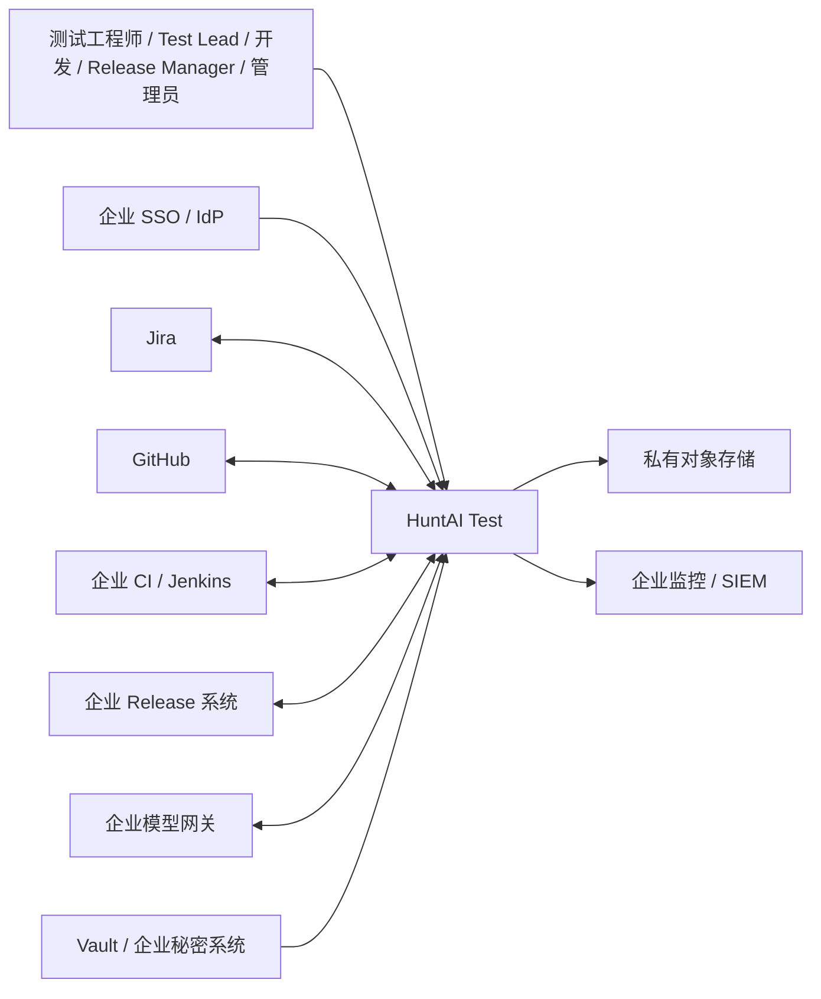
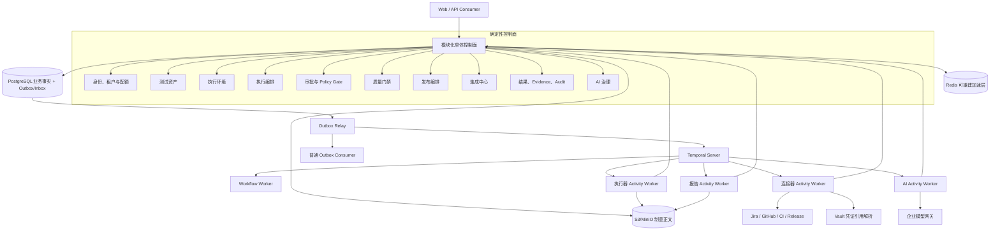

# HuntAI Test 后端集成架构

> - **Status: 已定稿**
> - **日期**：2026-08-27（2026-08-29 修订）
> - **阶段**：Stage 6 · 系统架构设计 · 后端集成架构正式产出
> - **文档定位**：把研究、领域、API/工作流、安全运维分册与 8 份 ADR 收口为一套唯一集成推荐；不是各分册的机械汇总
> - **决策纪律**：本文为 Stage 6 已定稿集成架构，后续阶段以本文为后端架构输入。ADR 0001（模块化单体控制面）与 ADR 0002（Temporal 持久工作流）为 **Accepted**；ADR 0003–0008 仍为 **Proposed**。架构选型不等于生产就绪或部署授权，文内 **Proposed** 冲突处置、生产 Gate 与 **TBD** 数值仍须各自批准或验证
> - **变更纪律**：修订本文必须先在 `docs/13_changes/change_log.md` 登记并获批准
> - **实现边界**：本文不包含代码、DDL、迁移、依赖变更或部署配置；本次仅按已登记批准新增 `execution_result=unknown` 结果值与基础设施 execution intent 状态，不新增领域对象或 ApprovalRequest 状态。技术栈、锁定版本与部署形态由同目录 [tech_stack_decision-v1.0.md](tech_stack_decision-v1.0.md) 承接（§2.3 非目标的对应缺口），本文只在 §15.1 登记其分期启用结论

## 1. 架构结论

HuntAI Test 采用 **模块化单体控制面 + Temporal 持久工作流 + 独立 Activity Worker**：控制面集中认证、租户、RBAC、Policy Gate、领域状态机、聚合事务、审批、门禁与审计裁决；Temporal Server 保存 workflow history、Timer、Signal 与 Task Queue 调度，Workflow Worker 只运行确定性编排；执行器、连接器、报告和 AI 作为隔离 Activity Worker，按已登记命令回写控制面。PostgreSQL 保存业务与一致性事实；Redis 仅作可重建的缓存、限流和短租约；S3/MinIO 保存大制品正文；Vault 保存秘密，业务库只保存引用。

这套推荐与企业内部、≤1000 用户的规模相称，同时满足治理面与执行面分离、平台执行器独立于 API、长等待可恢复以及故障重启不重复副作用的要求，依据见 [决策总纲](../README.md)（`../README.md:14`、`../README.md:44`、`../README.md:46`、`../README.md:336`）和 [PRD](../08_prd/prd.md)（`../08_prd/prd.md:118`、`../08_prd/prd.md:124`、`../08_prd/prd.md:269`）。模块与运行单元细化见 [领域与服务架构分册](01_domain_and_service_architecture.md)（`01_domain_and_service_architecture.md:45` 至 `01_domain_and_service_architecture.md:106`）。

用户已完成 Temporal 适配 POC，并于 2026-08-29 确认其符合本系统的长等待、Signal 与恢复需求，因此本架构接受 Temporal 作为持久工作流运行时。该事实只关闭“选择哪类运行时”的架构问题，不虚构尚未提供的 POC 测试数据，也不表示托管/自托管、Worker Versioning、容量、成本、RPO/RTO、生产部署和值班方案已经批准；生产 Gate 未通过时必须停止放量并以新 ADR 重评运行形态或替代方案。

## 2. 目标、范围与非目标

### 2.1 架构目标

1. **统一业务事实**：TestRun、ApprovalRequest、ExecutionEnvironment、ReleaseTask 与 GateEvaluation 的状态、资格和迁移只由后端领域命令裁决；前端、SSE、Worker、工作流引擎和外部系统只提供请求、提示或观察。[前后端边界](frontend_backend_boundary_spec-v1.0.md) 已明确后端权威性（`frontend_backend_boundary_spec-v1.0.md:13` 至 `frontend_backend_boundary_spec-v1.0.md:23`）。
2. **隔离治理与执行**：同步治理不被浏览器执行、压测、长轮询、大报告解析或 AI 调用拖垮；执行负载可独立扩缩和隔离。
3. **副作用可证明安全**：每次外部写都能追溯到 tenant、actor、工作流、参数哈希、审批或持续授权、外部请求 ID、结果与证据；重启、重试和重复投递不产生重复副作用。
4. **长流程可恢复**：审批等待、外部 CI 排队、持久轮询、停止信号和 Release 对账在进程故障后可继续；等待态持续可见、可告警、可人工取消。
5. **AI 受限而不控盘**：AI 只做理解、生成、聚类、解释和候选动作；权限、重试、幂等、审批、门禁和状态机由确定性平台控制。[决策总纲](../README.md) 的原则见 `../README.md:42` 至 `../README.md:49`。
6. **渐进演进**：先以模块化单体控制面降低分布式复杂度；只有稳定团队边界、独立 SLO/容量和成熟事件治理出现后才拆微服务。

### 2.2 范围

本文覆盖系统上下文、概念运行时拓扑、模块与 23 对象归属、核心状态与资格、C1–C4 数据流、API/异步/流式边界、审批与持续授权、一致性与恢复、数据存储、安全、SLO/容量、备份恢复、可观测、技术调研结论、ADR 摘要、风险、开放问题和验证计划。

### 2.3 非目标

- 不定义 endpoint、HTTP 错误码 schema、OpenAPI、分页协议或 SSE 帧格式；这些属于 Stage 7 API 契约。
- 不定义物理表、字段类型、索引、DDL、迁移、回填或事件总线产品。
- 不定义实例数、节点、集群、容器、网络、Secret 路径、环境变量或部署清单；下文图均为概念拓扑。
- 不替代 Jira、GitHub、Confluence、CI/CD 或 Release 系统，不做双向全量同步；平台只编排测试治理与质量证据。[PRD](../08_prd/prd.md) 的非目标见 `../08_prd/prd.md:66` 至 `../08_prd/prd.md:73`。
- 不把 Agent Mode 结果直接用于门禁或发布证据；轨迹人工固化为 Script 资产并执行确定性 run 后才恢复门禁资格。
- 除本次已登记批准的 `execution_result=unknown` 外，不新增第 24 个领域对象、业务状态、结果枚举或字段；后续改变上游模型的事项均须明确标为 **Proposed** 并走变更流程。

## 3. 输入追溯与事实优先级

### 3.1 已消费输入

本集成推荐实际消费以下分册与上游：

- [研究与输入追溯](00_research_and_input_traceability.md)：输入完整性、官方技术调研与 POC Gate；
- [领域与服务架构](01_domain_and_service_architecture.md)：模块、对象归属、事务、事件和恢复；
- [API、工作流与评审边界](02_api_workflow_and_review.md)：命令/查询、同步异步、SSE、审批与文件访问；
- [安全、可靠性与运维](03_security_reliability_and_operations.md)：信任边界、租户、数据、SLO、恢复与运维；
- [前端设计规范](frontend_design_spec-v1.0.md)：页面状态、TestRun/审批呈现和 SSE 消费边界；不作为后端技术选型事实源；
- [独立架构审查](04_architecture_review.md)：finding-first 审查与修订验收；审查结论不构成批准；
- [ADR 索引](adr/README.md) 与 [ADR 0001](adr/0001_modular_monolith_control_plane.md)、[0002](adr/0002_durable_workflow_runtime.md)、[0003](adr/0003_canonical_state_and_gate_semantics.md)、[0004](adr/0004_side_effect_approval_and_pre_authorization.md)、[0005](adr/0005_identity_tenancy_and_project_membership.md)、[0006](adr/0006_connector_idempotency_and_recovery.md)、[0007](adr/0007_data_artifact_and_audit_protection.md)、[0008](adr/0008_agent_langgraph_and_mcp_boundaries.md)；
- [问题模型](../03_problem_modeling/problem_model.md)、[C1](../04_interaction_design/chains/c1_north_star_quality_loop.md)、[C2](../04_interaction_design/chains/c2_approval_chain.md)、[C3](../04_interaction_design/chains/c3_execution_kickoff.md)、[C4](../04_interaction_design/chains/c4_failure_triage.md)、[PRD](../08_prd/prd.md)、[决策总纲](../README.md)、[Stage 6 README](README.md) 与 [前后端边界](frontend_backend_boundary_spec-v1.0.md)。

输入可复核性和限制沿用 [研究分册](00_research_and_input_traceability.md)：Stage 5 原型当前无可读文件，源仓库 references/competitors 未随迁，官方链接由 Lead 事先核对但本阶段没有二次联网验证（`00_research_and_input_traceability.md:66` 至 `00_research_and_input_traceability.md:78`）。这些缺口不被猜测补齐。

文内具体行号是审查时的定位快照，文件和章节链接才是长期权威引用；后续修订不得只维护行号而不核对被引语义。新引用优先使用章节名、ADR 编号或稳定契约 ID。

### 3.2 事实优先级

| 优先级 | 来源 | 本文使用规则 |
| --- | --- | --- |
| 1 | [问题模型](../03_problem_modeling/problem_model.md) | 23 对象、字段语义、状态集合、不变量与 CRUD 落点的最高事实源；见 `../03_problem_modeling/problem_model.md:14`、`../03_problem_modeling/problem_model.md:95`、`../03_problem_modeling/problem_model.md:108`。 |
| 2 | [C1–C4](../04_interaction_design/interaction_flows.md) | 页面流、跨对象时序、异常与证据落点；与问题模型冲突时服从问题模型。 |
| 3 | [前后端边界](frontend_backend_boundary_spec-v1.0.md) | 后端权威、成功判定、错误与外部访问边界；见 `frontend_backend_boundary_spec-v1.0.md:17` 至 `frontend_backend_boundary_spec-v1.0.md:23`。 |
| 4 | [决策总纲](../README.md) | 产品原则、治理/执行分离、技术路线和安全基线。 |
| 5 | [PRD](../08_prd/prd.md) | 需求、验收、SLO 假设和里程碑；其自身仍是中期版，见 `../08_prd/prd.md:3` 至 `../08_prd/prd.md:5`。 |
| 6 | Stage 6 四分册与 8 ADR | 四分册仍为 Draft 支撑材料；ADR 0001/0002 为 Accepted，0003–0008 为 Proposed。不得把其余 Proposed/TBD 或生产 Gate 反向提升为已批准实现事实。 |

冲突处理规则是：先保持高优先级模型可兼容运行，再登记 Proposed 变更、替代与验证；不以实现便利静默修改冻结资产。

## 4. 推荐架构与微服务替代

### 4.1 唯一推荐：模块化单体控制面 + 独立 Worker

**已定稿推荐**采用一个逻辑控制面、Temporal Server、Workflow Worker 和四类隔离 Activity Worker：

| 运行单元 | 职责 | 禁止 |
| --- | --- | --- |
| 模块化单体控制面 | 认证/tenant/RBAC、同步命令与查询、Policy Gate、状态机、聚合事务、审批、门禁、Outbox、工作台投影 | 执行浏览器或压测、长轮询、大报告解析、模型厂商直连 |
| Temporal Server | workflow history、Timer、Signal、Task Queue 调度与持久恢复 | 作为 TestRun/ApprovalRequest 等领域事实源 |
| Workflow Worker | 运行确定性 Workflow，编排长等待、轮询、恢复和补偿 | 直接执行网络/数据库 I/O；用引擎状态替代领域状态 |
| 执行器 Activity Worker | API/Web/性能确定性执行和受限 Agent 执行；心跳、停止、制品上传 | 拥有审批、门禁或业务终态裁决权 |
| 连接器 Activity Worker | Jira/GitHub/CI/Release I/O，webhook 规范化、轮询、幂等、对账与补偿 | 让外部回调直接改 TestRun/ReleaseTask/GateEvaluation |
| 报告 Activity Worker | 分片解析、归一化、脱敏、partial 显式、结果写入命令 | 在 API 进程解析大报告；自行判门禁 |
| AI Activity Worker | A1–A8、结构化校验、fallback、AIInvocationLog、Evidence 引用校验 | 决定权限、审批、业务重试、幂等、状态机或外部写 |

Worker 回写的唯一业务路径是已登记命令，跨模块通知只使用已登记事件；模块之间通过 ID、不可变快照、查询接口和事件协作，不共享仓储或 ORM 实体。Workflow 不执行网络/数据库 I/O，只调度 Activity。该规则承接 [领域分册](01_domain_and_service_architecture.md) 和 [Accepted ADR 0001](adr/0001_modular_monolith_control_plane.md)。

### 4.2 为什么不立即微服务化

微服务不是当前推荐，因为紧密相关的状态机、审批、门禁、租户和证据规则仍在冲突收口期；立即拆分会把本地事务变成分布式事务，并提前引入事件版本、跨服务授权、故障定位和运维成本。模块化单体能在一个事务数据库内保持聚合不变量，同时让高负载 Worker 独立扩缩。

**微服务替代方案**仅在以下条件同时出现时重评：

1. 模块有稳定团队 Owner 和独立发布节奏；
2. 容量或故障域已证明需要独立 SLO；
3. 公开命令/查询/事件接口稳定并有契约测试；
4. Outbox/Inbox、事件版本、跨服务追踪和恢复演练成熟；
5. 拆分收益由实测容量、组织或隔离需求驱动，而非仅因模块数量增加。

替代方案及代价见 [领域分册](01_domain_and_service_architecture.md)（`01_domain_and_service_architecture.md:99` 至 `01_domain_and_service_architecture.md:106`）。单进程把 API 与全部任务混跑不作为可接受替代，因为它直接违背执行隔离和恢复要求。

## 5. 系统上下文与概念运行时拓扑

### 5.1 系统上下文

HuntAI Test 是测试治理、质量证据和受控副作用的编排层，不是 Jira、CI 或 Release 的替代品。特别是生产发布执行权始终留在企业 Release 系统；平台只准备 release item，见 [决策总纲](../README.md)（`../README.md:235` 至 `../README.md:258`）。

### 5.2 概念运行时拓扑

控制面事务只提交业务事实与 Outbox；relay 以 event_id 和确定性 workflow_id 幂等 Start/Signal Temporal。外部回调先验签、去重、归属校验并落 Inbox/ExternalObservation，再经 Outbox Signal；Temporal 不可用时保留 Outbox 待重放。单步、可重建且无需 Timer/Signal 的通知或投影可走普通 Consumer；同一业务步骤只能有一个调度 Owner。该图不规定实例数、网络、容器、集群、托管方式或部署位置。

## 6. 模块职责与 23 对象归属摘要

23 对象总数以 [问题模型](../03_problem_modeling/problem_model.md) 为唯一口径（`../03_problem_modeling/problem_model.md:14` 至 `../03_problem_modeling/problem_model.md:40`）。ACTION_TARGET、JOB_CONTRACT、PROJECT_MEMBER、TEST_CASE_VERSION、STEP_RUN、ARTIFACT 等从属结构不另计数，见 `../03_problem_modeling/problem_model.md:102`。

| 模块 | 拥有的对象（按 23 对象口径） | 关键职责与写边界 |
| --- | --- | --- |
| 身份、租户与配额 | 1 Organization；2 User / ProjectMember；3 Project；21 OrgQuota | 建立可信 tenant、平台角色授权、Jira 项目镜像和 CAS 配额账本；不得让 Jira 同步直接覆盖本地角色 |
| 测试资产 | 5 TestCase(+Version)；6 TestPlan；16 PerfBaseline | 版本化测试意图、评审、计划与唯一活跃性能基线；AI 草稿不得直达 ACTIVE |
| 执行环境 | 4 ExecutionEnvironment | 平台执行器/外部 CI 注册、Job Contract、健康与新 run 资格；凭证只保存引用 |
| 执行编排 | 7 TestRun | 统一 10 态、冻结 snapshot、心跳、停止、等待、恢复和终态吸收 |
| 结果、证据与审计 | 8 CaseResult / StepRun / Artifact；9 FailureCluster；10 EvidenceObject；13 AuditEvent | 分片结果、分诊、稳定证据关系和 append-only 审计；不得推进 TestRun 或修改 Gate 结论 |
| 审批与策略 | 11 ApprovalRequest | Preview、Policy Gate 联动、九要素、四眼、param_hash、TTL、行锁单次消费 |
| 质量门禁 | 22 QualityGatePolicy；23 GateEvaluation | 版本化策略、资格判断和不可变评估；策略修改不得改写历史 |
| 发布编排 | 17 ReleaseTask | Jira 范围快照、证据汇聚、Readiness 与 prepare 生命周期；不执行生产发布 |
| 集成中心 | 18 ApiToken；19 Connector | 外部契约、凭证引用、webhook、轮询、幂等、ETag、补偿与健康 |
| AI 治理与助手 | 12 AIInvocationLog；14 Skill(+SkillVersion)；15 ModelRoute；20 CopilotSession | 模型唯一出口、技能版本、路由、会话、成本和质量归因；不得直写其他模块模型 |

完整逐对象聚合角色与跨模块消费见 [领域分册](01_domain_and_service_architecture.md)（`01_domain_and_service_architecture.md:155` 至 `01_domain_and_service_architecture.md:198`）。每个可变聚合使用版本前置条件；EvidenceObject、AuditEvent、AIInvocationLog、GateEvaluation、已发布 SkillVersion 和 TestCaseVersion 不原地覆盖（`01_domain_and_service_architecture.md:200` 至 `01_domain_and_service_architecture.md:207`）。

## 7. 核心领域模型、状态与资格

### 7.1 TestRun

权威状态集合为：`PENDING / VALIDATING / RUNNING / WAITING_EXTERNAL / WAITING_APPROVAL / STOPPING / SUCCEEDED / FAILED / CANCELLED / TIMEOUT`；终态为 SUCCEEDED、FAILED、CANCELLED、TIMEOUT。状态含义与迁移以 [问题模型](../03_problem_modeling/problem_model.md) 的机器可校验契约为唯一来源（`../03_problem_modeling/problem_model.md:139` 至 `../03_problem_modeling/problem_model.md:186`）。**本文不再手写或维护固定边数**，避免既有文档的计数和语义漂移。

- PENDING 只受理并冻结 snapshot；VALIDATING 执行 Job Schema、双层变量和 Job 存在性校验。
- RUNNING 与 STOPPING 是活跃态，必须有心跳；失联分别收敛到 TIMEOUT，不能永久运行或永久停止中。
- WAITING_EXTERNAL 与 WAITING_APPROVAL 是持久等待态，不受心跳回收；必须持续可见、显示滞留时长、告警并允许人工取消。
- **审批过期兼容结论**：ApprovalRequest 进入 EXPIRED，关联 TestRun **保持 WAITING_APPROVAL**；不自动放行，也不自动转 CANCELLED。重新提交产生新审批，或由人工取消。该行为是最高优先级模型的现行兼容语义，不标 Proposed，依据 `../03_problem_modeling/problem_model.md:178`、`../03_problem_modeling/problem_model.md:184`、`../03_problem_modeling/problem_model.md:207`。
- 终态吸收；迟到观察不得重开 run。CANCELLED/TIMEOUT 已产生的结果仍可归一化、分诊和追加 Evidence。

### 7.2 ApprovalRequest

状态集合为 `CREATED / PENDING / APPROVED / EXECUTED / REJECTED / EXPIRED`。`APPROVED` 只表示人已批准；`EXECUTED` 表示已尝试执行，结果由 `execution_result=ok/failed/unknown` 表达已确认成功、已确认失败或当前不可判定。四眼、param_hash、TTL、失效和一次消费依据见 [问题模型](../03_problem_modeling/problem_model.md)（`../03_problem_modeling/problem_model.md:188` 至 `../03_problem_modeling/problem_model.md:220`）。

资格与不变量：

1. 只有 Policy Gate 返回 REQUIRE_APPROVAL 才创建；九要素、候选审批人、TTL 和 param_hash 缺一则不入队。
2. approver 不得等于 initiator；创建、批准和消费前都复核。
3. 审批前 Preview 的完整参数与目标语义绑定 param_hash；消费前重算，同时重校验 tenant、当前权限、目标版本、持续授权和 kill switch。
4. APPROVED 的消费必须使用数据库行锁，并在同一事务原子创建以 `approval_request_id + bound_hash` 唯一标识的基础设施执行意图与 Outbox；重复消费返回同一执行引用。执行意图不是第 24 个领域对象，也不使 ApprovalRequest 提前进入 EXECUTED。
5. 过期、撤回、上游取消和参数失效进入 EXPIRED，不复用旧批准；修改后重提是新请求、新 TTL、新 initiator 和新哈希。
6. execution intent 至少区分 `READY / CLAIMED / DISPATCHING / CONFIRMED_OK / CONFIRMED_FAILED / UNKNOWN / ABANDONED`。Worker 在网络调用前持久化 DISPATCHING，使用稳定幂等键执行；首次真实调用已发出后，经控制面命令写 `EXECUTED + execution_result=ok/failed/unknown`。
7. READY/CLAIMED 崩溃可重新领取；DISPATCHING/UNKNOWN 或结果落账前崩溃必须先查询 external_request_id/幂等结果。可确认时收敛 ok/failed，暂不可判定时保持 unknown；unknown 不得按失败盲重试或按成功放行。若提供方既不支持幂等创建也不能查询请求结果，必须 fail-close 并转人工接管。
8. 只有 execution_result=ok 可触发目标聚合的成功迁移；failed/unknown 均不得自动推进 TestRun、ReleaseTask 或 ExecutionEnvironment。具体失败收敛若不在现有状态边内，保持当前 fail-closed 状态并由显式人工命令处置，直至上游状态模型另行批准。

### 7.3 ExecutionEnvironment

现行状态是 `PENDING_APPROVAL / ACTIVE / DEGRADED / DISABLED`，现行模型只明确注册激活、降级和停用；DEGRADED/DISABLED 只阻止新 run，不强杀在途 RUNNING/WAITING_EXTERNAL，依据 `../03_problem_modeling/problem_model.md:223` 至 `../03_problem_modeling/problem_model.md:235`。

- 新 run 资格：环境必须 ACTIVE，模式×环境组合合法，健康、容量、Job 存在性和参数契约在受理时复核。
- **Proposed 恢复边**：`DEGRADED → ACTIVE` 在连续健康检查满足恢复条件后发生；`DISABLED → PENDING_APPROVAL` 用于重新启用或配置变化后重新审批。恢复阈值保持 TBD。
- 在 Proposed 恢复边获上游批准前，禁止后台改库或把建议边当作已存在状态迁移。替代方案是配置未变时 `DISABLED → ACTIVE` 的管理员恢复，但仍需 L3 再认证/审批记录；该替代同样未获批准。冲突详见 [领域分册](01_domain_and_service_architecture.md)（`01_domain_and_service_architecture.md:601` 至 `01_domain_and_service_architecture.md:607`）。

### 7.4 ReleaseTask

状态集合为 `DRAFT / PENDING_CONFIRM / SUBMITTED / READY / FAILED_RETRYABLE / CANCELLED`，语义以 [问题模型](../03_problem_modeling/problem_model.md)（`../03_problem_modeling/problem_model.md:255` 至 `../03_problem_modeling/problem_model.md:268`）为准：

- DRAFT 创建时冻结 Jira 范围；证据、Readiness 与 A5 草稿就绪后进入 PENDING_CONFIRM。
- 审批后 prepare 请求进入 SUBMITTED；外部 item 成功进入 READY；失败进入 FAILED_RETRYABLE，人工幂等重试或取消。
- READY 只表示 release item 已准备完成，不表示生产发布已执行。
- CANCELLED 是吸收终态；迟到 READY 只记录外部状态分叉和人工对账，不覆盖取消。
- **Proposed 冲突处置**：`release_push` 沿用问题模型的 **L4 风险域**，平台仅允许 prepare item，要求再认证、四眼、param_hash 和幂等；任何“执行生产发布”的动作不存在或恒 DENY。C1 的 L3 旧表述不作为实现依据。冲突证据见 `../04_interaction_design/chains/c1_north_star_quality_loop.md:278` 与 `../03_problem_modeling/problem_model.md:220`。

### 7.5 QualityGatePolicy 与 GateEvaluation

QualityGatePolicy 是版本化策略；GateEvaluation 是包含 policy_snapshot 的不可变评估事实，结果现有枚举仅 `pass / fail / waived`，重评估新建记录，不改历史，依据 `../03_problem_modeling/problem_model.md:252` 至 `../03_problem_modeling/problem_model.md:253`。

资格规则：

- execution_source 为 script/external_ci，TestRun 为 SUCCEEDED/FAILED，归一化完整且策略可评估时，可生成 pass/fail；获批豁免按现有不可变关联/新评估语义表达。
- execution_source=agent 永不生成 GateEvaluation。
- CANCELLED、TIMEOUT、阈值缺配或报告 partial 不得默认 pass。
- **当前兼容行为**：上游尚未批准 `not_evaluated` 前，使用“**无 GateEvaluation + 查询投影明确 reason**”表达不可评估；Release 汇聚直接读取 TestRun 终态、结果完整性和缺配原因。
- **Proposed 上游变更**：未来可新增 `not_evaluated + reason`，以不可变事实区分尚未评估与评估后不可判定；在正式变更前不得写入不存在的枚举。该处置见 [Proposed ADR 0003](adr/0003_canonical_state_and_gate_semantics.md)（`adr/0003_canonical_state_and_gate_semantics.md:12` 至 `adr/0003_canonical_state_and_gate_semantics.md:20`）。

## 8. C1–C4 集成数据流

### 8.1 C1 北极星质量闭环

1. 测试资产模块接收 OpenAPI/Postman/curl；AI Activity Worker 生成默认不落库草稿并记录 AIInvocationLog；人工保存后才创建 TestCase DRAFT。
2. TestCase 经 DRAFT→PENDING_REVIEW→ACTIVE；执行编排读取已批准版本、ACTIVE 环境和配额，创建 TestRun 并冻结 snapshot。
3. Script×平台执行器、Script×外部 CI 和 Agent×平台执行器归一到 TestRun；Agent 结果不进门禁。
4. 报告 Activity Worker 分片归一化，结果模块产生 CaseResult/Artifact；C4 生成 FailureCluster 与 Evidence。
5. 合格 run 进入门禁，生成不可变 GateEvaluation；GitHub Check Run 同步失败不回滚门禁事实。
6. Jira 缺陷经 C2 审批后由连接器幂等创建；ReleaseTask 汇聚范围、门禁、性能和缺陷证据，只 prepare 外部 item。
7. EvidenceObject 与 AuditEvent 贯穿全链；M0–M3 以证据包导出承接知识回流，不擅自实现 M4 Confluence/RAG。

原始时序与证据主线见 [C1](../04_interaction_design/chains/c1_north_star_quality_loop.md)（`../04_interaction_design/chains/c1_north_star_quality_loop.md:70` 至 `../04_interaction_design/chains/c1_north_star_quality_loop.md:155`、`../04_interaction_design/chains/c1_north_star_quality_loop.md:285` 至 `../04_interaction_design/chains/c1_north_star_quality_loop.md:300`）。

### 8.2 C2 审批链

Preview → Policy Gate → ApprovalRequest CREATED/PENDING → 批准/拒绝/过期 → 消费前哈希、权限和版本复核 → 行锁单次消费 → 外部动作/资产变更 → execution_result、AuditEvent 与 Evidence。TTL 只管理审批，不管理 TestRun 心跳；过期保持 WAITING_APPROVAL。原始行锁与主时序见 [C2](../04_interaction_design/chains/c2_approval_chain.md)（`../04_interaction_design/chains/c2_approval_chain.md:106` 至 `../04_interaction_design/chains/c2_approval_chain.md:143`、`../04_interaction_design/chains/c2_approval_chain.md:176` 至 `../04_interaction_design/chains/c2_approval_chain.md:182`）。

### 8.3 C3 执行发起链

manual/schedule/ci_webhook/api_token 统一归一为受理命令；PENDING 冻结 snapshot，VALIDATING 完成权威校验。平台执行器消费不可变快照；外部 CI 以幂等键触发并由 webhook+持久轮询双通道观察；Agent 每步经过 Tool Router 与 Policy Gate。终态事件触发 C4 与门禁，但 CANCELLED/TIMEOUT 的迟到结果不得重开 run。模式矩阵与外部 CI/Agent 时序见 [C3](../04_interaction_design/chains/c3_execution_kickoff.md)（`../04_interaction_design/chains/c3_execution_kickoff.md:38` 至 `../04_interaction_design/chains/c3_execution_kickoff.md:45`、`../04_interaction_design/chains/c3_execution_kickoff.md:171` 至 `../04_interaction_design/chains/c3_execution_kickoff.md:261`）。

### 8.4 C4 失败分诊链

报告先确定性归一化和脱敏，再运行受限 A2；Schema/evidence_refs 失败走显式 fallback，AI 故障不阻塞报告。FailureCluster 人工修正留痕。jira_write 与 heal_apply 从终态 run 发起 ApprovalRequest，不把 TestRun 改回 WAITING_APPROVAL。副作用与证据时序见 [C4](../04_interaction_design/chains/c4_failure_triage.md)（`../04_interaction_design/chains/c4_failure_triage.md:67` 至 `../04_interaction_design/chains/c4_failure_triage.md:143`）。

**heal_apply 集成处置**：批准后消费时锁 ApprovalRequest，对 TestCase current_version 做 CAS；版本一致才在资产事务中创建真正 rollback snapshot，随后写新 Version 并切换指针。快照、写版本或 CAS 任一步失败都 fail-close，资产保持原状，ApprovalRequest 记录 `EXECUTED + failed`，再次尝试需新审批。该方案解决 C2“审批前快照”与 C4“批准后快照”的冲突，且不新增字段；对照 `../04_interaction_design/chains/c2_approval_chain.md:32`、`../04_interaction_design/chains/c2_approval_chain.md:45` 与 `../04_interaction_design/chains/c4_failure_triage.md:115` 至 `../04_interaction_design/chains/c4_failure_triage.md:123`。

## 9. API、同步/异步、SSE 与外部观察原则

### 9.1 API 语义

- **查询**只读，每次执行认证、tenant 和 RBAC；返回当前快照与版本语义，不触发隐式外部写或状态迁移。
- **命令**表达改变状态或产生副作用；入口重校验身份、tenant、权限、当前态、版本和幂等，受理与完成分离。
- API 面向既有领域资源，不引入“万能工作流对象”替代 TestRun/ApprovalRequest/ReleaseTask；普通后台处理可使用操作回执，但若需要新增持久通用任务对象，必须另走建模评审。
- param_hash、资源版本/ETag、幂等键和 ApprovalRequest 行锁分别解决参数篡改、并发覆盖、重复受理和双消费，不能互相替代。
- 网络结果未决先 GET 对账；前端不得因按钮成功、超时或断线自行推演结果。

详细命令/查询原则见 [API 分册](02_api_workflow_and_review.md)（`02_api_workflow_and_review.md:87` 至 `02_api_workflow_and_review.md:119`、`02_api_workflow_and_review.md:160` 至 `02_api_workflow_and_review.md:195`）。

### 9.2 同步与异步

- 短事务、无长外部依赖、无需持续进度的配置和审批决策可同步完成。
- TestRun、取消、AI、外部 CI、报告解析、大文件、导入导出、Release prepare 和通知采用“同步校验/受理 + 异步完成”。
- 异步不是 HITL 触发条件；只有 Policy Gate 判断为 L2+ 且没有有效持续授权时才进入审批。
- Worker 使用冻结输入引用，在实际执行点再次验证权限、审批/持续授权、资源版本和 kill switch。
- partial/failed/degraded 必须显式，不能把部分成功包装成完成。

矩阵见 `02_api_workflow_and_review.md:247` 至 `02_api_workflow_and_review.md:289`。

### 9.3 SSE

SSE 只负责展示进度和变化提示，不是命令通道、业务事实源或状态机：首次 GET 后订阅；关键状态、终态、重连、版本跳跃或网络恢复后 GET 对账；SSE 与 GET 冲突时以 GET 为准。服务端事件 ID 只用于续传和缺口检测，不作为业务版本或幂等键；保留窗口外明确要求全量对账。连续失败后降级轮询，不能因断流把 TestRun 判 FAILED/TIMEOUT 或把审批判 EXPIRED。该原则见 `02_api_workflow_and_review.md:335` 至 `02_api_workflow_and_review.md:381`。

### 9.4 Webhook + 轮询

Webhook 是低延迟观察，必须验签、归属校验和去重；持久轮询是可靠性兜底。两者统一归一为外部观察，先到且版本更新者可触发领域命令，重复/同版本忽略，迟到/较旧者只对账和审计。轮询游标持久化；任一通道都不能直接改平台状态机。原则见 `02_api_workflow_and_review.md:385` 至 `02_api_workflow_and_review.md:412`。

## 10. 审批、人工介入与持续授权

### 10.1 Policy Gate 基线

所有 Connector Action、Skill 和 Agent 工具必须声明 L0–L4；未声明或白名单外目标默认 DENY。L0 默认可允许，L1 可允许但可追溯，L2/L3 默认审批，L3+ 按会话新鲜度/资源要求先再认证；L4 实际生产发布、删除等动作 DENY 或只生成草稿。Policy Gate 四值与要求见 [PRD](../08_prd/prd.md)（`../08_prd/prd.md:101`、`../08_prd/prd.md:107` 至 `../08_prd/prd.md:111`）。

### 10.2 人工介入点

人工介入至少包括：审批/拒绝、等待 run 取消、审批重新提交、TIMEOUT 后新 run 重跑、报告 partial 处理、FailureCluster 修正、环境/连接器停用、Check Run 重推、Release prepare 重试/取消/对账、heal rollback、证据包导出和 kill switch 恢复。所有介入使用显式命令，带 actor、reason、目标版本、证据引用并写 AuditEvent；禁止后台直接改数据。

### 10.3 L2 系统动作的作用域化持续授权

**Proposed 集成处置**：外部 CI trigger、GitHub Check Run 等合格 L2 系统动作不逐次创建 ApprovalRequest，而由注册审批形成**作用域化持续授权**；它作为 Connector/ExecutionEnvironment 的版本化治理元数据承接，不暗增第 24 个对象。scope 至少绑定 tenant、project、connector action、目标资源、触发来源、最大等级、配置版本、有效期和撤销状态。每次动作仍经过 Policy Gate，并关联原批准和当前授权版本写审计。

持续授权不是永久豁免：请求入口、队列消费、工作流恢复、Connector 调用和 Tool 调用都复核当前成员、职能资格、scope、参数、有效期、撤销和 kill switch。具体合格动作、有效期和撤销 SLA 均为 TBD；未获批准前不得把它实现成隐藏绕过审批的通道。冲突、替代和影响见 [Proposed ADR 0004](adr/0004_side_effect_approval_and_pre_authorization.md)（`adr/0004_side_effect_approval_and_pre_authorization.md:12` 至 `adr/0004_side_effect_approval_and_pre_authorization.md:21`）。

## 11. 事务、消息、并发与恢复

### 11.1 事务边界

- 聚合内强一致使用单个 PostgreSQL 本地事务；事务只写本模块私有数据、Audit append 请求和 Outbox。
- 不使用跨进程分布式事务；但同进程模块协作不机械地全部消息化，按下表选择一致性机制。
- 远程调用不放进数据库事务，不持有数据库锁等待 Jira/CI/Release。
- 大结果按稳定 chunk key 分片提交，不与 TestRun 放在一个超大事务；TestRun 只保存完成/失败摘要和引用。

| 场景 | 机制 | 边界 |
| --- | --- | --- |
| 单聚合写入 | 模块私有 PostgreSQL 本地事务 | 业务事实、Audit append 请求与 Outbox 同事务 |
| 同进程只读/无独立生命周期校验 | 公开查询或领域端口同步调用 | 不共享 ORM 实体和私有仓储 |
| 提交后通知、投影、单步可重建任务 | Outbox + Inbox/幂等 Consumer | 不需要 Timer、Signal 或多步补偿 |
| 长等待、取消、轮询、多步补偿 | Outbox relay + Temporal Workflow/Activity | workflow_id/event_id 去重；PostgreSQL 为业务权威 |
| 跨模块独立聚合变更 | 已登记命令 + Outbox，必要时 Temporal saga | 显式中间态、补偿与人工接管 |

### 11.2 Outbox / Inbox

聚合事实与 Outbox 同事务提交；发布至少一次。消费者以 event_id 在 Inbox 去重，并将 Inbox 记录和自身业务写放在同一事务；崩溃后重复投递返回已有结果。需要持久编排时，relay 以 event_id 与确定性 workflow_id 幂等 Start/Signal Temporal；外部回调先落 Inbox/ExternalObservation 再 Signal。事件只陈述已提交事实，敏感正文不进总线或 workflow history，只传稳定引用与 classification。普通 Consumer 与 Temporal Activity 都按至少一次设计，同一业务步骤只能登记一个调度 Owner。

### 11.3 幂等、CAS 与行锁

- 受理幂等 scope 为 tenant + command/action type + idempotency key，并保存请求哈希与结果引用；同 key 同 hash 返回已有结果，同 key 异 hash 拒绝冲突。
- 外部写保存稳定幂等键、external_request_id、目标版本和响应摘要；未知结果先查询，确认不存在才重试。
- TestRun、TestCase current_version、ExecutionEnvironment、ReleaseTask、OrgQuota 和配置发布指针使用 expected_version/CAS；每次更新同时校验当前态、版本和不变量。
- ApprovalRequest 消费必须数据库行锁；锁内原子创建 READY execution intent 和 Outbox，不做远程调用，也不提前写 EXECUTED。重复 consume、Outbox/Activity 重投与 Worker 重领都复用同一意图。
- Worker 在网络调用前持久化 DISPATCHING；首次真实调用后才写 EXECUTED。确定结果进入 ok/failed；响应丢失或落账前崩溃进入/恢复为 unknown 并先按 external_request_id/幂等键查询，不得创建第二个意图。人工重提使用新 ApprovalRequest，不能复用旧意图授权新参数。
- 外部 ETag/版本在 Preview、审批绑定和执行前重读比较；冲突使旧动作 fail-close。

### 11.4 失败恢复与补偿

- 控制面重启：从 PostgreSQL 与 Outbox 恢复，未发布事件重发；不得直接补启第二条 workflow。
- Temporal/Worker 重启：从 workflow history 与 Task Queue 恢复，重复 Activity/命令安全；不能重新执行已确认副作用。
- Approval 执行：READY/CLAIMED 崩溃重新领取同一意图；DISPATCHING/UNKNOWN 先查询；Outbox/Activity 重投只唤醒同一意图。无法幂等创建且无法查询结果的外部动作保持 EXECUTED+unknown 并转人工接管。
- 外部 CI 未知结果：按幂等键/external_request_id 查询；webhook 丢失由持久轮询兜底。
- 执行器失联：RUNNING/STOPPING 按心跳收敛 TIMEOUT；不自动重跑 Agent 或压测。
- 审批过期：EXPIRED，run 保持 WAITING_APPROVAL，人工重提或取消。
- heal_apply 快照/CAS 失败：资产不变、EXECUTED failed、重新审批。
- Jira/Release：按连接器契约查询后重试；补偿是显式业务动作，不是假装远程事务回滚；Jira 不自动删除，Release 不执行生产发布。
- AI 网关失败：规则 fallback 或能力置灰；执行、报告、门禁和证据主链继续。

详细矩阵见 `01_domain_and_service_architecture.md:491` 至 `01_domain_and_service_architecture.md:514`。

### 11.5 迟到与乱序

- 终态 TestRun 收到旧 RUNNING 或外部成功：不重开；允许追加 late 结果、Artifact/Evidence。
- EXPIRED/REJECTED 审批收到执行命令：拒绝。
- GateEvaluation 后补结果：不改历史；显式重评估新建记录。
- ReleaseTask CANCELLED 后收到 READY：保持取消，记录 divergence、外部引用和人工对账。
- 旧 Connector 配置版本回调：按绑定版本解析，不能用新配置猜测旧 payload。

终态、版本和 external revision 共同防止状态倒退；规则见 `01_domain_and_service_architecture.md:477` 至 `01_domain_and_service_architecture.md:489`。

## 12. PostgreSQL、Redis、S3 与 Vault 边界

| 数据面 | 权威职责 | 明确禁止 |
| --- | --- | --- |
| PostgreSQL | 23 对象事务事实、状态机、聚合版本、审批/行锁、幂等、Outbox/Inbox、审计/证据元数据；pgvector 可作为内部规模下的起步检索能力 | 用 SQLite 承担并发审批、多租户安全、恢复或工作流 POC Gate；让共享数据库等于共享仓储 |
| Redis | 可重建缓存、网关/应用限流辅助、短租约和调度提示 | 作为审批、工作流、终止信号、授权、配额账本或幂等记录的唯一事实源 |
| S3/MinIO | 报告、截图、视频、Trace、日志原件、脚本、导出和证据包正文；私有对象、摘要、来源、分类与生命周期 | 公共 bucket；数据库保存大二进制；Evidence 保存短期预签名 URL |
| Vault/企业秘密系统 | Connector、CI、Webhook、对象存储、模型网关等秘密；运行时以工作负载身份获取短期凭证 | 在数据库、配置、队列、日志、Trace、Prompt、Artifact 或前端存秘密明文 |

PostgreSQL/Redis/S3 的上游分工见 `../08_prd/prd.md:218` 至 `../08_prd/prd.md:223`；Vault 与对象保护见 [Proposed ADR 0007](adr/0007_data_artifact_and_audit_protection.md)（`adr/0007_data_artifact_and_audit_protection.md:12` 至 `adr/0007_data_artifact_and_audit_protection.md:22`）。PostgreSQL RLS 只作为 Proposed 纵深防御，不替代应用层 tenant 过滤，见 `03_security_reliability_and_operations.md:110` 至 `03_security_reliability_and_operations.md:121`。

## 13. 认证、租户、文件、分类与 AI 安全

### 13.1 认证与 ProjectMember 权威

OIDC Authorization Code + PKCE 是主认证候选，浏览器只持安全、可吊销的服务端会话；LDAP 在无 OIDC 能力时作为兼容候选，优先经企业身份代理。IdP、claim、MFA、JIT/预配、会话时长和禁用传播仍为 TBD，不能当作定稿选型。

**Proposed 权威拆分**：IdP/目录是 User 身份、账号启停和认证强度的权威；Jira 是 Project/Jira 元数据的只读镜像来源；HuntAI Test 是 ProjectMember 的 `owner/admin/tester/viewer` 本地角色授权权威。Jira 用户/组只能作为候选映射输入，不得由同步或 webhook 静默覆盖本地授权。该处置解决“Jira 同步成员”与问题模型 ProjectMember CRUD 的冲突，见 `../README.md:317`、`../03_problem_modeling/problem_model.md:276` 和 [Proposed ADR 0005](adr/0005_identity_tenancy_and_project_membership.md)（`adr/0005_identity_tenancy_and_project_membership.md:12` 至 `adr/0005_identity_tenancy_and_project_membership.md:21`）。

### 13.2 全层租户与持续鉴权

可信 tenant 只由服务端会话、ApiToken 与资源归属建立；客户端 tenant/角色不可信。API、ORM、Worker、队列、缓存、对象存储、向量检索、AI、Evidence、Audit、导出和恢复路径都必须带 tenant scope；无上下文拒绝。跨租户或不可感知对象统一返回“资源不存在”语义，不泄露存在性。长流程在入口、恢复、审批消费、Connector/Tool 调用和制品授权时读取当前权限，不沿用旧角色快照。

### 13.3 文件与 Artifact

所有上传、外部 CI Artifact、附件、报告、日志和生成脚本均是不可信输入，经过隔离、扩展名/MIME/magic bytes、大小与解压预算、路径安全、恶意文件扫描、checksum、脱敏和准入后才能消费。对象 key 由服务端生成，默认私有。

**已定稿访问形态**为混合模式：大文件在后端授权后使用短期、单对象、只读预签名访问；Restricted 或高审计内容走后端代理、隔离查看或禁止导出。Artifact/Evidence 引用本身不是访问授权，每次访问重校验 tenant、project、RBAC、classification、保留和 Legal Hold。具体 TTL、扫描器、下载次数和保留期均 TBD，不能把 PRD 的 90 天假设写成默认值。依据见 `02_api_workflow_and_review.md:595` 至 `02_api_workflow_and_review.md:631`。

### 13.4 数据分类与模型出站

采用 Public/Internal/Confidential/Restricted 四级分类，输入、证据、历史上下文和工具结果取最高等级；分类缺失按 Confidential fail-close。Confidential 禁缓存并最小化/脱敏；Restricted 默认禁止模型出站，只允许经批准本地模型或拒绝处理。所有 chat/structured/embed 经 ModelRoute/LLM 工厂唯一出口并写 AIInvocationLog；业务模块和 Skill 不得直连厂商 SDK。

Jira、PR、Confluence、日志、网页 DOM、文件和未来 MCP 描述/结果全部是不可信内容。System/Policy/Skill/User/Document 分层；工具名、参数、URL 和资源 ID 只接受服务端注册 schema，随后经过 tenant/RBAC、Tool Router、Policy Gate、数据分级和审计。模型声称“已获批准”不构成授权。安全依据见 `03_security_reliability_and_operations.md:185` 至 `03_security_reliability_and_operations.md:215`。

## 14. SLO、容量、备份恢复、可观测与运维

### 14.1 SLO 与容量假设

下列数值来自当前 PRD，仍是假设或 TBD，不是部署默认；本文定稿不把这些数值提升为生产 SLO：

| 指标 | 当前目标/假设 | 成熟度 |
| --- | --- | --- |
| 只读 API | P95 < 1s（不含模型） | PRD 假设 SLO |
| AI 流式生成 | 首 token P95 ≤3s | PRD 假设 SLO，依赖企业模型网关 |
| A2 分诊 | 10k 用例级 run 完成后 ≤5 分钟 | PRD 假设 SLO |
| Check Run 回写 | CI 结束后 ≤2 分钟 | PRD 假设 SLO |
| 报告解析 | ≥1000 用例结果/分钟 | PRD 容量假设 |
| 用户规模 | 1000 注册、约 200 DAU | 假设，M0 校准 |
| 执行并发 | 接口 50 run；UI 8 slot TBD；压测全局并发 TBD | 假设/TBD |

来源见 `../08_prd/prd.md:280` 至 `../08_prd/prd.md:289`。网关限流只负责入口流量；OrgQuota 继续负责 AI Token、执行 slot 和压测预算。过载时先拒绝/排队 AI 增强和低优先级解析，再限制新执行；状态查询、审计、证据写入、取消/停止、kill switch 和审批拒绝必须尽量保留。

### 14.2 备份与恢复

先做业务影响分析，再按数据类批准 RPO/RTO；当前全部 TBD：

- PostgreSQL：全量+增量/WAL/PITR 候选；恢复后校验对象、审批、审计索引、tenant 隔离并重放删除/Hold。
- S3/MinIO：版本/复制/对象锁候选；恢复后验证摘要、引用和孤儿对象。
- Vault：使用企业 Vault DR，不把秘密明文纳入应用备份；恢复后验证租约并按需轮换。
- Redis：不是必须恢复的业务事实，从 PostgreSQL/工作流重建。
- Temporal：持久库、history/visibility 与配置需纳入恢复；恢复不得重复外部副作用，Worker Versioning 必须兼容在途 history。

备份成功不等于可恢复。正式放量前必须在隔离环境演练应用一致性、租户越权、在途工作流、外部副作用去重、删除/Hold 重放。具体矩阵见 `03_security_reliability_and_operations.md:316` 至 `03_security_reliability_and_operations.md:343`。

### 14.3 可观测

三类记录分离：AuditEvent 负责不可变业务/安全归因，结构化应用日志负责调试，OpenTelemetry Trace 负责请求→工作流→Activity/任务→Connector/模型的因果链。三者都禁止 secret 和默认敏感正文。关联至少覆盖 trace、tenant/project、actor、run、approval、workflow、connector、external_request_id、classification 和 evidence_refs。

核心指标：API RED、队列深度/年龄、workflow backlog、Activity/任务重试、WAITING/STOPPING 年龄、心跳/TIMEOUT、幂等冲突、Connector 延迟/429/5xx/熔断、AI usage/cost/schema/fallback/evidence、对象增长与租户配额。P1 告警包括跨租户泄露、未经审批外部写、Restricted/secret 泄露、实际生产发布越界和审计不可用。指标与告警域见 `03_security_reliability_and_operations.md:345` 至 `03_security_reliability_and_operations.md:376`。

### 14.4 运维边界

企业平台/AIOps 负责基础主机/K8s/网络/网关、基础数据平台监控和企业备份能力；HuntAI Test 团队负责应用状态机、工作流、幂等、心跳、等待态、Connector、安全策略、Evidence/Audit 和业务 SLO；外部系统 Owner 对其 API、权限、幂等能力和变更通知负责。RACI 当前只有角色级，人名与值班仍需 M0 指派，见 `03_security_reliability_and_operations.md:386` 至 `03_security_reliability_and_operations.md:412`。

## 15. 技术调研结论

### 15.1 Temporal：已接受选型，生产 Gate 独立

用户已完成适配 POC 并确认 Temporal 的 durable workflow、Signal 和长等待模型适合审批、外部轮询与恢复场景，因此 [ADR 0002](adr/0002_durable_workflow_runtime.md) 已接受 Temporal 为持久工作流运行时。Activity 仍是至少一次执行，Temporal 不提供业务 exactly-once，也不替代 PostgreSQL 领域事实。

集成协议固定为：

1. 控制面事务提交领域事实与 Outbox，不在事务内直接调用 Temporal；
2. relay 以 event_id 与确定性 workflow_id 幂等 StartWorkflow/SignalWithStart/Signal；
3. Workflow 只运行确定性编排，不直接执行网络或数据库 I/O；
4. 执行器、连接器、报告和 AI 使用隔离 Activity Task Queue；
5. webhook/轮询先落 Inbox/ExternalObservation，再经 Outbox Signal；
6. Activity 通过已登记控制面命令回写领域状态，重放必须业务幂等；
7. 单步可重建通知/投影可走普通 Outbox Consumer，但同一步骤不得由两套调度器重复执行。

选型 Accepted 不等于生产就绪。正式放量前仍须证明 API、Worker、Temporal 与数据库重启恢复，重复/乱序 Signal 安全，Worker Versioning 兼容在途 history，secret 不进 history，tenant/actor/classification 在执行点复核，以及备份恢复、可观测、容量、成本、RPO/RTO 和值班能力可承担。任一生产 Gate 失败都阻断放量，并通过新 ADR 重评托管方式或替代运行时，不得静默切换。

**分期启用（2026-08-29 修订，依据 [ADR 0009](adr/0009_technology_stack_freeze.md) 与 [tech_stack_decision-v1.0.md](tech_stack_decision-v1.0.md) §5）**：本文第 5.2 节的概念拓扑是**目标形态**，不是 M0/M1 的运行形态。M0/M1 只运行单 PostgreSQL 数据面——Temporal、Redis、S3/MinIO、Vault 均**推迟至 M2+ 启用**：Outbox 落 PostgreSQL 表，轮询由后端定时任务驱动，秘密经 `.env` + Docker secret 注入，制品存本地卷。该决定**不改变**本文的架构结论，也不推翻 ADR 0002 对 Temporal 的接受，只定义启用节奏；动因是单人运维能力，评估见 `tech_stack_decision-v1.0.md` §7。

分期带来的两点约束必须同时成立：其一，M0/M1 没有 workflow history 可重放，第 11.3 节的幂等键、CAS 与数据库行锁在该阶段是「重启不重复副作用」的**唯一**保障，不得以「M2 将启用 Temporal」为由推迟实现；其二，M2 启用 Temporal 时存在调度 Owner 切换窗口，切换期间同一业务步骤不得同时被后端定时任务与 Temporal 调度，该约束沿用第 11.2 节原文。Temporal 与 Vault 启用前须先补运维方案，为硬前置条件。

### 15.2 LangGraph：仅限 Agent/Copilot

LangGraph 只用于 Agent/Copilot 的受限推理循环、可选 interrupt bridge、checkpoint 恢复和展示流；不承担普通 TestRun、外部 CI、导入、报告、审批或 Release 工作流。interrupt 只能关联后端 ApprovalRequest；resume 前重新读取审批、权限、param_hash 和目标版本。checkpoint 只保存最小上下文或平台引用，不保存 secret/Restricted 原文，也不是业务事实源。streaming 只展示，GET/领域资源权威。

采用与退出 Gate 见 `00_research_and_input_traceability.md:168` 至 `00_research_and_input_traceability.md:180` 和 [Proposed ADR 0008](adr/0008_agent_langgraph_and_mcp_boundaries.md)（`adr/0008_agent_langgraph_and_mcp_boundaries.md:12` 至 `adr/0008_agent_langgraph_and_mcp_boundaries.md:22`）。是否最终采用 LangGraph、checkpoint 存储/加密/清理和恢复 SLO 仍未决定。

### 15.3 MCP：M0–M3 不采用，M4 只读 POC

M0、M1、M2、M3 不引入 MCP client/server、SDK、传输或对外承诺；内部继续使用 Connector Contract 与 Tool Router。M4 仅允许在专项批准后评估 L0 只读 tools/resources POC，限定试点 tenant、server/tool allowlist、严格 schema、tenant/RBAC、Policy Gate、分类/egress、全审计和 kill switch；prompts 默认不进入首轮，任何写意图 DENY。

MCP 的 host/client/server、tools/resources/prompts 和协议授权都不是平台权限、租户、ApprovalRequest、Evidence 或审计替代物。出现越权副作用、跨租户泄露、Restricted 出站，或不能证明优于内部契约，即关闭 POC。分期与 Gate 见 `00_research_and_input_traceability.md:199` 至 `00_research_and_input_traceability.md:213`、`02_api_workflow_and_review.md:663` 至 `02_api_workflow_and_review.md:680`。

## 16. ADR 摘要

ADR 0001、0002、0009 为 **Accepted**；ADR 0003–0008 仍为 **Proposed**。Accepted 只表示架构决策已作出，不等于生产 Gate、供应商、部署参数或其依赖的 Proposed 业务变化已经批准。

| ADR | 决策主题 | 本集成推荐中的位置 |
| --- | --- | --- |
| [0001](adr/0001_modular_monolith_control_plane.md) | **Accepted**：模块化单体控制面 + 独立 Worker | 唯一架构形态；实例和部署参数未定 |
| [0002](adr/0002_durable_workflow_runtime.md) | **Accepted**：Temporal 持久工作流 | PostgreSQL 业务权威；生产 Gate 与托管方式未定 |
| [0003](adr/0003_canonical_state_and_gate_semantics.md) | 权威状态与门禁资格 | 过期保持 WAITING_APPROVAL；not_evaluated 未批前无评估+reason |
| [0004](adr/0004_side_effect_approval_and_pre_authorization.md) | 审批、Release prepare、持续授权 | L4 prepare-only；实际发布 DENY；L2 自动动作作用域化持续授权 Proposed |
| [0005](adr/0005_identity_tenancy_and_project_membership.md) | 身份、租户与成员权威 | IdP 身份、Jira 项目镜像、本地 ProjectMember 角色 Proposed 拆分 |
| [0006](adr/0006_connector_idempotency_and_recovery.md) | Connector、幂等、双通道观察 | Outbox/Inbox、查询后重试、终态吸收和人工对账 |
| [0007](adr/0007_data_artifact_and_audit_protection.md) | 数据、Artifact、Evidence、Audit | 四级分类、Vault 引用、私有对象与混合访问候选 |
| [0008](adr/0008_agent_langgraph_and_mcp_boundaries.md) | Agent、LangGraph、MCP | LangGraph 限 Agent/Copilot；M0–M3 无 MCP，M4 只读 POC |
| [0009](adr/0009_technology_stack_freeze.md) | **Accepted**：技术栈冻结与分期基础设施 | 八类技术栈锁定版本（见 `tech_stack_decision-v1.0.md`）；M0/M1 单 PostgreSQL 数据面，Temporal / Redis / MinIO / Vault 推迟至 M2+（见 §15.1） |

ADR 之间的依赖关系见 `adr/README.md:26` 至 `adr/README.md:32`；任何状态提升必须附评审、验证和上游一致性证据。

## 17. 关键冲突集成处置

| 冲突 | 唯一集成处置 | 状态 |
| --- | --- | --- |
| 审批过期旧图指向 CANCELLED | ApprovalRequest→EXPIRED；TestRun 保持 WAITING_APPROVAL，可重提或人工取消 | 现行兼容行为，服从问题模型 |
| Release prepare L3/L4 | release_push 保持 L4 风险域；只允许 prepare item；实际生产发布动作不存在或恒 DENY | **Proposed** 冲突处置 |
| GateEvaluation 无 not_evaluated | 上游未批准前不创建 GateEvaluation，查询投影返回明确 reason；绝不默认 pass | 当前兼容；新增 not_evaluated+reason 为 **Proposed** |
| L2 CI/Check Run 自动动作 | 注册审批形成作用域化持续授权，每次仍持续鉴权、Policy Gate、可撤销和审计 | **Proposed**；scope/有效期 TBD |
| ProjectMember 是否从 Jira 同步 | IdP 管身份，Jira 只读镜像 Project 元数据，平台权威管理 ProjectMember 本地角色 | **Proposed** |
| ExecutionEnvironment 无恢复边 | Proposed `DEGRADED→ACTIVE`、`DISABLED→PENDING_APPROVAL`；批准前不得后台改状态 | **Proposed** |
| heal_apply 快照时点冲突 | 批准后锁 ApprovalRequest + current_version CAS + 事务内真实 rollback snapshot + 新 Version；失败 fail-close | 已定稿集成处置，不新增状态/字段 |
| 外部调用已发出但结果不可判定 | execution intent 进入 UNKNOWN；ApprovalRequest 为 EXECUTED + execution_result=unknown；只对账/人工接管，不盲重试或放行 | 已定稿集成处置；上游结果枚举已同步 |
| 状态边数在文档间漂移 | 不再手写边数；唯一来源为问题模型的可校验迁移契约，后续生成文档/测试 | 已定稿集成规则 |

## 18. 风险

| 风险 | 触发信号 | 缓解/阻断 |
| --- | --- | --- |
| 模块化单体退化为共享表单体 | 跨模块仓储/ORM 写、循环依赖、Worker 直写 | 私有仓储、架构测试、命令/事件接口评审 |
| 重试造成重复外部写 | 重复 Job/issue/release item | 稳定幂等键、external_request_id、查询后重试、Inbox、对账 |
| 审批 TOCTOU/双消费 | 参数/权限/版本变化或两个消费者执行 | param_hash、持续鉴权、目标 CAS、行锁、fail-close |
| 等待态成为隐形永久任务 | WAITING_* 长期不显示/不告警 | 工作台持续可见、滞留告警、人工取消，不误用心跳回收 |
| Gate 未评估被当通过 | 缺配/partial/CANCELLED/TIMEOUT | 无 GateEvaluation+reason，Release fail-closed，Proposed 模型变更 |
| 持续授权变永久豁免 | 过期/撤销后系统动作仍执行 | scope/版本/有效期/撤销、每次 Policy Gate、恢复时重校验 |
| 外部观察倒退终态 | 迟到 webhook/轮询覆盖取消或超时 | revision+CAS、终态吸收、divergence 与人工对账 |
| AI 或 MCP 越权 | 模型文本触发白名单外工具/泄露 | Tool Router、Policy Gate、分类、注入套件、kill switch、MCP 默认关闭 |
| 大报告/AI 拖垮控制面 | API 进程解析、队列无隔离 | 独立 Worker、分片、配额、公平队列、降级顺序 |
| Temporal 选型与生产就绪混淆 | 未验证升级/恢复/值班却直接放量 | Accepted 只关闭产品选择；八项生产 Gate 未通过即阻断放量 |
| 数据/Artifact/备份泄露 | 跨租户对象、旧 URL、恢复后数据复活 | 私有存储、短期授权、全层 tenant、删除/Hold 重放、隔离恢复测试 |
| GPL 源码污染 | 引入或改写 TestHub 实现 | 只借机制，依赖/来源审查；依据 `../08_prd/prd.md:72` |

## 19. 开放问题

| # | 问题 | 建议 Owner | 阻塞点 |
| --- | --- | --- | --- |
| Q1 | Temporal 托管/自托管、POC 原始证据归档、Worker Versioning、成本、RPO/RTO 与值班方案 | 平台架构师 + SRE + 安全 | 生产就绪 Gate；不影响已接受的运行时选择 |
| Q2 | GateEvaluation `not_evaluated + reason` 是否获上游批准 | QA + 产品 + 架构 | 门禁统计与 Release 汇聚长期模型 |
| Q3 | L2 持续授权的合格动作、scope、有效期、撤销传播和承载位置 | 安全 + 集成 Owner | CI trigger/Check Run 自动化上线 |
| Q4 | ProjectMember 权威拆分、Jira 候选映射与离职/调岗撤权 SLA | 安全 + IdP/Jira Owner | RBAC 定稿 |
| Q5 | ExecutionEnvironment 恢复边和健康阈值 | SRE + 安全 + 执行器 Owner | 环境注册中心状态契约 |
| Q6 | Artifact 访问、扫描器、文件限制、保留/删除/Legal Hold/WORM | 安全 + 法务 + 存储 Owner | 文件 API 与正式放量 |
| Q7 | 各 Connector 的幂等创建、查询、ETag/revision、delivery ID、补偿和重试预算 | 各外部系统 Owner | Connector contract test |
| Q8 | Release API 是否支持幂等 prepare、状态查询和 webhook | Release/集成 Owner | M3 Release |
| Q9 | SSE 事件排序范围、保留窗口、连接上限与降级轮询频率 | API Owner + 前端 Owner + SRE | Stage 7 契约 |
| Q10 | 审批 TTL、升级、再认证、心跳、僵尸、STOPPING、轮询和 Agent 超时数值 | 安全/SRE/对应业务 Owner | 配置定稿；禁止隐式默认 |
| Q11 | 按数据类的 SLO、RPO/RTO、备份拓扑与恢复演练频率 | 平台负责人 + SRE + 安全 | 生产恢复 Gate |
| Q12 | LangGraph checkpoint 存储、加密、tenant 删除和恢复 SLO | Agent/Copilot 技术 Owner + 安全 | LangGraph 是否采用 |
| Q13 | MCP M4 只读 POC 场景、试点 tenant、白名单、协议/SDK 审计和退出标准 | M4 产品 Owner + 安全 + 架构 | 是否启动 POC；M0–M3 保持关闭 |
| Q14 | Stage 5 原型资产无可读文件的恢复/替代确认 | 原型 Owner + Lead | Stage 5/6 UX 一致性评审 |
| Q15 | 角色级 RACI 的人名和值班日历 | 平台负责人 | M0 启动与事故响应 |

## 20. 验证计划

后续实现与评审必须以证据验证本文，而不是只做文档评审：

1. **架构依赖**：禁止模块引用其他模块私有仓储/ORM；禁止 Worker 直写控制面；删除测试证明模块接口有实际封装价值。
2. **状态机属性**：从问题模型的可校验契约生成测试；非法迁移拒绝、终态吸收、过期保持 WAITING_APPROVAL、STOPPING 可收敛 TIMEOUT；不维护手写边数断言。
3. **审批并发**：自批拒绝、双 consume 只有一次、param_hash/权限/版本变化失效、APPROVED 与 EXECUTED 语义分开。
4. **审批异步执行恢复**：双 consume 只产生一个 execution intent；覆盖 Outbox 重投、调用前崩溃、调用后响应丢失、结果落账前崩溃与人工重提，证明 Approval/Audit 状态不虚假且外部效果最多一次。
5. **heal_apply**：批准后并发改版触发 CAS 失败；快照失败不改资产；成功创建新 Version；同批准不可二次应用；回滚可验证。
6. **幂等混沌**：Outbox 重发、Inbox 重复、API/Worker/运行时/数据库重启、网络成功但响应丢失，均不重复外部副作用。
7. **外部双通道**：webhook 丢失、轮询恢复、重复/乱序/revision 倒退、迟到 READY；终态不重开，分叉可人工对账。
8. **租户与持续授权**：双租户覆盖 API、DB/RLS 候选、缓存、队列、对象、AI、审计、导出和恢复；跨租户存在性不泄露；授权撤销后恢复流程和 Connector 调用拒绝。
9. **文件与数据**：类型伪造、zip bomb、XXE、路径穿越、恶意文件、URL 泄露、Restricted 出站、Confidential 缓存、恢复后删除复活均被阻断。
10. **报告与门禁**：重复/乱序 chunk、解析中断与 partial；agent 无评估；缺配/partial/CANCELLED/TIMEOUT 无 GateEvaluation+reason 且绝不默认通过；历史评估不可变。
11. **AI/Agent**：所有调用有 AIInvocationLog；schema/evidence_refs 失败 fallback；白名单外工具、模型伪造批准和注入副作用 100% 阻断；checkpoint 丢失/重放不改变业务事实。
12. **Temporal 生产就绪**：验证 Outbox relay 启动/Signal 去重、Workflow determinism、Activity 幂等、Worker Versioning、备份恢复、容量、成本和运维；保留原始 POC/实测证据，未通过不得放量。
13. **MCP 分期**：M0–M3 依赖与能力扫描证明未启用；M4 若获批，验证只读、跨租户、注入、egress、审计、kill switch 和退出条件。
14. **容量与降级**：按当前假设负载、突发、单租户占用、大报告和对象增长压测；过载不得阻塞取消、kill switch、审计或证据写入。
15. **备份恢复**：隔离环境恢复 PG/S3/Vault/工作流；验证摘要、tenant、删除/Hold、在途流程和外部副作用去重；RPO/RTO 未批准前不放量。
16. **可观测与事故**：Trace 串联 request→run→approval→connector/model；敏感字段扫描；演练 P1 告警、即时关停、审批恢复、取证和 SIEM。
17. **人工接管**：等待 run 取消、审批重提、Check Run 重推、Connector reconcile、Release 对账、环境停用、heal rollback 和证据包导出均可由显式命令完成并留审计。

验证 Gate 可进一步消费 [安全运维分册](03_security_reliability_and_operations.md) 的 G-01 至 G-16（`03_security_reliability_and_operations.md:520` 至 `03_security_reliability_and_operations.md:541`）。

## 21. 收口声明

本文形成唯一后端集成推荐：**模块化单体控制面 + Temporal 持久工作流 + 隔离 Activity Worker；PostgreSQL 业务权威；Outbox relay 幂等启动/Signal；Outbox/Inbox、execution intent 与业务幂等吸收至少一次；审批/持续授权/Policy Gate 管理副作用；S3 保存制品；Vault 保存秘密；AI 只在受限节点；LangGraph 限 Agent/Copilot；M0–M3 不采用 MCP、M4 只读 POC 候选。**

本文为 **Status: 已定稿**。ADR 0001/0002 为 Accepted，0003–0008 仍为 Proposed；Temporal 架构选型已完成但生产 Gate 未完成。所有其余 Proposed 冲突处置、TBD 数值、供应商、依赖、托管方式和部署参数均不得被实现者擅自视为已批准。任何新增对象、状态、枚举、字段或对冻结语义的修改，必须先走上游变更流程。