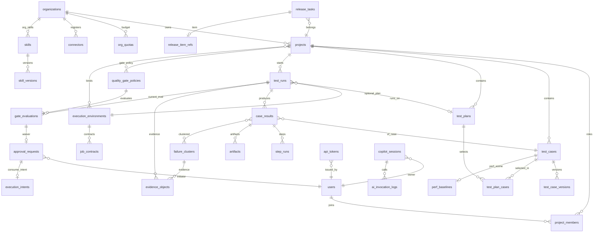
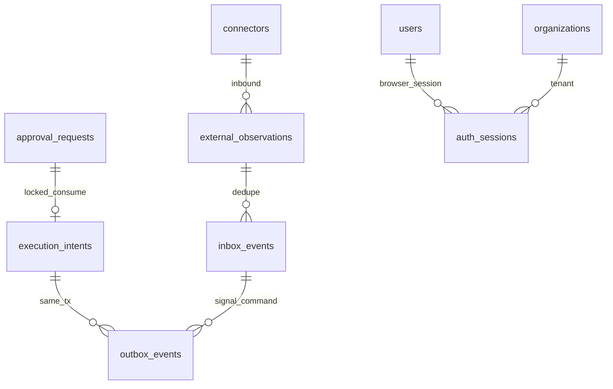

# HuntAI Test 逻辑数据模型（Stage 7）

> - **Status: Draft**
> - **日期**：2026-08-29（2026-08-31 修订）· **版本**：v1.1
> - **阶段**：Stage 7 · 数据模型与 API 规范 · 本文件只覆盖逻辑数据模型
> - **文档定位**：把已冻结的 23 个领域对象与已批准的基础设施写需求落到 PostgreSQL **逻辑表设计**。物理数据面在 M0/M1 仍是**单一 PostgreSQL**（ADR 0009）；逻辑上按控制面模块私有 schema 隔离。共享数据库不等于共享仓储。
> - **实现边界**：本文不含代码、DDL、`CREATE INDEX` 可执行语句、Alembic 脚本、ORM 实体、OpenAPI、错误码、SSE 帧或部署配置。
> - **变更纪律**：修订本文走后续 Stage 7 评审；禁止静默修改 Stage 6 已定稿 / 已冻结文档。

---

## 1. 来源优先级、范围与非目标

### 1.1 来源优先级（冲突时服从更高优先级）

| 优先级 | 来源 | 本文使用规则 |
| --- | --- | --- |
| 1 | [problem_model.md](../03_problem_modeling/problem_model.md) | 23 对象、字段语义、状态集合、不变量的最高事实源 |
| 2 | [architecture.md](../06_architecture_design/architecture.md) | 模块归属、事务/Outbox、execution intent、数据面边界（已定稿） |
| 3 | [01_domain_and_service_architecture.md](../06_architecture_design/01_domain_and_service_architecture.md) | 模块私有写模型、不共享仓储/ORM 实体 |
| 4 | [frontend_backend_boundary_spec-v1.0.md](../06_architecture_design/frontend_backend_boundary_spec-v1.0.md) | 后端权威；输出是语义契约，**不等于**表结构 |
| 5 | [tech_stack_decision-v1.0.md](../06_architecture_design/tech_stack_decision-v1.0.md) 与 [ADR 0009](../06_architecture_design/adr/0009_technology_stack_freeze.md) | SQLAlchemy 2 async + asyncpg + Alembic；M0/M1 单 PostgreSQL 数据面 |
| 6 | [ADR 0007](../06_architecture_design/adr/0007_data_artifact_and_audit_protection.md) | **Proposed**。四级分类体系可沿用；保留期 / Legal Hold / WORM / 「90 天」**不得**写成默认 |

不使用仓库中不存在的 `business_model.md` 或 `architecture_spec.md`。不把过时的「LangChain 编排层」写成表或接口。

### 1.2 范围

- 23 个领域对象 → 表（或「不落库」）的逐条映射。
- 从属结构与已批准基础设施表（Outbox、Inbox/ExternalObservation、execution intent、命令幂等记录、认证会话 / OIDC 登录草稿）——**不另算第 24 个领域对象**。
- 模块私有 schema 归属、ER、字段、主键/逻辑引用、唯一约束、索引、状态字段、分级、生命周期、多租户、迁移政策。

### 1.3 非目标

- 不定义 endpoint、HTTP 错误码、OpenAPI、分页协议或 SSE 帧（归后续 [`api_spec.md`](README.md)）。
- 不启用 MCP、LangGraph checkpoint、pgvector、Redis、Temporal、MinIO、Vault 专用表。
- 不把共享数据库设计成共享仓储；模块之间不共享表或 ORM 实体。
- 不把「页面字段」或 API 语义字段直接等同于数据库字段。
- 不把 Proposed 上游变更写成正式枚举/表。

### 1.4 M0/M1 物理数据面

| 关注点 | M0/M1 落法 | 明确禁止 |
| --- | --- | --- |
| 业务与一致性事实 | 单一 PostgreSQL；逻辑 schema 隔离 | 第二套业务库；SQLite 承担审批/租户/恢复 |
| 制品正文 | 表内只存 `object_key` / checksum / classification；对象存储以同一 key 表达（M0/M1 为本地卷） | 大二进制、报告原文、截图/视频/Trace 进 PostgreSQL；MinIO 专用元数据表 |
| 秘密 | 只存 `credential_ref`；M0/M1 解析目标为 `.env` / Docker secret 路径 | 明文密钥；Vault 产品表 |
| 调度 | Outbox 表 + 后端定时任务 relay（调度形态 TBD，tech_stack G1） | Temporal 持久库表；同一业务步骤两个调度 Owner |
| 检索 | 本阶段不引入 pgvector 专用表 | 把「决策总纲起步检索」提前写成已批准表 |

---

## 2. 模块私有 schema 归属

控制面按 [architecture.md](../06_architecture_design/architecture.md) §6 的 10 个模块划分写模型。OrgQuota 因高并发 CAS 记账从身份模块拆出独立 schema（[领域分册](../06_architecture_design/01_domain_and_service_architecture.md) §4.2 `quota_governance`），限界上下文仍是「身份、租户与配额」。因此 PostgreSQL **逻辑 schema 为 11 个**，一张表只属于一个 schema / 一个模块。

可编辑图与预览：

- [module_schema_ownership.drawio](module_schema_ownership.drawio)（VS Code draw.io 扩展或 draw.io 桌面/网页打开）
- [module_schema_ownership.svg](module_schema_ownership.svg)

### 2.1 Schema ↔ 模块 ↔ 写模型

| PostgreSQL schema | 控制面模块 | 拥有的领域对象（23 口径） | 本 schema 还拥有（非第 24 对象） |
| --- | --- | --- | --- |
| `identity_tenancy` | 身份、租户与配额 | 1 Organization；2 User / ProjectMember；3 Project | `outbox_events`、`command_idempotency_records`、`auth_sessions`、`oidc_login_drafts` |
| `quota_governance` | 身份、租户与配额（配额账本） | 21 OrgQuota | 同上 |
| `test_assets` | 测试资产 | 5 TestCase(+Version)；6 TestPlan；16 PerfBaseline | `test_case_versions`、`test_plan_cases`；同上 |
| `execution_registry` | 执行环境 | 4 ExecutionEnvironment | `job_contracts`；同上 |
| `run_orchestration` | 执行编排 | 7 TestRun | 同上 |
| `results_evidence` | 结果、证据与审计 | 8 CaseResult / StepRun / Artifact；9 FailureCluster；10 EvidenceObject；13 AuditEvent | `step_runs`、`artifacts`；同上。**AuditEvent 仅经 append 端口写入** |
| `approval_policy` | 审批与策略 | 11 ApprovalRequest | `execution_intents`；同上 |
| `quality_gates` | 质量门禁 | 22 QualityGatePolicy；23 GateEvaluation | 同上 |
| `release_orchestration` | 发布编排 | 17 ReleaseTask | `release_item_refs`；同上 |
| `integration_hub` | 集成中心 | 18 ApiToken；19 Connector | `inbox_events`、`external_observations`；同上 |
| `ai_governance` | AI 治理与助手 | 12 AIInvocationLog；14 Skill(+SkillVersion)；15 ModelRoute；20 CopilotSession | `skill_versions`；同上 |

后续架构测试可消费的不变量：

1. 每个表的 Owner schema 唯一；不出现跨模块双写。
2. 模块 A 的迁移不得对模块 B 的表建立物理外键。
3. 跨模块只使用 ID、不可变快照、查询端口；跨模块 ID 列为**只读引用、禁止级联写**。
4. `results_evidence.audit_events` 与各模块 `outbox_events` 可在**同一本地事务**中由 Owner 模块经端口追加，但调用方不得持有其 ORM 实体。

### 2.2 跨模块引用纪律

| 引用列（逻辑） | 所在表 / schema | 指向（Owner） | 物理 FK | 写规则 |
| --- | --- | --- | --- | --- |
| `projects.organization_id` | `identity_tenancy.projects` | `organizations` 同模块 | 允许（模块内） | Owner 写 |
| `test_cases.project_id` | `test_assets` | `identity_tenancy.projects` | **禁止** | 只读引用 |
| `test_runs.plan_id` | `run_orchestration` | `test_assets.test_plans` | **禁止** | 只读；受理时写入 snapshot |
| `test_runs.env_id` | `run_orchestration` | `execution_registry.execution_environments` | **禁止** | 只读；受理时写入 snapshot |
| `test_runs.gate_evaluation_id` | `run_orchestration` | `quality_gates.gate_evaluations` | **禁止** | 仅 CAS 挂接当前评估引用；不得改评估行 |
| `case_results.test_run_id` | `results_evidence` | `run_orchestration.test_runs` | **禁止** | 结果模块写自己的行；不得推进 TestRun 状态 |
| `approval_requests.target_object_id` | `approval_policy` | 多态：TestRun / TestCase / ReleaseTask / ExecutionEnvironment / GateEvaluation 等 | **禁止** | ACTION_TARGET 非独立表 |
| `execution_intents.approval_request_id` | `approval_policy` | 同模块 `approval_requests` | 允许 | 消费事务内创建 |
| `gate_evaluations.test_run_id` | `quality_gates` | `run_orchestration.test_runs` | **禁止** | 只读；agent run 不插行 |
| `gate_evaluations.waiver_approval_id` | `quality_gates` | `approval_policy.approval_requests` | **禁止** | 只读 |
| `release_tasks.project_id` | `release_orchestration` | `identity_tenancy.projects` | **禁止** | 只读 |
| `ai_invocation_logs.model_route_id` | `ai_governance` | 同模块 `model_routes` | 允许（可空） | 只读快照亦可 |
| `ai_invocation_logs.skill_version_id` | `ai_governance` | 同模块 `skill_versions` | 允许（可空） | 只读 |
| `ai_invocation_logs.copilot_session_id` | `ai_governance` | 同模块 `copilot_sessions` | 允许（可空） | 只读 |
| `org_quotas.organization_id` | `quota_governance` | `identity_tenancy.organizations` | **禁止** | 只读 tenant 键；账本本模块写 |
| `audit_events` 上的对象 ID | `results_evidence` | 各业务表 | **禁止** | append-only 引用 |

模块内 FK：使用 `RESTRICT` / `NO ACTION`，**禁止** `ON DELETE CASCADE` 跨聚合删除。

---

## 3. 23 个领域对象 → 表（或「不落库」）

对象总数以 [problem_model.md](../03_problem_modeling/problem_model.md) §1.1 为唯一口径。

| # | 领域对象 | 落库 | 表（schema.table） | 生命周期摘要 | 状态字段（枚举 ⊆ problem_model） |
| --- | --- | --- | --- | --- | --- |
| 1 | Organization | 是 | `identity_tenancy.organizations` | 原地更新；禁止物理删除 | 无问题模型状态机；停用方式 TBD |
| 2 | User / ProjectMember | 是 | `identity_tenancy.users` + `identity_tenancy.project_members` | User 镜像可更新启停；成员角色原地更新并审计 | 角色仅 `owner / admin / tester / viewer`（非生命周期状态机） |
| 3 | Project | 是 | `identity_tenancy.projects` | Jira 元数据只读镜像；本地可更新展示名等；禁止让同步覆盖 ProjectMember | 无问题模型状态机 |
| 4 | ExecutionEnvironment | 是 | `execution_registry.execution_environments` | 原地更新 + CAS；凭证只存引用 | `PENDING_APPROVAL / ACTIVE / DEGRADED / DISABLED`。Proposed 恢复边见 §14，**不写入正式枚举迁移** |
| 5 | TestCase(+Version) | 是 | `test_assets.test_cases` + `test_assets.test_case_versions` | 用例原地更新指针/状态；**Version 禁止覆盖** | 用例：`DRAFT / PENDING_REVIEW / ACTIVE / DEPRECATED`；`validity`：`valid / invalid`（系统标记，区别于 DEPRECATED） |
| 6 | TestPlan | 是 | `test_assets.test_plans` | 原地更新；执行时解析为快照 | 无问题模型状态机 |
| 7 | TestRun | 是 | `run_orchestration.test_runs` | 状态 CAS；`snapshot` 受理后不可变；终态吸收 | `PENDING / VALIDATING / RUNNING / WAITING_EXTERNAL / WAITING_APPROVAL / STOPPING / SUCCEEDED / FAILED / CANCELLED / TIMEOUT`。终态 = 后四者。**不手写边数**，边以 problem_model §2.2 为准 |
| 8 | CaseResult / StepRun / Artifact | 是 | `results_evidence.case_results` + `step_runs` + `artifacts` | 高容量 append/分片；制品正文不进库 | CaseResult 结果语义 [建模补全] 与执行完成事实对齐，不另造业务状态机 |
| 9 | FailureCluster | 是 | `results_evidence.failure_clusters` | 随 run 生成；人工修正只追加 `correction_history` | 无生命周期状态机。`category` 7 值见 §7.8 |
| 10 | EvidenceObject | 是 | `results_evidence.evidence_objects` | **append-only，禁止原地覆盖** | 无 |
| 11 | ApprovalRequest | 是 | `approval_policy.approval_requests` | 行锁消费；结果列仅 EXECUTED 有值 | `CREATED / PENDING / APPROVED / EXECUTED / REJECTED / EXPIRED`。`execution_result`：`ok / failed / unknown`（可空） |
| 12 | AIInvocationLog | 是 | `ai_governance.ai_invocation_logs` | **append-only**；不存 Prompt 原文 | `result`：`ok / degraded / refused`（问题模型字段，非 TestRun 状态机） |
| 13 | AuditEvent | 是 | `results_evidence.audit_events` | **append-only 独立表**；不得用业务 `updated_at` 冒充 | 无业务状态机 |
| 14 | Skill(+SkillVersion) | 是 | `ai_governance.skills` + `skill_versions` | 发布指针 CAS；**已发布 Version 禁止覆盖** | 发布范围：`personal / team / org`（问题模型三级发布，不是第四套执行状态机） |
| 15 | ModelRoute | 是 | `ai_governance.model_routes` | 原地更新 + CAS / 版本化配置 | 无问题模型状态机 |
| 16 | PerfBaseline | 是 | `test_assets.perf_baselines` | 新基线 + 旧基线停用 CAS；历史不改写指标快照 | 无；用 `is_active` 表达同场景唯一活跃 |
| 17 | ReleaseTask | 是 | `release_orchestration.release_tasks` | 范围快照创建后不变；prepare ≠ 生产发布 | `DRAFT / PENDING_CONFIRM / SUBMITTED / READY / FAILED_RETRYABLE / CANCELLED` |
| 18 | ApiToken | 是 | `integration_hub.api_tokens` | 签发后只吊销/异步更新 last_used；明文只显示一次 | 无状态机；`revoked_at` 非空即吊销 |
| 19 | Connector | 是 | `integration_hub.connectors` | 配置版本 CAS；凭证只存引用 | 无问题模型状态机；健康为探测结果而非第五套状态机 |
| 20 | CopilotSession | 是 | `ai_governance.copilot_sessions` | 服务端会话可更新摘要；消息 Confidential | 问题模型未定义会话状态机，**不发明** |
| 21 | OrgQuota | 是 | `quota_governance.org_quotas` | CAS 预留/确认/释放 | 无 |
| 22 | QualityGatePolicy | 是 | `quality_gates.quality_gate_policies` | 修改升 `policy_version`；不改写历史评估 | `mode`：`report_only / blocking` |
| 23 | GateEvaluation | 是 | `quality_gates.gate_evaluations` | **不可变**；重评估新建行 | `result`：`pass / fail / waived`。**不含** Proposed `not_evaluated` |

### 3.1 不落库或非独立表（仍须承载规则）

| 项 | 处理 | 理由 |
| --- | --- | --- |
| AI 生成草稿（未人工保存） | 不插入 `test_cases`；只写 `ai_invocation_logs` | problem_model：默认不落库，审阅后才 DRAFT。暂存 TTL / 多端续审归 `api_spec.md`（boundary G1） |
| ACTION_TARGET | 非表；见 `approval_requests.action_type` + `target_object_type` + `target_object_id` + `action_payload` | problem_model §1.2 约束 6 |
| Policy Gate | 无独立表；裁决写入 `audit_events` | FR-17 |
| ExecutionTrajectory | 存为 Artifact + CaseResult | FR-19；非第 24 对象 |
| 前端 URL 筛选 / 未提交表单 / SSE 订阅 / Query 缓存 | 不落库 | boundary spec §3.2 |
| GateEvaluation `not_evaluated` | **不建行、不写入 `result` 枚举** | 当前兼容：无评估行 + 查询投影 reason。见 §14 |
| L2 持续授权独立对象 | **不建表**（Proposed） | 兼容存法见 §14 |
| LangGraph checkpoint / MCP / 页面专用投影表 | 不建 | 架构非目标；M0–M3 不采用 MCP |
| 采纳率埋点 | 不另建表；从 `ai_invocation_logs.result` 聚合 | FR-05 CRUD 矩阵 |
| 认证会话 / OIDC 登录草稿 | **不升格对象**；落 `identity_tenancy` 基础设施表（§5.5） | api_spec §1.2 / §3.6；API-001–003。Cookie 只持不透明会话 ID |

Kill switch：问题模型有页面与 `action_ref=kill_switch_restore`，**无第 24 对象**。落在 Organization / Connector 的 [建模补全] 治理字段（§7.1、§7.11），关停 L1 即时、恢复走审批。

---

## 4. 从属结构（不计入第 24 个领域对象）

| 从属结构 | 表 | Owner schema | 所属领域对象 | 不可变？ |
| --- | --- | --- | --- | --- |
| ProjectMember | `project_members` | `identity_tenancy` | User / ProjectMember（对象 2） | 否（角色可变，变更必审计） |
| TestCaseVersion | `test_case_versions` | `test_assets` | TestCase | **是**（全量快照；heal_apply 新建版本 + 指针 CAS，禁止改历史版本） |
| TestPlan 选用 | `test_plan_cases` | `test_assets` | TestPlan | 否（计划编排）；执行时进入 TestRun.snapshot |
| Job Contract | `job_contracts` | `execution_registry` | ExecutionEnvironment | 契约版本化；已绑定执行的快照在 TestRun.snapshot，不回写本合同 |
| StepRun | `step_runs` | `results_evidence` | CaseResult / StepRun / Artifact | append；禁止覆盖步骤事实 |
| Artifact | `artifacts` | `results_evidence` | 同上 | 元数据可补 checksum；正文不进库；禁止把预签名 URL 当稳定引用 |
| SkillVersion | `skill_versions` | `ai_governance` | Skill | **已发布禁止覆盖**；未发布草稿允许原地更新 [建模补全] |
| Release item 引用 | `release_item_refs` | `release_orchestration` | ReleaseTask | 外部引用随 prepare 写入；CANCELLED 后迟到 READY 只追加 divergence，不覆盖取消 |

基础设施同构表（§5）也不是领域对象。

---

## 5. 基础设施表（不是第 24 个领域对象）

已批准的写需求分两类，均**不是领域对象**：

1. **平台一致性机制**（architecture.md §7.2 / §11 与 ADR 0002/0009）：聚合事实与 Outbox 同事务；Inbox 去重；execution intent 承接审批消费与外部尝试；命令幂等 scope = tenant + command type + key。
2. **身份传输协调面**（api_spec.md §3.6 / API-001–003；architecture.md §13.1「可吊销的服务端会话」）：仅 `identity_tenancy` 拥有 `auth_sessions` 与 `oidc_login_drafts`。Cookie 名、SameSite、会话时长、再认证窗口、并发会话数仍为 **TBD**，本模型不写默认秒数或 Cookie 名。

### 5.1 每模块同构：`outbox_events`

每个写模块 schema 各有一张，**列同构，表不共享**。

用途：本模块事务提交后至少一次发布。M0/M1 由定时任务扫描 `unpublished` 行 relay；不设计 Temporal 表。敏感正文不进 `payload`，只传稳定 ID、`object_key`、classification。

### 5.2 每模块同构：`command_idempotency_records`

每个受理命令的模块 schema 各有一张，列同构。

唯一约束：`(organization_id, command_type, idempotency_key)`。同 key 同 `request_hash` 返回已有 `result_ref`；同 key 异 hash 视为冲突（拒绝）。TestRun 的 `idempotency_key`（external_ci 重放）是**领域列**，与本表互补：本表覆盖通用命令受理，领域列覆盖「触发不重复创建 run」。

### 5.3 `approval_policy.execution_intents`

审批消费在行锁内原子创建，唯一标识 `(organization_id, approval_request_id, bound_hash)`。重复 consume、Outbox 重投、Worker 重领都复用同一行。**不把 ApprovalRequest 提前写成 EXECUTED。**

状态（基础设施，非领域对象状态机）：`READY / CLAIMED / DISPATCHING / CONFIRMED_OK / CONFIRMED_FAILED / UNKNOWN / ABANDONED`。

与领域 `execution_result` 对齐：首次真实调用已发出后，控制面命令写 `ApprovalRequest.status=EXECUTED` 且 `execution_result=ok/failed/unknown`。intent `UNKNOWN` 对应领域 `unknown`。

### 5.4 `integration_hub.inbox_events` 与 `external_observations`

- **Inbox**：消费者以 `event_id` 去重；Inbox 行与本模块业务写同事务。跨模块领域事件的消费方在**本模块 Inbox** 去重，不读他模块 Inbox 表。
- **ExternalObservation**：webhook / 轮询先落观察（验签、归属、乱序），再经本模块 Outbox 发出控制面命令。**禁止**观察行直接 UPDATE `test_runs` / `release_tasks` / `gate_evaluations`。

### 5.5 `identity_tenancy.auth_sessions` 与 `oidc_login_drafts`

仅本 schema 拥有。**不是**第 24 对象，也**不是**对象 20 `CopilotSession`。浏览器 Cookie 只持不透明 `auth_sessions.id`；IdP access / refresh token **禁止**入库、禁止进 Cookie、禁止进响应体。

- **`auth_sessions`**：API-002 签发、API-003 吊销、API-004 更新再认证事实时间、每请求校验。行内存身份引用（`user_id` + `organization_id`）与认证新鲜度时间戳，**不**缓存 ProjectMember 角色快照（角色每请求现读）。`revoked_at` 非空或已过 `expires_at` → 同一 Cookie 不得再通过认证（`HT-AUTH-001`）。无组织上下文不得插入本表（API-002：拒绝且不创建默认租户）。
- **`oidc_login_drafts`**：API-001 写入的服务端登录草稿（`state` / `nonce` / PKCE `code_verifier`）。发生在租户解析之前，**无** `organization_id`（§10 例外）。API-002 校验成功后标记消费并签发 `auth_sessions`；草稿不得当作已登录会话。`code_verifier` 必须可逆以完成 token 交换，消费后清除或使 `consumed_at` 非空后不可再换票；**禁止**进日志 / Trace / 错误 `details`。

M0/M1 无 Redis；会话与草稿不得放入进程内存作为多实例权威，也不得把 Redis 当授权事实源。

---

## 6. ER 图（逻辑关系）

跨模块连线表示 **ID 只读引用**，不是物理外键。基数与 [problem_model.md](../03_problem_modeling/problem_model.md) §1.2 一致。ACTION_TARGET / JOB_CONTRACT 等从属结构已展开为表名。

基础设施表与领域表的关系（同事务，非领域基数）：

`outbox_events` / `command_idempotency_records` 在每个写模块重复出现，上图不画 11 份拷贝。`oidc_login_drafts` 无租户/用户 FK（登录完成前无主体），不上领域 ER。

---

## 7. 字段定义

### 7.0 约定

**命名**：表名 snake_case 复数；字段名 snake_case（[project_rules.md](../00_setup/project_rules.md) §1.3）。

**主键**：[建模补全] 全部 `id` 为 UUID。租户作用域表必须有 `organization_id`（语义 = problem_model `tenant_id`）。

**分级**：`Public / Internal / Confidential / Restricted`。分类缺失按 **Confidential fail-close**。Restricted / 密钥类**禁止明文**，只存 `credential_ref` 或单向哈希；**禁止**进入日志 / Trace / Prompt / Outbox payload / Artifact 正文。唯一例外：§5.5 `oidc_login_drafts.code_verifier` 为 PKCE 短时协议材料，必须可逆以完成 token 交换（§8）。Confidential **禁缓存**，读取最小化并脱敏。Public 本模型几乎不用（内部平台对象默认至少 Internal）。

**通用列（可变业务表默认具备，下表不重复）**：

| 字段 | 类型语义 | 可空 | 分级 | 说明 |
| --- | --- | --- | --- | --- |
| `id` | UUID PK | 否 | Internal | |
| `organization_id` | UUID | 否 | Internal | 权威 tenant 键 |
| `created_at` | timestamptz | 否 | Internal | |
| `updated_at` | timestamptz | 否 | Internal | 可变表；**不能**替代 AuditEvent |
| `created_by` | UUID | 否* | Internal | 指向 `users.id` 的只读引用；系统 actor 用约定系统用户 ID（TBD） |
| `aggregate_version` | int | 否 | Internal | CAS；命令带 `expected_version`。[建模补全] |

\* append-only 表保留 `id` / `organization_id` / `created_at` / `created_by`（按对象需要），**不使用 `updated_at` 表达审计**，**不加 `aggregate_version`**（无原地更新）。

**JSONB**：只承载 problem_model 已有嵌套结构（snapshot、card_payload、job_binding、source_object 等），不借 JSON 偷加未确认业务字段。

**索引描述约定**：下列「索引」节只描述列、类型（btree / unique / partial unique）、目的，不是 DDL。

---

### 7.1 `identity_tenancy`

#### `organizations`（对象 1）

本表是 tenant 根：**没有** `organization_id` 列（`id` 即权威 tenant 键）。不适用 §7.0 中「租户作用域表必须有 organization_id」的列复制。

| 字段 | 类型语义 | 可空 | 约束 | 分级 | 生命周期 |
| --- | --- | --- | --- | --- | --- |
| `id` | UUID PK | 否 | 权威 tenant 键 | Internal | 禁止物理删除 |
| `created_at` | timestamptz | 否 | | Internal | |
| `updated_at` | timestamptz | 否 | | Internal | 不能替代 AuditEvent |
| `created_by` | UUID | 否 | 只读引用 `users.id`（引导期可为空 TBD） | Internal | |
| `aggregate_version` | int | 否 | CAS [建模补全] | Internal | |
| `name` | text | 否 | | Confidential | 可更新 |
| `slug` | text | 否 | unique `slug` | Internal | 可更新策略 TBD |
| `capability_controls` | jsonb | 否 | 默认关闭收紧位须显式结构 [建模补全] | Internal | 四级 kill switch：A1–A8 / 模块 Copilot·Release·压测 / 全局 AI。关停即时；恢复须审批。**非第 24 对象** |
| `is_active` | bool | 否 | | Internal | 停用语义 TBD；禁止物理删除 |

索引：unique btree `slug`（租户目录）；btree `is_active`（运营查询）。

#### `users`（对象 2 · 身份镜像）

| 字段 | 类型语义 | 可空 | 约束 | 分级 | 生命周期 |
| --- | --- | --- | --- | --- | --- |
| （通用列） | | | PK；`organization_id` 必填 | | IdP 为启停权威（ADR 0005 Proposed；当前按组织作用域落行） |
| `idp_subject` | text | 否 | unique `(organization_id, idp_subject)` | Internal | 不可改 |
| `display_name` | text | 是 | | Confidential | 可随目录更新 |
| `email` | text | 是 | unique `(organization_id, email)` WHERE email IS NOT NULL | Confidential | 可更新；禁进日志明文以外的完整转储 |
| `is_disabled` | bool | 否 | | Internal | 目录禁用传播时延 TBD |

跨组织是否合并同一自然人标 **TBD**。

索引：unique `(organization_id, idp_subject)`；partial unique `(organization_id, email)`。

#### `projects`（对象 3）

| 字段 | 类型语义 | 可空 | 约束 | 分级 | 生命周期 |
| --- | --- | --- | --- | --- | --- |
| （通用列） | | | | | 镜像可刷新；禁止覆盖本地成员角色 |
| `name` | text | 否 | | Confidential | |
| `jira_project_key` | text | 是 | unique `(organization_id, jira_project_key)` WHERE NOT NULL | Internal | Jira 只读镜像 |
| `jira_sync_cursor` | text | 是 | | Internal | 同步游标，非业务状态 |
| `bind_env_ids` | uuid[] | 是 | 元素为执行环境 ID 只读引用 [建模补全] | Internal | 项目/组织级绑定；权威仍在环境注册 |

索引：unique `(organization_id, jira_project_key)` WHERE NOT NULL；btree `(organization_id, name)`。

#### `project_members`（从属 · 对象 2）

| 字段 | 类型语义 | 可空 | 约束 | 分级 | 生命周期 |
| --- | --- | --- | --- | --- | --- |
| （通用列） | | | | | 角色变更 + Audit append |
| `project_id` | UUID | 否 | 模块内 FK → `projects.id` | Internal | |
| `user_id` | UUID | 否 | 模块内 FK → `users.id` | Internal | |
| `role` | text | 否 | ∈ `owner / admin / tester / viewer`；unique `(organization_id, project_id, user_id)` | Internal | Jira 用户/组不得静默覆盖（ADR 0005 Proposed；当前兼容 = 本表为平台角色权威） |

索引：unique `(organization_id, project_id, user_id)`；btree `(organization_id, user_id)`。

#### 本 schema 基础设施

同构 `outbox_events`、`command_idempotency_records`（列定义见 §7.12）。本 schema 另有认证传输表（非同构、非领域对象）：

#### `auth_sessions`（基础设施 · API-002/003/004/006）

无 `aggregate_version` / `updated_at` / `created_by`。吊销与再认证只改 `revoked_at` / `last_reauth_at`。无 CAS（API-003）。

| 字段 | 类型语义 | 可空 | 约束 | 分级 | 生命周期 |
| --- | --- | --- | --- | --- | --- |
| `id` | UUID PK | 否 | Cookie 只持此不透明 ID | Internal | 轮换 session id 时新行，旧行吊销 |
| `organization_id` | UUID | 否 | 只读引用 `organizations.id` | Internal | 无租户不得插入 |
| `user_id` | UUID | 否 | 模块内只读引用 `users.id` | Internal | |
| `created_at` | timestamptz | 否 | | Internal | |
| `expires_at` | timestamptz | 否 | 签发时写入绝对时间 | Internal | 时长数值 TBD，模型不写默认秒数 |
| `revoked_at` | timestamptz | 是 | 非空即吊销 | Internal | API-003；账号禁用等撤权可批处理本列（传播时延 TBD） |
| `last_reauth_at` | timestamptz | 是 | | Internal | API-004 完成时写入；再认证窗口秒数 TBD |

禁止列：角色快照、IdP access / refresh token、Cookie 名、会话秘密明文。有效判定 = `revoked_at IS NULL` 且当前时间 `< expires_at`。

索引：PK `id`（Cookie 查找）；btree `(organization_id, user_id)`（按主体吊销）；btree `expires_at` WHERE `revoked_at IS NULL`（过期扫描；清理窗口 TBD）。

#### `oidc_login_drafts`（基础设施 · API-001/002）

登录完成前无主体与租户。无 `organization_id`（§10 例外）。无 `aggregate_version`。

| 字段 | 类型语义 | 可空 | 约束 | 分级 | 生命周期 |
| --- | --- | --- | --- | --- | --- |
| `id` | UUID PK | 否 | | Internal | |
| `state` | text | 否 | unique | Internal | OIDC `state`；校验失败 `HT-AUTH-003` |
| `nonce` | text | 否 | | Internal | |
| `code_verifier` | text | 否 | 必须可逆以完成 PKCE | Restricted | 禁止进日志 / Trace / 错误体；消费后不可再换票 |
| `return_path` | text | 是 | 仅相对路径；开放重定向校验归 API-001 | Internal | 非法值 `HT-VAL-005` |
| `created_at` | timestamptz | 否 | | Internal | |
| `expires_at` | timestamptz | 否 | 签发时写入绝对时间 | Internal | 草稿 TTL 数值 TBD，模型不写默认秒数 |
| `consumed_at` | timestamptz | 是 | 非空 = 已用于 callback | Internal | 重复使用 `state` → `HT-AUTH-003` |

禁止列：IdP token 明文。响应体不得返回 `code_verifier`。

索引：unique `state`；btree `expires_at` WHERE `consumed_at IS NULL`（过期扫描；清理窗口 TBD）。

---

### 7.2 `quota_governance`

#### `org_quotas`（对象 21）

| 字段 | 类型语义 | 可空 | 约束 | 分级 | 生命周期 |
| --- | --- | --- | --- | --- | --- |
| （通用列，含 `aggregate_version`） | | | unique `(organization_id)` 一行账本 | | CAS 预留/确认/释放；超限拒新调用 |
| `token_budget` | numeric | 否 | | Internal | |
| `token_reserved` | numeric | 否 | | Internal | |
| `token_consumed` | numeric | 否 | | Internal | 由 AIInvocationLog 确认路径扣减 |
| `executor_slot_quota` | int | 否 | | Internal | |
| `perf_concurrency_quota` | int | 否 | | Internal | |

索引：unique btree `organization_id`（即 tenant 账本）。

跨模块：`organization_id` 只读引用 `organizations`，无物理 FK。

---

### 7.3 `test_assets`

#### `test_cases`（对象 5）

| 字段 | 类型语义 | 可空 | 约束 | 分级 | 生命周期 |
| --- | --- | --- | --- | --- | --- |
| （通用列） | | | | | 状态原地更新；current_version CAS |
| `project_id` | UUID | 否 | 跨模块只读引用 | Internal | |
| `case_type` | text | 否 | ∈ `api / web / performance / referenced` | Internal | |
| `execution_mode` | text | 否 | ∈ `script / agent` | Internal | |
| `title` | text | 否 | | Confidential | |
| `priority` | text | 否 | ∈ `P0 / P1 / P2 / P3` | Internal | |
| `tags` | text[] | 否 | 可含保留标签 `ai-generated` | Internal | |
| `lifecycle_status` | text | 否 | ∈ `DRAFT / PENDING_REVIEW / ACTIVE / DEPRECATED` | Internal | 边见 problem_model §2.1；AI 禁止直写 ACTIVE |
| `validity` | text | 否 | ∈ `valid / invalid` | Internal | 与生命周期分离；引用型 Job 失效可逆 |
| `invalid_reason` | text | 是 | | Confidential | [建模补全] |
| `invalidated_at` | timestamptz | 是 | | Internal | [建模补全] |
| `script_ref` | text | 是 | 对象 `object_key`；referenced 型必须空 | Confidential | 正文在对象存储 |
| `job_binding` | jsonb | 是 | referenced：`{env_id, job_id, params_schema_ref, collect_config, gate_mapping}` | Confidential | |
| `jira_story_key` | text | 是 | | Internal | 单向链接 |
| `current_version_id` | UUID | 是 | 指向 `test_case_versions.id`（模块内） | Internal | DRAFT 未保存版本时可空至首次 Version |

索引：btree `(organization_id, project_id, lifecycle_status)`；btree `(organization_id, tags)` 目的为标签筛选（具体 GIN TBD）；unique 不要求 title 全局唯一。

#### `test_case_versions`（从属 · **不可变**）

| 字段 | 类型语义 | 可空 | 约束 | 分级 | 生命周期 |
| --- | --- | --- | --- | --- | --- |
| `id` | UUID PK | 否 | | Internal | **禁止 UPDATE** |
| `organization_id` | UUID | 否 | | Internal | |
| `created_at` | timestamptz | 否 | | Internal | |
| `created_by` | UUID | 否 | | Internal | |
| `test_case_id` | UUID | 否 | 模块内 FK | Internal | |
| `version_seq` | int | 否 | unique `(organization_id, test_case_id, version_seq)` | Internal | |
| `snapshot` | jsonb | 否 | 全量用例快照（含定位器主备等） | Confidential | heal_apply 只追加新行 |
| `data_classification` | text | 否 | ∈ 四级；缺失 = Confidential | Internal | 最高级别传播 |

无 `updated_at`。索引：unique `(organization_id, test_case_id, version_seq)`；btree `(organization_id, test_case_id)`。

#### `test_plans`（对象 6）

| 字段 | 类型语义 | 可空 | 约束 | 分级 | 生命周期 |
| --- | --- | --- | --- | --- | --- |
| （通用列） | | | | | 编排可更新；执行走快照 |
| `project_id` | UUID | 否 | 跨模块只读 | Internal | |
| `name` | text | 否 | | Confidential | |
| `jira_fix_version` | text | 是 | | Internal | |

索引：btree `(organization_id, project_id)`。

#### `test_plan_cases`（从属）

| 字段 | 类型语义 | 可空 | 约束 | 分级 | 生命周期 |
| --- | --- | --- | --- | --- | --- |
| （通用列可简化：无 aggregate_version） | | | unique `(organization_id, test_plan_id, test_case_id)` | Internal | 计划内选用 |
| `test_plan_id` | UUID | 否 | 模块内 FK | Internal | |
| `test_case_id` | UUID | 否 | 模块内引用 | Internal | 须同租户同项目，应用层校验 |

#### `perf_baselines`（对象 16）

| 字段 | 类型语义 | 可空 | 约束 | 分级 | 生命周期 |
| --- | --- | --- | --- | --- | --- |
| （通用列） | | | partial unique `(organization_id, scenario_test_case_id) WHERE is_active` | | 新活跃行 + 旧行 `is_active=false` CAS；**禁止改写**历史 `metrics_snapshot` |
| `scenario_test_case_id` | UUID | 否 | 同模块 TestCase（perf 型） | Internal | |
| `metrics_snapshot` | jsonb | 否 | | Confidential | 创建后不可变 |
| `tolerance` | jsonb | 否 | RT/TPS 等 | Internal | 随新基线行替换，不改旧行 |
| `is_active` | bool | 否 | | Internal | 同场景仅一个 true |

索引：partial unique `(organization_id, scenario_test_case_id) WHERE is_active`；btree `(organization_id, scenario_test_case_id, created_at)`。

---

### 7.4 `execution_registry`

#### `execution_environments`（对象 4）

| 字段 | 类型语义 | 可空 | 约束 | 分级 | 生命周期 |
| --- | --- | --- | --- | --- | --- |
| （通用列） | | | | | 状态原地 CAS；DEGRADED/DISABLED 只挡新 run |
| `env_type` | text | 否 | ∈ `platform_executor / external_ci` | Internal | |
| `name` | text | 否 | | Confidential | |
| `endpoint` | text | 是 | | Confidential | 非密钥 |
| `credential_ref` | text | 是 | 只存引用 | **Restricted** | **禁止明文**；禁止进日志/Trace/Prompt/Outbox |
| `status` | text | 否 | ∈ `PENDING_APPROVAL / ACTIVE / DEGRADED / DISABLED` | Internal | **不含** Proposed 恢复边 |
| `health_status` | jsonb | 是 | 最近探活时间/延迟 | Internal | 探测结果，经命令写入 |
| `capacity` | jsonb | 是 | slot / 外部配额 | Internal | |
| `scope_level` | text | 否 | ∈ `organization / project` [建模补全] | Internal | ER「项目/组织级绑定」 |
| `standing_auth_metadata` | jsonb | 是 | **Proposed 占位** | Confidential | 不得当永久豁免；见 §14 |
| `config_version` | int | 否 | 与 aggregate_version 可合一；若分列则 CAS 配置发布指针 | Internal | |

索引：btree `(organization_id, status)`；btree `(organization_id, env_type)`。

#### `job_contracts`（从属）

| 字段 | 类型语义 | 可空 | 约束 | 分级 | 生命周期 |
| --- | --- | --- | --- | --- | --- |
| （通用列） | | | unique `(organization_id, execution_environment_id, job_id)` | | 版本化配置；外部改名走 TestCase.validity |
| `execution_environment_id` | UUID | 否 | 模块内 FK | Internal | |
| `job_id` | text | 否 | | Internal | |
| `params_schema_ref` | text | 是 | 对象 key 或 schema id | Confidential | |
| `artifact_manifest` | jsonb | 是 | | Confidential | |
| `report_adapter` | text | 是 | | Internal | |
| `supports_cancel` | bool | 否 | | Internal | |
| `contract_version` | int | 否 | | Internal | |

---

### 7.5 `run_orchestration`

#### `test_runs`（对象 7）

| 字段 | 类型语义 | 可空 | 约束 | 分级 | 生命周期 |
| --- | --- | --- | --- | --- | --- |
| （通用列） | | | | | 状态 CAS；终态吸收 |
| `project_id` | UUID | 否 | 跨模块只读 | Internal | |
| `plan_id` | UUID | 是 | 跨模块只读 | Internal | |
| `env_id` | UUID | 否 | 跨模块只读 | Internal | 必填 |
| `execution_source` | text | 否 | ∈ `script / agent / external_ci` | Internal | agent ⇒ `gate_evaluation_id` 恒空 |
| `trigger_type` | text | 否 | ∈ `manual / schedule / ci_webhook / api_token` | Internal | |
| `idempotency_key` | text | 是 | unique `(organization_id, idempotency_key)` WHERE NOT NULL | Internal | external_ci 重放不重复触发 |
| `status` | text | 否 | 10 态见 §3；终态四值吸收 | Internal | 边以 problem_model §2.2 为准，本文不维护边数 |
| `gate_evaluation_id` | UUID | 是 | 跨模块只读挂接 | Internal | 不改评估行 |
| `snapshot` | jsonb | 否 | 用例版本、环境、参数；**受理后禁止改写** | Confidential | |
| `last_heartbeat_at` | timestamptz | 是 | | Internal | 活跃态心跳 [建模补全] |
| `stop_signal_at` | timestamptz | 是 | | Internal | 终止信号持久化 [建模补全] |
| `result_summary` | jsonb | 是 | 完成/失败摘要与结果引用，不含报告原文 | Confidential | 大结果不在本行 |

索引：btree `(organization_id, status, created_at)`（工作台进行中/滞留）；unique `(organization_id, idempotency_key)` WHERE NOT NULL；btree `(organization_id, project_id, created_at)`；btree `(organization_id, env_id)`。

---

### 7.6 `results_evidence`

#### `case_results`（对象 8）

| 字段 | 类型语义 | 可空 | 约束 | 分级 | 生命周期 |
| --- | --- | --- | --- | --- | --- |
| `id` / `organization_id` / `created_at` / `created_by` | | | unique `(organization_id, test_run_id, test_case_id, attempt_seq)` [建模补全 attempt_seq] | | append；迟到结果可追加 attempt，**不重开 run** |
| `test_run_id` | UUID | 否 | 跨模块只读 | Internal | |
| `test_case_id` | UUID | 否 | 跨模块只读 | Internal | |
| `test_case_version_id` | UUID | 是 | 跨模块只读 | Internal | 快照内版本 |
| `outcome` | text | 否 | 与执行完成事实对齐：至少表达通过/失败/未完成；**不新增**问题模型未有的业务枚举名。取值与报告归一化契约对齐，细节 TBD 但不得发明第四套状态机 | Internal | |
| `is_late` | bool | 否 | | Internal | 终态后追加 |
| `is_partial` | bool | 否 | | Internal | 超大报告显式 partial |
| `chunk_key` | text | 是 | unique `(organization_id, test_run_id, chunk_key)` WHERE NOT NULL | Internal | 分片幂等 |
| `normalized_summary` | jsonb | 是 | 脱敏后摘要 | Confidential | 禁缓存 |
| `data_classification` | text | 否 | 四级；缺失 Confidential | Internal | |

索引：unique `(organization_id, test_run_id, test_case_id, attempt_seq)`；btree `(organization_id, test_run_id)`；partial unique `(organization_id, test_run_id, chunk_key)` WHERE chunk_key IS NOT NULL。

#### `step_runs`（从属）

| 字段 | 类型语义 | 可空 | 约束 | 分级 | 生命周期 |
| --- | --- | --- | --- | --- | --- |
| （append 通用列，无 updated_at） | | | unique `(organization_id, case_result_id, step_index)` | | 禁止覆盖 |
| `case_result_id` | UUID | 否 | 模块内 FK | Internal | |
| `step_index` | int | 否 | | Internal | |
| `action` | jsonb | 是 | Agent：tool + args_hash，不含秘密参数原文 | Confidential | |
| `observation_ref` | text | 是 | object_key | Confidential | |
| `assertion_results` | jsonb | 是 | | Confidential | |
| `token_usage` | jsonb | 是 | Agent 步骤 | Internal | |
| `is_incomplete` | bool | 否 | | Internal | 轨迹 incomplete |

#### `artifacts`（从属）

| 字段 | 类型语义 | 可空 | 约束 | 分级 | 生命周期 |
| --- | --- | --- | --- | --- | --- |
| （append 通用列） | | | unique `(organization_id, object_key)` | | 正文不进库 |
| `case_result_id` | UUID | 是 | 模块内 | Internal | 运行级制品可只挂 run：见 `test_run_id` |
| `test_run_id` | UUID | 否 | 跨模块只读 | Internal | |
| `kind` | text | 否 | 截图/视频/Trace/日志/报告/轨迹 等，**不当**新领域对象 | Internal | |
| `object_key` | text | 否 | 服务端生成、带租户 scope | Internal | 稳定引用；禁止存预签名 URL |
| `checksum` | text | 否 | | Internal | |
| `byte_size` | bigint | 是 | | Internal | |
| `mime_type` | text | 是 | | Internal | |
| `data_classification` | text | 否 | 四级；缺失 Confidential | Internal | Restricted 不经普通预签名（访问方式 TBD） |
| `original_filename` | text | 是 | **仅展示，不作路径** | Confidential | |

索引：unique `(organization_id, object_key)`；btree `(organization_id, test_run_id)`。

#### `failure_clusters`（对象 9）

| 字段 | 类型语义 | 可空 | 约束 | 分级 | 生命周期 |
| --- | --- | --- | --- | --- | --- |
| （通用列；`correction_history` 只追加） | | | | | 无状态机；禁止删除历史簇 |
| `test_run_id` | UUID | 否 | 跨模块只读 | Internal | |
| `category` | text | 否 | ∈ `env_down / auth_expired / locator_stale / assertion_real_bug / flaky / data_issue / unknown` | Internal | unknown 兜底 |
| `root_cause` | text | 是 | | Confidential | |
| `confidence` | numeric | 否 | | Internal | 禁止默认 1.0（应用层） |
| `blocking_judgment` | text | 否 | ∈ `blocker / non_blocker / uncertain` | Internal | |
| `evidence_refs` | uuid[] | 否 | 只引用已存在 Evidence ID | Internal | |
| `failure_refs` | uuid[] | 否 | CaseResult ID | Internal | |
| `correction_history` | jsonb | 否 | `[{actor, field, old, new, timestamp}, ...]` 只追加 | Confidential | 人工修正留痕 |
| `unclustered_refs` | uuid[] | 是 | | Internal | A2 输出 |

索引：btree `(organization_id, test_run_id)`。

#### `evidence_objects`（对象 10 · **不可变**）

| 字段 | 类型语义 | 可空 | 约束 | 分级 | 生命周期 |
| --- | --- | --- | --- | --- | --- |
| `id` / `organization_id` / `created_at` / `created_by` | | | | | **禁止 UPDATE/DELETE** |
| `claim` | text | 否 | | Confidential | |
| `source_object` | jsonb | 否 | `{connector, resource, version, timestamp}` | Confidential | 稳定来源，非短期 URL |
| `content_ref` | text | 是 | 稳定 `object_key` | Confidential | 禁止预签名 URL |
| `subject_type` | text | 否 | 如 `test_run / case_result / failure_cluster / gate_evaluation / release_task / ai_invocation` [建模补全] | Internal | ER「挂证据」 |
| `subject_id` | UUID | 否 | 跨模块只读 | Internal | |
| `data_classification` | text | 否 | 取输入最高级；缺失 Confidential | Internal | Restricted 默认不出站 |

索引：btree `(organization_id, subject_type, subject_id)`；btree `(organization_id, created_at)`。

#### `audit_events`（对象 13 · **append-only 独立表**）

对齐 [market_research.md](../01_market_research/market_research.md) §3.16。失败操作也必须插行。

| 字段 | 类型语义 | 可空 | 约束 | 分级 | 生命周期 |
| --- | --- | --- | --- | --- | --- |
| `id` | UUID PK（即 event_id） | 否 | | Internal | **禁止改写** |
| `organization_id` | UUID | 否 | | Internal | |
| `created_at` | timestamptz | 否 | 即 timestamp | Internal | |
| `project_id` | UUID | 是 | 跨模块只读 | Internal | |
| `actor_user_id` | UUID | 是 | | Internal | 系统动作可空 |
| `delegated_agent` | text | 是 | | Internal | |
| `workflow` | text | 是 | 业务工作流名/ID 引用，非 Temporal 表 | Internal | |
| `step` | text | 是 | | Internal | |
| `skill_id` | UUID | 是 | | Internal | |
| `skill_version_id` | UUID | 是 | | Internal | |
| `model` | text | 是 | | Internal | |
| `provider` | text | 是 | | Internal | |
| `prompt_version` | text | 是 | | Internal | **不存 Prompt 正文** |
| `tool` | text | 是 | | Internal | |
| `action` | text | 是 | | Internal | |
| `resource_type` | text | 是 | | Internal | |
| `resource_id` | UUID | 是 | | Internal | |
| `request_hash` | text | 是 | | Internal | |
| `response_hash` | text | 是 | | Internal | |
| `approval_id` | UUID | 是 | | Internal | |
| `approval_decision` | text | 是 | | Internal | |
| `approval_bound_hash` | text | 是 | | Internal | |
| `data_classification` | text | 否 | 缺失 Confidential | Internal | |
| `external_request_id` | text | 是 | | Internal | |
| `result` | text | 是 | 审计结果摘要码，非秘密正文 | Internal | |
| `evidence_refs` | uuid[] | 是 | | Internal | |
| `cost` | numeric | 是 | | Internal | |
| `latency_ms` | int | 是 | | Internal | |
| `payload_ref` | text | 是 | 如需细节只存 object_key | Confidential | 禁止 secret |

无 `updated_at`。索引：btree `(organization_id, created_at)`；btree `(organization_id, actor_user_id, created_at)`；btree `(organization_id, request_hash)`；btree `(organization_id, approval_id)`；btree `(organization_id, external_request_id)` WHERE NOT NULL。

**禁止**：用 `test_runs.updated_at` 或其他业务列冒充本表。

---

### 7.7 `approval_policy`

#### `approval_requests`（对象 11）

| 字段 | 类型语义 | 可空 | 约束 | 分级 | 生命周期 |
| --- | --- | --- | --- | --- | --- |
| （通用列） | | | | | 行锁消费；过期不放行 |
| `action_type` | text | 否 | ∈ `jira_write / heal_apply / perf_high_risk / release_push / env_register / agent_tool_action / gate_waiver / kill_switch_restore`；`copilot_write` 为 M4 预留，M0/M1 不得当作已启用动作 | Internal | ACTION_TARGET 非表 |
| `target_object_type` | text | 否 | 多态类型 | Internal | |
| `target_object_id` | UUID | 否 | 跨模块只读 | Internal | |
| `action_payload` | jsonb | 否 | 参数；消费前重算 hash | Confidential | 禁缓存 |
| `param_hash` | text | 否 | | Internal | 参数变化 ⇒ EXPIRED invalidated |
| `card_payload` | jsonb | 否 | 九要素卡片 | Confidential | |
| `status` | text | 否 | ∈ `CREATED / PENDING / APPROVED / EXECUTED / REJECTED / EXPIRED` | Internal | |
| `execution_result` | text | 是 | **仅 EXECUTED 非空**；∈ `ok / failed / unknown` | Internal | unknown 禁止当失败盲重试或当成功放行 |
| `initiator_id` | UUID | 否 | ≠ `approver_id` | Internal | 重提时 = 重新提交人 |
| `approver_id` | UUID | 是 | PENDING 后应有候选/实际审批人 | Internal | 四眼 |
| `expires_at` | timestamptz | 否 | | Internal | TTL 只管审批 |
| `escalate_to` | UUID | 是 | | Internal | 不自动放行 |
| `expired_reason` | text | 是 | ∈ `ttl / withdrawn / invalidated` 等问题模型已列原因 | Internal | 不新增状态 |
| `origin_request_id` | UUID | 是 | | Internal | 重提归因 |
| `original_initiator_id` | UUID | 是 | | Internal | |
| `snapshot_ref` | text | 是 | 自愈应用前快照 object_key 或 Version ID | Confidential | |
| `side_effect_level` | text | 否 | ∈ `L0 / L1 / L2 / L3 / L4` 与冻结表一致 | Internal | |

索引：btree `(organization_id, status, expires_at)`（队列）；btree `(organization_id, initiator_id)`；btree `(organization_id, target_object_type, target_object_id)`。

#### `execution_intents`（基础设施 · 非领域对象）

| 字段 | 类型语义 | 可空 | 约束 | 分级 | 生命周期 |
| --- | --- | --- | --- | --- | --- |
| （通用列，含 aggregate_version 用于领取 CAS） | | | unique `(organization_id, approval_request_id, bound_hash)` | | READY/CLAIMED 可重领；DISPATCHING/UNKNOWN 先查询 |
| `approval_request_id` | UUID | 否 | 模块内 FK | Internal | 不提前写 EXECUTED |
| `bound_hash` | text | 否 | 与 param_hash/消费绑定 | Internal | |
| `status` | text | 否 | ∈ `READY / CLAIMED / DISPATCHING / CONFIRMED_OK / CONFIRMED_FAILED / UNKNOWN / ABANDONED` | Internal | |
| `external_request_id` | text | 是 | | Internal | 查询对账 |
| `idempotency_key` | text | 否 | 稳定外部幂等键 | Internal | |
| `claimed_by` | text | 是 | worker 标识 | Internal | |
| `claimed_at` | timestamptz | 是 | | Internal | |
| `result_summary` | jsonb | 是 | 无秘密正文 | Confidential | |

索引：unique `(organization_id, approval_request_id, bound_hash)`；btree `(organization_id, status)`。

---

### 7.8 `quality_gates`

#### `quality_gate_policies`（对象 22）

| 字段 | 类型语义 | 可空 | 约束 | 分级 | 生命周期 |
| --- | --- | --- | --- | --- | --- |
| （通用列） | | | unique `(organization_id, project_id, scope_key)` [建模补全 scope_key] 或允许同项目多策略：btree 即可。**blocking 须显式开启** | | 修改升 `policy_version`，不改历史 GateEvaluation |
| `project_id` | UUID | 否 | 跨模块只读 | Internal | |
| `thresholds` | jsonb | 否 | `{min_pass_rate, max_p95_ms, max_error_rate}` | Internal | |
| `mode` | text | 否 | ∈ `report_only / blocking` | Internal | |
| `scope` | jsonb | 否 | 用例集 / 计划 / 仓库分支绑定 | Confidential | |
| `policy_version` | int | 否 | | Internal | |

索引：btree `(organization_id, project_id)`。

#### `gate_evaluations`（对象 23 · **不可变**）

| 字段 | 类型语义 | 可空 | 约束 | 分级 | 生命周期 |
| --- | --- | --- | --- | --- | --- |
| `id` / `organization_id` / `created_at` / `created_by` | | | | | **禁止 UPDATE**；重评估新行 |
| `test_run_id` | UUID | 否 | 跨模块只读 | Internal | `execution_source=agent` **禁止插入** |
| `policy_id` | UUID | 否 | 模块内引用 | Internal | |
| `policy_snapshot` | jsonb | 否 | 评估时策略快照 | Internal | |
| `result` | text | 否 | ∈ `pass / fail / waived`。**禁止** `not_evaluated` | Internal | |
| `threshold_details` | jsonb | 否 | 逐阈值实测与判定 | Confidential | |
| `check_run_ref` | jsonb | 是 | GitHub 回写引用与同步状态 | Internal | |
| `waiver_approval_id` | UUID | 是 | 跨模块只读 | Internal | gate_waiver |
| `evidence_refs` | uuid[] | 否 | | Internal | |

索引：btree `(organization_id, test_run_id, created_at)`；btree `(organization_id, result)`。

不可评估：不插本表，由查询投影返回 reason（§14）。

---

### 7.9 `release_orchestration`

#### `release_tasks`（对象 17）

| 字段 | 类型语义 | 可空 | 约束 | 分级 | 生命周期 |
| --- | --- | --- | --- | --- | --- |
| （通用列） | | | | | Jira 范围快照创建后不变；READY ≠ 生产已发布 |
| `project_id` | UUID | 否 | 跨模块只读 | Internal | |
| `status` | text | 否 | ∈ `DRAFT / PENDING_CONFIRM / SUBMITTED / READY / FAILED_RETRYABLE / CANCELLED` | Internal | CANCELLED 吸收；迟到 READY 只记 divergence |
| `jira_version_ref` | text | 否 | | Internal | |
| `scope_snapshot` | jsonb | 否 | | Confidential | 创建后禁止改写 |
| `gate_result_ref` | UUID | 是 | 跨模块只读 GateEvaluation | Internal | 汇聚只读 |
| `notes_draft` | text | 是 | A5 草稿 | Confidential | |
| `divergence` | jsonb | 是 | 取消后外部状态分叉 [建模补全] | Confidential | 只追加 |

索引：btree `(organization_id, project_id, status)`。

#### `release_item_refs`（从属）

| 字段 | 类型语义 | 可空 | 约束 | 分级 | 生命周期 |
| --- | --- | --- | --- | --- | --- |
| （通用列） | | | unique `(organization_id, release_task_id)` 当前 1:1 可演进 | | prepare 幂等创建外部 item |
| `release_task_id` | UUID | 否 | 模块内 FK | Internal | |
| `external_item_id` | text | 是 | | Internal | |
| `external_system` | text | 否 | | Internal | |
| `prepare_idempotency_key` | text | 否 | unique `(organization_id, prepare_idempotency_key)` | Internal | 防重复创建 |

---

### 7.10 `integration_hub`

#### `api_tokens`（对象 18）

| 字段 | 类型语义 | 可空 | 约束 | 分级 | 生命周期 |
| --- | --- | --- | --- | --- | --- |
| （通用列） | | | | | 明文只显示一次；此后只存哈希 |
| `issued_to_user_id` | UUID | 否 | 跨模块只读 | Internal | |
| `token_hash` | text | 否 | unique `(organization_id, token_hash)` | **Restricted** | argon2；**禁止明文落库**；禁止进日志/Trace/Prompt |
| `token_prefix` | text | 否 | 展示用短前缀 | Internal | 非秘密 |
| `scopes` | text[] | 否 | ⊆ `read / write / execute / delete` | Internal | |
| `project_ids` | uuid[] | 否 | 白名单；空数组语义 TBD（禁止默认「全部项目」） | Internal | |
| `expires_at` | timestamptz | 否 | | Internal | |
| `revoked_at` | timestamptz | 是 | | Internal | 非空即吊销 |
| `last_used_at` | timestamptz | 是 | | Internal | 允许异步更新；非审计替代 |

索引：unique `(organization_id, token_hash)`；btree `(organization_id, issued_to_user_id)`。

#### `connectors`（对象 19）

| 字段 | 类型语义 | 可空 | 约束 | 分级 | 生命周期 |
| --- | --- | --- | --- | --- | --- |
| （通用列） | | | unique `(organization_id, type, name)` [建模补全 name] | | 配置版本 CAS |
| `type` | text | 否 | ∈ `jira / github / ci / release` | Internal | |
| `name` | text | 否 | | Confidential | |
| `auth_method` | text | 否 | | Internal | |
| `credential_ref` | text | 否 | 只存引用 | **Restricted** | 同环境凭证纪律 |
| `action_contract` | jsonb | 否 | sideEffectLevel / supportsPreview / Idempotency / Compensation | Internal | 未声明默认 DENY（应用层） |
| `outbound_write_enabled` | bool | 否 | [建模补全] kill switch：连接器写入 | Internal | 关停 L1；恢复 L3 审批 |
| `webhook_secret_ref` | text | 是 | | **Restricted** | HMAC 密钥只存引用 |
| `standing_auth_metadata` | jsonb | 是 | **Proposed 占位** | Confidential | §14 |
| `config_version` | int | 否 | | Internal | 旧回调按绑定版本解析 |
| `health_status` | jsonb | 是 | | Internal | |

索引：unique `(organization_id, type, name)`；btree `(organization_id, type)`。

#### `inbox_events`（基础设施）

| 字段 | 类型语义 | 可空 | 约束 | 分级 | 生命周期 |
| --- | --- | --- | --- | --- | --- |
| `id` | UUID | 否 | | Internal | 与业务写同事务 |
| `organization_id` | UUID | 否 | | Internal | |
| `event_id` | text | 否 | unique `(organization_id, consumer_name, event_id)` | Internal | 去重 |
| `consumer_name` | text | 否 | | Internal | |
| `processed_at` | timestamptz | 是 | | Internal | |
| `result_ref` | jsonb | 是 | 已有结果引用 | Internal | 重投返回已有结果 |

#### `external_observations`（基础设施）

| 字段 | 类型语义 | 可空 | 约束 | 分级 | 生命周期 |
| --- | --- | --- | --- | --- | --- |
| （append 倾向，允许补对账字段但不改业务聚合） | | | unique `(organization_id, source, observation_key)` | | 先验签再入库 |
| `source` | text | 否 | webhook / poll | Internal | |
| `connector_id` | UUID | 否 | 模块内 | Internal | |
| `observation_key` | text | 否 | 外部投递幂等键 | Internal | |
| `payload_ref` | text | 是 | object_key；原始正文不进库若过大 | Confidential | 无 secret |
| `signature_ok` | bool | 否 | | Internal | 失败仍可审计 |
| `observed_at` | timestamptz | 否 | | Internal | |
| `data_classification` | text | 否 | | Internal | |

索引：unique `(organization_id, source, observation_key)`；btree `(organization_id, connector_id, observed_at)`。

---

### 7.11 `ai_governance`

#### `ai_invocation_logs`（对象 12 · **append-only**）

唯一出口写入。敏感正文不落本表，也不落普通日志。

| 字段 | 类型语义 | 可空 | 约束 | 分级 | 生命周期 |
| --- | --- | --- | --- | --- | --- |
| `id` / `organization_id` / `created_at` / `created_by` | | | | | **禁止覆盖** |
| `user_id` | UUID | 是 | 跨模块只读 | Internal | |
| `model` | text | 否 | | Internal | |
| `prompt_version` | text | 否 | | Internal | |
| `usage` | jsonb | 否 | 真实 usage | Internal | |
| `cost` | numeric | 否 | | Internal | |
| `latency_ms` | int | 否 | | Internal | |
| `data_classification` | text | 否 | 路由所用分级 | Internal | Restricted 默认不出站 |
| `result` | text | 否 | ∈ `ok / degraded / refused` | Internal | 采纳率从此聚合 |
| `skill_version_id` | UUID | 是 | 模块内 | Internal | |
| `model_route_id` | UUID | 是 | 模块内 | Internal | |
| `copilot_session_id` | UUID | 是 | 模块内 | Internal | |
| `input_ref` | text | 是 | 脱敏/截断后的 object_key，可选 | Confidential | **禁止 Prompt 原文列** |

索引：btree `(organization_id, created_at)`；btree `(organization_id, user_id, created_at)`；btree `(organization_id, copilot_session_id)` WHERE NOT NULL。

#### `skills`（对象 14）

| 字段 | 类型语义 | 可空 | 约束 | 分级 | 生命周期 |
| --- | --- | --- | --- | --- | --- |
| （通用列） | | | | | 发布指针 CAS |
| `name` | text | 否 | unique `(organization_id, name)` | Confidential | |
| `current_published_version_id` | UUID | 是 | 模块内；未发布可空 | Internal | 未版本化不进生产 |

#### `skill_versions`（从属）

| 字段 | 类型语义 | 可空 | 约束 | 分级 | 生命周期 |
| --- | --- | --- | --- | --- | --- |
| `id` / `organization_id` / `created_at` / `created_by` | | | unique `(organization_id, skill_id, version_seq)` | | `published_scope` 非空后 **禁止 UPDATE** |
| `skill_id` | UUID | 否 | 模块内 FK | Internal | |
| `version_seq` | int | 否 | | Internal | |
| `manifest` | jsonb | 否 | allowedTools / max_steps / 超时 / 副作用上限 / modelPolicy / 金标准测试集 | Confidential | allowedActions 白名单在此，不建连接器中间表 |
| `instructions` | text | 否 | | Confidential | 禁缓存 |
| `scope` | text | 否 | | Internal | |
| `published_scope` | text | 是 | ∈ `personal / team / org`；空 = 未发布草稿，允许改 | Internal | 三级发布 |
| `data_classification` | text | 否 | | Internal | |

索引：unique `(organization_id, skill_id, version_seq)`。

#### `model_routes`（对象 15）

| 字段 | 类型语义 | 可空 | 约束 | 分级 | 生命周期 |
| --- | --- | --- | --- | --- | --- |
| （通用列） | | | unique `(organization_id, task_type, data_classification)` | | 版本化配置 CAS |
| `task_type` | text | 否 | | Internal | |
| `data_classification` | text | 否 | 四级 | Internal | |
| `provider_allowlist` | text[] | 否 | | Internal | |
| `max_cost` | numeric | 否 | | Internal | |
| `fallback` | jsonb | 是 | | Internal | |
| `require_prompt_version` | bool | 否 | | Internal | |
| `require_structured_output` | bool | 否 | | Internal | |
| `credential_ref` | text | 是 | 模型网关凭证引用 | **Restricted** | 禁止明文 |

索引：unique `(organization_id, task_type, data_classification)`。

#### `copilot_sessions`（对象 20）

| 字段 | 类型语义 | 可空 | 约束 | 分级 | 生命周期 |
| --- | --- | --- | --- | --- | --- |
| （通用列） | | | | | 无发明状态机 |
| `user_id` | UUID | 否 | 跨模块只读 | Internal | 归属用户/租户 |
| `title` | text | 是 | | Confidential | |
| `messages` | jsonb | 否 | 会话消息；**Restricted 内容 fail-close 不得写入** | Confidential | 禁缓存；工具调用仍独立过 Policy Gate |
| `selected_skill_version_id` | UUID | 是 | 模块内只读 | Internal | |
| `data_classification` | text | 否 | 会话最高级 | Internal | |

索引：btree `(organization_id, user_id, updated_at)`。

---

### 7.12 同构基础设施列（各写模块）

#### `{schema}.outbox_events`

| 字段 | 类型语义 | 可空 | 约束 | 分级 | 生命周期 |
| --- | --- | --- | --- | --- | --- |
| `id` | UUID | 否 | | Internal | 与业务事实同事务 insert |
| `organization_id` | UUID | 否 | | Internal | |
| `event_id` | text | 否 | unique `(organization_id, event_id)` | Internal | relay 幂等 |
| `event_type` | text | 否 | | Internal | |
| `payload` | jsonb | 否 | 只含 ID / object_key / classification | Internal（引用）/ 内容级随 classification | **禁止** secret、Prompt 原文、制品正文 |
| `data_classification` | text | 否 | | Internal | |
| `created_at` | timestamptz | 否 | | Internal | |
| `published_at` | timestamptz | 是 | | Internal | 空 = 待 relay |
| `publish_attempts` | int | 否 | | Internal | |

索引：unique `(organization_id, event_id)`；btree `(published_at) WHERE published_at IS NULL` 目的为 relay 扫描（列含 organization_id 的组合索引 btree `(organization_id) WHERE published_at IS NULL`）。

#### `{schema}.command_idempotency_records`

| 字段 | 类型语义 | 可空 | 约束 | 分级 | 生命周期 |
| --- | --- | --- | --- | --- | --- |
| `id` | UUID | 否 | | Internal | |
| `organization_id` | UUID | 否 | unique 组合见下 | Internal | tenant scope **必须** |
| `command_type` | text | 否 | | Internal | |
| `idempotency_key` | text | 否 | unique `(organization_id, command_type, idempotency_key)` | Internal | |
| `request_hash` | text | 否 | | Internal | 同 key 异 hash ⇒ 冲突 |
| `response_ref` | jsonb | 是 | 已有结果引用 | Internal | |
| `created_at` | timestamptz | 否 | | Internal | |
| `created_by` | UUID | 是 | | Internal | |

索引：unique `(organization_id, command_type, idempotency_key)`。

拥有这两张表的 schema：§2.1 全部 11 个写模块。`inbox_events` / `external_observations` **仅** `integration_hub`。`execution_intents` **仅** `approval_policy`。`auth_sessions` / `oidc_login_drafts` **仅** `identity_tenancy`（列定义见 §7.1，禁止复制到其他模块）。

---

## 8. 数据分级总则与 Restricted 清单

规则沿用 Proposed ADR 0007 的**分类体系**，不沿用其未批数值。

1. 输入、证据、历史上下文、工具结果取**最高**分类；缺失 = Confidential fail-close。
2. Confidential：最小化、脱敏、**禁缓存**（含 Redis；M0/M1 无 Redis 也禁止应用层把 Confidential 当可重建缓存键值长期存放）。
3. Restricted：默认禁止模型出站；只允许经批准本地模型或拒绝处理。长期密钥表内只存引用或单向哈希。PKCE `code_verifier` 例外见下表。
4. 制品正文不进数据库。

**Restricted 字段（禁止明文、禁止进日志/Trace/Prompt/Outbox/Artifact）**：

| 表 | 字段 | 存法 |
| --- | --- | --- |
| `execution_environments` | `credential_ref` | 引用 |
| `connectors` | `credential_ref`、`webhook_secret_ref` | 引用 |
| `api_tokens` | `token_hash` | argon2 哈希，非明文 |
| `model_routes` | `credential_ref` | 引用 |
| `oidc_login_drafts` | `code_verifier` | PKCE 短时协议材料：必须可逆以完成 token 交换；**禁止**进日志 / Trace / Prompt / Outbox / 错误 `details`；`consumed_at` 非空后不得再换票。**不是**长期密钥，**禁止**存 IdP access / refresh token |

长期密钥不存在明文列（`credential_ref` / `token_hash`）。M2 迁 Vault 时只改引用解析，不改表内存值形态。`code_verifier` 不迁 Vault（登录窗口内消费即失效）。

---

## 9. 审计

| 机制 | 用途 | 禁止 |
| --- | --- | --- |
| 业务表 `created_at` / `updated_at` / `created_by` | 行级操作时间与创建者 | 用 `updated_at` 冒充安全/业务审计 |
| `results_evidence.audit_events` | 不可变归因：命令、DENY、审批、外部写、回收、豁免、kill switch、敏感访问 | 覆盖历史行；写入 secret / Prompt 原文 |
| 应用日志 / Trace | 调试与因果链 | 与 AuditEvent 混用；默认敏感正文 |

可变聚合更新必须能对应到命令；关键命令无论成功失败都 append AuditEvent（architecture / C2）。

---

## 10. 多租户

1. 租户作用域表必须有 `organization_id`。例外：`organizations` 以 `id` 自身为 tenant 根；`oidc_login_drafts` 发生在租户解析之前，无 `organization_id`（不得用本例外回退默认租户）。`auth_sessions` **必须**有 `organization_id`。
2. 唯一约束与列表索引必须把 tenant 纳入 scope（见各表 unique/index）。
3. 无组织上下文 = **拒绝**，不是放行。
4. 跨租户对象存在性不可探测（HTTP 映射归 `api_spec.md`）。
5. **PostgreSQL RLS 仅为 Proposed 纵深防御**，不替代应用层 / ORM 强制 tenant 过滤（ADR 0005 / architecture §12）。
6. ApiToken、Worker、Outbox payload、`object_key`、Evidence 访问都必须带同一 tenant。

---

## 11. 数据生命周期

| 类别 | 创建 | 更新 | 删除 | 终态 |
| --- | --- | --- | --- | --- |
| 可变聚合（TestRun、ApprovalRequest、环境、ReleaseTask、策略、配额等） | insert | 原地 CAS；状态 ⊆ problem_model | 禁止物理删除不可变事实；配置用 DISABLED / DEPRECATED / revoked | TestRun / ReleaseTask / ApprovalRequest 按各自终态吸收 |
| TestRun `snapshot`、ReleaseTask `scope_snapshot` | 受理/圈定时写入 | **禁止改写** | 随保留政策 TBD | 迟到观察不得重开 run / 覆盖 CANCELLED |
| TestCaseVersion、已发布 SkillVersion、EvidenceObject、AuditEvent、AIInvocationLog、GateEvaluation | 只 insert | **禁止覆盖** | 禁止物理删除（保留/Hold TBD） | 重评估 / 新版本 = 新行 |
| FailureCluster | insert | 只追加 `correction_history` | 禁止删历史 | 无 |
| Artifact 元数据 | insert | 可补 checksum；禁止改 `object_key` 指向他人对象 | 删除传播 TBD | 正文在对象存储 |
| Outbox / Inbox / intent | insert | 发布标记 / 状态机列 | 清理窗口 TBD | 重投幂等 |
| `auth_sessions` | API-002 insert | 只改 `revoked_at` / `last_reauth_at`；禁止改 `user_id` / `organization_id` | 清理窗口 TBD；禁止把过期行当仍有效 | `revoked_at` 非空或过 `expires_at` = 失效 |
| `oidc_login_drafts` | API-001 insert | 只改 `consumed_at` | 清理窗口 TBD | 消费或过期后不得再换票 |

**保留期、Legal Hold、WORM、备份 RPO/RTO：全部 TBD。** 禁止把「90 天」写成默认。append-only **不等于** WORM。

TestRun 终态吸收：SUCCEEDED / FAILED / CANCELLED / TIMEOUT 收到旧 RUNNING 或外部成功时不重开；允许追加 late CaseResult / Artifact / Evidence。

---

## 12. 数据迁移政策（不是脚本）

1. **Alembic 为唯一迁移工具**（与 SQLAlchemy 2 同栈，ADR 0009）。禁止手写平行迁移体系。
2. 迁移按 **schema / 模块** 分组，便于架构测试断言「模块 A 不改模块 B 的表」。
3. 不可变事实表（§11 列出的六类 + 已发布 SkillVersion / TestCaseVersion）**禁止改写历史行**的数据修复；纠错用新行或显式补偿命令。
4. 破坏性变更必须 **可逆**，或显式标注不可逆并给出回填 / 双读策略与批准记录。
5. 跨模块物理 FK 一旦误加，必须在同一变更中拆除并改为 ID 列；不得靠级联删除「清理」。
6. M0/M1 **不引入** Temporal / Redis / MinIO / Vault / pgvector 专用表。日后启用这些组件属依赖变更，须另走 Plan + `change_log`，且不得把业务权威迁出 PostgreSQL。
7. `credential_ref` / `object_key` 列名在 M0 即稳定，避免 M2 改数据形态。

---

## 13. 与状态机对齐

本文**不手写、不维护固定边数**。权威边在 [problem_model.md](../03_problem_modeling/problem_model.md)。

| 对象 | 状态列允许集合 | 结果列 |
| --- | --- | --- |
| TestCase | `DRAFT / PENDING_REVIEW / ACTIVE / DEPRECATED` | `validity=valid/invalid` 独立 |
| TestRun | 10 态见 §3 | 无 `execution_result`；外部不可判定不在本对象发明新态 |
| ApprovalRequest | 6 态见 §3 | **`execution_result` ∈ `ok / failed / unknown`**，仅 EXECUTED 有值 |
| ExecutionEnvironment | `PENDING_APPROVAL / ACTIVE / DEGRADED / DISABLED` | 无 |
| ReleaseTask | 6 态见 §3 | 无 |
| GateEvaluation | 无生命周期态 | `result ∈ pass / fail / waived` |
| execution intent（非领域） | 7 态见 §5.3 | 与领域 unknown/ok/failed 对齐，见 §5.3 |

`execution_result=unknown`：请求可能已到达外部但效果不可判定；必须对账或人工接管。

---

## 14. Proposed 占位与当前兼容存法

| 主题 | 正式模型 | Proposed | 当前兼容存法 |
| --- | --- | --- | --- |
| GateEvaluation `not_evaluated` | 枚举**不含**该值 | ADR 0003 | **不插入** `gate_evaluations`；查询投影返回明确 reason；Release 读 TestRun 终态/完整性/缺配原因。**禁止默认 pass** |
| L2 持续授权独立对象 | **无第 24 对象、无独立表** | ADR 0004 | `connectors.standing_auth_metadata` / `execution_environments.standing_auth_metadata` JSON 占位；每次动作仍 Policy Gate + 审计。未批准前**不得**做成隐藏绕过审批的通道；合格动作/有效期/撤销 SLA = TBD |
| ExecutionEnvironment 恢复边 | 无 `DEGRADED→ACTIVE` / `DISABLED→PENDING_APPROVAL` 正式边 | architecture §7.3 | 禁止后台改库当作已有迁移。管理员恢复若实施须走已有审批动作，且替代方案同样未获批准 |
| PostgreSQL RLS | 应用层过滤为必须 | 纵深防御 | 不在本文启用策略细节 |
| ADR 0007 保留/WORM | 无默认天数 | 分类体系可用 | 保留/Hold/WORM = TBD |

---

## 15. 完成前自检

- [x] 23 个领域对象均有对应表或「不落库」说明及理由（§3）
- [x] 从属结构与基础设施表已列出，且未计成第 24 个领域对象（§4–§5）
- [x] 每个字段完成 Public/Internal/Confidential/Restricted 分级；长期密钥无明文落库；PKCE `code_verifier` 短时例外见 §8
- [x] 状态枚举 ⊆ problem_model；含 `execution_result=unknown`（§13）
- [x] 租户列与唯一约束已按 tenant scope 设计（§7、§10）
- [x] 不可变对象（EvidenceObject / AuditEvent / AIInvocationLog / GateEvaluation / 已发布 SkillVersion / TestCaseVersion）禁止原地覆盖（§3、§7、§11）
- [x] 无 DDL/代码；无把 Proposed 当已批准；无 90 天等未批数值当默认
- [x] 模块私有表边界可被后续架构测试消费（§2：表归属模块，跨模块无物理 FK、无双写）

---

## 16. 修订记录

| 版本 | 日期 | 说明 |
| --- | --- | --- |
| v1.1 | 2026-08-31 | 按基础设施表补 `identity_tenancy.auth_sessions` 与 `oidc_login_drafts`（传输/安全协调面，非第 24 对象）；对齐 api_spec API-001–003 可吊销服务端会话。时长/Cookie 名/窗口仍 TBD |
| v1.0 | 2026-08-29 | 首版逻辑数据模型：11 个模块私有 schema、23 对象映射、从属结构与基础设施表、分级与 M0/M1 单 PostgreSQL 边界 |
